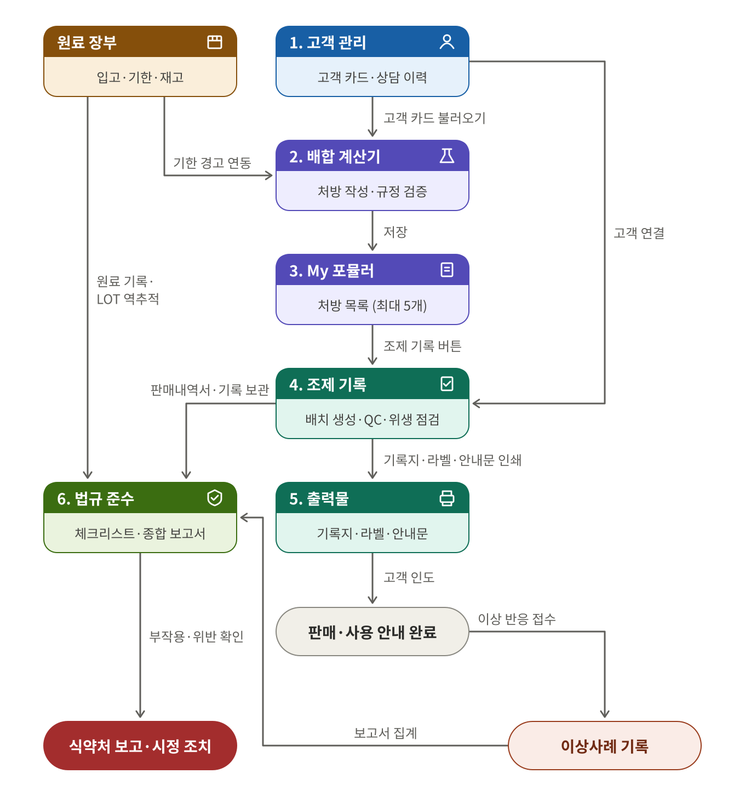
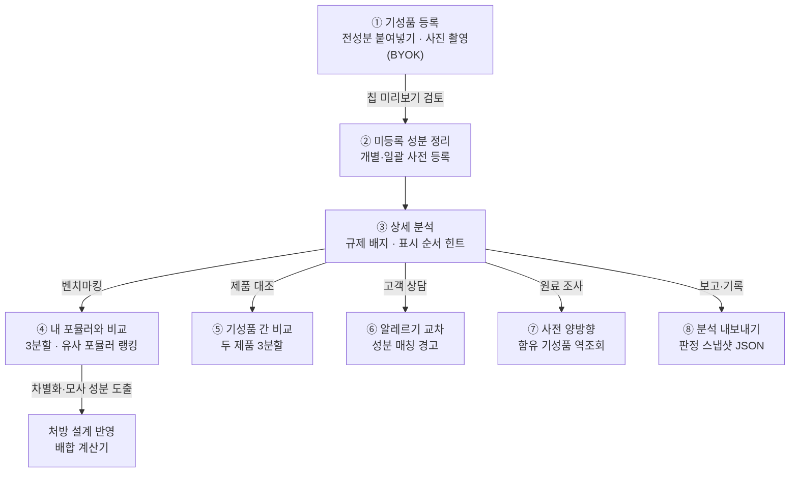
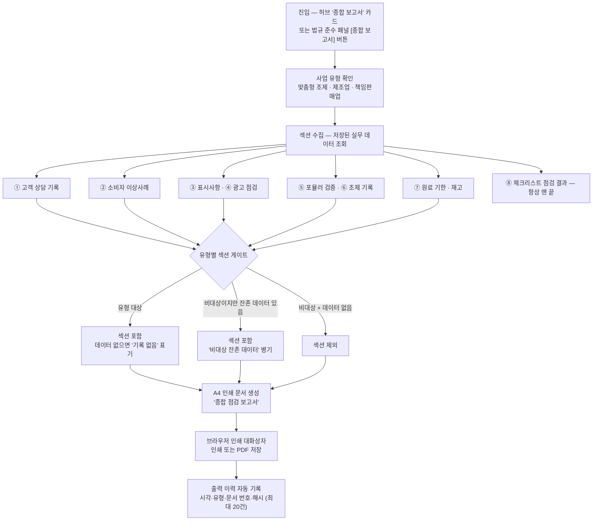

# Passmula — Formula OS 실무 매뉴얼

> **최종 업데이트**: 2026-10-05 · 앱 버전은 설정 메뉴 하단에 `vYYYY.MM.DD` 형식으로 표시됩니다 · 시험 학습 기능은 [사용자 매뉴얼](doc:user_manual) 참조
> **문서 ID**: DOC-USR-02
> **범위**: exam:cosmetic · 판본: none
> **관련 SPEC ID**: FO-01~68, DI-06~10, MV-01~04

Formula OS는 화장품 실무자의 **작업 공간**입니다. 상단의 **사업 유형** 선택에 따라 화면 구성이 달라집니다 — **맞춤형화장품 판매업**(기본), **화장품제조업**, **책임판매업**. 맞춤형은 고객 상담부터 처방 설계·조제 기록·원료 관리·법규 점검까지, 제조업은 레시피·원료·제조 기록 중심으로, 책임판매업은 표시사항·광고 문구 점검 중심으로 사용합니다.

> ⚠️ **면책 고지**: 이 앱의 모든 검증·추천·안내문은 참고용 도구입니다. 법정 한도 검증은 규정 준수 확인일 뿐 제품의 안전성·안정성·품질을 보장하지 않으며, 실제 의무 판단은 법령 원문과 관할 지방식약청 안내를 따르세요.

### 🗂️ 화면 구성

| 사업 유형 | 허브 카드 순서 (좌→우) |
| --- | --- |
| 맞춤형화장품 판매업 (기본) | 고객 관리 → 배합 계산기 → My 포뮬러 → 원료 장부 → 조제 기록 → 법규 준수 |
| 화장품제조업 | 배합 계산기 → My 포뮬러 → 원료 장부 → 조제 기록 → 표시사항 검토 → 광고 문구 점검 → 법규 준수 (CGMP 체크리스트) |
| 책임판매업 | 고객 관리 → My 포뮬러 → 표시사항 검토 → 광고 문구 점검 → 법규 준수 (표시·광고 체크리스트) |

> 사업 유형은 허브 상단 칩으로 전환하며 이 기기에 저장됩니다. **법규 준수·종합 보고서는 모든 유형에서 마지막 카드**이고, 카드의 단계 번호는 보이는 카드만 세므로 유형을 바꿔도 항상 1번부터 시작합니다.

| 화면 요소 | 동작 |
| --- | --- |
| 허브 카드 | **배합 계산기 = 처방 작업대**, **My 포뮬러 = 처방전 보관함** — 계산기에서 작성·검증한 배합은 '저장'해야 My 포뮬러에 보관됩니다. 저장 전 계산기 내용은 임시 작업입니다 |
| 성분 사전 | 사이드바(모바일은 학습도구 탭)의 별도 메뉴 — 원료 상세에서 '포뮬러에 추가'로 계산기에 바로 투입. 상단 배지에 원료 DB 버전·수록 수(`v2026.09.7 · 1,402종`), 탭하면 개정 이력 |
| 성분 추가(자가 등록) | 공식 DB에 없는 원료는 사전 상단 '성분 추가'로 직접 등록 — '사용자 등록 원료' 배지, 입력한 자가 한도까지만 검증(법정 판정 아닌 사내 참고용). 공식 DB와 같은 이름은 불가 |
| 사전 CSV | 'CSV'는 검색·필터 결과, '전체 CSV'는 검색과 무관한 전체 DB(공식 + 자가 등록) 다운로드 |
| 원료 판정 원칙 | **네거티브 리스트** — 안전기준 고시 별표1(사용불가)·별표2(사용제한·한도)에 없는 원료는 사용 가능. 기능성 원료·색소·보존제·자외선차단 성분은 지정 목록(포지티브 리스트). 허브 상단 상시 표시, 각 용어는 law.go.kr 바로가기 |
| 분석·법규 도구 | 허브 하단의 순번 없는 상시 카드 — 기성품 전성분 분석(규제 배지·알레르기 교차·포뮬러 대조)·이상사례 기록·법규 준수·종합 보고서. 기성품 분석 절차는 아래 '기성품 전성분 DB' 섹션 |
| 식약처 고시 감시 | '식약처 고시 확인'이 감시 중인 법령·고시 8종을 law.go.kr 실시간 조회, '고시 정보 보기'는 문서별 기준↔최신 비교·마지막 자동 확인 시각. 신규 고시 감지 시 진입 경고 배너 + 개정 문서 참조에 '⚠ 갱신 필요' 배지 (오프라인이면 안내만) |
| 실무 모드 | 합격 후 실무만 사용 시 ⚙️ 설정 → [모드: 학습 모드] 또는 사이드바 최하단 토글 — 학습 메뉴 숨김, 이 작업실이 홈. [사용자 매뉴얼 §12.5](doc:user_manual) 참조 |
| 서브내비 칩 | 화면 상단 칩으로 허브 복귀 없이 섹션 이동 — 사업 유형별 구성 상이 (예: 책임판매업은 표시사항·광고 점검 칩) |

### 🔄 업무 처리 흐름 (Workflow) — 맞춤형 조제 기준

| 원칙 | 내용 |
| --- | --- |
| 처방(포뮬러)과 배치 분리 | 처방은 재사용 가능한 설계, 배치는 실제 조제 회차 기록 — 같은 처방으로 여러 번 조제하면 회차마다 배치가 쌓입니다 |
| 스냅샷 보존 | 배치에는 생성 시점의 처방명·전성분·검증 결과가 함께 저장 — 처방을 수정·삭제해도 과거 조제 기록의 근거가 유지됩니다 |
| 기성품 분석은 상시 도구 | 흐름 순번이 아닌 '분석' 카드라 상담 단계(고객 사용 제품 등록·알레르기 교차)와 설계 단계(내 포뮬러와의 성분 대조) 어느 곳에서나 열어 씁니다 — 아래 '기성품 전성분 DB' 섹션 참조 |

---

## 1. 👥 고객 관리

고객을 카드 단위로 관리하고 상담 이력을 누적합니다 (최대 20명).

> 🛡 **이 기기 전용**: 고객 카드·상담 이력은 개인정보 보호를 위해 **이 기기에만** 저장되며, 로그인해도 클라우드 동기화에서 제외됩니다. 다른 기기로 옮기려면 CSV 보내기 또는 설정의 '데이터 백업'을 이용하세요.

| 기능 | 동작 |
| --- | --- |
| 고객 카드 | 이름·나이·성별·피부/두피 유형·고민·알레르기·임신 여부·사용 중 제품·목적·메모 |
| 상담 이력 | 고객 상세에서 날짜+내용을 **추가만** 가능(append-only) — 삭제·수정되지 않아 상담 기록이 보존됩니다 |
| 역참조 | 고객 상세에서 해당 고객의 처방·조제 기록을 바로 엽니다 |
| 고객 안내·동의서 | 고객 상세의 [동의서] 버튼으로 '맞춤형화장품 사용 안내·동의서' 인쇄 — 알레르기 이력·사용 전 안내사항(타인 사용 금지·이상 증상 대응·보관법·이상사례 기록 안내) 담김, 최근 인도 제품 자동 표기. 고객·조제관리사 서명란으로 조제 전 고지·서명 증적 활용 |
| 처방 연동 | 계산기 고객 정보에서 카드 불러오기 / 현재 입력을 고객 카드로 저장 — 처방에 `customerId` 연결 시 배치 폼에서 자동 선택 |
| 삭제 시 | 연결된 처방은 인라인 고객 정보(스냅샷)만 남고 참조만 해제 — 기록은 보존됩니다 |

### CSV 가져오기·보내기

기존에 Excel 등으로 관리하던 고객 명단을 CSV로 가져오거나, 목록을 CSV로 보낼 수 있습니다.

| 기능 | 동작 |
| --- | --- |
| CSV 가져오기 | 헤더의 [CSV 가져오기] → 파일 선택 → 건수 확인 후 가져오기. **같은 이름의 기존 고객은 건너뛰고**(덮어쓰지 않음) 최대 등록 수(20명)를 넘는 행은 제외 |
| CSV 보내기 | 등록된 고객 전체를 CSV로 다운로드 — UTF-8 BOM 포함으로 Excel에서 바로 열림 |
| 양식 | [양식] 버튼으로 빈 CSV를 받아 헤더를 맞춤 |

| CSV 헤더 | 필드 | 비고 |
| --- | --- | --- |
| 이름 / 고객명 / name | 고객명 | **필수** |
| 나이 / 연령 / age | 나이 | 숫자 |
| 성별 / gender | 성별 | 남성·여성 |
| 피부타입 / 피부유형 / skintype | 피부 유형 | 건성·지성·복합성·중성·민감성 |
| 두피타입 / 두피 / scalptype | 두피 유형 | 건성·지성·민감성·정상 |
| 고민 / 피부고민 / concerns | 피부 고민 | 여러 값은 `;`·`\|`·`/`로 구분 |
| 알레르기 / allergies | 알레르기 이력 | 여러 값은 `;`·`\|`·`/`로 구분 |
| 임신수유 / 임신 / pregnancy | 임신·수유 | '임신'·'수유' 포함 시 자동 매핑 |
| 사용제품 / products | 사용 중 제품 | |
| 목적 / purpose | 조제 목적 | |
| 메모 / 비고 / notes | 메모 | |

> 인코딩은 UTF-8·UTF-8 BOM·**CP949(EUC-KR)**을 자동 인식합니다. Excel에서 저장한 한글 CSV도 그대로 가져올 수 있습니다. 셀 안에 쉼표가 있으면 `"..."`로 감싸세요.

---

## 2. ⚗️ 배합 계산기 (Blending Calculator) — 처방 작업대

처방(포뮬러)을 작성·검증하는 핵심 화면입니다. 저장 전까지 입력 내용은 임시 작업이며, 완성한 처방은 하단 액션바의 '저장'으로 My 포뮬러(처방전 보관함)에 보관합니다. **위·아래 고정 바 + 중앙 작업 영역** 구조입니다.

| 기능 | 동작 |
| --- | --- |
| 상단 고정 요약바 | 총 제조량(g/ml) 입력과 배합률 합계·검증 요약이 스크롤과 무관하게 항상 표시 |
| 하단 고정 액션바 | 포뮬러 이름 입력과 저장·인쇄·JSON 버튼 상시 표시 — '인쇄'는 현재 처방의 명세서(원료별 배합률·투입량·규정 검증·절차·안정성·전성분)를 A4로 출력 |
| 실제 투입량 자동 계산 | 총 제조량과 원료별 배합률(%) 입력 → 원료별 투입량과 합계 즉시 계산 |
| 합계 100% 판정 | 배합률 합계 100% → 🟢 '100% 정상' / 부족 → 🟠 'N% 부족' / 초과 → 🔴 'N% 초과' |
| 원료 행 카드 | 위쪽 줄에 원료명·검증 배지·삭제 버튼, 아래쪽 줄에 배합률·투입량·제조 단계 입력 |
| 제조 단계(Phase) 태그 | 수상부 / 유상부 / 실리콘부 / 기능성 / 후첨가 / 기타 — '단계별 정렬'로 공정 순서 정렬 |
| 원료 자동완성 | 원료명 입력 시 원료 DB 자동완성 — 성분 사전의 '포뮬러에 추가'로도 투입 가능 |
| DB 미등록 원료 | 'DB 미등록' 배지 옆 '사전 등록' 버튼 → 이름 채워진 등록 모달 → 저장 시 행 배지가 '자가 등록'으로 갱신. 자가 등록 원료는 '자가 등록'/'자가 한도 이내'/'자가 한도 초과'로 공식 판정과 구분 표시 |
| 원료 기한 경고 | 원료 장부에 같은 이름의 원료가 있으면 행에 기한 배지(`재고 D-N` / `재고 기한 경과`) 표시 |

### 제조 정보 (접이식)

| 항목 | 내용 |
| --- | --- |
| 기록 항목 | 목표 pH·실측 pH(0~14), 제조 절차(최대 20단계), 메모 — 절차는 조제 기록지에 인쇄됩니다 |
| 접이식 요약 | 접힌 상태에서도 요약 표시 (예: `pH 5.5/5.8 · 절차 4단계 · 메모`) |

### 규정 검증 (Regulation Check)

원료 행마다 법정 배합 한도와 실시간 비교합니다.

| 배지 | 의미 |
| --- | --- |
| 🟢 한도 이내 | 법정 한도 범위 내 |
| 🟠 한도 초과 | 한도 초과 |
| 🔴 금지 원료 | 사용 불가 원료 |
| ⚪ 확인 필요 | 판정 근거 부족 — 원문 확인 |

> ⚠️ '한도 이내'는 규정 준수 확인일 뿐 안전성 보장이 아닙니다. 조건부 한도는 원문 고시를 확인하세요.

### 제형 안정성 체크 (Stability Check)

| 구분 | 내용 |
| --- | --- |
| 점검 대상 | 배합비·배합방법이 안정성에 미치는 영향을 규칙 기반으로 점검 — 상 비율(유화제 부재·비율), 원료 상호작용(카보머×양이온성 등), 열 민감 원료 가열 단계, pH 적정대 |
| 판정 등급 | 🟠 **주의** / ⚪ **참고** 두 단계 — 규칙에 없는 조합은 판정하지 않으며 모든 안내는 참고용 |

### 안정성 실험 확인

| 구분 | 내용 |
| --- | --- |
| 실험 기록 | 규칙 경고는 "가능성"일 뿐 — 실제 안정성은 **실험으로만 확정**. 수행한 실험(실온 경시·가속·가혹·동결-융해·원심분리·보존력)을 기록 |
| 양호 확인 시 | 결과 **양호**로 확인된 배합은 저장 시 화장품법 전성분 표시 규칙에 따라 **전성분 순서가 자동 생성** (1% 초과 내림차순 → 1% 이하 → 색소 최하단) |

### 고객 정보 (접이식 — 선택)

| 구분 | 내용 |
| --- | --- |
| 입력 방식 | 고객 카드에서 불러오기(`customerId` 참조) 또는 인라인 자유입력 — 둘 다 지원 |
| 입력 항목 | 고객명·나이·성별·피부 유형·선택 제형·피부 고민(칩 복수 선택) + 안전 정보(알레르기 원료·임신/수유·사용 중 제품) |
| 활용 | 안전 정보는 추천 엔진의 필터·주의문에 활용 — 의학적 판단을 대신하지 않습니다 |

### 추천 베이스 · 원료 (Recommendation)

| 구분 | 내용 |
| --- | --- |
| 엔진 | 규칙 기반(고정 매핑) — AI 생성이 아니며 농도는 제안하지 않습니다 |
| 제안 내용 | 제형별 필수 역할(용제·보습제·유화제·보존제 등)과 후보 칩, 고민/피부 유형별 기능성 원료 제안 |
| 적용 | 칩 클릭 → 원료 행 추가 + 단계 자동 태깅 — 알레르기 원료·임신/수유 플래그·연령 주의 자동 반영 |

### 맞춤 추천 규칙 (Custom Rules)

| 기능 | 동작 |
| --- | --- |
| 규칙 등록 | 자주 쓰는 원료를 추천 후보에 직접 추가 — 대상(베이스 역할/피부 고민/피부 유형) + 원료명으로 등록 |
| 공유 | JSON 보내기/가져오기로 기기 간 공유 — 가져오기는 병합, 중복·한도 초과는 자동 제외 |
| 제외 대상 | 사용 불가 원료·DB 미등록 이름은 추천에 표시되지 않습니다 |

---

## 3. 📒 My 포뮬러 (처방 저장) — 처방전 보관함

| 기능 | 동작 |
| --- | --- |
| 처방 저장 | 계산기(작업대) 하단 액션바에 이름 입력 → '저장'으로 현재 배합·고객·제조 정보 보관 (최대 5개) |
| 포뮬러 카드 | 규정 검증·안정성·고객 요약 배지 표시 — 열기·복제·삭제·JSON 보내기·조제 기록 버튼 |
| 규정 스냅샷 | 저장 시점의 한도 기준이 함께 보존 — 원료 DB 갱신 후에도 검증 근거 유지 |
| 고시 개정 감지 | 저장 후 원료 DB 기준(유형·한도)이 바뀐 원료가 있으면 카드에 '기준 변경 N' 배지 + 계산기에서 열면 상단에 재검증 배너. 다시 저장하면 스냅샷이 현재 기준으로 갱신 |

---

## 4. 📋 조제 기록 — 배치

같은 처방으로 여러 번 조제한 **회차별 기록**입니다 (최대 50건).

| 기능 | 동작 |
| --- | --- |
| 배치 생성 | My 포뮬러 카드의 '조제 기록' → 배치 폼 — 배치번호는 `YYYYMMDD-NN`으로 자동 채번 |
| 기록 항목 | 조제 일시·총 제조량·고객(카드 선택 또는 인라인)·권장 사용기한·**고객 인도일**(판매내역서 근거)·메모 |
| 사용기한 자동 제안 | 처방 선택 시 보존제 유무·수상 여부로 자동 입력 — 보존제 포함 180일 / 무보존제 수상 제형 14일 / 무보존제 무수 제형 90일. 참고용 제안, 직접 수정 가능 |
| 사용 원료 LOT | 처방 원료가 원료 장부와 이름으로 자동 매칭 — 복수 LOT이면 직접 선택(기한 임박 순 기본), 부작용 보고·리콜 시 역추적에 사용. 잔량 소진 LOT는 선택 불가 |
| 재고 부족 경고 | 총 제조량과 배합률로 원료별 소요량 계산 — 장부 잔량보다 부족하면 경고 |
| 재고 자동 차감 | 배치 **저장** 시 선택 LOT의 소요량(총량×배합비)이 장부 잔량에서 자동 차감 — 부족하면 0까지 차감 + 부족 알림(발주 근거). 보정(수정) 저장은 차감하지 않으므로 총량을 크게 바꾼 경우 장부에서 수동 정정 필요 |
| 품질 확인(QC) | 외관·색상·향·점도·이물 — 각각 정상/이상/미확인. **실측 pH**(0~14) 회차별 기록 |
| QC 이상 조치 | 이상 판정 배치에 폐기·재조제·보류 조치 기록 — 이상인데 조치가 없으면 목록에 '조치 미기록' 경고 |
| 위생 점검 | 도구 소독·작업대 정리·장갑 착용 체크 |
| 알레르기 교차검증 | 고객 카드 선택 시 고객의 알레르기 이력 원료가 처방에 포함됐는지 자동 검사 → 경고 표시, 저장 전 확인 요청 |
| 불변 원칙 | 처방·배치번호·조제일시·검증 스냅샷은 저장 후 수정 불가 — QC·실측 pH·위생·기한·인도일·조치·LOT·메모만 보정 가능 |
| 스냅샷 보존 | 생성 시점의 처방명·전성분·검증 결과와 **검증에 사용된 원료 DB 버전** 함께 저장 — 처방 수정·삭제나 고시 개정 후에도 기록 근거 유지 |
| 목록 필터 | 처방·고객명·QC 상태·인도 여부로 필터링 |
| CSV보내기 | 목록 헤더의 [CSV] 버튼으로 필터된 조제 기록을 CSV 저장 (기록 보존·엑셀 보고용) |

| CSV 컬럼 | 내용 |
| --- | --- |
| 배치번호 | `YYYYMMDD-NN` 자동 채번 |
| 처방 / 고객 | 처방명·고객명 (스냅샷) |
| 조제일시 | `YYYY-MM-DD HH:mm` |
| 제조량 / 단위 / 제형 | 총 제조량, 단위(g·ml), 제형 |
| QC이상 / QC미확인 | 이상 판정 항목명(`;` 구분) / 미확인 항목 수 |
| 위생 | 완료/전체 (예: `3/3`) |
| 실측pH | 회차별 측정 pH |
| 사용기한 / 인도일 / 조치 | 권장 사용기한, 고객 인도일, QC 이상 조치 |
| 사용LOT | `원료명:LOT` 목록 (`;` 구분) |
| 원료DB버전 | 검증에 사용된 원료 DB 버전 |
| 메모 | 배치 메모 |

### 출력물 4종

| 출력물 | 내용 |
| --- | --- |
| 조제 기록지 | 처방 정보 + 배치 QC·실측 pH·위생 + 사용 LOT + 인도일 + 조제관리사·확인자 서명란 + 안전 고지 (A4 인쇄·PDF 저장) |
| 제품 라벨 | 제품명·전성분·조제일·사용기한·용량·주의사항 — 소형 라벨 레이아웃 |
| 사용 안내문 | 제형별 사용법·보관법 + 원료 주의·고객 조건(임신/알레르기) 기반 주의사항 자동 병기 |
| 판매내역서 | 목록 헤더의 [판매내역서] 버튼으로 인도일이 기록된 배치를 모아 인쇄 — 인도일·배치번호·제품·고객·내용량 표와 작성자·확인일 서명란 포함. 배치 폼의 '고객 인도일'을 입력해야 내역서에 포함 |

---

## 5. 📦 원료 장부

원료의 입고·기한·재고를 관리합니다 (최대 30종).

| 기능 | 동작 |
| --- | --- |
| 등록 항목 | 원료명·LOT 번호·입고일·사용기한·보관 조건·잔량·단위·메모 |
| 기한 상태 | 기한 경과(빨강) / 30일 이내 임박(주황) / 정상 — 카드 강조 + 상단 경고 배너 |
| 계산기 연동 | 배합 계산기에서 같은 이름의 원료를 쓰면 기한 배지 자동 표시 |
| 재고 자동 차감·소진 | 조제 기록 저장 시 사용 LOT 잔량 자동 차감 — 잔량 0이면 '소진' 배지 + 배치 폼 LOT 선택 제외. 잔량을 비워두면 차감 대상이 아니므로 수량 관리 시 잔량 기입 |
| LOT 역추적 | 원료 카드의 [추적] 버튼으로 그 원료(LOT)를 사용한 배치·인도 고객 목록 조회, [추적 목록 인쇄]로 A4 출력 — 부작용 접수·리콜 시 연락 대상 특정. LOT 미선택 배치는 추적 대상 아님 |

### CSV 가져오기·보내기

고객 관리와 동일한 방식으로 CSV 가져오기·보내기·양식 다운로드를 지원합니다.

| 기능 | 동작 |
| --- | --- |
| CSV 가져오기 | 헤더의 [CSV 가져오기] — **원료명+LOT이 같은 기존 항목은 건너뜀**. 이름이 같아도 LOT이 다르면 별도 항목으로 추가 |
| CSV 보내기 · 양식 | 고객 관리와 동일 |

| CSV 헤더 | 필드 | 비고 |
| --- | --- | --- |
| 원료명 / 원료 / name | 원료명 | **필수** — 계산기 연동은 이름 정확 매칭 |
| LOT / 로트 / 제조번호 | LOT 번호 | 중복 판정 키 |
| 입고일 / 입고 / receivedat | 입고일 | `YYYY-MM-DD`·`YYYY.M.D`·`YYYY/M/D` 인식 |
| 사용기한 / 유통기한 / expiryat | 사용기한 | 날짜 형식 동일 |
| 보관조건 / 보관 / storage | 보관 조건 | 실온·냉장·냉동·냉암소·기타 |
| 잔량 / 수량 / 재고 / qty | 잔량 | 숫자 |
| 단위 / unit | 단위 | g·mL 등 |
| 메모 / 비고 / notes | 메모 | |

---

## 6. 🏪 기성품 전성분 DB — 제조·설계 활용

시판 화장품의 전성분을 등록해 두는 개인 기성품 DB입니다 (최대 30종). 처방 설계 벤치마킹·고객 안전 교차·품질 검토를 돕는 분석 도구로, 순번 없는 '분석' 카드라 조제 전 어느 단계에서든 열 수 있습니다.

> ℹ️ 전성분은 함량이 없는 성분 목록입니다 — '사용 제한' 배지는 한도 초과가 아니라 존재 표시입니다. 분석은 조회 시점 원료 DB 기준 **라이브 매칭**이라 고시 개정으로 DB가 갱신되면 모든 등록 제품의 판정이 자동 최신화됩니다.

### 제조 활용 절차

| 단계 | 작업 | 내용 |
| --- | --- | --- |
| ① | 기성품 등록 | 허브 '기성품 전성분 분석' → '제품 등록'. 전성분은 라벨·판매 페이지 텍스트를 그대로 붙여넣기 (쉼표·중점·개행·세미콜론·파이프 구분자 자동 인식, `1,2-헥산디올` 같은 자릿수 쉼표는 자동 보호). `전성분:`·`전성분표`·`INGREDIENTS` 같은 필드 표기와 문장 끝 마침표는 자동 제거, `제품명:` 등 다른 필드가 섞이면 칩으로 남으니 ✕로 삭제. 칩 미리보기에서 순서·오타 검토 후 저장. 제품당 150종까지, 초과 시 '상한 초과 N종 잘림' 경고. 같은 브랜드+제품명 재등록 시 '동명 제품' 확인 — 리뉴얼·개정 제품은 별도 항목으로 등록 가능하며 목록에 '동명 N종' 구분 표시 |
| ② | 미등록 성분 정리 | '미등록' 칩 성분은 탭해 자가 사전에 개별 등록하거나 2종 이상이면 '미등록 N종 사전 일괄 등록'. 등록 즉시 분석 반영. 띄어쓰기·하이픈 오차(`1,2 헥산디올` ↔ `1,2-헥산디올`)와 흔한 속칭(`비타민E`, `메칠파라벤`, `산화아연` 등)은 자동 표준명 매칭 — '미등록'은 정말 DB에 없는 성분일 가능성이 높음 |
| ③ | 상세 분석 확인 | 목록의 '분석' 버튼 → 성분별 규제 배지(공식 등록 · 사용 제한 · 금지 성분명 매칭 · 자가 등록 · DB 미등록)와 한도 근거를 표시 순서대로 확인. 색소가 중간에 표기된 제품은 '표시 순서 검토' 힌트가 라벨 원문·입력 오류 검토 안내 |
| ④ | 처방 설계 대조 | '내 포뮬러와 비교'에서 안정성 '양호' 포뮬러 선택 → **공통 / 이 제품에만 / 내 포뮬러에만** 3분할로 성분 차이 확인. '유사 포뮬러' 칩은 중첩도 상위 3건 자동 추천 — 시판 제품 모사·차별화 성분 도출 (제조 핵심 활용) |
| ⑤ | 기성품 간 대조 | '다른 기성품과 비교'로 등록 제품 두 개를 같은 3분할로 비교 (유사군·대체군·성분 구성 추정) |
| ⑥ | 고객 안전 교차 | 고객 카드에 알레르기가 있으면 제품 전성분과 자동 매칭해 '알레르기 성분 매칭' 경고 — 사용 중 제품을 등록해두면 처방 설계 전 주의 원료 파악, 고객 상세에서도 '알레르기 주의 기성품' 역방향 표시 |
| ⑦ | 사전 양방향 연동 | 분석 행의 사전 아이콘 → 성분 사전 상세 직행, 사전 상세의 '함유 기성품' → 이 목록을 해당 성분 필터로 열기 — 원료 조사 ↔ 제품 역조회 왕복 |
| ⑧ | 기록·공유 | '보내기'는 제품 원본 데이터(JSON), '분석 내보내기'는 판정 시점 스냅샷(성분 순서·배지·요약·순서 힌트) JSON — 판정은 고시 개정 시 달라지므로 검토 기록·보고 첨부에는 분석 내보내기 사용 |

### 📷 사진으로 채우기 (BYOK — 선택)

**BYOK(Bring Your Own Key)**는 사용자가 본인의 AI API 키를 직접 등록해 쓰는 방식입니다 — 앱 서버를 거치지 않고 브라우저가 Google에 직접 요청하므로, 운영자가 키나 사진에 접근할 경로가 없고 사용 비용은 본인 Google 계정의 API 할당량으로 처리됩니다.

| 항목 | 내용 |
| --- | --- |
| 키 발급·등록 | [Google AI Studio](https://aistudio.google.com/apikey)에서 무료 발급한 Gemini API 키를 폼 상단 '사진으로 채우기'의 키 입력란에 저장 — '키 확인'으로 모델 접근 가능 여부 즉시 점검 |
| 사진 읽기 | 정면(제품명·브랜드·제형)+후면(전성분) 사진을 촬영·선택하면 텍스트를 읽어 폼에 프리필 |
| 보안 계약 | 키는 이 기기에만 저장, 백업·동기 제외 — 기기 변경 시 재등록 필요. 사진·응답 원문은 추출 후 폐기 (모델명은 크리덴셜이 아닌 환경설정이라 백업 대상) |
| 검토 단계 필수 | 읽은 결과는 초안 — 칩으로 확인 후 저장. '미등록' 칩 성분은 인식 오류 가능성이 있으니 라벨 원문과 대조 |
| 모델 설정 | 모델 입력란에서 속도·비용·정확도가 다른 모델로 변경 (기본 `gemini-2.0-flash`, 추천 목록 제공) |

---

## 7. 🏷️ 표시사항 검토 · 📣 광고 문구 점검 (제조업·책임판매업)

사업 유형을 **화장품제조업** 또는 **책임판매업**으로 선택하면 나타나는 카드입니다. 제10조 표시사항과 제13조 광고 금지 표현을 자가 점검합니다.

| 기능 | 동작 |
| --- | --- |
| 표시사항 검토 | 제품명·책임판매업자·제조번호·사용기한·전성분 등 제10조 필수 표시사항 입력 + 누락 실시간 체크 — My 포뮬러 '전성분 가져오기' 자동 삽입, 라벨 시트 인쇄 (입력 초안 기기 저장) |
| 광고 문구 점검 | 제품 설명·상세페이지·광고 문구 붙여넣기 → 의약품 오인·과대광고·기능성 범위 초과·**전문가 추천 오인**(의사·약사·피부과 추천 등) 표현 하이라이트 — '최고'·'최상'·'1위'·'무해' 절대 표현도 탐지. 확실한 금지 표현만 탐지하는 보수적 사전이며 결과는 자가 점검 참고용. 국내외 제품 오인·외국 기술제휴·저속 표현·멸종위기종·타 제품 비방 등 문맥 판단 항목은 키워드 범위 밖이라 수동 검토 필요 |

## 8. ⚖️ 법규 준수 체크리스트

사업 유형별 법정 의무를 자가점검합니다 — 허브에서 항상 마지막 카드입니다.

| 기능 | 동작 |
| --- | --- |
| 유형별 체크리스트 | 맞춤형 조제 **6개 카테고리 27항목** / 제조업 **CGMP 중심 16항목** / 책임판매업 **표시·광고 중심 16항목** — 유형 전환 시 해당 세트 표시, 체크 상태는 세트별 별도 저장 |
| 맞춤형 카테고리 | 영업·자격(신고·조제관리사 배치·연간 교육·원료 보고) / 시설·위생 / 혼합·소분 안전관리 / 기록 보관 / 표시·안내 / 안전·보고 |
| 법령 링크 | 각 항목에서 화장품법·시행규칙 원문, CGMP, 안전기준·주의사항 규정, 별표 문서로 이동 — 문서명은 앱 내 변환본(고정 스냅샷), **↗원문**은 law.go.kr 공식 현행본 새 탭. 원문 개정 시 '⚠ 갱신 필요', 공포 후 미시행이면 '⏳ 시행 예정' 배지 |
| 앱 기능 연결 | 판매내역서 → 조제 기록, 상담 기록 → 고객 관리, 원료 기록 → 원료 장부 등 관련 섹션 바로 이동 |
| 체크 상태 저장 | 점검 항목은 기기에 저장, 상단 배지에 진행률 — '초기화'로 리셋 |
| 재점검 리마인더 | 마지막 점검일로부터 30일 경과 시 법규 준수 카드에 '재점검 권장' 배지 — 한 번도 시작하지 않았으면 표시 안 됨 |
| 종합 보고서 | 패널 헤더 [종합 보고서] 버튼(또는 허브 카드)으로 출력 시점의 실무 데이터를 모은 A4 문서 출력·PDF — 고객 상담·표시사항·광고 점검·포뮬러 검증·조제 기록·원료 기한·이상사례·체크리스트가 유형에 맞게 구성, 기록 없는 영역은 '기록 없음' 표기 |
| 점검자 성명 | 패널 하단 '보고서 점검자'에 성명 입력 → 보고서 서명란 점검자란에 `성명 (인)` 기입 — 비우면 공란 출력, 확인자·확인일은 수기 서명용 공란. 입력값은 기기 저장·백업·동기 대상 |

**보고서 푸터 증적 정보** — 출력물 상단·하단에 자동 기입되는 메타데이터입니다.

| 메타데이터 | 내용 |
| --- | --- |
| 기준 고시 | `기준 고시: 화장품 안전기준 등에 관한 규정 제YYYY-NN호 (시행 YYYY-MM-DD) · 고시 확인 YYYY-MM-DD` — 검증 기준 고시와 확인 시점. 신규 고시 감지 시 '⚠ 신규 고시 개정 확인 필요' 병기, 상태 확인 불가 시 '확인 불가' 명시 |
| 문서 번호·내용 해시 | `문서 번호: RPT-YYYYMMDD-NNN-해시6 · 내용 해시: …` — 출력물 고유 식별자로 '보고서 출력 이력'의 동일 id·hash와 대조해 변조·재발행 확인 |
| 서명 기록 | 서명란 아래 `서명 기록 — 출력일시 · 출력 환경(브라우저·OS 요약) · 문서 번호` 자동 기입 — 누가 언제 어떤 환경에서 출력했는지의 흔적 (전자서명이 아닌 출력 시점 메타데이터) |

*   **보고서 출력 이력**: 종합 보고서를 출력하면 패널 하단 '보고서 출력 이력'에 출력 시각·사업 유형·체크리스트 진행률과 **문서 번호·내용 해시·각 섹션 데이터 기준일**이 기록됩니다 (최대 20건). 고객 개인정보가 담긴 보고서 본문은 저장되지 않고 출력물만 남습니다 — 출력물 하단의 문서 번호·해시와 이력을 대조하면 출력 당시 그대로인지 확인할 수 있습니다. 우측의 **[이력 삭제]** 버튼은 이력 전체를 비웁니다 — 삭제하면 출력물의 문서 번호·해시와 대조할 수 없으므로 필요할 때만 사용하세요.
*   ⚠️ 자가점검 참고 자료이며 법률 자문이 아닙니다.

---

## 9. 🚨 소비자 이상사례 기록

고객에게 제품을 인도한 뒤 접수된 부작용·이상 반응을 기록합니다 (최대 30건). 사업 유형과 무관하게 허브의 **이상사례 기록** 카드로 열립니다 — 위해사례 대응은 모든 화장품 사업자의 의무입니다.

| 기능 | 동작 |
| --- | --- |
| 기록 항목 | 발생일(필수)·고객(카드 연결 또는 직접 입력)·제품/배치번호·증상·조치 내용·보고 여부·보고일·메모 |
| 조치 내용 | 사용 중단 안내·환불·병원 방문 권유·식약처 보고 등 수행한 조치 자유 기재 |
| 보고 체크 | '보고 완료' 체크 + 보고일 입력 → 위해사례 보고 이행 증적 — 심각한 이상사례는 대한화장품협회 또는 식약처에 신속 보고 |
| 종합 보고서 연동 | 등록된 이상사례는 종합 점검 보고서에 자동 집계·표기 |
| LOT 추적 연계 | 이상사례에 배치번호 기록 → 원료 장부의 [추적]으로 같은 LOT를 쓴 다른 고객 역조회 |

---

## 10. 💾 데이터 관리

| 항목 | 내용 |
| --- | --- |
| 저장 원칙 | 모든 Formula OS 데이터는 **이 기기의 로컬 저장소**가 원본 — 로그인 시 포뮬러·배치·원료·기성품·체크리스트 등은 클라우드 동기화되지만 **고객 카드·상담 이력(타인 개인정보)은 동기화에서 제외** |
| 데이터 백업 | ⚙️ 설정 → 데이터 백업에 포뮬러·고객·배치·원료·기성품·체크리스트·자가 등록 원료·이상사례·보고서 출력 이력 자동 포함 — 기기 변경 전 반드시 백업 (고객 데이터는 백업이 유일한 이동 수단) |
| 증적 백업 리마인더 | 증적 데이터(포뮬러·배치·고객·원료·이상사례·출력 이력)가 있는데 마지막 백업이 30일 초과 또는 미실시 → 허브 '종합 보고서' 카드에 '증적 백업 권장' 배지. 백업 실행 시 해제, 다음 주기부터 재계산 |
| 저장 한도 | 포뮬러 5개 · 고객 20명 · 배치 50건 · 원료 30종 · 기성품 30종 · 자가 등록 원료 50종 · 이상사례 30건 · 보고서 이력 20건 |
| 파일 교환 | 포뮬러·기성품·맞춤 규칙은 JSON 파일로 개별 보내기/가져오기 |
| 의견 보내기 | ⚙️ 설정 → 의견 보내기로 오류·개선 아이디어를 로그인 없이 전송 — 오프라인이면 저장됐다가 연결 시 자동 전송 |
