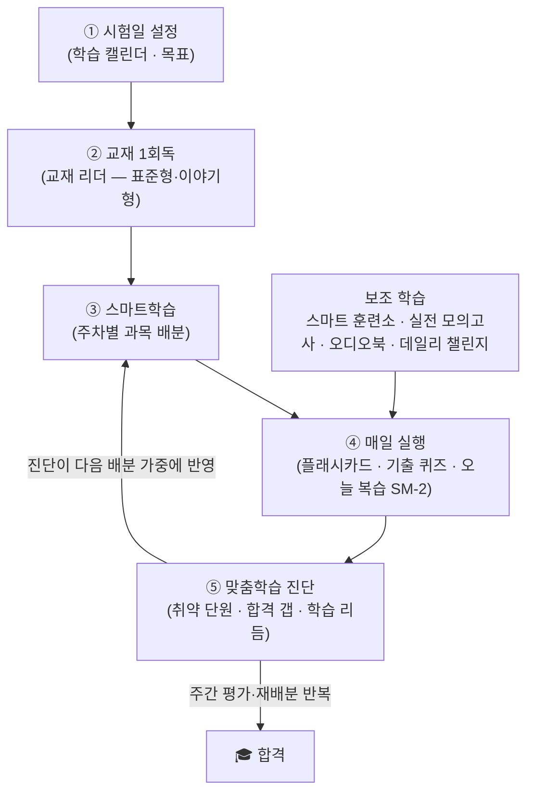
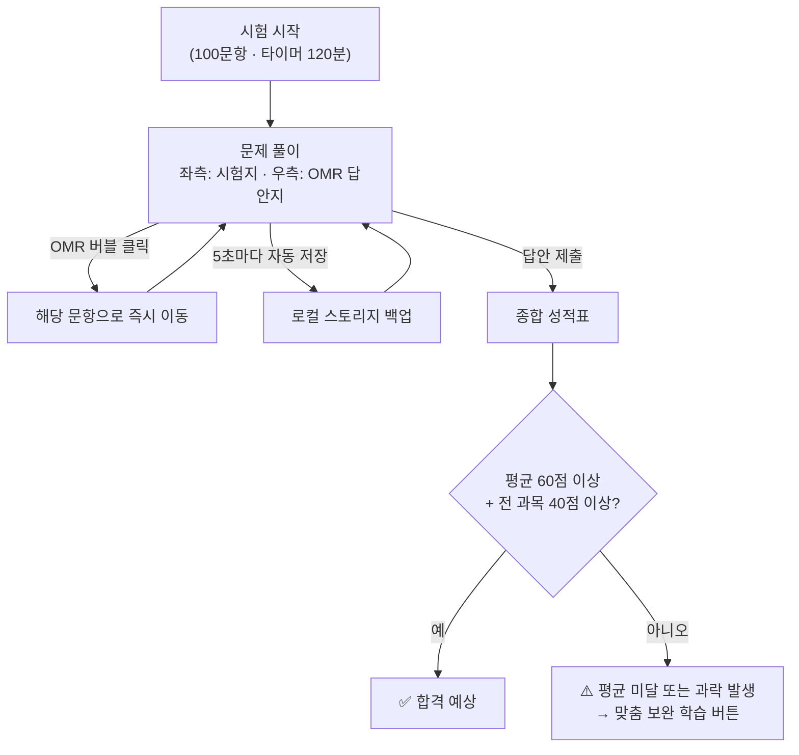

# Passmula — 맞춤형화장품 조제관리사 사용자 매뉴얼 (시험 대비)

> **최종 업데이트**: 2026-10-19 · 앱 버전은 설정 메뉴 하단에 `vYYYY.MM.DD` 형식으로 표시됩니다 · 변경 이력은 설정 메뉴의 "변경 이력"에서 확인할 수 있습니다
> 실무 배합 기능(Formula OS)은 별도 문서로 분리되었습니다 → [실무 매뉴얼](doc:formula_manual)
> **문서 ID**: DOC-USR-07
> **관련 SPEC ID**: MV-01~04 (기능 전반은 SPEC §3 전 영역 대응)

Passmula는 맞춤형화장품 조제관리사 자격증 취득을 위한 법령 암기, 플래시카드, 계산식 연습, 실전 모의고사를 한곳에서 수행할 수 있도록 설계된 프리미엄 SPA(Single Page Application) 통합 포털입니다. 실무 배합 작업(Formula OS)은 별도 [실무 매뉴얼](doc:formula_manual)을 참조하세요.

### 🗂️ 메뉴 구성 (Navigation)

*   **사이드바 4그룹**: 데스크톱 좌측 메뉴는 용도별로 네 그룹에 정리되어 있습니다.
    *   **학습** — 대시보드 · 맞춤학습 · 플래시카드 · 기출 퀴즈
    *   **훈련 · 평가** — 스마트 훈련소 · 오답/중요 복습 · 실전 모의고사
    *   **실무** — 실무 작업실 (Formula OS) — 사용법은 [실무 매뉴얼](doc:formula_manual) 참조
    *   **자료 · 도구** — 교재리더 · 교재검색 · 성분 사전 · 학습 캘린더
*   **🔍 통합 검색**: 헤더의 돋보기 버튼(모바일 포함) 또는 `Ctrl+K`로 어디서든 검색창을 열어 화면 이동·교재·카드·퀴즈·성분·문제집을 한 번에 찾을 수 있습니다 — 자세한 내용은 [§9.5 통합 검색 팔레트](#95--통합-검색-팔레트-ctrlk) 참조.
*   **⚙️ 설정 메뉴**: 화면 우측 상단의 톱니바퀴 버튼을 누르면 관리 기능이 한곳에 모여 있습니다 — **계정 / 로그인**, 데이터 백업, 백업 가져오기, 시험 전환, **학습/실무 모드 전환**, **앱 종료**, 진도 초기화, **시작 안내**, **변경 이력**, **의견 보내기**. 사용자 매뉴얼·실무 매뉴얼은 좌측 사이드바(모바일은 하단 탭의 **[더보기]**)에서 바로 열립니다. 메뉴는 항목을 선택하거나 바깥을 누르면 자동으로 닫힙니다.
*   **의견 보내기**: 설정 메뉴의 **의견 보내기**를 누르면 칭찬·개선·오류·제안을 로그인 없이 보낼 수 있습니다. 별점은 선택이고, 보낼 때 현재 화면과 앱 버전이 함께 전달되어 문맥 파악이 쉽습니다. 오프라인에서 쓴 의견은 저장됐다가 연결되면 자동으로 전송됩니다. 연락처·이름 등 개인정보는 넣지 말아 주세요.
*   **변경 이력**: 설정 메뉴의 **변경 이력**을 누르면 최근 업데이트에서 바뀐 내용을 다시 볼 수 있습니다. 새 버전이 적용된 직후에는 자동으로 "새로운 소식" 창이 한 번 표시됩니다.
*   **앱 종료** (설치된 PWA 전용): 설정 메뉴의 **앱 종료**를 누르면 확인 창이 뜨고, 확인하면 종료를 시도합니다. 데스크톱 PWA는 바로 닫히며, 모바일은 OS가 앱 자체 종료를 막으므로 안내 화면이 표시됩니다 — 최근 앱 목록에서 이 화면을 위로 밀면 완전히 종료됩니다.
*   **모바일**: 하단 탭 바(핵심 탭 + [더보기] 시트)로 모든 학습 메뉴에 접근하고, 백업·초기화·모드 전환 등 관리 기능은 상단의 ⚙️ 버튼에서 사용합니다.

---

## 🧭 전체 학습 흐름 (Workflow)

> 📚 단계별 상세 진행 흐름과 앱/사용자 역할 분담은 **[학습 안내서](doc:study_summary)**의 "5. 추천 학습 방법 → 🔁 스마트학습·맞춤학습 진행 흐름"을 참조하세요.

---

## 1. 📊 학습 대시보드 (Dashboard)

학습의 첫 단추인 대시보드는 현재 나의 학습 진척도와 상태를 시각적으로 분석해 줍니다.

*   **시작 안내**: 처음 방문하면 권장 학습 순서 4단계(① 시험일 설정 → ② 교재 1회독 → ③ 카드·퀴즈 학습 → ④ 복습·진단 루프) 안내가 1회 표시됩니다. 설정 메뉴의 `시작 안내` 버튼으로 언제든 다시 볼 수 있습니다.
*   **화면 구성**: 첫 화면 맨 위에는 "오늘 할 일"인 **일일 데일리 챌린지**와 학습 안내서가 있고, 이어서 **오늘의 맞춤 학습 추천**과 핵심 통계 카드가 보입니다. 보조 지표(외운 카드·정답률·헷갈린 카드)는 **"학습 통계 더 보기"** 바를 눌러 펼치고, 뽀모도로 타이머는 **"집중 도구"** 바를 눌러 펼쳐서 사용합니다. 상세 분석(과목별 상태·정답률 히트맵·모의고사 예측·오답 패턴)은 사이드바의 **"🎯 맞춤학습"** 메뉴에 별도 화면으로 분리되어 있습니다.

### 핵심 통계
상시 노출 3개 — **총 학습 진척도** · **오늘 복습 카드 수** · **시험일 D-day**. 나머지(외운 카드 수·퀴즈 정답률·헷갈린 카드 개수)는 **"학습 통계 더 보기"** 접이식에 있습니다.
*   **총 학습 진척도**: 데이터베이스의 전체 암기 대상 카드 대비 "외운 카드"의 비중을 퍼센트(%)로 나타냅니다.
*   **퀴즈 정답률**: 지금까지 기출 및 핵심 퀴즈를 풀며 정답을 맞춘 비율을 나타냅니다.
*   **헷갈린 카드 개수**: 플래시카드에서 "헷갈림"으로 선택하거나 모의고사에서 틀려 복습이 필요한 핵심 오답의 잔여 개수입니다.
*   **오늘 복습 카드 수**: SM-2 간격 반복 알고리즘이 계산한 오늘 복습 대기 카드 수입니다. 망각 곡선에 따라 잊기 전에 적시 복습하도록 자동 스케줄링됩니다. 대기 카드가 있으면 `지금 복습` 버튼이 표시되어 누르면 전 과목의 복습 대상 카드만 모은 플래시카드 세션이 바로 시작됩니다.
*   **시험일 D-day**: 학습 캘린더의 "목표 설정"에서 시험일을 입력하면 대시보드 카드에 남은 일수가 표시되고, 현재 미학습 카드 수를 남은 일수로 나눈 **"역산 권장: 하루 N장"** 가이드가 함께 나타납니다. **미설정 상태에서는 이 카드가 강조 표시되어 "학습 계획의 시작점"으로 시험일 설정을 우선 안내**합니다. 권장량이 일일 목표를 크게 넘으면 "압축(카드·퀴즈 병행 권장)"·"긴급(비중 큰 과목 우선)" 꼬리 안내가 붙고, 시험이 7일 이내로 다가오면 강조 표시됩니다.

### 🎯 오늘의 맞춤 학습 추천 (개인화 우선순위)

학습 데이터를 종합해 **지금 가장 먼저 할 일**을 우선순위로 추천합니다. 대시보드에 항상 표시되며, 각 추천에는 "왜 이걸 먼저 해야 하는지" 이유가 함께 표시되고, 버튼을 누르면 바로 해당 학습이 시작됩니다. 우측의 **"맞춤 리포트 보기 →"** 버튼을 누르면 [맞춤학습](#15-🎯-맞춤학습-personal-analysis) 화면으로 이동합니다.

우선순위는 다음 순서로 결정됩니다:
1.  **오늘 복습할 카드** — SM-2 복습 시간이 도래한 카드가 있으면 최우선
2.  **과락 위기 과목** — 모의고사 과목별 점수가 과락선(40점) 미만인 과목 집중 보강
3.  **정답률 최저 과목** — 3문 이상 푼 과목 중 정답률이 가장 낮은 과목
4.  **헷갈린 카드 최다 과목** — 헷갈린 카드가 가장 많은 과목 복습
5.  **미학습 콘텐츠** — 아직 한 번도 학습하지 않은 카드/퀴즈 시작

*   📚 과목별 학습 우선순위와 시간 배분 추천은 **[학습 안내서](doc:study_summary)**의 "5. 추천 학습 방법" 섹션을 참조하세요.

### 집중 도구 (접이식)

*   **뽀모도로 타이머**: 대시보드 하단의 **"집중 도구"** 접이식 영역 안에 있습니다. 25분 집중 + 5분 휴식 세션으로 학습 시간을 관리하며, 오늘 누적 집중 시간과 완료 세션 수가 표시됩니다.

### 진도 초기화
*   헤더 우측의 **⚙️ 설정 메뉴 → 진도 초기화**를 누르면 컨펌 모달이 나타나며, 확인하면 로컬 스토리지에 보관된 학습 진도 데이터를 안전하게 포맷하고 대시보드를 `0%` 상태로 되돌립니다.
*   진도 초기화 시 간격 반복(SM-2) 스케줄 데이터와 교재 읽기 위치도 함께 초기화됩니다.

---

## 1.5. 🎯 맞춤학습 (Personal Analysis) 💎 PRO

사이드바 **학습 → 맞춤학습** 메뉴(모바일은 하단 탭의 **[더보기]** 시트 → **맞춤학습**)로 진입합니다. 흩어져 있던 개인화 분석을 한 화면에 모은 전용 화면입니다. **Pro 버전에서 제공되는 기능**으로, 첫 진입 시 1회 안내가 표시됩니다(현재는 무료 체험으로 누구나 이용 가능). 상단의 **"맞춤학습 안내"** 카드는 기능 소개가 담긴 접이식 안내로, 펼치거나 접은 상태가 기억됩니다.

### 🧭 학습 진단 요약

화면 상단에 내 학습 상태를 진단하는 6개 카드와 **"주간 리포트"** 공유 버튼이 표시됩니다.

*   **이번 주 스마트학습** (PRO 표기): 학습 캘린더의 스마트학습 배분을 요약해 과목별 `실적/배정`장·문(카드+퀴즈)으로 보여줍니다 — 진단 화면에서 이번 주 할 일을 바로 확인하고 "캘린더 보기"로 이동할 수 있습니다. 시험일 미설정 시에는 설정 유도 안내가 표시됩니다.
*   **오답 패턴 분석**: 최근 7일간 오답 복습에서 태그한 "틀린 이유"(암기 부족·개념 오해·계산 실수) 분포와 권장 학습법을 보여줍니다. 태그된 오답이 적으면 미태깅 오답을 자동 추정(숫자 정답→계산, 부정형 문항→개념 오해 등)해 분포를 보완합니다. 태그된 오답이 없으면 오답 복습으로 이동하는 버튼이 표시됩니다.
*   **취약 진술 추적**: O/X·ㄱㄴㄷ 조합 드릴에서 반복 오판한 진술을 보여줍니다. 진술 ID 대신 **실제 진술 텍스트**와 참/거짓 배지가 표시되고, 같은 교재 구간에서 여러 진술을 반복 오판하면 개념 클러스터 경고가 추가됩니다. "취약 리뷰 열기"로 스마트 훈련소의 취약 리뷰 패널로 바로 이동합니다.
*   **학습 리듬**: 오늘 목표 달성률, 이번 주 학습일, 시험일 D-day를 요약합니다. 주간 정답률(이번 주 vs 지난주 비교)과 **D-day 페이스 판정**(현재 속도로 시험일까지 커버 가능한지 예측)도 함께 표시됩니다. 표본이 쌓이면 **집중 패턴**(최다 활동 시간대·요일)과 **주말 학습 비중**이 추가됩니다 — 교재 읽기만 한 날도 세션으로 집계됩니다.
*   **주간 리포트 공유**: 맞춤학습 화면 상단의 **"주간 리포트"** 버튼을 누르면 이번 주 학습량·정답률·예상 점수·합격 갭·취약 단원·스마트학습 과목별 실적/배정이 평문 리포트로 생성되어 공유(지원 환경) 또는 클립보드 복사됩니다.
*   **단원별 취약 분석**: 퀴즈·모의고사·드릴의 오답을 교재 단원으로 매핑해 어느 단원에서 자주 틀리는지 보여줍니다. 과락이 과목 단위로 평가되므로 **과목별로 그룹화**해 각 과목의 최약 단원을 보여줍니다.
*   **합격 갭 분석**: 예상 점수와 합격선(평균 60점) 사이의 갭, 그리고 최우선 보강 과목을 진단합니다. 최근 모의고사 과목별 점수를 우선 사용하고, 모의고사 이력이 없으면 퀴즈 정답률로 판정합니다. 과목 버튼을 누르면 바로 해당 과목 퀴즈로 이동합니다. **예상 점수가 합격선에 미달하면 목표 상향 권고가 표시됩니다** — 학습 계획의 필요량이 일일 목표를 넘으면 권장 목표치(N→M장)를 계산해 안내하고, "목표 상향" 버튼으로 바로 설정할 수 있습니다.

### 🔁 이용 절차 — 맞춤학습 ↔ 스마트학습

시험일을 설정하면 **스마트학습**(주차별 과목 배분)이 켜지고, 학습하며 쌓인 기록이 **맞춤학습** 진단에 반영되어 다시 배분에 되먹는 순환 구조입니다.

> 📚 단계별 진행 흐름도(Mermaid)와 각 단계에서 앱이 하는 일·사용자 동선의 상세 설명은 **[학습 안내서](doc:study_summary)**의 "5. 추천 학습 방법 → 🔁 스마트학습·맞춤학습 진행 흐름"을 참조하세요.

### 과목별 학습 상태
*   1과목부터 4과목까지 카드 수, 퀴즈 개수, 각 과목의 상세 진척도와 바로가기 버튼이 내장되어 있습니다.
*   과목별 **헷갈린 카드 수**와 **푼 퀴즈 개수**도 함께 표시되어 어느 과목에 집중해야 할지 한눈에 파악할 수 있습니다.

### 과목별 정답률 히트맵
*   4개 과목의 퀴즈 정답률을 색상으로 한눈에 파악할 수 있습니다.
    *   🟢 80% 이상: 초록 (양호)
    *   🟠 60–79%: 주황 (보통)
    *   🔴 40–59%: 빨강 (주의)
    *   ⭕ 40% 미만: 진빨강 (집중 필요)
    *   ⚪ 미응시: 회색 (아직 퀴즈 미풀이)
*   각 셀에 마우스를 올리면 과목명, 정답률, 푼 문제 수가 툴팁으로 표시됩니다.

### 모의고사 성적 분석
*   성적 추이 그래프, 과목별 역량 레이더 차트, 합격 가능성 진단 카드로 구성됩니다.
*   아직 모의고사를 풀지 않은 상태에서는 각 카드에 **"지금 모의고사 시작"** 버튼이 표시되어 바로 실전 모의고사로 진입할 수 있습니다.
*   레이더 차트/꺾은선 차트의 데이터 포인트에 마우스를 올리거나 터치하면 과목명, 점수, 합격 상태, 응시 횟수 등의 상세 정보가 인터랙티브 툴팁으로 표시됩니다.
*   **예상 점수 추정**: 모의고사를 2회 이상 응시하면 합격 진단 카드 하단에 최근 5회 평균을 바탕으로 한 **예상 점수 대**(예: 62~74점)와 **상승/보합/하락 추세**가 표시됩니다. 실제 합격 여부가 아닌 점수 추정치입니다.
*   **실제 결과 기록**: 시험일이 지나면(D-day 경과) 같은 카드에 **실제 시험 결과 입력 폼**이 나타납니다. 합격/불합격과 점수를 기록하면 예상 점수와의 오차가 표시되고, 데이터가 쌓일수록 앞으로의 예측이 정확해집니다.

---

## 2. 🎴 개념 플래시카드 (Flashcards)

*Active Recall(능동적 연상)* 학습법을 적용하여 뇌에 강력하게 핵심 개념을 주입합니다.

1.  **과목 필터링**: 사이드바 및 카드 화면 상단에서 1~4과목 중 암기하고자 하는 대상을 선택합니다.
2.  **키워드만 보기 모드**:
    *   활성화 시 본문이 숨겨지고 주요 빈칸 키워드만 표시되어 단답형 시험에 직관적으로 대비할 수 있습니다.
3.  **난이도 필터**: 전체/쉬움/보통/어려움 중 선택하여 학습 강도를 조절할 수 있습니다.
4.  **카드 뒤집기 & 자가 평가**:
    *   **카드 클릭** (또는 키보드 `Enter`/`Space`): 카드가 부드럽게 플립 애니메이션되며 뒷면의 정답과 상세 해설이 드러납니다.
    *   **자가 진단 버튼**:
        *   `🟢 다 외웠어요`: 해당 카드를 완벽 암기 상태로 등록하여 대시보드 진척도(%)를 올리고 다음 학습에서 필터링합니다. SM-2 알고리즘이 다음 복습 시점을 자동 계산합니다.
        *   `🟡 아직 헷갈려요`: 해당 카드를 **오답/중요 복습 목록**으로 즉각 분류하여 재학습을 유도합니다. SM-2 복습 간격이 1일로 리셋됩니다.

### 🔄 간격 반복 학습 (SM-2)
*   **SM-2 알고리즘**: 플래시카드 평가 시 망각 곡선에 따라 다음 복습 시점을 자동 계산합니다.
*   **복습 간격 확장**: "외움"으로 평가한 카드는 1일 → 3일 → 7일 → 14일 → ... 순으로 복습 간격이 점진적으로 확장됩니다.
*   **간격 리셋**: "헷갈림"으로 평가하면 복습 간격이 1일로 리셋되어 다시 시작합니다.
*   기존 "외움"/"헷갈림" 분류와 함께 동작합니다. 간격 반복은 복습 시점을 예측해 주는 보조 기능이며, 언제든 자유롭게 모든 카드를 학습할 수 있습니다.

---

## 3. ✍️ 기출 및 핵심 퀴즈 (Quiz)

실제 기출 단답형 빈칸 채우기 문항들을 10문제 단위로 모아 학습할 수 있습니다.

*   **실시간 답안 입력**: 빈칸에 해당하는 용어나 수치를 입력창에 넣고 제출합니다. `Enter` 키로 즉시 제출할 수 있습니다.
*   **채점 및 피드백**: 공백을 자동 제거하여 채점 신뢰성을 확보했으며, 해설과 정오답 처리가 매끄럽게 팝업됩니다.
*   **복습 자동 연동**: 틀린 퀴즈 정보 역시 오답/중요 복습 카드로 즉각 이관됩니다.
*   **틀린 이유 태깅**: 오답 제출 직후 "틀린 이유" 선택지(**암기 부족 · 개념 오해 · 계산 실수**)가 표시됩니다. 선택한 원인에 따라 **관련 카드 추가 / 교재 보기 / 유사 문제** 버튼이 나타나 바로 재학습으로 이어지고, 원인별 통계는 오답 패턴 분석(§4)에 반영됩니다. 결과 화면의 오답 목록에서도 나중에 태깅·재학습이 가능합니다.
*   **진단 평가**: 퀴즈 화면의 **"진단 평가"** 버튼으로 전 과목에서 균등하게 약 20문항을 뽑은 진단 세트를 시작합니다. 결과 화면에 과목별 정답률 프로파일이 표시되어 어느 과목이 약한지 빠르게 파악하고, 약한 과목의 집중 퀴즈로 바로 이동할 수 있습니다. 학습 초기 진단이나 실력 점검에 유용합니다.

---

## 4. ⭐ 오답 / 중요 복습 (Review Note)

나의 취약점들만 모아 단권화 요약 노트를 보듯 학습하는 공간입니다.

*   **빈 상태 CTA**: 오답 카드가 없을 때 "플래시카드 학습하러 가기" 버튼이 표시되어 바로 학습을 시작할 수 있습니다.
*   **양방향 카드 보관소**: 플래시카드의 `헷갈림` 카드와 실전 모의고사에서 제출 후 `오답`으로 식별된 문항들이 복습 카드로 표시됩니다.
*   **과목별 복습 필터**: 복습 상단의 `[전체] [1과목] [2과목] [3과목] [4과목]` 필터 버튼 그룹을 통해 과목별로 오답 목록을 실시간 필터링하여 일목요연하게 복습할 수 있습니다.
*   **필터 기반 맞춤형 시험**: 특정 과목 필터를 선택한 채로 `헷갈린 카드 집중 퀴즈`나 `오답 모의고사`를 시작하면, 필터링된 해당 과목의 약점 문항들만으로 시험지가 자동 구성되어 집중 보강이 가능합니다.
*   **오답 집약 모의고사**: 오답노트에 등록된 약점 카드와 퀴즈들 중 오답 비율을 산출하여 20문항의 모의고사 시험지를 즉시 조립합니다. 실전 OMR 및 실시간 타이머, 답안 제출 후의 오답풀이 기능이 동일하게 연계되어 마지막 순간까지 약점을 방어합니다.
*   **오답 인쇄 및 인쇄 필터**: 화면 우측 상단의 인쇄 버튼을 눌러 깔끔한 학습 오답 요약본을 출력할 수 있으며, 마찬가지로 필터링 상태가 인쇄물에도 그대로 연계 반영됩니다.
*   **오답 패턴 분석**: 최근 7일간의 오답을 분석해 상단에 요약이 표시됩니다 — 틀린 이유 분포(암기 부족/개념 오해/계산 실수 비율), 가장 많은 원인, 취약 과목, 그리고 원인에 맞는 권장 학습법(예: 암기 부족이 많으면 플래시카드 복습 우선). 자신의 실수 패턴을 알고 학습 전략을 조정하는 데 활용하세요.

---

## 5. 📝 예상 문제집 & OMR 모의고사 (Mock Exam)

실제 국가 공인 시험장의 환경(시간 압박, 마킹 실수, 문항 검토)을 브라우저에 그대로 시뮬레이션합니다.

*   **1~4과목 통합 실전 모의고사**: 실제 자격증 시험과 동일한 문항 출제 비율(1과목 10문항, 2과목 25문항, 3과목 25문항, 4과목 40문항, 총 100문항)에 맞춰 문제은행의 전체 1,000문항 중 무작위로 100문항을 조합해 매번 새로운 실전 시험지를 동적으로 출제합니다. 과목별 정답 및 오답 결과는 대시보드 역량 진단 레이더 차트 및 과락 진단 로직과 완벽히 호환됩니다.
*   **과목별 집중 모의고사**: 각 과목별(1과목 100제, 2과목 250제, 3과목 250제, 4과목 400제, 총 1,000제) 완성도를 위해 분리 제공되는 모의고사 패키지입니다.
*   **ㄱㄴㄷ 조합 모의고사**: 각 과목 카드의 `모의고사 시작` 버튼을 누르면 `실전 · 선다형+단답형`과 `ㄱㄴㄷ 조합 · 진술 조합형` 두 그룹의 문항 수 칩(20/40/60/전체 N문)이 펼쳐집니다. ㄱㄴㄷ 조합 문항(과목별 102/249/280/359제 = 총 990문)은 원본 문제은행 문항의 교재 근거를 ㄱ~ㅁ 진술 조합으로 자동 변환한 것으로, 실전 시험의 "옳은 것을 모두 고르시오" 패턴을 훈련합니다.
*   **📖 실전 예상문제집 뷰어**: 각 과목 카드의 `예상 문제집` 버튼을 누르면 앱 안에서 바로 전체화면 뷰어가 열립니다(별도 창/팝업 아님). `ㄱㄴㄷ 조합 문제집` 버튼은 예상문제를 ㄱㄴㄷ 진술 조합으로 변환한 문제집을 엽니다.
    *   **자동 목차(TOC)**: 왼쪽에 대단원 목차가 생성되어 클릭 한 번으로 해당 회차/섹션으로 이동합니다.
    *   **인쇄 / PDF 저장**: 뷰어 상단의 인쇄 버튼으로 깔끔한 문제집 출력물을 만들 수 있습니다.
    *   **닫기**: `Esc` 키, 우상단 닫기 버튼, 또는 모바일 뒤로가기 버튼으로 종료합니다.
    *   **오프라인 지원**: 한 번 연 문제집은 세션에 캐시되어 재열람 시 즉시 표시됩니다. PWA 오프라인 환경에서도 정상 동작합니다.
    *   **🔖 이어보기**: 문제집을 읽다가 닫으면 문서별 마지막 위치가 자동 저장됩니다. 다시 열면 우하단에 `이어보기 · N% 지점` 칩이 잠시 표시되어 누르면 읽던 지점으로 이동합니다.
    *   **📚 교재 근거 인용 링크**: 문제의 정답 블록에 `[교재: L####]` 형태의 인용 링크가 표시됩니다. 클릭하면 해당 교재 파일이 뷰어 내에서 바로 열리며, 인용된 라인이 **노란색 하이라이트**로 표시되어 어떤 내용이 근거인지 한눈에 확인할 수 있습니다.
        *   하이라이트는 펄스 애니메이션으로 5초간 표시된 후 자동으로 사라집니다.
        *   교재 파일을 확인한 후 **뒤로 버튼**(상단 좌측)을 누르면 이전에 보던 문제집 위치로 돌아갑니다. 스크롤 위치도 복원됩니다.
        *   인용 링크를 여러 번 클릭해 이동해도 뒤로 버튼을 반복해서 누르면 최초 문제집까지 단계적으로 돌아갈 수 있습니다.

*   **OMR 답안지 패널**: 우측 OMR 그리드의 문항 버블을 클릭하면 해당 번호로 시험지가 즉시 점프합니다. 마킹(체크)된 문항은 OMR 버블이 밝게 점등됩니다. 헤더에는 `푼 문제 N/전체 · 미답 N`이 상시 표시되어 답안지를 접어도 미답 수를 확인할 수 있고, 미답이 있으면 주황색으로 강조됩니다.
*   **실전 타이머**: 상단에 카운트다운 타이머가 실행되어 시간 내 풀이하는 긴장감을 유지합니다. 잔여 10분 이하는 주황, 5분 이하는 빨강으로 전환되어 마무리 시점을 알립니다.
*   **키보드 단축키**: 데스크톱에서는 `←/→` 이전/다음 문항, `1~5` 선지 선택, `Enter` 다음 문항으로 빠르게 풀 수 있습니다. 단답형 입력 중에는 자동으로 비활성화됩니다.
*   **미답변 경고**: 답안 제출 시 풀지 않은 문항이 있으면 확인 창에 미답 개수가 표시되어 찍기 누락을 방지합니다.
*   **모의고사 자동 저장 및 이어 풀기 (Auto-Save & Resume)**: 시험 진행 중 답안을 마킹하거나 5초 주기의 타이머 틱이 발생할 때마다 진행 정보가 로컬 스토리지에 자동 백업됩니다. 브라우저 종료나 새로고침 후에도 대시보드 상단의 배너를 통해 풀던 시간과 상태 그대로 즉각 시험지로 복원되어 이어 풀 수 있습니다.
*   **종합 성적 및 과목별 과락 진단 보고서**: 답안 제출 즉시 총점 외에도 **1~4과목별 상세 문항 수 및 득점률 프로그레스 바**가 제공됩니다. 합격 기준은 실제 시험과 동일하게 **평균 60점 이상 + 전 과목 40점 이상(과락선)**이며, 40점 미만을 취득한 과목에는 `[과락]` 딱지와 경고문이 출력됩니다. 해당 과목 기출 퀴즈로 바로 이동해 연습할 수 있는 **맞춤 보완 학습 버튼**이 동적으로 자동 생성됩니다. (기준값은 매니페스트 `integratedExam.passAverage`/`subjectFailBelow`에서 관리)
*   **단원별 취약 분석**: 성적표 하단에 오답이 포함된 교재 단원(`Chapter`/`N.` 절 단위, 전 과목 49개 단원)을 정답률 낮은 순으로 표시합니다. 어느 과목이 아니라 **어느 단원**이 약한지 바로 파악할 수 있습니다.
*   **과목별 복습 버튼**: 오답이 있는 모든 과목 행에 `⚡ 복습` 버튼이 표시되어, 클릭 시 해당 과목의 집중 퀴즈(10문)로 즉시 이동합니다.
*   **오답 복습노트 바로가기**: 성적표 하단의 `오답 복습노트로 이동` 버튼으로 방금 틀린 문항이 등록된 복습노트(§4)로 바로 넘어갈 수 있습니다.

---

## 6. 🏋️ 스마트 훈련소 (Smart Trainer Center)

맞춤형화장품 조제관리사 합격의 지름길인 **수치 단순 암기**와 **배합량 연산**만을 무한 반복하는 스마트 트레이닝 도구입니다.

### 🔢 핵심 수치 암기 마스터 (Limits Trainer)
*   **시뮬레이션 방식**: 보존제 한도, 자외선 차단 성분 한도, 안전기준 유해 물질 허용값(납, 비소, 수은, 카드뮴, 메탄올 등), 천연/유기농 충족 함량 등 법정 필수 수치 23종을 사지선다형으로 학습합니다.
*   **오답 선지 제너레이터**: 정답이 `0.04%`이면 오답으로 `0.02%`, `0.05%`, `0.1%` 등 오도하기 쉬운 보기들을 시스템이 동적으로 연산하여 보기 조합을 매번 다르게 구축합니다. 정답과 중복되는 오답이 생성되는 것도 방지됩니다.
*   **원클릭 학습**: 선택하는 즉시 정/오답 색상 판정과 고시 기준 설명이 출력됩니다.
*   **진행률 바**: 상단에 현재 진행 상황을 시각적으로 표시하는 진행률 바가 표시되어 학습 동기를 부여합니다.
*   **오답 리뷰 화면**: 23문제를 모두 풀면 점수와 함께 틀린 문제의 정답·내 답안·고시 기준이 포함된 상세 오답 리뷰 화면이 인앱에 표시됩니다. "다시 풀기" 버튼으로 즉시 재도전할 수 있습니다.

### 🧮 원료 배합 계산 연습기 (Blending Calculator Practice)
*   **시뮬레이션 방식**: 맞춤형화장품 조제 시 실제 필수적인 원료 첨가량 연산, 가상 제형 혼합 시 평균 농도 계산, 한도 내 최대 추가량 연산 등 주관식 기출 수학 문제를 출제합니다.
*   **무한 난수 모의 문제**: 실행할 때마다 기존 베이스 중량과 원료 농도가 무작위의 다른 숫자로 생성되어 외워서 푸는 것을 방지합니다.
*   **오차 허용 채점**: 반올림 과정에서 생기는 수소점 오차를 반영하여 정답 기준값의 $\pm 0.02$ 이내는 자동으로 정답 인정 처리합니다.
*   **엔터키 제출**: 정답 입력 후 `Enter` 키를 누르면 즉시 제출되어 마우스 클릭 없이 빠르게 풀이할 수 있습니다.
*   **단계별 풀이 공식 아코디언**: 풀고 난 후 아코디언 패널을 확장하면, 해당 문제에 대입된 숫자를 바탕으로 수식이 한 줄씩 깔끔하게 유도되어 전개되는 해설을 시각적으로 학습할 수 있습니다.
*   **✏️ 손글씨 계산 연습장 (Canvas Scratchpad)**: 계산기 카드 아래에 위치한 드로잉 캔버스 보드를 열어 공식 필기나 숫자를 자유롭게 메모할 수 있습니다. `연필` 모드, 부분 수정을 돕는 `지우개` 모드 및 일괄 청소 `모두 지우기` 단추가 제공되며, 다음 문제를 누르면 칠판은 자동으로 깨끗이 비워집니다.
*   **🗂️ 최근 계산 5회 풀이 이력 로그**: 정/오답 제출 즉시 과거 풀었던 계산 문제 정보(날짜, 유형, 문제 문구, 내가 제출한 값, 실제 정답)가 카드 형태로 누적 저장되어 약점을 정확하게 복기할 수 있습니다.

### 🧪 화장품 원료 안전성 챌린지 (Ingredients Safety Challenge)
*   **원료 데이터베이스 연동**: 앱에 내장된 원료 DB(사용 가능·사용 제한·사용 금지 원료 목록)를 바탕으로 매번 새로운 문제를 자동 생성합니다. (색소 원료 목록은 색소 전용 참조 문서로, 챌린지 출제 대상이 아닙니다.)
*   **4가지 핵심 학습 유형**:
    1.  **안전성 판별**: 특정 원료명(예: 글루타랄, 납 등)을 보고 사용 가능 / 사용 제한 / 사용 금지 원료를 매칭합니다.
    2.  **배합 한도 주관식**: 보존제 및 자외선 차단제의 법적 사용 한도를 단답형으로 기재합니다.
    3.  **조제 적합성 판정**: 조제관리사가 매장에서 개별 성분을 직접 계량하여 배합할 수 있는지 여부(조제 권한)를 판별합니다. (예: 별표 2 제한 원료는 직접 배합 불가 등)
    4.  **알레르기 성분 표시 의무**: 알레르기 유발 향료 성분 25종의 씻어내는 제품(0.01% 초과) 및 씻어내지 않는 제품(0.001% 초과) 의무 고지 여부를 수학적으로 연산하여 기재 여부를 판정합니다.
*   **진행률 바**: 상단에 현재 진행 상황을 시각적으로 표시하는 진행률 바가 표시됩니다.
*   **엔터키 제출**: 주관식 문제에서 `Enter` 키를 누르면 즉시 제출됩니다.
*   **오답 리뷰 화면**: 모든 문제를 풀면 점수와 함께 틀린 문제의 정답·내 답안이 포함된 상세 오답 리뷰 화면이 인앱에 표시됩니다.

### ⭕ O/X 판정 드릴 (Statement O/X Drill)

문제은행 각 문항의 교재 근거를 **개별 진술(3,700+개)로 분해**해 참/거짓을 판정하는 고강도 반복 드릴입니다.

*   **과목별 출제**: 과목을 선택하면 해당 과목 진술 중 **오판 이력이 있거나 SM-2 복습 기한이 도래한 진술을 우선 편성**합니다.
*   **출제 수 조절**: 10/20/전체 칩으로 한 세트의 문항 수를 선택합니다.
*   **진술 단위 추적**: 판정할 때마다 진술별 SM-2 복습 스케줄과 오판 통계가 갱신됩니다 — 카드의 "오늘 복습 대상 N개" 배지로 오늘 할 일이 표시됩니다.

### 🧩 ㄱㄴㄷ 조합 훈련 (Combo Drill)

실전 "옳은 것을 모두 고르시오" 유형을 **2단계 판정**으로 훈련합니다.

*   **2단계 응시**: ① 각 진술(ㄱ·ㄴ·ㄷ·ㄹ)의 참/거짓을 개별 판정 → ② 판정 결과에 해당하는 조합(①~⑤)을 선택합니다. 진술 판정이 틀려도 조합이 맞으면 어디서 틀렸는지 피드백됩니다.
*   **취약 우선 편성**: 오판 이력이 있는 진술을 포함한 문항을 우선 출제합니다.
*   **과목별 문항 수**: 1과목 102 · 2과목 249 · 3과목 280 · 4과목 359 (총 990문).

### 🩹 취약 진술 리뷰 (Weak Statement Review)

두 드릴에서 **반복 오판한 진술**을 모아 보여주는 리뷰 패널입니다.

*   **오판 진술 목록**: 실제 진술 텍스트와 참/거짓 정답 배지로 표시됩니다 — "옳지 않은 것" 유형의 실수 원인을 직접 확인할 수 있습니다.
*   **SM-2 복습 대상**: 복습 기한이 도래한 진술이 별도 표시되며, 카드 배지의 "오늘 복습 대상"과 연동됩니다.
*   **혼동쌍 대조**: 같은 교재 구간에서 여러 진술을 번갈아 오판하면 혼동 진술쌍으로 묶어 대조 표시합니다.
*   **졸업 판정**: 같은 진술을 3회 연속 정답하면 취약 목록에서 졸업합니다 — 맞춤학습의 "마스터리 Lv"가 이 비율로 계산됩니다.

### ⏱️ 집중 뽀모도로 타이머 (Pomodoro Timer)
*   **위치**: 대시보드의 **"집중 도구"** 접이식 영역 안에 있습니다. 바를 눌러 펼치면 타이머가 나타납니다.
*   **25분 집중 세션**: 25분 집중 → 5분 휴식의 뽀모도로 기법을 지원합니다. 다른 앱으로 전환해도 경과 시간이 정확히 유지됩니다.
*   **세션 카운트**: 오늘 완료한 집중 세션 횟수가 헤더에 표시되며, 일자별로 기기에 자동 저장됩니다.
*   **오늘 누적 집중 시간**: 당일 누적 집중 시간이 분 단위로 표시됩니다.
*   **자동 일시정지**: 다른 탭으로 이탈하거나 화면이 꺼지면 타이머가 자동으로 일시정지되어 의도치 않은 집중 시간 누적을 방지합니다. 돌아오면 "계속 하기" 버튼으로 재개할 수 있습니다.

---

## 7. 📖 교재 리더 (Textbook Reader)

1~4과목 전체 교재 본문을 앱 안에서 바로 읽을 수 있는 통합 교재 뷰어입니다.

### 📚 교재리더
*   **단원 선택**: 사이드바의 `교재리더` 메뉴에서 과목과 단원을 선택하면, 해당 단원의 전체 본문이 섹션 카드 형태로 렌더링됩니다.
*   **섹션 접기/펼치기**: 각 섹션(`##`)은 카드 형태로 표시되며, 헤더 클릭으로 접고 펼 수 있습니다.
*   **다이어그램 자동 렌더링**: 교재 본문에 포함된 마인드맵·플로우차트·시퀀스 다이어그램 등이 자동으로 그려져 시각적 학습을 지원합니다. 다이어그램이 있는 단원을 열 때만 렌더링 엔진을 불러와 불필요한 로딩을 줄입니다.
*   **이야기형 모드 💎 PRO**: 단원 제목 우측의 토글 스위치로 표준형 ↔ 이야기형 교재를 전환할 수 있습니다. 이야기형은 주인공의 실수 경험을 통해 시험 함정을 회피하는 서사 구조로 학습 몰입도를 높입니다. 이야기형 모드에서만 **오디오북(🎧 오디오 듣기)** 버튼이 표시됩니다 — MP3가 이야기형 교재의 내레이션이기 때문입니다. (Pro 버전 제공 예정 — 현재는 무료 체험으로 이용 가능)

### 🎨 가독성 도구 (Readability Tools)
교재 리더 툴바에 가독성 조절 도구가 내장되어 있습니다.
*   **글자 크기 조절**: `A+` / `A-` 버튼으로 본문 글자 크기를 85%~140% 범위에서 조절할 수 있습니다. 설정은 저장되어 다음 학습에도 유지됩니다.
*   **줄 간격 조절**: `≡` 버튼으로 줄 간격을 1.4~2.6 범위에서 조절할 수 있습니다. 설정은 저장되어 다음 학습에도 유지됩니다.
*   **집중 모드 (Focus Mode)**: `🎯 집중 모드` 버튼을 누르면 사이드바·TOC·툴바가 숨겨지고 본문만 전체 화면으로 표시됩니다. 다시 누르면 원래대로 돌아옵니다. 모바일에서 특히 효과적입니다.
*   **섹션별 읽기 진행률**: 상단 진행률 바에 전체 진행률과 함께 `3/5 섹션` 형태로 현재 섹션/전체 섹션 표시가 표시되어 학습 위치를 한눈에 파악할 수 있습니다.
*   **본문 내 검색**: 툴바의 검색 입력란에 키워드를 입력하면 현재 단원 본문에서 일치하는 단어가 노란색 하이라이트로 표시됩니다. `▲`/`▼` 버튼 또는 `Enter`/`Shift+Enter`로 이전/다음 검색 결과로 이동할 수 있으며, `ESC`로 검색을 닫을 수 있습니다. 검색 결과 개수(`1/15`)도 함께 표시됩니다.
*   **표 확장 모달**: 표 우상단의 `⛶` 버튼을 누르면 표가 전체 화면 모달로 확대되어 가로 스크롤 없이 전체 내용을 확인할 수 있습니다. 모달은 `ESC` 또는 배경 클릭으로 닫을 수 있습니다.
*   **다이어그램 확대 모달**: Mermaid 다이어그램을 탭하거나 우상단 `⛶` 버튼을 누르면 전체 화면 모달로 열립니다. `+`/`−` 버튼으로 25%~400% 배율을 조절하고 `맞춤`으로 화면 폭에 맞출 수 있으며, 양방향 스크롤로 큰 다이어그램의 전체를 확인할 수 있습니다. `ESC`·배경 클릭·`×`로 닫습니다. 교재 본문뿐 아니라 통합검색 결과와 매뉴얼에서도 동일하게 동작합니다.
*   **본문 이미지 확대 모달**: 본문의 삽화·이미지(SVG 등)를 클릭하면 다이어그램과 동일한 확대 모달로 열립니다. 이미지가 본문 폭으로 축소 표시되어 작아진 경우에도 원본 크기로 확대해 읽을 수 있습니다 (커서가 돋보기 모양으로 바뀝니다).
*   **챕터 끝 마커**: 각 단원 끝에 `— 단원 끝 —` 마커가 표시되어 단원 종료를 시각적으로 알려줍니다.

### 📑 목차 (TOC) 및 브레드크럼
*   **계층형 목차**: 좌측 TOC 패널에 섹션 계층 구조가 표시되며, 챕터/섹션 접기·펼치기가 가능합니다.
*   **클릭 이동**: TOC 항목 클릭 시 해당 섹션으로 자동 스크롤됩니다.
*   **스크롤 스파이**: 스크롤 시 현재 읽고 있는 섹션이 TOC와 상단 브레드크럼에 자동 하이라이트됩니다.
*   **모바일 TOC 드로어**: 모바일에서는 TOC가 왼쪽 드로어(오버레이)로 표시됩니다. **화면 왼쪽 끝을 오른쪽으로 밀면(스와이프) 드로어가 열리고**, 왼쪽 가장자리의 작은 탭이나 툴바의 `목차` 버튼을 눌러도 열 수 있습니다. 항목 클릭·왼쪽 스와이프·배경 탭으로 닫힙니다.
*   **툴바 자동 숨김**: 모바일에서 아래로 스크롤하면 툴바가 자동으로 숨겨지고, 위로 살짝 올리면 다시 나타납니다.

### 📖 교재 읽기 이어하기 (Reading Resume)
*   **자동 위치 저장**: 교재를 읽는 동안 스크롤 위치, 선택한 과목, 단원, 이야기형 모드 여부가 자동으로 저장됩니다.
*   **이어하기 복원**: 앱을 다시 실행하여 교재 리더에 진입하면, 마지막으로 읽던 과목·단원·스크롤 위치가 자동으로 복원됩니다.
*   **30일 보관**: 저장된 위치는 30일간 유효합니다. 30일이 지난 위치는 자동 만료되어 처음부터 시작합니다.
*   **진도 초기화 연동**: ⚙️ 설정 메뉴의 "진도 초기화" 실행 시 교재 읽기 위치도 함께 초기화됩니다.
*   **일독 진척 추적**: 각 과목에서 **실제로 머문 구간**만 진척으로 누적됩니다 — 목차나 이어하기로 건너뛴 부분은 읽은 것으로 집계되지 않습니다. 표준형·이야기형은 같은 내용의 다른 표현이므로 진척을 함께 공유하며, 읽는 동안의 체류 시간이 학습 활동(읽기 분)으로 자동 기록됩니다.

> 💡 **참고**: 오디오 이어듣기(5초 간격 저장)와는 별개로 동작합니다. 오디오는 재생 위치를, 교재 이어하기는 스크롤 위치를 저장합니다.

### ↔️ 이전/다음 단원 이동
*   교재 본문 하단에 **이전 단원** / **다음 단원** 버튼이 표시되어, 단원 간 연속 학습이 가능합니다. 각 버튼에 대상 단원명이 함께 표시됩니다.

### 🎯 학습 보조 도구 (Study Aids)
교재 리더에 2가지 학습 보조 도구가 내장되어 있어 시험 대비 학습 효율을 높입니다.
*   **① 기출 필터 & 요약**: `🔖기출` 마커가 있는 섹션만 하이라이트하고 비기출 섹션을 디밍하는 토글 기능. 핵심 요약 카드 제공.
*   **② 숫자·기한 빈칸 카드**: 정규식으로 교재 본문의 숫자/기한/횟수를 자동 추출하여 챕터별 암기표를 생성합니다.

### 📝 교재 콘텐츠 학습 보조 요소
전 교재 4과목(표준형 4 + 이야기형 4) Markdown 원본에 다음 학습 보조 요소가 통합되어 있습니다.

**프론트 매터 (챕터 전)**:
*   **🗺️ 과목 지도**: 과목 전체 마인드맵 + 챕터별 마인드맵으로 과목 구조를 한눈에 파악할 수 있습니다.
*   **🎯 최우선 암기 축**: 시험 직전 우선 암기할 핵심 키워드 목록입니다.
*   **🔢 숫자 암기 미리보기**: 출제 빈도가 높은 숫자/기한/횟수를 미리 정리한 표입니다.

**챕터 내부**:
*   **🔑 이 장의 질문**: 각 챕터 헤더 직후에 챕터 전체를 관통하는 핵심 질문이 제공되어 학습 방향성을 제시합니다.
*   **학습 가이드**: 각 단원 시작에 출제 빈도(★), 예상 소요 시간, 핵심 키워드를 명시한 블록이 제공됩니다.
*   **한 줄 요약**: 각 주요 섹션 하단에 핵심 내용을 한 줄로 요약한 blockquote가 추가되어 빠른 복습이 가능합니다.
*   **비교표**: 주요 개념, 수치, 기준을 한눈에 비교할 수 있는 표가 포함되어 있습니다.
*   **확인문제**: 객관식 4지선다 문제와 상세 해설이 각 단원 말미에 제공되어 학습 직후 자가 점검이 가능합니다.
*   **용어 사전**: 단원별 핵심 용어와 포인트를 정리한 표가 단원 말미에 제공됩니다.

**백 매터 (챕터 후)**:
*   **⚡ 시험 직전 체크리스트**: 단원별 최종 점검 항목을 체크리스트 형태로 제공합니다.
*   **🧠 30초 회상**: 챕터별 핵심 카드 10장으로, 30초 내외로 핵심을 회상하는 학습법입니다.
*   **📚 참조 자료**: 법령 원문·별표·참조자료 링크가 정리되어 있습니다.

### 📖 용어집 (Glossary)
*   **단원 말미 용어집 테이블**: 각 챕터 말미에 `📌 용어 정리` 표가 자동 생성됩니다.
*   **본문 키워드 자동 링크**: 본문 중 용어집 키워드가 자동으로 링크로 변환되며, 클릭 시 용어집 해당 행으로 점프합니다.
*   **원래 위치로 돌아가기**: 용어집 점프 후 화면 우하단에 플로팅 "← 원래 위치로" 버튼이 표시되어, 클릭 시 이전 읽던 위치로 돌아갈 수 있습니다.
*   **과목별 전문 정의**: 각 과목의 핵심 용어에 큐레이션된 전문 정의가 함께 표시됩니다.

### 📚 참조자료 연결 (Reference Links)
*   **참조자료 사이드바**: 교재 리더 우측에 참조자료 링크 목록이 표시됩니다. 현재 단원의 출처와 관련된 참조자료가 "이 단원의 참조자료" 섹션에 상단 추천 표시됩니다.
*   **인앱 참조자료 뷰어**: 링크 클릭 시 앱 내 전체화면 오버레이로 법령·별표·KFCC 등 참조자료가 열립니다 (별도 팝업 없음).
*   **공식 원문 링크 (↗원문)**: 법령·고시 문서 항목 옆의 '↗원문'을 누르면 law.go.kr의 **공식 현행본**(현재 시행 중인 버전의 직결 링크)이 새 탭으로 열립니다. 앱 내 문서는 변환 시점의 고정 스냅샷이라 항목에 '스냅샷 제N호 · 시행일' 배지가 함께 표시됩니다. 공식 원문이 개정되면 '⚠ 갱신 필요', 개정 공포 후 시행일 전이면 '⏳ 시행 예정' 배지가 붙습니다 (오프라인에서는 안내 메시지만 표시).
*   **키워드 기반 스크롤**: 본문의 `제N조` 등 키워드가 자동 추출되어 참조자료 내 해당 위치로 스크롤됩니다.
*   **Deep Linking**: `data-ref-anchor` 속성으로 참조자료 내 특정 조문/앵커로 직접 이동합니다.
*   **인라인 프리뷰 툴팁**: 참조자료 링크에 마우스를 올리면(데스크톱 400ms) 또는 길게 누르면(모바일 600ms 롱프레스) 200자 스니펋 미리보기 툴팁이 표시됩니다.
*   **검색 내비게이션**: 참조자료 뷰어 내에서 이전/다음 검색 결과 버튼, `Enter`/`Shift+Enter` 단축키, `1/N` 카운트 표시로 검색 결과 간 이동이 가능합니다.
*   **PDF 저장**: 참조자료 뷰어 상단의 "PDF 저장" 버튼으로 브라우저 인쇄 다이얼로그를 통해 PDF로 저장할 수 있습니다.

### 🔎 교재 본문 통합 검색 (Textbook Search)
*   **실시간 검색**: 1~4과목 전체 교재 본문을 키워드로 검색하여 해당 구절과 맥락을 즉시 확인합니다.
*   **다중 키워드 (AND) 검색**: 여러 단어를 공백으로 띄워 입력하면 모든 키워드를 포함한 섹션만 필터링합니다.
*   **역색인(inverted index) 방식**: 교재의 모든 섹션 텍스트를 토큰화하여 단어→섹션 인덱스를 구축, 2-gram 보조 인덱스로 한국어 부분 매칭도 빠르게 처리합니다. 최초 검색 시 인덱스가 구축되며 이후 같은 세션에서는 재사용하여 반복 검색이 더 빠릅니다.
*   **텍스트 하이라이트**: 검색어와 일치하는 단어가 강조 표시되며, '더 보기'로 본문을 확장할 수 있습니다.
*   **마크다운 렌더링**: 검색 결과에 코드블록, 테이블, Mermaid 다이어그램 등이 마크다운 그대로 렌더링되어 표시됩니다.
*   **전체 단원 보기**: 결과 카드의 '전체 단원 보기'를 누르면 해당 단원 교재 리더로 바로 이동합니다.

### 🔄 추천 회독법 (Recommended Study Cycle)
교재를 효율적으로 학습하기 위한 회독법 안내입니다. 각 과목의 `📋 목차`와 `🧠 30초 회상` 카드, `⚡ 시험 직전 체크리스트`와 함께 활용하세요.

> 📚 **학습 전략 상세 안내**: 출제비중 기반 우선순위 등급(S/A/B/C), 회독별 학습 전략, 핵심 원칙, 과목별 학습 순서·시간 배분 추천 등은 **[학습 안내서](doc:study_summary)**의 "5. 추천 학습 방법" 섹션을 참조하세요.

---

## 8. 🎧 교재 오디오 듣기 (Textbook Audio Player)

*   **이야기형 교재 오디오북 💎 PRO**: 1~4과목 전체 4개 단원의 **이야기형 교재 본문**을 Google TTS 엔진으로 음성 합성한 오디오 MP3(총 약 11시간 분량)가 내장되어 있습니다. 출퇴근길이나 운전 중 등 눈으로 교재를 읽기 어려운 상황에서 귀로 학습할 수 있습니다.
*   **재생 방법**: 교재 리더에서 **이야기형 모드**를 켠 상태로 단원을 선택하면, 단원 제목 우측에 **`🎧 오디오 듣기`** 버튼이 표시됩니다. 버튼을 누르면 플레이어 패널이 펼쳐지며 자동으로 재생이 시작됩니다. (오디오는 이야기형 교재 내레이션이므로 표준형 모드에서는 버튼이 표시되지 않습니다. 이야기형을 끄면 재생이 중지됩니다.)
*   **풀 커스텀 재생 컨트롤**:
    *   `▶ / ⏸` **재생·일시정지 버튼**: 원형 버튼으로 현재 재생 상태를 아이콘으로 표시합니다.
    *   **시크바(Seek Bar)**: 재생 위치를 원하는 지점으로 드래그하여 즉시 탐색할 수 있으며, 재생 시간/전체 시간이 `mm:ss` 형식으로 표시됩니다.
    *   **재생 속도 조절**: `1x` 버튼을 클릭할 때마다 `0.75x → 1x → 1.25x → 1.5x → 2x` 순으로 순환하여 복습 시 빠른 청취가 가능합니다. 선택한 속도는 저장되어 다음 재생에도 유지됩니다.
    *   **스크롤 따라가기 토글**: `스크롤 따라가기` 버튼으로 오디오 재생 위치에 맞춰 텍스트가 자동으로 스크롤되는 기능을 켜고 끌 수 있습니다. 설정은 저장되어 다음 재생에도 유지됩니다.
    *   **상태 배지**: `로딩 중…`, `버퍼링…`, `재생 중` 등 현재 상태가 실시간으로 표시됩니다.
*   **오디오 싱크 스크롤 (Audio Sync Scroll)**:
    *   **자동 섹션 추적**: 오디오 재생 위치에 맞춰 현재 읽고 있는 교재 섹션이 자동으로 화면 상단에 스크롤됩니다. 눈으로 따라가며 귀로 듣는 몰입형 학습이 가능합니다.
    *   **현재 섹션 하이라이트**: 재생 중인 섹션 카드에 시안(cyan)색 테두리와 그림자가 적용되어 위치를 한눈에 파악할 수 있습니다.
    *   **접힌 섹션 자동 펼침**: 접혀 있는 섹션도 재생 위치가 도달하면 자동으로 펼쳐집니다.
    *   **수동 전환**: `스크롤 따라가기` 버튼을 끄면 자동 스크롤이 비활성화되어 원하는 위치에서 자유롭게 읽을 수 있습니다.
*   **똑똑한 이어보기 (Auto Resume)**: 오디오 재생 위치가 5초 간격으로 자동 저장됩니다. 듣다가 중단한 단원을 나중에 다시 열어도 **"N분 N초부터 이어듣기"** 안내와 함께 중단 지점부터 자동 재개됩니다. (끝까지 들은 단원은 저장 위치가 자동 삭제되어 처음부터 재생됩니다.)
*   **잠금화면 미디어 컨트롤**: Android Chrome에서 오디오 재생 중 잠금화면/알림바에 미디어 컨트롤이 표시됩니다. 재생/일시정지/탐색/이전 단원/다음 단원 버튼으로 제어할 수 있습니다.
*   **자동 정지 및 안내 토스트**: 재생 도중 다른 단원·과목으로 전환하거나 다른 메뉴(화면)로 이동하면 오디오가 안전하게 정지되고, 화면 중앙에 `재생이 중지되었습니다` 토스트 알림이 표시됩니다. 정지 시점의 위치는 저장되어 이어보기가 가능합니다.
*   **모바일 배터리·정책 대응**: 화면이 꺼지거나 다른 앱으로 전환(탭 비활성화)하면 자동으로 일시정지되어 배터리 낭비를 방지하며, 브라우저 자동재생 정책으로 재생이 차단된 경우에는 `재생 버튼을 눌러 시작하세요` 안내가 표시됩니다.
*   **오류 안내**: 네트워크 끊김, 파일 손상 등 재생 오류 발생 시 원인에 맞는 한글 안내 메시지(네트워크 오류 / 디코딩 오류 / 파일을 찾을 수 없음 등)가 표시됩니다.
*   **실행 환경 안내**: 배포된 앱에서는 탐색(Seek)이 정상 동작합니다. 다만 `index.html` 파일을 더블클릭해 `file://`로 직접 여는 방식에서는 오디오 기능이 제한될 수 있습니다.

---

## 9. 🔍 성분 사전 (Ingredient Dictionary)

*   **실시간 성분 검색**: 초성 검색(예: `ㄱㄹㅅㄹ`), 영문명 검색을 완벽 지원하며 성분 카테고리 필터링이 가능합니다.
*   **상세 카드 오버레이**: 카드를 클릭하여 성분 상세 베이스, 법적 최대 배합 한도, 시험 고득점 팁 등을 바로 펼쳐볼 수 있습니다.
*   **포뮬러에 추가**: 상세 카드의 버튼으로 해당 성분을 배합 계산기에 바로 추가할 수 있습니다 (Formula OS 연동).
*   **원료 DB 버전**: 화면 상단 배지에 현재 버전과 **수록 원료 수**가 함께 표시됩니다 (예: `원료 DB v2026.09.7 · 1,402종`). 자가 등록 원료가 있으면 `+자가 N`으로 별도 병기됩니다 — 공식 수록 수에는 자가 항목이 포함되지 않습니다. 법령·고시 개정으로 DB가 갱신되면 앱 접속 시 1회 알림이 표시되고 버전이 올라갑니다. 배지를 탭하면 현재 버전과 과거 개정 이력을 모달로 확인할 수 있습니다.
*   **네거티브 리스트 판정 원칙**: 화면 상단에 원칙 안내가 상시 표시됩니다 — 사용금지(banned, 별표1) 원료는 배합 불가, 사용제한(restricted, 별표2) 원료는 고시 한도·조건 내 허용, 이 목록들에 없는 원료가 사용가능(approved)입니다. 단, 기능성 원료·색소·보존제·자외선차단 성분은 지정 목록(포지티브 리스트)을 따릅니다.
*   **성분 추가(자가 등록)**: 공식 DB에 없는 원료는 검색창 옆의 **'성분 추가'**로 직접 등록할 수 있습니다 — 이름·영문명·카테고리·자가 한도(선택)를 입력하면 공식 항목 뒤에 병합되고 **'사용자 등록 원료'** 배지와 전용 필터 칩으로 구분됩니다. 자가 한도를 지정하면 배합 계산기에서 초과 경고가 동작하지만, 통과해도 '자가 한도 이내'로만 표시됩니다 — 공식 '사용 가능' 판정과 구분되는 **사내 참고용**입니다. 공식 DB와 같은 이름(공백·대소문자 무시)은 등록할 수 없고, 나중에 고시 개정으로 공식 등록되면 '공식 등록됨' 배지가 붙습니다. 자가 항목은 카드 상세의 '수정'에서 편집·삭제합니다 (최대 50종, 백업·동기화 대상).
*   **CSV보내기**: 검색창 옆의 **[필터 CSV]** 버튼으로 현재 검색·필터 결과를, **[전체 CSV]** 버튼으로 검색·필터와 무관하게 전체 DB(공식 + 자가 등록)를 저장합니다 — 파일명에 DB 버전이 포함되며 UTF-8 BOM이라 Excel에서 바로 열립니다.
*   **성분 고시 확인**: 검색창 옆의 **[고시 확인]** 버튼으로 성분 관련 식약처 고시의 최신본을 law.go.kr에서 즉시 조회합니다 — 대상은 「화장품 안전기준 등에 관한 규정」·「기능성화장품 기준 및 시험방법」·「화장품 사용할 때의 주의사항 및 알레르기 유발성분 표시에 관한 규정」·「화장품의 색소 종류 및 기준」 4종입니다. 문서별로 앱 내 기준 스냅샷과 최신본을 나란히 비교하고, 개정이 감지되면 '⚠ 개정 감지'·'⏳ 시행 예정' 표시와 함께 공식 원문(law.go.kr) 링크를 제공합니다. 사용 제한·금지·배합 한도 판정의 법적 근거가 되는 고시이므로 실무 판단 전 확인용입니다. 다시 누르면 패널이 닫힙니다. (인터넷 연결 필요 — 오프라인에서는 조회되지 않습니다.)
*   **색소(타르색소·무기안료)**: 색소는 배합가능원료(별표2)가 아니라 별도 고시 — 「화장품의 색소 종류와 기준 및 시험방법」 식약처 고시로 관리됩니다. 참조 자료 `colorants_ingredients.md`에 정리되어 있으며, 성분 사전·Formula OS 규정 검증 대상에는 포함되지 않습니다 (조제 대상 원료가 아닌 색상 부여 성분).

---

## 9.5. 🔍 통합 검색 팔레트 (Ctrl+K)

앱 어디서나 하나의 검색창으로 **모든 학습 자원을 한 번에** 찾아 바로 실행합니다.

*   **열기**: 헤더의 🔍 돋보기 버튼(모바일 포함) 또는 키보드 `Ctrl+K` (Mac은 `Cmd+K`). 다시 누르면 닫힙니다.
*   **검색 대상** (유형별 그룹으로 표시):
    *   **화면** — "퀴즈", "캘린더" 같은 메뉴 이름으로 바로 화면 이동
    *   **교재** — 섹션 제목으로 해당 과목 교재 리더 챕터로 이동
    *   **플래시카드** — 용어/설명 매칭 → 해당 과목 카드 학습 시작
    *   **기출 퀴즈** — 문항/보기 매칭 → 해당 과목 퀴즈 시작
    *   **성분 사전** — 한글·영문·**초성**(예: `ㄱㄹㅅ`) 검색 → 성분 사전으로 이동
    *   **문제집** — 기출 문제집 파일을 바로 열기
*   **조작법**: `↑` `↓` 화살표로 항목 이동, `Enter`로 실행, `Esc` 또는 배경 클릭으로 닫기.
*   **본문 전수검색 연결**: 결과 맨 아래의 **"교재 본문에서 '검색어' 전체 검색"** 항목을 선택하면 §7 교재 본문검색으로 검색어가 넘어갑니다 — 섹션 제목이 아니라 **본문 내용에만** 있는 키워드(예: `30일`, 조문 번호)를 찾을 때 사용하세요.
*   **오프라인 지원**: 검색 대상이 모두 기기 내 데이터라 인터넷 연결 없이도 동작합니다.

> 교재 본문 전체 텍스트 검색(장문 내용까지)은 §7의 "교재 본문 통합 검색" 메뉴를 이용하세요 — 팔레트는 빠른 이동·실행용이며, 맨 아래 본문검색 항목으로 바로 연결됩니다.

---

## 10. 📊 과목별 역량 진단 레이더 차트 (SVG Radar Chart)

*   **방사형 역량 평가**: 맞춤학습 화면의 **모의고사 성적 분석** 영역에서 4대 과목별 평균 이해도를 다각형의 형태(레이더 차트)로 동적 렌더링합니다.
*   **취약점 즉시 확인**: 과락(40% 미만) 과목이 있거나 성적이 낮은 과목의 영역이 찌그러지며 부족한 부문을 직관적으로 알려줍니다.
*   **인터랙티브 툴팁**: 라인 차트의 데이터 포인트와 레이더 차트의 꼭짓점에 마우스를 올리면(또는 터치하면) 과목명, 점수, 합격 상태, 응시 횟수 등의 상세 정보가 툴팁으로 표시됩니다.

---

## 11. 🧩 일일 5분 데일리 챌린지 & Streak

*   **학습 루틴 불꽃(Streak)**: 매일 데일리 챌린지를 완수하면 학습 연속 일수(🔥 Streak)가 상승하여 주도적인 수험 태도를 유지하게 돕습니다.
*   **🧊 스트릭 복구권**: 7일 연속 학습마다 복구권 1장을 받습니다(최대 2장 보유). 어제 하루만 학습을 놓쳤다면 복구권이 자동으로 소비되어 연속 기록이 유지됩니다. 스트릭 배지 옆에 잔여 장수가 표시되고, 옆의 칩에서 "이번 주 N/M일" 주간 목표 진행도 확인할 수 있습니다.
*   **다채로운 챌린지 팩**: 하루 한 번 Flashcard 암기, 기출 퀴즈, 배합 계산, 안전 등급 판별 퀴즈가 유기적으로 믹스된 8문제를 풀며 몰입합니다.
*   **마스터리 레벨**: **맞춤학습** 뷰의 과목 카드에 "마스터리 Lv.N (졸업 X/Y)"이 표시됩니다 — 드릴에서 판정된 진술 중 3연속 정답으로 졸업한 비율입니다 (Lv.1~5, 20% 단위).

---

## 11.5. 📅 학습 캘린더 (Study Calendar)

날짜별 학습 기록과 목표 달성률을 한눈에 확인하여 꾸준한 학습 습관을 형성합니다.

*   **월별 캘린더**: 학습한 날짜에 ✓ 스탬프가 표시됩니다. 오늘 날짜는 테두리로 강조됩니다. 교재 읽기만 한 날도 학습일로 인정되며(툴팁에 읽기 분 표시), 주간 학습일·이번 달 학습 일수에 반영됩니다.
*   **목표 달성률**: 오늘/이번 주/이번 달의 목표 달성률이 링 그래프로 표시됩니다.
    *   **오늘 목표**: 일일 카드 목표(장)와 퀴즈 목표(문제) 달성률
    *   **이번 주 목표**: 주간 학습 일수 달성률
    *   **이번 달**: 이번 달 학습 일수 + 연속 학습 일수(Streak)
*   **목표 설정**: "목표 설정" 버튼으로 일일 카드/퀴즈 목표와 주간 학습 일수를 조정할 수 있습니다. 시험일 입력란 아래에 권장 준비 기간(50일) 기준 안내가 실시간으로 표시됩니다.
*   **시험일 등록 (D-day)**: 목표 설정 모달에서 시험일을 입력하면 대시보드에 D-day 카드와 "역산 권장 일일 카드 수"가 표시되고, 캘린더의 해당 날짜에는 **D-day 칩**이 붙습니다(7일 이내는 긴급 강조). 저장하면 학습 캘린더로 자동 이동해 계획 패널을 바로 확인할 수 있습니다. 시험일이 지나면 대시보드 합격 진단 카드에 실제 결과 기록 폼이 열립니다.
*   **📋 학습 계획 패널**: 시험일 설정 시 목표 설정 행 아래에 표시됩니다 — 시험일·D-day·**등급 배지**(여유/압축/긴급), 남은 카드·학습 가능 일수·학습일당 필요량·설정 목표 요약, **주차별 마일스톤 표**(주차·기간·배정 카드·누적 진도 %), 등급별 권고 문구. 학습 가능 일수는 주간 학습일 목표를 반영해 산출됩니다. **교재 일독이 진행 중이면 남은 통독 예상 학습일을 카드 학습일에서 차감**해 계산하고 주차 표에 "통독 N일"로 표기합니다 — 진척률은 교재 리더에서 실제로 머문 구간 기준으로 자동 추적되고, 완독하면 자동으로 차감이 사라집니다.
*   **이번 주 진행**: 계획 패널 상단의 진행률 바가 이번 주 배정량 대비 최근 7일 카드 실적을 보여줍니다 — 달성(녹색)/순항/지연(경고 + 보충·목표 조정 권고) 3단계입니다.
*   **마일스톤 안내**: D-30/14/7/1/0 진입, 주간 계획 달성, 전체 진도 50%/75% 경유 시 화면 상단에 1회성 축하·경고 메시지가 뜹니다.
*   **스마트학습** (PRO 표기): 계획 패널 하단의 **이번 주 과목별 목표** 칩과 주차×과목 배분표입니다. 남은 카드와 퀴즈 문항을 **출제 비중(10:25:25:40) × 약점 가중(최근 퀴즈 정답률 + 헷갈림 카드 비율 + 오답 원인 태그 + 취약 단원 + 밀린 복습)**으로 과목에 자동 배분하며, 표본이 부족한 과목은 중립 가중치가 적용됩니다. 퀴즈 배분은 과목별 남은 문제은행 문항을 주간 퀴즈 목표(학습일×일일 퀴즈 목표)로 나눈 것입니다. 칩에는 이번 주 실적이 `실적/배정`장·`실적/배정`문으로 표시되고, **칩을 누르면 해당 과목 카드 학습으로 바로 이동**합니다. 약점 가중이 반영된 과목에는 `약점` 배지가 붙습니다. 과목을 먼저 마치면 배정이 남은 과목으로 자동 재배분됩니다.
    *   칩 옆의 **ⓘ 버튼**을 누르면 맞춤학습 뷰의 해당 과목 카드로 이동해 배정 근거(정답률·취약 단원 등 진단 상세)를 확인할 수 있습니다.
    *   **맞춤학습 뷰 상단**에도 "이번 주 스마트학습" 요약 카드가 표시되고, **주간 리포트**에는 과목별 `실적/배정`장·문 준수 행이 함께 출력됩니다.
*   **자동 기록**: 플래시카드 학습, 퀴즈 풀이, 교재 읽기(분 단위) 시 자동으로 날짜별 활동이 기록됩니다.

---

## 12. 💾 로컬 데이터 백업 및 복원 (Data Backup & Restore)

*   **학습 진행 영구 소장**: 헤더 우측의 **⚙️ 설정 메뉴 → 데이터 백업**으로 지금까지 공부한 진척도 전체를 하나의 JSON 파일로 내보낼 수 있으며, 기기 변경이나 데이터 유실 시 **백업 가져오기**로 원클릭 복원이 가능합니다. Formula OS에 저장한 My 포뮬러도 백업에 포함됩니다.

## 12.1. 👤 계정 · 클라우드 동기화 (Login & Sync)

설정 메뉴의 **계정 / 로그인**에서 이메일 계정으로 로그인할 수 있습니다. 로그인해도 이 기기의 학습 데이터는 그대로 유지됩니다.

*   **로그인 방법**:
    *   **로그인 메일 보내기** (권장): 이메일만 입력하면 로그인 링크·숫자 코드가 발송됩니다 — 메일의 링크(브라우저)나 코드(설치된 앱)로 처음 로그인하면 **계정이 자동 생성**됩니다. 별도 회원가입 불필요.
    *   **이메일 + 비밀번호**: 회원가입으로 만든 계정 또는 비밀번호를 설정한 계정으로 로그인합니다.
    *   **비밀번호 찾기**: 로그인 메일을 받아 코드로 로그인한 뒤, 계정 화면의 **비밀번호 설정**에서 새 비밀번호를 지정합니다 (PWA 안에서 비밀번호 로그인하려는 경우).
*   **클라우드 동기화 (Pro)**: Pro 가입 시 학습 진도·포뮬러/조제 기록이 클라우드와 동기화되어 **여러 디바이스 간 상태가 공유**됩니다. 계정 화면의 **"지금 동기화"** 버튼으로 수동 동기화도 가능하고, 동기화 상태가 표시됩니다. 고객 카드(실무)는 개인정보 보호를 위해 이 기기에만 저장되고 동기화되지 않습니다.
*   **플랜 표시**: 계정 화면에 현재 플랜(Free/Pro)이 표시되고, **"Free/Pro 차이"** 버튼으로 기능 비교표를 볼 수 있습니다.
*   로그아웃해도 이 기기의 데이터는 유지됩니다. 계정 기능이 설정되지 않은 환경에서는 해당 메뉴가 안내 문구로 표시됩니다.

---

## 12.5. 🔀 학습 모드 / 실무 모드 전환 (UI Mode)

시험 합격 후 **실무(조제·고객·장부) 중심으로만 사용**하고 싶다면 UI를 실무 중심으로 전환할 수 있습니다.

### 전환 방법
*   **데스크톱**: 사이드바 최하단의 **[학습 모드 ⇄ 실무 모드]** 버튼, 또는 ⚙️ 설정 메뉴의 **[모드: 학습 모드]** 항목.
*   **모바일**: ⚙️ 설정 메뉴(상단 톱니바퀴)의 **[모드: 학습 모드]** 항목 — 사이드바가 숨겨진 환경에서도 전환 가능합니다.

### 실무 모드에서 달라지는 것
*   **학습 메뉴 숨김**: 대시보드·플래시카드·기출 퀴즈·훈련소·복습·모의고사·교재 읽기·교재 검색·학습 캘린더·사용자 매뉴얼이 사이드바와 모바일 탭 바에서 사라집니다.
*   **학습 도구 펼침**: 데스크톱은 사이드바의 **[학습 도구 ▾]** 라벨, 모바일은 **[더보기]** 시트의 **[학습도구]** 버튼을 누르면 숨겨진 학습 메뉴를 일시적으로 펼쳐 사용할 수 있습니다 (펼침 상태 기억·학습 모드 복귀 불필요).
*   **실무 중심 구성**: 실무 매뉴얼이 최상단으로 이동하고, 남는 메뉴는 실무 작업실·성분 사전·테마·시험 전환뿐입니다. 모바일 탭 바는 **실무·성분 사전·실무매뉴얼·더보기**로 축소되며, 테마·학습도구·시험전환은 더보기 시트에서 이용합니다.
*   **실무 작업실 랜딩**: 앱을 열거나 모드를 전환하면 대시보드 대신 실무 작업실이 홈 화면이 됩니다.

> 학습 데이터(진도·오답·포뮬러)는 모두 그대로 보존되며, 언제든 같은 방법으로 학습 모드로 돌아올 수 있습니다.

---

## 13. 📱 모바일 최적화 기능 (Mobile Optimization)

스마트폰에서 접속 시 네이티브 앱과 유사한 사용 경험을 제공하기 위한 모바일 전용 기능들입니다.

### 📲 하단 탭 바 네비게이션 (Bottom Tab Bar)
*   **앱 스타일 하단 바**: 모바일(768px 이하)에서 접속하면 기존 사이드바가 자동으로 숨겨지고, 화면 하단에 고정된 탭 바가 표시됩니다.
*   **핵심 탭 + 더보기**: 자주 쓰는 **대시보드 / 카드 / 퀴즈 / 실무 / 성분 사전** 탭이 하단에 고정되고, 나머지 메뉴(맞춤학습·캘린더·매뉴얼·훈련소·복습·모의고사·교재리더·교재검색·테마·시험전환)는 **[더보기]** 버튼의 하단 시트에 용도별로 정리되어 있습니다. 시트 안 메뉴가 활성이면 더보기 탭에 현재 위치가 표시됩니다. 실무 모드에서는 학습 탭이 빠져 **실무·성분 사전·실무매뉴얼·더보기**로 축소되며, [학습도구]로 숨겨진 학습 메뉴를 펼칠 수 있습니다.
*   **활성 탭 자동 스크롤**: 현재 위치의 탭이 화면 밖에 있으면 자동으로 중앙으로 스크롤되며, 스크린리더에는 `aria-current="page"`로 현재 메뉴가 전달됩니다.
*   **safe-area-inset 대응**: iPhone 하단 홈 인디케이터(홈 바) 영역을 자동으로 계산하여 탭 바가 가려지지 않도록 패딩을 확보합니다.
*   **아이콘 모드**: 375px 이하 소형 화면에서는 텍스트 라벨을 숨기고 아이콘만 표시하여 공간을 확보합니다.

### 🔄 뷰 전환 시 스크롤 위치 복원 (Scroll Restoration)
*   **스크롤 기억**: 대시보드에서 스크롤을 내린 후 다른 탭(예: 플래시카드)으로 이동했다가 돌아오면, 이전에 보던 위치로 자동 복원됩니다.
*   **모든 탭 적용**: 사이드바 네비게이션, 모바일 하단 탭 바, 외부 `switchView()` 호출 모두에서 동작합니다.

### 📶 오프라인 감지 배너 (Offline Detection)
*   **실시간 네트워크 상태 표시**: 실제로 인터넷 연결이 끊어진 경우에만 화면 상단에 빨간색 배너가 나타나 "인터넷 연결이 끊어졌습니다"라고 안내합니다. 데스크톱과 모바일 모든 화면 크기에서 동일하게 동작합니다.
*   **정확한 연결 판별**: OS 네트워크 상태(`navigator.onLine`)가 '온라인'이면 그대로 신뢰해 불필요한 배너를 원천 차단하고, '오프라인'으로 표시될 때만 실제 접속 가능 여부를 재확인합니다. 실제 접속 확인은 연속 3회(PWA 설치본은 4회) 실패해야 오프라인으로 확정하므로 일시적 네트워크 흔들림에는 배너가 뜨지 않습니다. 화면을 다시 켜거나 앱을 막 시작한 직후 15초 동안은 재연결 시간을 고려해 실패를 누적하지 않습니다. 확인 주기는 온라인 시 30초, 오프라인 복구 감시 시 5초로 자동 조절됩니다.
*   **자동 복구 알림**: 연결이 복구되면 배너가 자동으로 사라집니다.

### 🔙 뒤로가기 버튼 대응 (Back Navigation)
*   **뷰 간 뒤로가기**: 메뉴를 바꿔 이동할 때마다 주소가 `#/quiz` 같은 해시로 기록되어, 브라우저/PWA의 뒤로가기로 이전 메뉴로 돌아갈 수 있습니다. 주소를 직접 입력하거나 공유해 특정 메뉴로 바로 진입(딥링크)할 수도 있습니다.
*   **Android 뒤로가기 지원**: 모달(팝업)이 열린 상태에서 Android 뒤로가기 버튼을 누르면 모달이 닫힙니다. (기존: 뒤로가기 시 페이지 이탈)

### ⏳ 로딩 상태 표시 (Loading State)
*   **스피너 애니메이션**: 데이터 로딩 중 화면이 멈춘 것처럼 보이지 않도록 로딩 스피너와 메시지를 표시합니다.

### 🎯 터치 영역 확대 (Touch Target)
*   **44px 최소 터치 영역**: 모든 버튼과 입력 필드가 Apple Human Interface Guidelines의 최소 터치 영역(44×44px)을 충족합니다.
*   **iOS 줌 방지**: 입력 필드의 `font-size`를 16px로 설정하여 iOS에서 입력 시 자동 확대(줌)되는 현상을 방지합니다.

### 📐 반응형 그리드 레이아웃
*   **통계 카드 2열**: 모바일에서 대시보드 통계 카드가 2열 그리드로 표시되며, 카드 높이가 유연하게 조정됩니다.
*   **플래시카드 동적 높이**: `aspect-ratio`와 `max-height`를 사용하여 화면 크기에 맞게 카드 비율이 유지됩니다.

### ⚡ 대용량 문서 스크롤 렌더링 최적화
*   **부드러운 상하 스크롤**: 수천 줄의 법적 배합 한도 및 긴 규정이 들어있는 대용량 학습용 문서를 렌더링할 때 브라우저 버벅임을 해결하기 위해 `content-visibility: auto`를 도입했습니다.
*   **화면 밖 렌더링 생략**: 제목(`h2`) 단락별로 독립된 구획으로 자동 구조화하며, 화면 밖 오프스크린 콘텐츠의 렌더링 자원 소모를 차단하여 스크롤 속도를 향상시켰습니다.
*   **인쇄/PDF 호환**: 인쇄 시에는 자동으로 최적화를 일시 정지하여 모든 내용이 유실 없이 인쇄물에 담기도록 합니다.

### 📐 전역 테이블 가로 스크롤
*   교재 및 참조자료의 테이블이 컨테이너 너비를 초과할 때 셀 내용이 찌그러지지 않고 가로 스크롤로 확인할 수 있습니다. 좁은 테이블은 컨테이너를 채우고, 넓은 테이블은 콘텐츠 너비만큼 확장됩니다.

---

## 14. 🌗 라이트 / 다크 테마 전환

본 플랫폼은 눈의 피로를 줄이고 사용 환경에 맞춰 **라이트 모드와 다크 모드**를 모두 지원합니다.

### 테마 전환 방법
*   **PC (데스크톱)**: 화면 우측 상단 헤더의 🌙/☀️ **테마 버튼**을 클릭하면 즉시 전환됩니다.
*   **모바일**: 화면 하단 탭 바의 **[테마]** 탭을 누르면 즉시 전환됩니다.

### 자동 테마 감지
*   첫 방문 시 스마트폰/PC의 **시스템 테마 설정(라이트/다크)**을 자동으로 따라갑니다.
*   한 번이라도 수동으로 테마를 전환하면 선택이 기기에 저장되며, 이후에는 시스템 설정이 바뀌어도 마지막으로 선택한 테마가 유지됩니다.
*   교재 본문 읽기 화면을 포함한 앱 전체가 동일한 테마로 즉시 동기화됩니다.

> 💡 **참고**: 테마 선택은 각 기기(브라우저)에 개별 저장되므로, 스마트폰과 PC에서 서로 다른 테마를 사용할 수 있습니다.

---

## 15. 📲 PWA 설치 (홈 화면에 앱처럼 추가)

본 플랫폼은 PWA(Progressive Web App)로 제작되어, 홈 화면에 설치하면 네이티브 앱처럼 실행되고 오프라인에서도 핵심 학습 기능(플래시카드, 퀴즈, 교재 읽기)을 사용할 수 있습니다.

### 앱 내 "앱 설치" 버튼
*   화면 **우측 상단 헤더의 "앱 설치" 버튼**을 누르면 설치를 시작할 수 있습니다.
*   **설치 조건 충족 시 (Android Chrome 등)**: 브라우저 네이티브 설치 확인 팝업이 바로 표시됩니다.
*   **조건 미충족 시**: 사용 중인 기기에 맞는 **단계별 설치 안내 모달**이 표시됩니다.
    *   Android: 브라우저 메뉴(⋮ 또는 ≡) → "앱 설치" / "홈 화면에 추가"
    *   iPhone: Safari 공유 버튼 → "홈 화면에 추가"
*   앱이 이미 설치된 상태(standalone 모드)에서는 설치 버튼이 자동으로 숨겨집니다.

### 브라우저 메뉴로 수동 설치
*   **Android Chrome**: 주소창 오른쪽 ⋮ → "앱 설치"
*   **삼성 인터넷**: 화면 하단 ≡ → "페이지를 홈 화면에 추가"
*   **iPhone Safari**: 하단 공유(□↑) → "홈 화면에 추가" (반드시 Safari 사용)

### ⚠️ 인앱 브라우저에서는 설치 불가
**카카오톡·네이버 앱·문자 메시지 등에서 링크를 눌러 열면** 앱 내 브라우저(WebView)로 열리며, 여기서는 PWA 설치가 지원되지 않습니다. "앱 설치" 버튼의 진단 화면에 `인앱 브라우저`로 표시되면:

1. 화면 우측 상단/하단의 **⋮ 메뉴 → "다른 브라우저로 열기"**를 선택하거나
2. Chrome 앱을 직접 열어 주소창에 `passory.vercel.app`을 입력한 후 설치합니다.

### ⚠️ 브라우저 호환성 안내
일부 모바일 브라우저에서는 PWA 설치 후 **교재검색** 또는 **성분 사전** 데이터가 정상적으로 로드되지 않을 수 있습니다. 이는 브라우저별 Service Worker 캐시 정책 차이 때문입니다.

**권장 브라우저**:
*   **Android**: **Google Chrome** (기본 브라우저로 설정 권장)
*   **iOS**: **Safari** (PWA 설치 필수)

**문제 발생 시 해결 방법**:
1. 기기 설정에서 **기본 브라우저를 Chrome으로 변경**합니다.
2. 또는 기존 앱을 **완전히 삭제**하고 Chrome으로 접속하여 재설치합니다.
3. 문제가 지속되면 브라우저 주소창에 `?debug=1`을 추가하여 접속하면 화면 하단에 디버그 패널이 표시되며, 데이터 로딩 상태를 확인할 수 있습니다.

### 🔄 Service Worker 자동 업데이트
*   새 버전이 배포되면 Service Worker가 자동으로 감지하여 3단계 토스트 팝업("다운로드 중..." → "설치 중..." → "업데이트 완료")으로 진행 상황을 알려준 후 페이지를 자동 새로고침합니다.
*   학습 중 갑작스러운 리로드로 인해 현재 화면을 잃는 불편을 방지합니다.

### 오프라인 지원
*   설치 후에는 Service Worker가 앱 셸과 학습 데이터를 캐시하여, 인터넷 연결 없이도 플래시카드·퀴즈·교재 읽기 등 핵심 기능을 사용할 수 있습니다.
*   대용량 오디오(MP3) 파일은 캐시 대상에서 제외되어 있어 오디오 재생은 온라인 연결이 필요합니다.

---

## 16. ♿ 접근성 및 알림 (Accessibility & Notifications)

### 키보드 접근성 (`:focus-visible`)
*   **포커스 링**: Tab 키로 탐색 시 2px 청록색 포커스 링이 표시되어 현재 위치를 명확히 알려줍니다.
*   **마우스 클릭 숨김**: 마우스로 클릭한 요소는 포커스 링이 표시되지 않아 시각적 노이즈를 줄입니다.
*   **플래시카드 키보드 지원**: 카드에 Tab으로 포커스 후 `Enter`/`Space` 키로 뒤집을 수 있습니다.

### 커스텀 토스트 알림
*   **중앙 팝업 토스트**: 기존 브라우저 기본 `alert()` 대신, 화면 중앙에 타입별 아이콘과 색상이 표시되는 커스텀 토스트가 나타납니다.
    *   🔵 정보 (info), 🟢 성공 (success), 🟡 경고 (warning), 🔴 오류 (error)
*   **컨펌 모달**: 진도 초기화, 시험 제출, 데일리 챌린지 종료 등 확인이 필요한 작업은 커스텀 모달로 표시됩니다.
    *   백드롭 클릭 또는 `Esc` 키로 취소 가능
    *   44px 최소 터치 영역 보장

### 전정 감각 민감 사용자 지원 (`prefers-reduced-motion`)
*   **애니메이션 축소**: OS 설정에서 "애니메이션 줄이기"를 활성화한 경우, 모든 전환 효과와 애니메이션이 0.01ms로 축소됩니다.
*   **스크롤 동작**: 부드러운 스크롤(smooth scroll)도 즉시 이동으로 전환됩니다.

### ARIA 속성
*   오버레이(참조자료/문제집 뷰어): `role="dialog"`, `aria-modal`, `aria-label` 적용
*   검색 결과 카운트, 퀴즈 피드백: `aria-live="polite"`로 화면 낭독기 지원
*   플래시카드: `role="button"`, `aria-expanded` 상태 표시

---

## 17. 📐 가로/세로 보기 전환 (모바일 전용)

*   모바일 헤더의 **가로/세로 보기 토글 버튼**으로 화면 방향을 전환할 수 있습니다.
*   교재 리더, 플래시카드 등 학습 화면에서 방향 전환 시 자동으로 레이아웃이 재조정됩니다.

---

## 18. 🔧 저장 공간 부족 안내

*   브라우저 저장 공간이 부족하면 화면 하단에 "저장 공간이 부족하여 학습 진행상황이 저장되지 않습니다" 경고 배너가 표시됩니다.
*   배너를 누르면 닫을 수 있으며, 백업(설정 → 데이터 백업) 후 브라우저 캐시 정리를 권장합니다.
