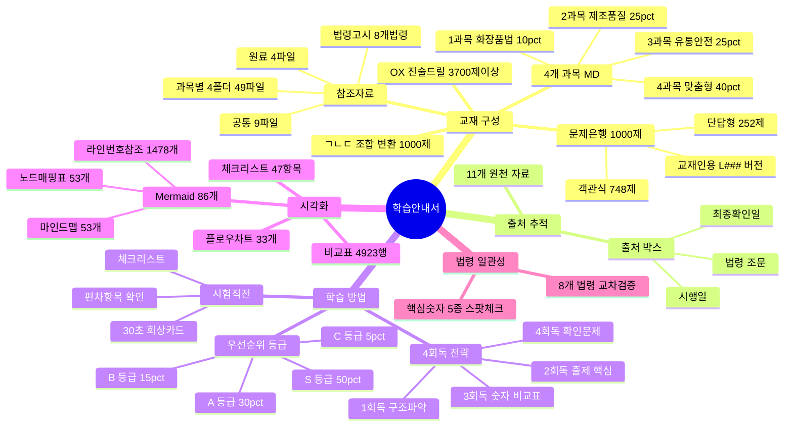
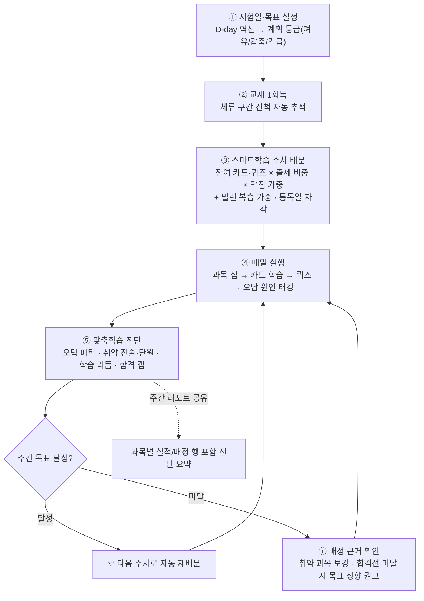

# 📚 맞춤형화장품조제관리사 학습 안내서

### 가독성·시각화 강화 · 맞춤형화장품조제관리사 시험 대비

> **최종 갱신**: 2026-10-13 (제공 콘텐츠 요약으로 §10 재구성 — 개발자용 디렉터리 트리 제거, 참조자료·문제은행·교재 수치를 실제 파일과 동기화)
> **학습 대상**: 맞춤형화장품조제관리사 자격시험 준비생
>
> 📊 **핵심 요약 위치**: 출제비중 분석·학습 방법은 본 문서 §5, 제공 콘텐츠 목록은 §10을 참조하세요.
> - `report/법령최신확인결과.md` — 8개 법령·고시 현행 확인 결과

---

## 🧭 학습 아이콘

| 표시 | 의미 | 학습법 |
| :--- | :--- | :--- |
| 🎯 | **출제 포인트** | 먼저 암기 |
| ⭐ | **한 줄 핵심** | 반복 회상 |
| 🔢 | **숫자·기한** | 표로 정리 |
| ⚠️ | **주의·예외** | 비교 학습 |
| 📝 | **확인문제** | 즉시 풀기 |
| 📊 | **비교표** | 눈으로 익히기 |

---

## 🧠 전체 구조 마인드맵

> 각 노드의 **풍선도움말(설명)**과 **연결 파일**은 하단 [마인드맵 노드 상세 매핑](#마인드맵-노드-상세-매핑) 표를 참조하세요.



### 마인드맵 노드 상세 매핑

| 분과 | 노드 | 풍선도움말 (설명) | 연결 파일 |
|:-----|------|------------------|----------|
| **교재 구성** | 1과목 10% | 법령 위계·영업3종·기능성심사·표시광고·행정처분·개인정보보호 | `교재/law/1과목_화장품법의이해_표준형.md` |
| | 2과목 25% | 원료분류·계면활성제·CGMP·품질검사·사용제한원료·위해관리 | `교재/manufacturing/2과목_제조및품질관리_표준형.md` |
| | 3과목 25% | 청정도등급·필터·설비관리·유통시험법·위해회수·포장재 | `교재/safety/3과목_유통화장품안전관리_표준형.md` |
| | 4과목 40% | 맞춤형화장품 정의·조제관리사시험·안전성시험9종·피부생리·혼합소분·포장 | `교재/understanding/4과목_맞춤형화장품의이해_표준형.md` |
| | 객관식 748제 | 5지선다·4과목 275제 최다·비율 10:25:25:40 반영 | `문제은행/과목1~4_문제은행.md` (4개) |
| | 단답형 252제 | 빈칸채우기·4과목 125제 최다·시험 20문항 중 12문항 | `문제은행/과목4_문제은행.md` |
| | ㄱㄴㄷ 조합 1,000제 | ㄱㄴㄷ 진술 조합형 자동 변환·앱 드릴/모의고사 연동 | 앱 내 "ㄱㄴㄷ 조합 문제집" (드릴 데이터 런타임 렌더링) |
| | 교재인용 L### | 정답 옆 교재 라인번호 표기·오답 시 원문 즉시 역추적 | `문제은행/과목1~4_문제은행.md` (4개) |
| | 과목별 4폴더 | 1~4과목 각 참조자료·MD원문+별표PDF·과목교재에서 인용 | `참조자료/과목1~4/` (4폴더 49파일) |
| | 공통 9파일 | 전 과목 공통 별표·CGMP·안전기준·주의사항·색소 | `참조자료/공통/` (9파일) |
| | 원료 4파일 | 사용가능·금지·제한·색소 원료 목록·2과목·학습안내서 참조 | `참조자료/원료/` (4파일) |
| | 법령고시 8개법령 | 시험대상 8개 법령·고시 PDF 원문·고시 감시로 현행 확인 | `참조자료/법령고시/` (8 PDF) |
| **출처 추적** | 출처 박스 | 각 섹션 근거 법령 조문·시행일·최종확인일 | 4개 과목 MD 내 출처박스 |
| | 11개 원천자료 | 법령6·고시·개인정보보호법·식약처학습자료·전문교재 | `학습안내서.md` §3 |
| **학습 방법** | S/A/B/C 등급 | 예상비중+중요도 기준 4단계 우선순위 분류 | 본 문서 §5 |
| | 4회독 전략 | 구조파악→출제핵심→숫자비교표→확인문제 오답역추적 | 본 문서 §5 |
| | 시험직전 | 30초 회상카드·체크리스트·편차항목 재확인 | 본 문서 §5·§11 |
| **시각화** | Mermaid 86개 | 마인드맵53+플로우차트33·노드 매핑표 53개·라인번호 참조 1,478개 (L### 820·L? 658) | 4개 과목 MD 내 포함 |
| | 비교표 4,923행 | 과목별 테이블 행 수 총합 (마인드맵 매핑표 포함) | 4개 과목 MD 내 포함 |
| | 체크리스트 47항목 | 과목별 체크리스트 항목 총합 | 4개 과목 MD 내 포함 |
| **법령 일관성** | 8개 법령 교차검증 | 4과목 교차참조·동일 법령번호 일치여부·고시 감시로 현행 확인 | `report/법령최신확인결과.md` |
| | 핵심숫자 5종 | 15일·15초·97%·60%40%·28±3일 스팟체크 | 본 문서 §9 |

---

## 1. 교재 구성 개요

본 교재는 **4개 과목 Markdown 파일(`교재/`) + 4개 문제은행(`문제은행/`) + 참조자료(`참조자료/`)**로 구성되어 있습니다.

### 과목 파일

각 과목은 **표준형**(시험 대비 정식 교재)과 **이야기형**(서사 흐름 병행본) 두 버전이 있습니다.

| 과목 | 표준형 | 이야기형 |
| :--- | :--- | :--- |
| 📕 1과목 `교재/law/` | 2,421줄 (166KB) | 3,194줄 (218KB) |
| 📘 2과목 `교재/manufacturing/` | 3,749줄 (260KB) | 5,325줄 (433KB) |
| 📙 3과목 `교재/safety/` | 3,287줄 (199KB) | 4,168줄 (241KB) |
| 📗 4과목 `교재/understanding/` | 4,263줄 (267KB) | 5,265줄 (322KB) |

### 문제은행 (총 1,000제)

| 파일 | 문항 수 | 비율 | 객관식 | 단답형 |
| :--- | :--- | :--- | :--- | :--- |
| `문제은행/과목1_문제은행.md` | 100제 | 10% | 66 | 34 |
| `문제은행/과목2_문제은행.md` | 250제 | 25% | 158 | 92 |
| `문제은행/과목3_문제은행.md` | 250제 | 25% | 249 | 1 |
| `문제은행/과목4_문제은행.md` | 400제 | 40% | 275 | 125 |
| **합계** | **1,000제** | **100%** | **748** | **252** |

> 시험 출제 비율(10:25:25:40)에 맞추어 구성되었으며, 객관식과 단답형이 혼합되어 있습니다.
> 모든 문제은행은 **교재인용(L###)** 버전으로, 각 정답에 교재 라인 번호가 표기되어 오답 시 교재 원문을 즉시 찾을 수 있습니다.

### 앱 학습 기능 (스마트 훈련소·모의고사)

| 기능 | 규모/방식 | 위치 |
| :--- | :--- | :--- |
| **O/X 진술 드릴** | 객관식 선지를 진위형으로 분해한 3,700+ 진술 — 취약·복습 우선 편성, 10/20/전체 출제 수 선택, 수치·한도·기한 태그 집중 모드 | 훈련소 → O/X 드릴 |
| **ㄱㄴㄷ 조합 드릴** | 문제은행 전량을 ㄱㄴㄷ 조합형으로 변환 (100/250/250/400 = 1,000문) — 2단계 응시(진술 O/X 판정 → 조합 선택), 부분 판정으로 선지 소거 | 훈련소 → ㄱㄴㄷ 조합 드릴 |
| **취약 진술 리뷰** | 오판 진술 자동 수집 + SM-2 간격 반복(복습 기한 도래 우선) — 혼동쌍(conceptId) 대조, 연속 3회 정답 시 졸업, 단건 재시도 | 훈련소 → 취약 진술 리뷰 |
| **ㄱㄴㄷ 조합 모의고사** | 과목별 40/60/전체 문항 선택 응시 — 오답 시 진술 정오표 표시·취약 추적 연동 | 실전 모의고사 → 과목 카드 |
| **통합 모의고사** | 100문항 120분(실제 시험 시간) — "ㄱㄴㄷ 조합형으로 혼합" 체크 시 과목별 약 20%를 조합 문항으로 교체 | 실전 모의고사 → 통합 카드 |
| **학습 계획** | 시험일 기준 주차별 역산 계획표 — 학습 가능 일수·학습일당 필요량·주차별 마일스톤·이번 주 진행률 바, D-30/14/7 임계 안내 | 학습 캘린더 (시험일 설정 시) |
| **스마트학습** | 주차별 총량을 과목별로 자동 배분 — 남은 카드·퀴즈 × 출제 비중 × 약점 가중, 과목 칩 `실적/배정` · 클릭 시 바로가기 · ⓘ 배정 근거 · 주차×과목 배분표 (진행 흐름 상세는 §5) | 학습 캘린더 → 학습 계획 (PRO 표기) |
| **오늘의 맞춤 학습 추천** | SM-2 복습 대기·과락 위기·정답률 최저·헷갈린 카드·미학습 순으로 오늘의 우선순위 제안 — 사유+즉시 실행 버튼 | 대시보드 |
| **맞춤학습** | 개인화 분석 전용 화면 — 진단 요약 카드(오답 패턴·취약 진술·학습 리듬·단원 취약·합격 갭·이번 주 스마트학습) + 과목 상태·히트맵·성적 추이·합격 예측 + 주간 리포트 공유 (진행 흐름 상세는 §5, 카드별 설명은 사용자 매뉴얼) | 학습 → 맞춤학습 (PRO 표기) |

---

## 2. 과목별 학습 내용

### 📕 1과목 — 화장품법의 이해

화장품법·시행령·시행규칙·고시의 법령 위계, 영업 3종(제조업·책임판매업·맞춤형판매업)의 등록·신고 절차, 결격사유, 기능성화장품 심사, 표시·광고 규정, 개인정보 보호, 행정처분 기준을 다룹니다.

- **Mermaid 다이어그램**: 15개 (마인드맵 9개 + 플로우차트 6개)
- **체크리스트**: 12항목
- **FINAL REVIEW 카드**: 10장

| 섹션 | 예상 비중 | 중요도 | 문제은행 편차 | 우선순위 |
|------|:--------:|:------:|:---------:|:--------:|
| 1.1 화장품법 | 80~85% | ★★★★★ | +15~20% (과다) | **S** |
| 1.2 개인정보 보호법 | 15~20% | ★★★ | −15~20% (과소) | **A** ⚠️ |

### 📘 2과목 — 제조 및 품질관리

원료의 종류와 특성, 계면활성제·보존제·색소·향료, 화장품 제조공정, CGMP(우수화장품 제조 및 품질관리기준), 품질검사 체계, 사용금지·제한 원료, 위해관리와 회수 절차를 다룹니다. 4개 과목 중 가장 분량이 많습니다.

- **Mermaid 다이어그램**: 25개 (마인드맵 16개 + 플로우차트 9개)
- **체크리스트**: 10항목
- **FINAL REVIEW 카드**: 10장

| 섹션 | 예상 비중 | 중요도 | 문제은행 편차 | 우선순위 |
|------|:--------:|:------:|:---------:|:--------:|
| 2.1 원료/제조관리 | 30~35% | ★★★★★ | +17~22% (과다) | **S** |
| 2.3 사용제한 원료 | 25~30% | ★★★★★ | −20~25% (심각 과소) | **S** ⚠️ |
| 2.2 기능과 품질 | 15~20% | ★★★★ | −7~12% (과소) | **A** |
| 2.5 위해사례 판단 | 10~15% | ★★★★ | +3~8% (약 과다) | **A** |
| 2.4 화장품 관리 | 10~15% | ★★★ | +1~6% (양호) | **B** |

### 📙 3과목 — 유통 화장품 안전관리

작업실 청정도 등급, 필터·소독제, 설비 관리, 원료 입고·보관·출고, 유통 안전관리 시험방법, 위해화장품 회수, 직접구매 해외화장품 신고, 포장재 관리를 다룹니다. 25문항 전체가 선다형입니다.

- **Mermaid 다이어그램**: 19개 (마인드맵 13개 + 플로우차트 6개)
- **체크리스트**: 10항목
- **FINAL REVIEW 카드**: 6장

| 섹션 | 예상 비중 | 중요도 | 문제은행 편차 | 우선순위 |
|------|:--------:|:------:|:---------:|:--------:|
| 3.4 원료/내용물 관리 | 25~30% | ★★★★★ | −1~6% (양호) | **S** |
| 3.3 설비 및 기구 관리 | 20~25% | ★★★★★ | −11~16% (과소) | **S** ⚠️ |
| 3.1 작업장 위생관리 | 20~25% | ★★★★ | +36~41% (심각 과다) | **A** |
| 3.2 작업자 위생관리 | 15~20% | ★★★★ | −13~18% (과소) | **A** ⚠️ |
| 3.5 포장재의 관리 | 10~15% | ★★★ | −7~12% (과소) | **B** |

### 📗 4과목 — 맞춤형화장품의 이해

맞춤형화장품 정의(혼합형·소분형), 판매업 신고, 조제관리사 자격시험, 안전성시험 9종, 유효성·안정성시험, 피부 구조와 생리, 모발 생리, 상태 분석, 관능평가, 혼합·소분 실무, 포장을 다룹니다. 출제 비율이 40%로 가장 높으며, **단답형 12문항(전체 20문항 중 60%)**이 출제됩니다.

- **Mermaid 다이어그램**: 27개 (마인드맵 15개 + 플로우차트 12개)
- **체크리스트**: 15항목
- **FINAL REVIEW 카드**: 10장

| 섹션 | 예상 비중 | 중요도 | 문제은행 편차 | 우선순위 |
|------|:--------:|:------:|:---------:|:--------:|
| 4.6 혼합 및 소분 | 25~31% | ★★★★★ | −12~18% (과소) | **S** ⚠️ |
| 4.2 피부/모발 생리구조 | 20~25% | ★★★★★ | +18~23% (과다) | **S** |
| 4.1 맞춤형화장품 개요 | 8~10% | ★★★★ | +29~31% (심각 과다) | **B** |
| 4.4 제품 상담 | 8~10% | ★★★★ | −8~10% (과소) | **A** ⚠️ |
| 4.5 제품 안내 | 8~10% | ★★★★ | −8~10% (과소) | **A** ⚠️ |
| 4.3 관능평가 | 5~7% | ★★★ | −5~7% (과소) | **B** |
| 4.7 충진 및 포장 | 5~7% | ★★★ | −3~5% (과소) | **B** |
| 4.8 재고관리 | 2~4% | ★★ | — | **C** |

---

## 3. 출처 추적 체계

본 교재의 모든 주요 섹션에는 **출처 박스**가 추가되어 있어, 각 학습 내용의 법적 근거를 추적할 수 있습니다.

### 출처 박스 형식

```
> 📌 출처: [법령/고시명 조문] | 시행일: [YYYY. M. D.] | 최종 확인: 2026. 8. 30.
```

### 주요 원천 자료

| 구분 | 원소스 | 활용도 |
| :--- | :--- | :--- |
| ① 법령 | 화장품법 (제20901호) | ★★★★★ |
| ② 시행규칙 | 화장품법 시행규칙 (제2109호) | ★★★★★ |
| ③ 식약처 고시 | 화장품 안전기준 등에 관한 규정 (제2026-19호) | ★★★★★ |
| ④ 식약처 고시 | 기능성화장품 심사 규정 (제2025-88호) | ★★★★★ |
| ⑤ 식약처 고시 | CGMP (제2024-46호) | ★★★★★ |
| ⑥ 식약처 고시 | 색소 종류 및 기준 (제2023-61호) | ★★★★☆ |
| ⑦ 식약처 고시 | KFCC 기준 및 시험방법 (제2025-89호) | ★★★★☆ |
| ⑧ 식약처 고시 | 주의사항·알레르기 (제2026-56호) | ★★★★★ |
| ⑨ 개인정보 보호법 | 개인정보 보호법 (법률 제19229호) | ★★★★☆ |
| ⑩ 식약처 학습자료 | 안내서, 가이드라인, 해설자료 | ★★★★☆ |
| ⑪ 전문 교재 | 피부과학·모발과학·제제학 교재 | ★★★☆☆ |

### 콘텐츠 제작 흐름

```
정부 원문 → 구조화 → 쉬운 설명 → 시각화(표·마인드맵) → 문제화 → 출처 tagging
```

> ⚠️ 법령·고시는 개정될 수 있습니다. 출처 박스의 **시행일**과 **최종 확인일**을 참조하여,
> 개정 시 해당 섹션만 찾아 업데이트하면 됩니다.

---

## 4. 과목 파일 공통 구조

모든 과목 파일은 동일한 골격으로 작성되어 있습니다.

| 순서 | 섹션 | 설명 |
| :--- | :--- | :--- |
| 1 | **표지** | 과목 이모지 + 부제 |
| 2 | **학습 안내** | 교재의 학습 방향 안내 |
| 3 | **학습 아이콘** | 6종 아이콘 범례 |
| 4 | **시험 직전 1분 전체 지도** | 과목 전체 흐름을 한눈에 |
| 5 | **최우선 암기 축** | 시험 전날 반드시 볼 핵심 |
| 6 | **숫자 암기 미리보기** | 출제 빈도 높은 숫자 정리 |
| 7 | **목차** | 법령 조문 기준 목차 |
| 8 | **본문** | 법령·학습자료·표·다이어그램 |
| 9 | **확인문제** | 각 챕터별 즉시 풀기 |
| 10 | **문제은행 링크** | 과목별 실전 예상 문제로 이동 |
| 11 | **FINAL REVIEW** | 30초 회상 카드 + 체크리스트 + 추천 회독법 |

### FINAL REVIEW 구성 (전 과목 공통)

```text
30초 회상 카드 (CARD 01~10)
   ↓
시험 직전 체크리스트
   ↓
추천 회독법
```

---

## 5. 추천 학습 방법

> 📋 이 절은 출제비중 분석 결과를 반영한 **핵심 요약**입니다.
> 등급 분류의 근거가 된 상세 분석은 개발 문서(`docs/report_archive/`)에 보관되어 있습니다.
>
> 📱 **앱 기능 사용법**: 플래시카드, 퀴즈, 모의고사, 교재 리더 등 앱 기능의 구체적인 사용 방법은 **[사용자 매뉴얼](doc:user_manual)**을 참조하세요.

### 출제비중 기반 우선순위 등급

| 등급 | 조건 | 학습 전략 | 비중 |
|:----:|------|-----------|:----:|
| **S** | 예상 비중 ≥20% + ★★★★★ | 최우선 심화 학습, 완벽 암기 | 50% |
| **A** | 예상 비중 10~20% + ★★★★~★★★★★ | 핵심 위주 반복 학습 | 30% |
| **B** | 예상 비중 5~10% + ★★★~★★★★ | 요약 정리 + 문제은행 풀이 | 15% |
| **C** | 예상 비중 ≤5% + ★★~★★★ | 마지막에 훑기만 | 5% |

### 회독별 학습 전략 (출제비중 반영)

```text
1회독  구조 파악 + S등급 정독 (마인드맵 · 흐름도 · 본문)
   ↓
2회독  🎯 출제 + ⭐ 핵심 + A등급 보완 (과소 항목 집중)
   ↓
3회독  🔢 숫자 + 📊 비교표 + B등급 요약
   ↓
4회독  📝 확인문제 + 오답 역추적 (L### → 교재 원문)
   ↓
시험 직전  🧠 30초 회상 카드 + 📋 체크리스트 + ⚠️ 편차 항목
```

> 💡 **앱 연동**: 교재리더에서 읽은 구간과 읽기 시간은 자동으로 기록되어, **1회독 진척률이 학습 계획에 반영**됩니다 — 남은 통독 기간만큼 카드 학습일이 예약되고, 읽기만 한 날도 학습일로 인정됩니다.

> **핵심 원칙:** 긴 설명을 처음부터 다시 읽기보다, **표·흐름도·숫자·문제를 통해 먼저 회상한 뒤 필요한 부분만 본문으로 돌아가는 방식**을 권장합니다.
> **편차 보정 원칙:** 문제은행 분포가 예상 비중보다 **과소한 항목은 교재 본문+참조자료로 보완**, **과다한 항목은 문제은행 풀이만으로 복습**합니다.
> **매일 학습 습관:** 매일 5분 데일리 챌린지로 연속 학습(🔥 스트릭)을 유지하고, 캘린더의 주간 목표 링으로 이번 주 진행을 확인하세요. 스트릭 복구권·마스터리 레벨 등 상세 기능은 [사용자 매뉴얼](doc:user_manual)을 참조하세요.

### 🔁 스마트학습·맞춤학습 진행 흐름

시험일을 설정하면 **스마트학습**이 주차별 과목 배분을 만들고, 학습 기록이 **맞춤학습** 진단에 쌓여 다시 배분 가중으로 되먹는 순환입니다. 맞춤학습은 별도 "시작" 절차가 없습니다 — 퀴즈·복습·드릴·모의고사 기록이 표본을 채우면 진단 카드가 자동으로 채워집니다.



#### 단계별 상세

| 단계 | 앱이 하는 일 | 사용자가 할 일 |
|:---:|---|---|
| **① 시험일 설정** | D-day로 주차별 학습일을 역산하고, 필요량÷일일 목표 비율로 **여유/압축/긴급** 등급 판정. 50일 미만이면 권장 준비 기간 경고 (계획은 정상 생성) | 대시보드 첫 카드 또는 캘린더에서 시험일 입력 |
| **② 교재 1회독** | 실제로 머문 구간(청크)만 진척으로 누적하고, 남은 통독 예상 학습일을 카드 학습일에서 차감 — 주차 표에 "통독 N일" 표기. 읽기만 한 날도 학습일·스트릭 인정 | 표준형 또는 이야기형으로 가볍게 구조 파악 (마인드맵·흐름도 위주) |
| **③ 스마트학습 배분** | 과목별 남은 카드·퀴즈에 **출제 비중 × 약점 가중**(최근 퀴즈 정답률·헷갈림 카드·오답 원인·취약 단원·밀린 SM-2 복습)을 곱해 주차 배분. 먼저 끝낸 과목의 배정은 남은 과목으로 자동 재배분 | 이번 주 과목 칩의 `실적/배정` 확인. `약점` 배지 과목 우선 |
| **④ 매일 실행** | 칩 클릭 → 해당 과목 플래시카드 즉시 시작. 퀴즈 오답에 원인 태그를 달면 분류표에 축적 | 카드 목표(기본 50장)·퀴즈 목표(기본 10문) 채우기 + 오답 원인 태깅 |
| **⑤ 맞춤학습 진단** | 6개 진단 카드가 기록을 종합 — 진단 결과가 다음 주차 배분의 약점 가중에 반영. 합격선 미달이면 목표 상향 권고(계획 필요량 기반 권장치)와 "목표 상향" 버튼 | 취약 단원·오답 패턴 확인 → 권장 학습법 실천 |
| **⑥ 주간 판정·재배분** | 주간 목표 달성 시 다음 주차로 자동 진행. 미달 시 칩 ⓘ로 배정 근거를 확인하고 보강 동선 안내 | 주간 리포트로 복기 — 과목별 실적/배정 준수 확인 |

#### 데이터가 쌓이는 순서

```text
첫 주  : 카드·퀴즈 기록 축적 → 진단 카드가 하나씩 활성화 (표본 부족 시 중립 가중치)
2~3주차: 오답 원인·취약 진술 누적 → 스마트학습 배분이 약점을 강하게 반영
중반   : 모의고사 1회 이상 → 성적 추이·합격 예측·과목별 균형(레이더) 활성화
후반   : 합격 갭이 0에 수렴하도록 일일 목표·배분이 자동 조정되는 흐름 확인
```

> 💡 **왜 이 순서인가**: 시험일이 배분의 기준선을 정하고, 교재 1회독이 전체 지형을 잡으며, 그 뒤의 카드·퀴즈 실행이 진단의 표본을 만듭니다. 진단 없는 초반엔 출제 비중 중심의 중립 배분, 표본이 쌓인 후반엔 약점 중심의 개인화 배분으로 자연히 이동합니다.

### 과목별 학습 순서 권장

1. **1과목** → 법령 체계를 먼저 잡으면 2·3과목 이해가 빨라집니다 (⚠️ 1.2 개인정보보호법 문제은행 0문항, 교재 본문 학습 필수)
2. **2과목** → 분량이 가장 많으므로 충분한 시간 배정 (⚠️ 2.3 사용제한 원료 문제은행 5% vs 예상 25~30%, 최우선 보완)
3. **3과목** → 2과목의 CGMP와 연결되므로 연이어 학습 (⚠️ 3.1 작업장 위생 문제은행 61% 과다, 3.2/3.3 보완 필요)
4. **4과목** → 출제 비율 40% + 단답형 12문항 최다, 마지막에 집중 반복 (⚠️ 4.6 혼합·소분 문제은행 13% vs 예상 25~31%)

### 과목별 시간 배분 추천 (100시간 기준)

| 과목 | 시험 비율 | 추천 시간 | 조정 사유 |
|:----:|:---------:|:---------:|----------|
| 1 | 10% | 10시간 | 1.2 개인정보보호법 보완에 시간 배정 |
| 2 | 25% | 30시간 | 2.3 사용제한 원료 집중 보완에 추가 시간 |
| 3 | 25% | 25시간 | 3.1 과다 → 감량, 3.2/3.3 보완에 재배분 |
| 4 | 40% | 35시간 | 4.1/4.2 과다 → 감량, 4.4/4.5/4.6 보완에 재배정 |

### 과목 간 연결 학습

| 연결 | 학습 포인트 |
| :--- | :--- |
| 1과목 ↔ 2과목 | 화장품법·기능성 규정 ↔ 제조·품질 기준 |
| 2과목 ↔ 3과목 | 제조·품질관리 ↔ 유통·안전관리 |
| 2과목 ↔ 4과목 | 원료·배합·품질 기준 ↔ 맞춤형화장품 조제 실무 |
| 3과목 ↔ 4과목 | 유통 안전관리 ↔ 맞춤형 판매장 안전관리 |

### 시험 직전 D-5 학습 플랜

> **목표**: 시험 5일 전부터 당일까지, 정리된 자료로 최종 회독
> **전략**: "요약 → 문항 → 문제은행 → 모의고사" 4단계 회전
> **과목 비중**: 1과목 10% / 2과목 25% / 3과목 25% / 4과목 40%

**활용 자료 맵**

| 자료 | 위치 | 용도 |
| --- | --- | --- |
| 과목별 핵심요약 | `참조자료/과목N/N과목_핵심요약.md` | 1분 요약표 → 전체 지도 → 챕터별 상세 → 혼동 함정표 → 숫자 체크리스트 |
| 핵심정리 문항 | `참조자료/과목N/N과목_핵심정리_XX문항.md` | 비중만큼 선별된 핵심 문항 (10/25/25/40) |
| 핵심암기 | `참조자료/과목2/2과목_Ch01_원료_핵심암기.md`, `Ch03_사용제한원료_핵심암기.md` | 원료·배합한도 집중 암기 |
| 두음법·숫자 암기 총정리 | `docs/두음법_암기_총정리.md` | 두음법 64개(Part 1) + 중요 숫자 전수 회독(Part 2) |
| 문제은행 | 앱 문제은행 뷰 (과목별 100/250/250/400 = 1,000제) | 실전 검증, 기출 필터 활용 |
| ㄱㄴㄷ 조합 드릴/모의고사 | 앱 훈련소·모의고사 (과목별 ㄱㄴㄷ 조합 1,000문) | ㄱㄴㄷ 조합 실전 대비, 오판 진술 자동 추적 |
| O/X 진술 드릴 | 앱 훈련소 (3,700+ 진술) | 진술 단위 O/X 반복, 취약·복습 우선 편성 |
| 취약 진술 리뷰 | 앱 훈련소 | 오판 진술·SM-2 복습 대상·혼동쌍 대조 |
| 통합 실전 모의고사 | 앱 모의고사 (100문항 120분) | 실제 시간대 응시 + 결과 리뷰 |
| 스마트 훈련소 | 앱 훈련소 | 계산 연습(배합 한도) + 원료 배합 챌린지 |
| 오디오북 | 앱 오디오북 | 이동·식사 시간 청취 |

**📅 D-5 — 과목4 집중 (비중 40%)**

1. `4과목_핵심요약.md` 정독 — 혼동 함정표와 숫자 체크리스트까지
2. `4과목_핵심정리_40문항.md` 풀이 — 모르는 문항은 문제은행에서 해당 주제 검색해 근거 확인
3. 앱: 과목4 문제은행 1회전 — 시간 부족 시 **기출 필터(🎯)** 모드로 표시 문제만

**📅 D-4 — 과목2 + 과목3 (각 25%)**

1. `2과목_핵심요약` + `Ch01_원료_핵심암기` + `Ch03_사용제한원료_핵심암기` — 배합한도가 과목2 핵심
2. `2과목_핵심정리_25문항` 풀이
3. `3과목_핵심요약` — 청정도 등급 수치·미생물 기준·안전용기 제외 대상이 빈출
4. `3과목_핵심정리_25문항` 풀이

**📅 D-3 — 과목1 + 암기 자료 총정리**

1. `1과목_핵심요약` — 벌칙/과태료 구간, 등록 vs 신고, 기한(30일/90일/15일) 표만 집중
2. `1과목_핵심정리_10문항` 풀이
3. `두음법_암기_총정리.md` 1회전 (두음법 Part 1 + 중요 숫자 Part 2)
4. 앱: **스마트 훈련소 → 계산 연습** (배합 한도 × g 계산 유형) + **원료 배합 챌린지**

**📅 D-2 — 전 과목 2회차 회독**

1. 각 과목 핵심요약의 **혼동 함정표 + 숫자 체크리스트**만 회독 (과목당 30~40분)
2. 핵심정리 문항 중 D-5~D-3에 틀린 문항 재풀이
3. 앱: 문제은행 **기출 필터(🎯)** 모드로 과목당 표시 문제만 스캔
4. `두음법_암기_총정리.md` 2회전 — 연상 문장까지 회상되는지 확인
5. 이동/식사 시간: **오디오북**으로 약한 과목 챕터 청취

**📅 D-1 — 모의고사 + 약점 보완**

1. **통합 실전 모의고사** 1회 — 실제 시험 시간대에 응시, 타이머 사용 (100문항 120분)
2. 결과 리뷰에서 틀린 과목 확인 → 해당 과목 핵심요약의 **혼동 함정표**만 재학습
3. 틀린 문제의 주제를 문제은행에서 10~20제 추가 풀이
4. 저녁: `두음법_암기_총정리.md` 숫자 파트(Part 2) 2회전 + 각 과목 핵심요약의 **숫자 체크리스트**만 스캔

**📅 시험 당일**

1. 핵심요약 4종의 **"시험 직전 1분 요약표" + 숫자 체크리스트**만 회독 (과목당 5~10분)
2. 새 문제 풀이 금지 — 이미 본 것만 복습
3. 데일리 챌린지로 가볍게 워밍업

**우선순위 팁**

| 상황 | 행동 |
| --- | --- |
| 시간 부족 시 | 과목4(40%) > 과목2·3 > 과목1 순으로만 |
| 가장 효율 높은 자료 | 핵심요약의 **혼동 함정표 + 숫자 체크리스트** — "옳지 않은 것" 유형 대비에 핵심 |
| 계산 문제 | 배합 한도 × g 계산은 훈련소 계산 연습으로 유형만 익히면 충분 |
| 교재 미수록 용어 | 문제은행에 스핑고신·헤미데스모좀·코르네오데스모좀·초임계·MSDS·에어샤워·ADI·자유지방산·공정검증 등이 정답으로 등장 — 별도 메모로 단답 암기 권장 |

**과목별 반드시 확인할 함정**

- **1과목**: 제조업·책임판매업 **등록** vs 맞춤형판매업 **신고** / 등록기관 = 지방식약청장 / 결격 1년·3년 / 변경 30일·90일 / 벌칙 3년·1년·200만
- **2과목**: 퍼퓸 부향률 15~25% / 파라벤 단일 0.4%·혼합 0.8% / 치오글리콜 퍼머 11%·제모 3.0~4.5% / 벤조페논-3 2.4%(5%) / HLB 3~6·8~14·15~18
- **3과목**: 청정도 등급(낙하균 10/30, 부유균 20/200) / 필터 5·0.5·0.3㎛ / 미생물 100·500·1000 / 선한선출 / 안전용기 제외(일회용·에어로졸)
- **4과목**: 각화주기 28±3일 / 표피 구성비 58·31·11 / 안정성 3로트·6개월·+15℃·-15~45℃ / 포장공간 15·10·25 / 시험 90일 전 공고·60%/40% / 피지 구성 TG 41%·왁스에스터 25%·지방산 16%·스쿠알렌 12%

---

## 6. 참조자료 구성

### 과목별 참조자료

| 폴더 | 파일 수 | 주요 내용 |
| :--- | :--- | :--- |
| `참조자료/과목1/` | 6개 | 화장품법 원문, 개인정보보호법, 시행규칙 별표(행정처분·수수료), 핵심요약·정리 문항 |
| `참조자료/과목2/` | 21개 | 원료·품질·위해관리 자료, KFCC 별표 10종, 핵심암기·정리 문항 |
| `참조자료/과목3/` | 12개 | 작업장·작업자·설비·자재·포장 안전 자료, 시행규칙 별표 |
| `참조자료/과목4/` | 10개 | 맞춤형화장품 개요·생리·관능평가·컨설팅·혼합소분·포장 |

### 공통참조자료

`참조자료/공통/` 폴더에 9개 PDF가 있으며, CGMP 별표, 안전기준 별표(사용불가·사용제한 원료 등), 유형별 주의사항 문구, 알레르기 유발성분 25종, 색소 종류 및 기준 등 전 과목 공통으로 참조하는 자료가 포함되어 있습니다.

### 원료 정보

`참조자료/원료/` 폴더에 4개 파일이 있습니다.

| 파일 | 내용 | 크기 |
| :--- | :--- | :--- |
| `참조자료/원료/approved_ingredients.md` | 사용 가능 원료 목록 | 52KB |
| `참조자료/원료/banned_ingredients.md` | 사용 금지 원료 목록 | 308KB |
| `참조자료/원료/restricted_ingredients.md` | 사용 제한 원료 목록 | 95KB |
| `참조자료/원료/colorants_ingredients.md` | 색소 원료 목록 | 9KB |

### 법령 원문

`참조자료/법령고시/` 폴더에 시험 대상 8개 법령의 PDF 원문이 있습니다.

| 법령 | 고시 번호 |
| :--- | :--- |
| 화장품법 | 제20901호 |
| 화장품법 시행규칙 | 제02109호 |
| 화장품 안전기준 등에 관한 규정 | 제2026-19호 |
| 우수화장품 제조 및 품질관리기준 | 제2024-46호 |
| 기능성화장품 심사에 관한 규정 | 제2025-88호 |
| 기능성화장품 기준 및 시험방법 | 제2025-89호 |
| 화장품 사용할 때의 주의사항 및 알레르기 유발성분 표시에 관한 규정 | 제2026-56호 |
| 화장품의 색소 종류 및 기준 | 제2023-61호 |

---

## 7. 시각화 요소 현황

각 과목은 이해를 돕기 위해 Mermaid 다이어그램, 마인드맵, 플로우차트, 비교표를 적극 활용합니다.

| 요소 | 1과목 | 2과목 | 3과목 | 4과목 |
| :--- | :--- | :--- | :--- | :--- |
| Mermaid 다이어그램 | 15 | 25 | 19 | 27 |
| └ 마인드맵 | 9 | 16 | 13 | 15 |
| └ 노드 매핑표 | 9 | 16 | 13 | 15 |
| └ 라인번호 참조 | 221 | 391 | 351 | 515 |
| └ 플로우차트 | 6 | 9 | 6 | 12 |
| 비교표 (테이블 행) | 663 | 1,894 | 961 | 1,405 |
| 체크리스트 항목 | 12 | 10 | 10 | 15 |

> GFM(GitHub Flavored Markdown) 기반 렌더러에서 모든 표와 다이어그램이 정상 렌더링됩니다.
> 마인드맵 노드 매핑표의 각 셀은 `텍스트 (L###)` 형식으로 문서 내 라인번호를 참조하여, 에디터에서 `Ctrl+G`로 즉시 이동 가능합니다.

---

## 8. 법령 인용 일관성

모든 과목 파일에서 동일한 법령 번호를 일관되게 인용하고 있습니다.

| 검토 항목 | 결과 |
| :--- | :--- |
| 화장품법 (제20901호) | ✅ 4과목 일치 |
| 시행규칙 (제2109호) | ✅ 4과목 일치 |
| 안전기준 고시 (제2026-19호) | ✅ 4과목 일치 |
| CGMP 고시 (제2024-46호) | ✅ 2·3과목 일치 |
| 기능성심사 규정 (제2025-88호) | ✅ 1·2과목 일치 |
| KFCC (제2025-89호) | ✅ 2과목 |
| 주의사항 고시 (제2026-56호) | ✅ 2과목 |
| 과목 간 교차 참조 | ✅ 4과목 상호 참조 |

---

## 9. 핵심 숫자 스팟체크

시험에 자주 출제되는 핵심 숫자의 정확성을 확인했습니다.

| 검토 항목 | 결과 |
| :--- | :--- |
| 안전성정보 신속보고 15일 | ✅ |
| 손 세정 15초 이상 | ✅ |
| 내용량 평균 97% 이상 | ✅ |
| 자격시험 60%/40% 합격 | ✅ |
| 각화주기 28±3일 | ✅ |

---

## 10. 제공 콘텐츠 요약

이 시험 패키지에서 학습에 활용할 수 있는 콘텐츠는 다음과 같습니다.

### 📖 교재

| 과목 | 표준형 | 이야기형 |
| :--- | :--- | :--- |
| 1과목 화장품법의 이해 | 2,421줄 | 3,194줄 |
| 2과목 화장품 제조 및 품질관리 | 3,749줄 | 5,325줄 |
| 3과목 유통화장품 안전관리 | 3,287줄 | 4,168줄 |
| 4과목 맞춤형화장품의 이해 | 4,263줄 | 5,265줄 |

- **표준형** — 시험 대비용 정식 교재. 🎯⭐🔢⚠️📝📊 학습 아이콘 + FINAL REVIEW 수록
- **이야기형** — 같은 내용을 서사 흐름으로 풀어낸 병행본 (통학·취침 전 회독용)
- **용어집** — 과목별 핵심 용어 총 156개 (1과목 23 · 2과목 52 · 3과목 45 · 4과목 36)

### ✏️ 문제·훈련 콘텐츠

| 콘텐츠 | 규모 | 활용처 |
| :--- | :--- | :--- |
| 문제은행 | 1,000제 (100/250/250/400) | 퀴즈·모의고사·약점 추적 |
| ㄱㄴㄷ 조합 드릴 | 문제은행 전량 변환 | 훈련소 — 진술 판정 → 조합 선택 |
| O/X 진술 드릴 | 3,700+ 진술 | 훈련소 — 취약·복습 우선 편성 |
| 숫자 드릴 | 140항목 (30/23/41/46) | 훈련소 — 수치·기한·한도 집중 |
| 핵심 수치 암기 | 23항목 | 훈련소 — 법령 수치 마스터 |
| 원료 안전성 챌린지 | 원료 DB 연동 문항 | 훈련소 — 사용가능·제한·금지 판별 |

### 📚 지식 DB·참조자료

| 항목 | 내용 |
| :--- | :--- |
| 원료 사전 | 1,402종 — 사용가능 93 · 사용제한 205 · 사용금지 1,104 (고시 반영 최신본) |
| 과목별 참조자료 | MD+PDF 총 49개 (1과목 6 · 2과목 21 · 3과목 12 · 4과목 10) |
| 공통 참조자료 | 별표 PDF 9종 — CGMP·안전기준·주의사항·색소 기준 |
| 법령·고시 원문 | 8종 PDF — 화장품법·시행규칙·안전기준 등 시험 대상 전량 |
| 원료 목록 | 사용가능·금지·제한·색소 MD 4종 |
| 두음법 암기 총정리 | 두음법칙+핵심숫자 통합 암기표 (~900줄) |

### 🎧 오디오북

- 과목별 이야기형 교재 낭독 MP3 4종 — 이동 중 청취용
- 앱 내 오디오북 뷰어에서 재생 (챕터 이동·재생 속도 지원)

### 📱 오프라인·모바일 열람

- 모든 교재·문제은행·참조자료는 **앱 내 뷰어**로 오프라인 열람 가능
- HTML 단독 문서 18종 — 브라우저만으로 모바일 열람 (교재 표준형/이야기형 8 + 문제은행 유형별 8 + 안내서·법령확인 2)

---

## 11. 학습 체크리스트

### 시작 전

- [ ] 4개 과목 파일을 GFM 지원 뷰어(VS Code, Obsidian, GitHub 등)로 열기
- [ ] 학습 아이콘 6종(🎯⭐🔢⚠️📝📊) 의미 숙지
- [ ] 과목별 출제 비율(10:25:25:40) 확인 후 학습 계획 수립
- [ ] 본 안내서 §5 "출제비중 기반 우선순위 등급" 숙지 — S/A/B/C 등급 우선순위 확인
- [ ] 객관식 vs 단답형 비율 확인 (특히 과목4 단답형 12문항)
- [ ] 과목별 최소 합격선(40%) 확인 — **과목1 위험도 가장 높음** (1문항당 10점)

### 회독별

- [ ] 1회독: 각 과목 시험 직전 1분 전체 지도로 구조 파악 + **S등급 본문 정독**
- [ ] 2회독: 🎯 출제 포인트 + ⭐ 핵심 + **A등급 과소 항목 보완** (⚠️ 편차 항목 집중)
- [ ] 3회독: 🔢 숫자·기한 + 📊 비교표 + **B등급 요약** + 과목 간 연결 학습
- [ ] 4회독: 📝 확인문제 풀고 **오답 L### 역추적** → 교재 원문 재학습
- [ ] 시험 직전: FINAL REVIEW 30초 회상 카드 + 체크리스트 + ⚠️ 편차 항목 재확인

### 과목별 최종 점검

- [ ] 1과목: 법령 위계 4단계, 영업 3종, 결격사유, 기능성화장품 + **1.2 개인정보보호법** ⚠️
- [ ] 2과목: 원료 분류, 계면활성제 HLB, CGMP 3요소, 제조공정 + **2.3 사용제한 원료** ⚠️
- [ ] 3과목: 청정도 4등급, 필터 3종, 소독제, 위해화장품 회수 + **3.3 설비·기구, 3.2 작업자 위생** ⚠️
- [ ] 4과목: 맞춤형화장품 정의, 조제관리사 자격시험, 안전성시험 9종, 피부 구조 + **4.6 혼합·소분, 4.4 제품 상담, 4.5 제품 안내** ⚠️

### 시험 직전 최종 점검

- [ ] S등급 7개 항목 30초 회상 카드 점검
- [ ] ⚠️ 편차 항목(2.3, 4.6, 3.3, 1.2, 4.4, 4.5, 3.2) 재확인
- [ ] 핵심 숫자 5종 (15일, 15초, 97%, 60%/40%, 28±3일)
- [ ] 모의고사 최소 3회 이상 실시 (시간 관리 훈련)
- [ ] 오답 노트 전체 회독
- [ ] 시험 당일: 부정형 문제 밑줄, 시간 배분(1문항당 1.2분), 단답형 빈칸 금지

---

*본 안내서는 2026-10-01에 갱신되었습니다. (ㄱㄴㄷ 조합 드릴 1,000문·O/X 진술 드릴 3,700+·취약 진술 추적·통합 모의고사 120분 등 앱 학습 기능 반영·문제은행 유형 통계 정정·UI 명칭 ㄱㄴㄷ 조합형으로 통일)*

> 📱 **앱 사용법**: 플래시카드, 퀴즈, 모의고사, 교재 리더, 오디오 듣기, 성분 사전, 백업/복원, PWA 설치 등 앱 기능 사용법은 **[사용자 매뉴얼](doc:user_manual)**을 참조하세요.
