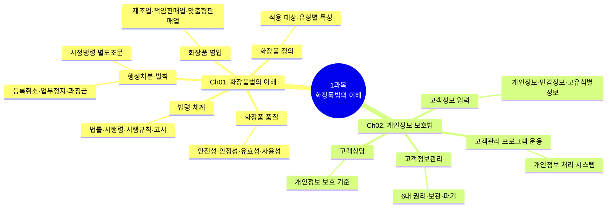
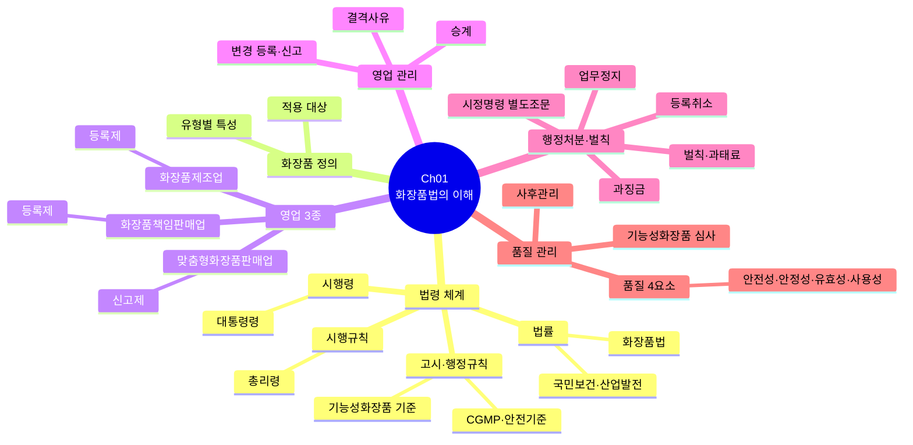
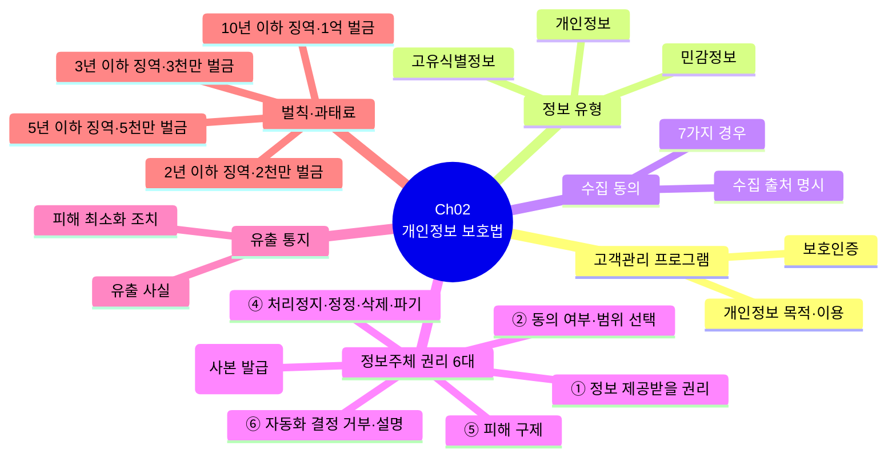
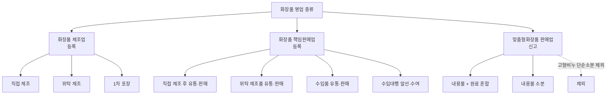
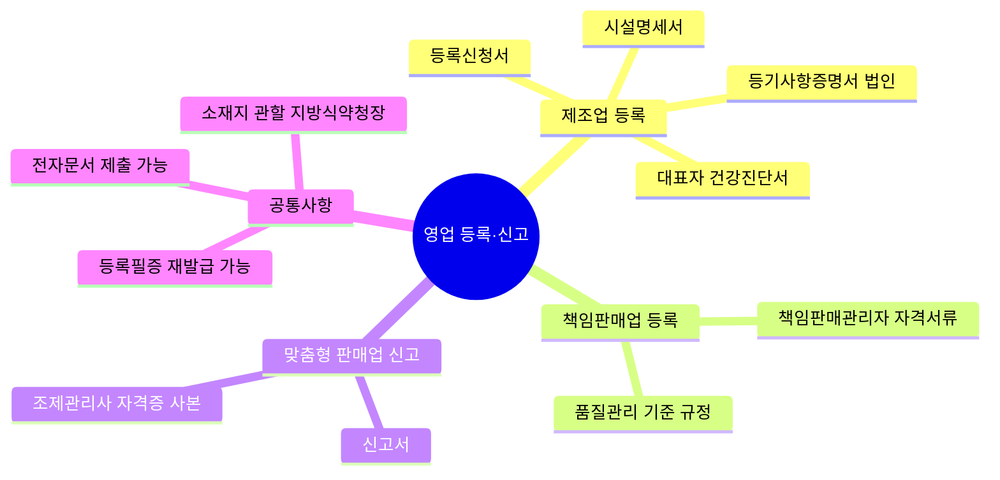
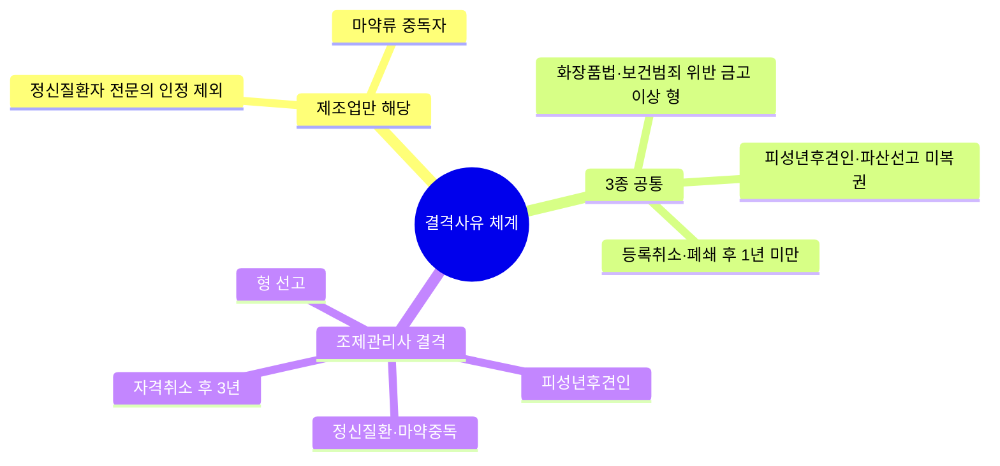
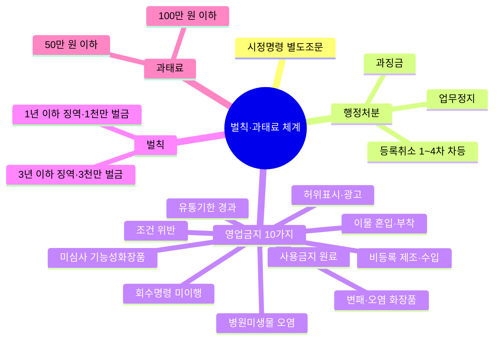
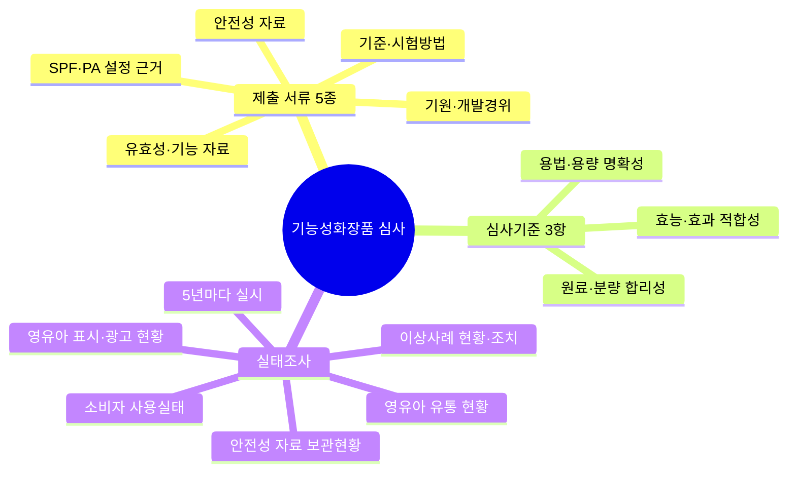
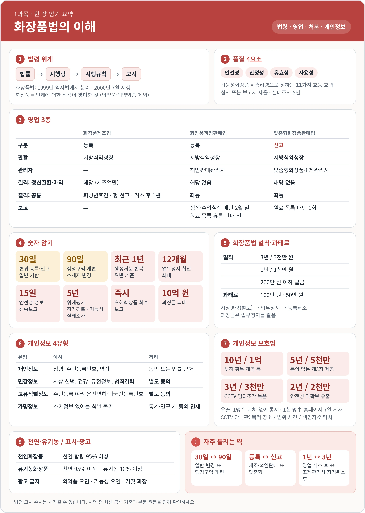

<!-- ⚠️ 자동 생성 파일 — 직접 편집 금지. 본문은 *_표준형.md, 서사는 story/*_서사.md 패치를 편집하고 npm run build:story로 재생성하세요. -->
# 📕 1과목 화장품법의 이해 — 이야기형 학습교재

> **학습 안내**
>
> 1과목은 **법령 중심** 과목입니다. 화장품법·시행령·시행규칙·고시의 위계 구조를 이해하고, 영업 3종(제조·책임판매·맞춤판매)의 등록/신고 절차, 기능성화장품 심사, 표시·광고 규제, 행정처분 기준을 정확히 암기해야 합니다. 개인정보 보호법도 포함됩니다.

<!-- story:slot:s01 -->

<!-- story:slot:s02 -->

<!-- story:start -->

📖 ┈┈┈┈ **이야기** ┈┈┈┈

## 프롤로그 — 민수의 첫 번째 화장품

민수는 어느 날 자신만의 화장품 브랜드 **PASSMULA**를 만들어 보기로 했다.
처음에는 간단한 생각이었다. 좋은 원료를 고르고, 예쁜 용기에 담아 고객에게 판매하면 될 것 같았다.

하지만 사업을 시작하려는 순간, 현실의 벽에 부딪혔다. 서류 한 장을 내려도 법령이 가로막았고, 원료 하나를 고를 때도 기준이 따랐다. 민수는 처음 겪는 규제의 복잡함에 좌절감을 느꼈다.

> "이 제품은 법에서 말하는 화장품일까?"
> 
> "내가 직접 만들면 제조업일까?"
> 
> "다른 공장에서 만들어 내 상표로 팔면 무엇이 필요할까?"
> 
> "고객의 피부 상태에 맞춰 혼합해 주려면?"

그럴 때마다 품질 담당자 **지연**이 옆에서 조언했다. 지연은 실무 경험이 있어 민수의 질문에 하나씩 답해주었고, 행정기관 담당자는 법의 기준을 명확히 설명해 주었다. 민수는 점차 "왜 이런 규칙이 필요한가"를 이해하기 시작했고, 두려움이 자신감으로 바뀌었다.

민수는 그때 알게 되었다. 화장품 사업은 단순히 제품을 만드는 일이 아니라 **법이 정한 역할과 절차를 따라가는 하나의 여정**이라는 것을. 그리고 그 여정의 끝에는, 안전하게 사용하는 고객의 미소가 기다리고 있었다.

이 교재에서는 민수가 화장품 사업을 시작하고, 제품을 만들고, 판매하고, 문제가 발생했을 때 대응하는 과정을 따라가며 화장품법을 공부한다. 각 장의 끝에는 민수가 겪는 **실수와 교훈**이 등장한다 — 그 교훈이 바로 시험의 함정이다.

┈┈┈┈ **본문** ┈┈┈┈ 📘

<!-- story:end -->

---

<!-- story:slot:s03 -->
## 🧭 이야기의 등장인물

• **민수** — 처음 화장품 사업을 시작하는 예비 사업자. 법의 복잡함에 좌절하지만, 하나씩 이해하며 점차 자신감을 얻어간다.
• **지연** — 민수의 품질·책임판매 업무를 돕는 실무 담당자. 실무 경험이 풍부하여 민수의 질문에 답하고, 때로는 민수의 실수를 정정해 준다.
• **예린** — 민감성·트러블 피부 때문에 시중 제품이 맞지 않아 PASSMULA를 찾은 첫 손님. 그녀의 상담 카드는 4과목까지 이어진다.
• **표 감독관** — 소비자화장품안전관리감시원. 예고 없이 나타나 민수가 미뤄 둔 것들을 정확히 짚어 낸다.
• **행정기관 담당자** — 등록·신고·검사·행정처분의 기준을 설명하는 역할. 민수가 헷갈릴 때마다 정확한 법적 기준을 제시한다.

> 💡 **읽는 방법**
> 1. 이야기에서 상황을 이해한 뒤, 바로 아래의 **🎯 시험 포인트**와 **🧠 암기 포인트**를 확인하세요.
> 2. 🔖 **기억 태그**가 보이면 — 그것이 시험 함정입니다. 민수의 실수를 통해 오답을 방지하세요.
> 3. 마지막으로 **⚖️ 법령 원문**에서 정확한 근거를 확인합니다.
> 4. 각 장 끝의 **💭 에필로그**를 읽으면 다음 장이 예고되어 흐름이 이어집니다.
> 5. **📖 ┈┈ 이야기 ┈┈** 표시부터 **┈┈ 본문 ┈┈ 📘** 표시까지가 이야기(서사)입니다. 그 밖의 내용은 모두 시험 본문입니다.

---

> **학습 안내**
>
> 이 교재는 원문의 법령·학습자료·표·문제를 최대한 유지하면서, **핵심을 먼저 보고 → 구조를 시각화하고 → 숫자를 암기하고 → 문제로 회상**할 수 있도록 구성했습니다.

---

## 🧭 학습 아이콘

| 표시 | 의미 | 1과목 활용 |
| --- | --- | --- |
| 🎯 | 기출·출제 포인트 | 영업 3종, 행정처분, 기능성화장품 |
| ⭐ | 핵심 개념 | 법령 위계, 품질 4요소 |
| 🧠 | 암기 포인트 | 결격사유, 변경 기한, 벌칙 단계 |
| ⚠️ | 주의·함정 | 30일 vs 90일, 등록 vs 신고 |
| 🔢 | 숫자·기한 | 벌칙 3년/1년/200만, 과태료 100/50 |
| 📊 | 비교·분류 | 영업 3종 비교, 결격사유 비교 |
| 🔄 | 절차·흐름 | 심사 절차, 행정처분 절차 |
| 📝 | 확인문제 | 챕터별 즉시 회상 |
| ⚖️ | 법령 원문 | 조문별 최종 확인 |

---

## 🚀 시험 직전 1분 전체 지도

| 대분류 | 세부 내용 |
| --- | --- |
| **법령 체계** | 법률 → 시행령 → 시행규칙 → 고시 |
| **영업·등록** | 제조업·책임판매업·맞춤형화장품판매업 → 결격·변경·승계 → 행정처분·벌칙 |
| **품질·안전** | 안전성·안정성·유효성·사용성 → 기능성 심사 |
| **→ 공통** | 표시·광고·사후관리 → 개인정보 보호법 |

<!-- story:slot:s04 -->
## 🧭 민수의 여정도 — 이야기 흐름 한눈에 보기

| 단계 | 주제 | 핵심 포인트 | ⚠️ 함정 |
| --- | --- | --- | --- |
| **[1]** | 법의 지도를 편다 | 법령 체계, 화장품 정의, 영업 3종 | "맞춤형화장품은 등록이겠지?" → 아니, **신고**! |
| **[2]** | 영업 등록의 관문 | 결격사유, 시설기준, 변경·승계 | "결격사유 1년? 3년?" → 제조/책판 **1년**, 조제관리사 **3년**! |
| **[3]** | 품질과 안전의 무게 | 품질 4요소, 기능성화장품 심사, 사후관리 | "여드름 크림도 기능성화장품이겠지?" → 아니, **의약외품**! |
| **[4]** | 표시·광고의 함정 | 부당광고 금지, 실증 의무 | "천연이라고 광고해도 되지?" → **기준 있음**! |
| **[5]** | 고객 정보를 다루다 | 개인정보 보호법, 6대 권리 | "민감정보도 마음대로 써도 되지?" → **별도 동의 필요**! |
| **[6]** | 문제가 생기면 | 위해화장품 회수, 행정처분, 벌칙 | "가등급은 즉시 회수?" → 아니, **15일 이내**! |

> 💡 각 장을 읽을 때마다 이 여정도에서 **어디에 있는지** 확인하세요. 🔖 기억 태그가 보이면 시험 함정입니다!

---

## 🎯 최우선 암기 축

① **법령 위계** → 법률 → 시행령 → 시행규칙 → 고시·행정규칙
② **영업 3종** → 제조업 **등록** / 책임판매업 **등록** / 맞춤형화장품판매업 **신고** ③ **품질 4요소** → 안전성 / 안정성 / 유효성 / 사용성 ④ **맞춤형화장품** → 혼합 또는 소분의 개념 ⑤ **결격사유** → 영업별 공통점과 차이점 비교 ⑥ **변경 기한** → 일반적으로 30일, 행정구역 개편에 따른 소재지 변경은 90일 ⑦ **행정처분** → 반복 위반 기준(최근 1년)과 최대 업무정지 기간(12개월) 확인 ⑧ **기능성화장품** → 정의·효능·심사자료를 묶어서 학습 ⑨ **표시·광고** → 의약품 오인, 기능성 오인, 거짓·과장 여부 주의 ⑩ **개인정보** → 개인정보 / 민감정보 / 고유식별정보 / 가명정보를 구별

---

<!-- story:slot:s05 -->

## 🔢 숫자 암기 미리보기

| 항목 | 핵심 숫자 |
| --- | ---: |
| 변경 등록·신고 일반 기한 | 30일 |
| 행정구역 개편 소재지 변경 | 90일 |
| 행정처분 반복 위반 기준 | 최근 1년 |
| 업무정지 합산 최대 | 12개월 |
| 안전성 정보 신속보고 | 15일 |
| 위해평가 사용기준 정기검토 | 5년 |
| 기능성화장품 실태조사 | 5년 |
| 벌칙(화장품법) | 3년/3천만 원 · 1년/1천만 원 · 200만 원 이하 |
| 과태료(화장품법) | 100만 원 · 50만 원 |
| 개인정보보호법 벌칙 | 10년/1억 · 5년/5천만 · 3년/3천만 · 2년/2천만 원 |
| 과징금 | 최대 10억 원 |
| 화장품의 날 | 9월 7일 |
| 수수료(심사의뢰) | 189,000원(전자) / 210,000원(방문) |
| 위해화장품 회수 보고 | 즉시 |

> ⚠️ **법령·고시 수치는 개정될 수 있으므로, 실제 시험에서는 해당 시험의 최신 공식 기준과 본문 원문(⚖️)을 함께 확인하세요.**

---

> **🔍 키워드**: 화장품법, 시행령, 시행규칙, 영업분류, 기능성화장품,
> 행정처분, 표시광고, 천연화장품 **핵심 내용**: 화장품법·시행규칙 전체
> 조문, 영업·표시·행정처분 제도

## 📋 목차
• 🗺️ 과목 지도
• **Chapter 01.** 화장품법의 이해 — 민수, 법의 지도를 펼치다
• **Chapter 02.** 개인정보 보호법 — 고객 정보를 다루게 된 민수
• 📚 참조 자료 (법령 원문)
• ⚡ 시험 직전 체크리스트
• 📝 기출문제
• 🧠 30초 회상

---

## 📋 학습 안내

### 학습 목표
• 화장품법·시행령·시행규칙의 전체 조문을 이해하고, 법령 체계와 주요 제도를 설명할 수 있다
• 영업 등록·변경 절차, 기능성화장품 심사, 표시·광고 규제, 행정처분 기준을 숙지한다
• 법령 간 상하위 관계(법 → 시행령 → 시행규칙 → 고시)를 파악하여 실무 적용력을 기른다

### 학습 흐름
① **법령 체계 이해** → 화장품법(법) → 시행령(대통령령) → 시행규칙(총리령) → 고시·행정규칙의 위계 구조
② **영업 관련 규정** → 제조업·책임판매업·맞춤형화장품판매업의 등록/신고, 결격사유, 시설기준 ③ **기능성화장품 제도** → 심사 대상, 심사 절차, 안전성 평가, 영유아·어린이 화장품 관리 ④ **표시·광고 규제** → 기재사항, 가격표시, 부당광고 금지, 실증 의무 ⑤ **행정처분 및 벌칙** → 등록취소·업무정지·과징금 기준, 위반 행위별 처분, 벌칙·과태료

### 출제 빈도 높은 영역
• **★★★**: 영업 등록 절차, 기능성화장품 심사, 행정처분 기준(등록취소·업무정지)
• **★★☆**: 표시·광고 규제, 위해화장품 회수, 안전기준
• **★☆☆**: 벌칙·과태료, 단체 설립, 권한 위임

---

## 🗺️ 과목 지도

> 아래 다이어그램들은 본 과목의 핵심 구조를 시각적으로 정리한 것입니다.

### 🗺️ 과목 개요 마인드맵

> **🗺️ 마인드맵 노드 상세 매핑**

| 대분류 | 중분류 | 핵심 포인트 |
| --- | --- | --- |
| Ch01. 화장품법의 이해 | 법령 체계 | 법률→시행령→시행규칙→고시 4단계 위계 |
|  | 화장품 정의 | 적용 대상·유형별 특성 |
|  | 화장품 영업 | 제조업·책임판매업(등록), 맞춤형판매업(신고) |
|  | 행정처분·벌칙 | 시정명령(별도) + 행정처분 3종(등록취소·업무정지·과징금) |
|  | 화장품 품질 | 안전성·안정성·유효성·사용성 4요소 |
| Ch02. 개인정보 보호법 | 고객관리 프로그램 운용 | 개인정보 처리 시스템 |
|  | 고객정보 입력 | 개인정보·민감정보·고유식별정보 구분 |
|  | 고객정보관리 | 6대 권리(조회·열람·정정·삭제·처리정지·파기) |
|  | 고객상담 | 개인정보 보호 기준 준수 |

### 🗺️ 챕터별 마인드맵

### 🗺️ Ch01 마인드맵: 화장품법의 이해

### 🗺️ Ch02 마인드맵: 개인정보 보호법 — 고객 정보를 다루게 된 민수

## 📚 Chapter 01. 화장품법의 이해 — 민수, 법의 지도를 펼치다

> 📚 **참조자료**: [1.cosmetic-law.md](../참조자료/과목1/1.cosmetic-law.md)

> 출처: [화장품법(법률)(제21525호)(20261008).md](../참조자료/ref_md/과목1/화장품법%28법률%29%28제21525호%29%2820261008%29/화장품법%28법률%29%28제21525호%29%2820261008%29.md)
<!-- story:slot:s06 -->

<!-- story:start -->

📖 ┈┈┈┈ **이야기** ┈┈┈┈

민수는 가장 먼저 "무엇을 지켜야 하는가?"부터 알아보기로 했다.
법률만 읽으면 될 것 같았지만, 실제 사업에서는 시행령과 시행규칙, 고시까지 함께 살펴야 했다.

┈┈┈┈ **본문** ┈┈┈┈ 📘

<!-- story:end -->

> 🎯 **이 장의 질문**: 화장품 사업자는 법을 어떤 순서로 이해해야 할까?
>
> 세 개의 화장품법 정리 문서를 하나로 병합한 자료입니다.
>
> 화장품법은 PART 2, 3, 4에서도 중복하여 출제되기에 놓치면 안 되는
> 중요한 부분이에요.

> 🔗 **관련 과목** - [2과목 2챕터 화장품 제조관리 및 품질](subj:manufacturing#ch02) --- 기능성화장품
> 11가지 효능의 제품별 구체화 - [3과목 1챕터 작업장 위생관리](subj:safety#ch01) --- CGMP
> 3대 요소 및 위생 기준 - [4과목 1챕터 맞춤형화장품 개요](subj:understanding#ch01) ---
> 제3조의2~제3조의8 맞춤형화장품 규정의 실무 적용 - 4과목 5챕터 "제품
> 안내" --- 표시·기재사항, 기능성화장품 표시 의무

<!-- story:slot:s07 -->
> 화장품법은 PART 2, 3, 4에서도 중복하여 출제되기에 놓치면 안 되는 중요한 부분이에요.

> 🔗 **관련 과목**
> - [2과목 2챕터 화장품 제조관리 및 품질](subj:manufacturing#ch02) — 기능성화장품 11가지 효능의 제품별 구체화
> - [3과목 1챕터 작업장 위생관리](subj:safety#ch01) — CGMP 3대 요소 및 위생 기준
> - [4과목 1챕터 맞춤형화장품 개요](subj:understanding#ch01) — 제3조의2~제3조의8 맞춤형화장품 규정의 실무 적용
> - [4과목 5챕터 제품 안내](subj:understanding#ch05) — 표시·기재사항, 기능성화장품 표시 의무

---
> 📋 **학습 가이드** - 출제 빈도: ★★★★★ (1과목 전체 중 최다 출제 영역) -
> 예상 소요 시간: 60분 - 핵심 키워드: 법령 체계, 화장품 정의, 영업
> 3종(등록 vs 신고), 결격사유, 행정처분, 품질 요소, 기능성화장품 심사

<!-- story:slot:s08 -->
> 📋 **학습 가이드**
> - 출제 빈도: ★★★★★ (1과목 전체 중 최다 출제 영역)
> - 예상 소요 시간: 60분
> - 핵심 키워드: 법령 체계, 화장품 정의, 영업 3종(등록 vs 신고), 결격사유, 행정처분, 품질 요소, 기능성화장품 심사

---

### 🗺️ Ch01 마인드맵: 화장품법의 이해

> **🗺️ 마인드맵 노드 상세 매핑**

| 대분류 | 중분류 | 핵심 포인트 |
| --- | --- | --- |
| 법령 체계 | 법률 | 화장품법: 1999년 약사법에서 분리, 2000년 7월 시행 (국민보건 향상·산업발전) |
|  | 시행령 | 대통령령: 법에서 위임된 사항과 시행에 필요한 사항 규정 |
|  | 시행규칙 | 총리령: 법·시행령에서 위임된 사항과 세부 시행절차 규정 |
|  | 고시·행정규칙 | 기능성화장품 기준·CGMP·안전기준 고시 |
| 화장품 정의 | 적용 대상 | 인체 청결·미용·보호 목적, 의약품과 구분 |
|  | 유형별 특성 | 법정 제품류 13종 (영·목·인/기/손·눈·색/염·두·면·모·체·방) |
| 영업 3종 | 화장품제조업 | 등록제 |
|  | 화장품책임판매업 | 등록제 |
|  | 맞춤형화장품판매업 | 신고제 |
| 영업 관리 | 결격사유 | 영업별 공통점과 차이점 비교 |
|  | 변경 등록·신고 | 일반 30일, 행정구역 개편 90일 |
|  | 승계 | 영업자 지위 승계 |
| 행정처분·벌칙 | 시정명령(별도) | 제19조, 경미한 위반 시 최초 조치 |
|  | 등록취소·업무정지 | 반복 위반 기준 최근 1년, 최대 12개월 |
|  | 과징금 | 업무정지 갈음, 위반행위 매출액 비례 |
|  | 벌칙·과태료 | 3년/3천만 원 · 1년/1천만 원 · 200만 원 이하 |
| 품질 관리 | 품질 4요소 | 안전성·안정성·유효성·사용성 |
|  | 기능성화장품 심사 | 식약처 사전 심사 |
|  | 사후관리 | 위해화장품 회수·안전정보 신속보고 |

## 1. 화장품법의 목적과 법령 체계

### 1. 화장품법의 입법 취지(목적)

> 📌 **출처**: 화장품법 제1조| **참조 자료**: [화장품법(법률)(제21525호)(20261008).md](../참조자료/ref_md/과목1/화장품법%28법률%29%28제21525호%29%2820261008%29/화장품법%28법률%29%28제21525호%29%2820261008%29.md)| **시행일**: 2026. 10. 8.| **최종 확인**: 2026. 8. 29.
<!-- story:slot:s09 -->

<!-- story:start -->

📖 ┈┈┈┈ **이야기** ┈┈┈┈

#### 📖 민수의 상황 — 법령 출력물 한 뭉치와 파란 수첩

지방식품의약품안전청 민원실. 민수는 밤새 인터넷에서 뽑아 온 법령 출력물을 한 아름 안고 앉아 있었다. 화장품법, 시행령, 시행규칙, 그리고 이름만 읽어도 숨이 찬 고시들. 어디서부터 읽어야 할지 몰라 종이 모서리만 만지작거리다가, 결국 가장 근본적인 질문이 튀어나왔다.

"왜 화장품에 이렇게 많은 규칙이 필요한가요? 먹는 것도 아니고, 약도 아닌데요."

담당자는 출력물 더미를 가지런히 모으더니, 메모지에 삼각형 하나를 그렸다. 맨 위 꼭짓점에 '법률', 그 아래로 '시행령', '시행규칙', 가장 넓은 바닥에 '고시'.

> "화장품은 매일 사람의 몸에 사용됩니다. 따라서 소비자의 건강과 안전을 보호하면서 산업도 발전시켜야 합니다."

"큰 원칙은 법률이 정하고, 아래로 내려갈수록 구체적이 됩니다. 시행령은 대통령령, 시행규칙은 총리령이고요." 담당자가 덧붙였다. "원래 화장품은 약사법 안에 있었어요. 1999년에 따로 떨어져 나와 2000년 7월부터 독립된 법으로 시행됐고, 지금은 식약처가 관리합니다."

함께 온 지연이 가방에서 새 **파란 수첩**을 꺼냈다. 첫 장 맨 위에 또박또박 적었다. — *"법 → 시행령(대통령령) → 시행규칙(총리령) → 고시. 위는 원칙, 아래는 세부."*

"수첩까지요?" 민수가 웃자 지연이 담담하게 답했다. "대표님이 헷갈리실 때마다 한 줄씩 채울 거예요. 아마 금방 꽉 찰걸요." 그 말은 틀리지 않았다. 이 수첩은 머지않아 PASSMULA의 **함정 노트**가 된다.

┈┈┈┈ **본문** ┈┈┈┈ 📘

<!-- story:end -->

<!-- story:slot:s10 -->
> 📌 **출처**: 화장품법 제1조 | **참조 자료**: [화장품법(법률)(제21525호)(20261008).md](../참조자료/ref_md/과목1/화장품법%28법률%29%28제21525호%29%2820261008%29/화장품법%28법률%29%28제21525호%29%2820261008%29.md) | **시행일**: 2026. 10. 8. | **최종 확인**: 2026. 8. 29.

> **한 줄 요약**: 화장품법은 약사법에서 분리(1999.9), 식약처 관할, 법→시행령→시행규칙→고시 4단 체계.
> **🧠 두음법**: **법·시·규·고** (법률→시행령→시행규칙→고시)

「화장품법」은 1999년 9월 「약사법」에서 분리되어 2000년 7월부터 시행되었다. 현재 식품의약품안전처에서 관리·감독하고 있으며, 다음과 같은 목적으로 법령 체계를 갖추고 있다.

| 구분 | 입법 취지(목적) |
| --- | --- |
| 「화장품법」(법률) 🎯 기출 | 화장품의 제조·수입·판매 및 수출 등에 관한 사항을 규정함으로써 국민 보건 향상과 화장품 산업의 발전에 기여함을 목적으로 함 |
| 「화장품법 시행령」(대통령령) | 「화장품법」에서 위임된 사항과 그 시행에 필요한 사항을 규정하는 것을 목적으로 함 |
| 「화장품법 시행규칙」(총리령) | 「화장품법」 및 「화장품법 시행령」에서 위임된 사항과 그 시행에 필요한 사항을 규정하는 것을 목적으로 함 |
| 고시(행정규칙) | 기능성화장품 기준 및 시험 방법, 기능성화장품 심사에 관한 규정, 우수화장품 제조 및 품질관리 기준(CGMP) 등을 고시하는 것을 목적으로 함 |
---

<!-- story:slot:s11 -->

## 2. 화장품의 정의

### 1. 화장품의 정의 및 유형 🎯 기출

> 📌 **출처**: 화장품법 제2조| **참조 자료**: [화장품법(법률)(제21525호)(20261008).md](../참조자료/ref_md/과목1/화장품법%28법률%29%28제21525호%29%2820261008%29/화장품법%28법률%29%28제21525호%29%2820261008%29.md)| **시행일**: 2026. 10. 8.| **최종 확인**: 2026. 8. 29.
<!-- story:slot:s12 -->

<!-- story:start -->

📖 ┈┈┈┈ **이야기** ┈┈┈┈

#### 📖 민수의 첫 번째 질문 — "이것도 화장품인가요?"

민수는 밤새 뽑은 라벨 시안 한 뭉치를 담당자 책상에 펼쳤다. 맨 위장에는 큼직하게 『PASSMULA 여드름 크림』.

> "피부에 바르는 제품이면 다 화장품이죠? 이 정도면 바로 팔아도 되겠죠?"

담당자는 시안을 넘겨보며 사용 목적과 인체에 미치는 작용, 그리고 의약품·의약외품과의 구별부터 짚었다. 민수는 반쯤 흘려듣고 여드름 크림 시안을 가리켰다. "이건 확실하죠?"

담당자는 고개를 끄덕이는 대신 조용히 되물었다. "이 문구 그대로 광고하시면… **부당광고로 행정처분** 받으실 각오는 되셨습니까?" 민수의 등줄기가 서늘해졌다.

> "여드름 크림은 **의약외품**입니다. 화장품 중 여드름 완화는 **인체 세정용 제품류**만 기능성화장품으로 인정됩니다."

민수가 시안에서 '크림' 두 글자를 지우다 문득 멈췄다. *…그럼 크림 말고, 여드름 세정용이라면?* 지연이 그 표정을 읽고 파란 수첩에 한 줄 적었다. — *"여드름 = 세정용만. 크림 아님."*

┈┈┈┈ **본문** ┈┈┈┈ 📘

<!-- story:end -->

> **한 줄 요약**: 화장품은 인체 청결·미용·보호 목적의 경미한 작용 제품 --- 의약품과 구분이 핵심.

<!-- story:slot:s13 -->
> 📌 **출처**: 화장품법 제2조 | **참조 자료**: [화장품법(법률)(제21525호)(20261008).md](../참조자료/ref_md/과목1/화장품법%28법률%29%28제21525호%29%2820261008%29/화장품법%28법률%29%28제21525호%29%2820261008%29.md) | **시행일**: 2026. 10. 8. | **최종 확인**: 2026. 8. 29.

> **한 줄 요약**: 화장품은 인체 청결·미용·보호 목적의 경미한 작용 제품 — 의약품과 구분이 핵심.

<!-- story:slot:s14 -->
> 🔖 **기억 태그**: 여드름 크림 = 의약외품 (기능성화장품 아님!) / 여드름 완화 = 세정용 제품류만 해당
> *(→ 이 원칙은 4과목에서 수진이 여드름 고객을 응대할 때 다시 등장합니다.)*

| 종류 | 정의 및 유형 |
| --- | --- |
| **화장품** 🎯 기출 | 인체를 청결·미화하여 매력을 더하고 용모를 밝게 변화시키거나 피부·모발의 건강을 유지 또는 증진하기 위해 인체에 바르고 문지르거나 뿌리는 등 이와 유사한 방법으로 사용되는 물품으로서 인체에 대한 작용이 경미한 것을 말함 (단, 의약품, 의약외품 제외) |
| **기능성화장품** 🎯 기출 | 화장품 중에서 다음 어느 하나에 해당되는 것으로서 총리령으로 정하는 화장품을 말함 |

**기능성화장품의 종류 (총리령으로 정하는 11가지 효능·효과)**
• 피부의 미백에 도움을 주는 제품
• 여드름성 피부를 완화하는 데 도움을 주는 화장품 (단, 인체 세정용 제품류로 한정, 여드름 크림은 기능성화장품이 아님)
• 피부장벽(피부의 가장 바깥쪽에 존재하는 각질층의 표피)의 기능을 회복하여 가려움 등의 개선에 도움을 주는 화장품
• 튼살로 인한 붉은 선을 엷게 하는 데 도움을 주는 화장품

> **참고: 화장품 vs 기능성화장품** - 일반화장품: 외부적 용모 개선, 청결,
> 미화 목적 - 기능성화장품: 피부 기능 개선, 미백, 주름, 자외선 보호,
> 영양공급 등 효과가 입증된 제품 - ※ 화장품은 인체에 대한 작용이
> 경미해야 하며, 의약품과는 구분된다.

> **참고: 자외선 차단 기능성화장품** 자외선 차단지수의 측정값이 −20%
> 이하의 범위에 있는 경우 같은 효능·효과로 봄

> **참고: 탈모/여드름/피부장벽/튼살 관련 표시** 탈모 증상의 완화,
> 여드름성 피부의 완화, 피부장벽 기능의 회복, 튼살로 인한 붉은 선을 엷게
> 하는 데 도움을 주는 화장품에는 '질병의 예방 및 치료를 위한 의약품이
> 아님'이라는 문구를 표시해야 함

#### 기타 화장품 유형

| 종류 | 정의 |
| --- | --- |
| **영유아 또는 어린이 사용 화장품** | 영유아(3세 이하), 어린이(4세 이상\~13세 이하)가 사용할 수 있는 화장품. 이를 표시·광고하려는 경우 제품 및 제조 방법에 대한 설명 자료, 화장품의 안전성 평가 자료, 제품의 효능·효과에 대한 증명 자료를 작성 및 보관해야 함 |
| **천연화장품** | 동식물, 미네랄, 미생물 및 그 유래 원료 등을 함유한 화장품으로, ISO 16128-1 가이드라인에 따라 정의된 천연(유래) 원료를 사용하고, ISO 16128-2 가이드라인에 따라 계산하였을 때 중량 기준으로 천연(유래) 원료 함량이 전체 제품에서 95% 이상으로 구성된 화장품 |
| **유기농화장품** 🎯 기출 | 유기농 원료, 동식물, 미네랄, 미생물 및 그 유래 원료 등을 함유한 화장품으로, ISO 16128-1 가이드라인에 따라 정의된 천연(유래) 및 유기농(유래) 원료를 사용하고, ISO 16128-2 가이드라인에 따라 계산하였을 때 중량 기준으로 유기농(유래) 함량이 전체 제품에서 10% 이상이어야 하며, 유기농(유래) 함량을 포함한 천연(유래) 함량이 전체 제품에서 95% 이상으로 구성된 화장품 |
| **맞춤형화장품** 🎯 기출 | ① 제조 또는 수입된 화장품의 내용물에 다른 화장품의 내용물이나 식품의약품안전처장이 정하는 원료를 추가하여 혼합한 화장품   ② 제조 또는 수입된 화장품의 내용물을 소분한 화장품 (다만, 고형 비누 등 화장품의 내용물을 단순 소분한 화장품은 제외) |
| **직접구매 해외화장품** | 개인이 자가소비를 목적으로 해외의 사이버몰(컴퓨터 등과 정보통신설비를 이용하여 재화 등을 거래할 수 있도록 설정된 가상의 영업장)에서 직접 구매하는 화장품 |

> **참고:** 「화장품법」 제2조(정의) 천연화장품 및 유기농화장품 정의 삭제 (2025. 1. 31. 일부개정)

---
### 2. 화장품의 유형별 특성

> 📌 **출처**: 화장품법 제2조 + 식약처 고시| **참조 자료**: [화장품법(법률)(제21525호)(20261008).md](../참조자료/ref_md/과목1/화장품법%28법률%29%28제21525호%29%2820261008%29/화장품법%28법률%29%28제21525호%29%2820261008%29.md)| **시행일**: 2026. 10. 8.| **최종 확인**: 2026. 8. 29.

> **한 줄 요약**: 화장품법 시행규칙상 법정 제품류 13종 — 세정 계열(영유아·목욕·인체세정) + 기초 + 메이크업(손발톱·눈화장·색조) + 헤어·바디(두발염색·두발·면도·체모제거·체취방지·방향).
> **🧠 두음법**: 법정 제품류 13종 = **영·목·인 | 기 | 손·눈·색 | 염·두·면·모·체·방** (영유아용·목욕용·인체세정용 | 기초화장용 | 손발톱용·눈화장용·색조화장용 | 두발염색용·두발용·면도용·체모제거용·체취방지용·방향용)

<!-- story:slot:s15 -->

> 📌 **출처**: 화장품법 제2조 + 식약처 고시 | **참조 자료**: [화장품법(법률)(제21525호)(20261008).md](../참조자료/ref_md/과목1/화장품법%28법률%29%28제21525호%29%2820261008%29/화장품법%28법률%29%28제21525호%29%2820261008%29.md) | **시행일**: 2026. 10. 8. | **최종 확인**: 2026. 8. 29.

| 유형 | 설명 및 제품 종류 |
| --- | --- |
| **영유아용 제품류** 🎯 기출 | 3세 이하 영유아를 대상으로 하는 삼푸·린스·로션 등의 제품 • 영유아용 샴푸·린스 • 영유아용 오일 • 영유아 목욕용 제품 • 영유아용 로션·크림 • 영유아 인체 세정용 제품 |
| **목욕용 제품류** | 샤워, 목욕 시 전신에 사용 후 씻어내는 제품으로 욕조 투입 또는 몸에 향취를 주기 위한 제품 • 목욕용 오일·정제·캡슐 • 버블배스 • 목욕용 소금류 • 그 밖의 목욕용 제품류 |
| **인체 세정용 제품류** | 손, 얼굴에 사용하고, 사용 후 바로 씻어내는 제품 • 폼 클렌저 • 액체비누 • 외음부 세정제 • 바디 클렌저 • 화장비누(고형 형태의 세안용 비누) • 물휴지 • 그 밖의 인체 세정용 제품 |
| **기초화장용 제품류** 🎯 기출 | 피부의 보습, 수렴, 유연(에몰리언트), 영양 공급, 세정 등에 사용되는 스킨케어 제품 • 수렴·유연·영양 화장수 • 에센스, 오일 • 바디 제품 • 눈 주위 제품 • 손·발의 피부연화 제품 • 클렌징 워터, 클렌징 오일, 클렌징 로션, 클렌징 크림 등 메이크업 리무버 • 마사지 크림 • 파우더 • 팩, 마스크 • 로션, 크림 • 그 밖의 기초화장용 제품류 |
| **손발톱용 제품류** | 손톱과 발톱의 관리 및 메이크업에 사용하는 제품 • 베이스코트, 언더코트 • 네일 크림·로션·에센스·오일 • 네일 폴리시·네일 에나멜 리무버 • 네일 폴리시, 네일 에나멜 • 탑코트 • 그 밖의 손발톱용 제품류 |
| **눈화장용 제품류** | 눈 주위(눈썹, 눈꺼풀, 속눈썹 등)의 미화, 청결을 위해 사용하는 메이크업 제품 • 아이브로제품 • 아이섀도 • 아이메이크업 리무버 • 속눈썹용 퍼머넌트 웨이브 • 아이라이너 • 마스카라 • 그 밖의 눈화장용 제품류 |
| **색조화장용 제품류** | 얼굴과 신체에 매력을 더하기 위해 사용하는 메이크업 제품 • 볼연지 • 메이크업 베이스 • 메이크업 픽서티브 • 립글로스, 립밤 • 페이스 파우더 • 리퀴드·크림·케이크 파운데이션 • 립스틱, 립라이너 • 바디페인팅, 페이스페인팅, 분장용 제품 • 그 밖의 색조화장용 제품류 |
| **두발염색용 제품류** | 두발의 색을 변화시키거나(염모), 탈색시키는(탈염) 제품 • 헤어 틴트 • 염모제 • 헤어 컬러스프레이 • 탈염·탈색용 제품(기능성화장품) • 그 밖의 두발염색용 제품류 |
| **두발용 제품류** | 모발 세정, 컨디셔닝, 정발, 웨이브 형성, 스트레이팅, 증모 효과에 사용되는 제품 • 헤어 컨디셔너·트리트먼트·팩, 린스 • 포마드, 헤어 스프레이·무스·왁스·젤, 그루밍 에이드 • 헤어 크림·로션 • 샴푸 • 헤어 퍼머넌트 웨이브 • 헤어 토닉·에센스 • 헤어 오일 • 헤어 스트레이트너 • 흑채 • 그 밖의 두발용 제품류 |
| **면도용 제품류** | 면도 전·후에 피부 보호 및 진정을 위해 사용하는 제품 • 프리셰이브 로션 • 세이빙 크림 • 애프터셰이브 로션 • 셰이빙 폼 • 그 밖의 면도용 제품류 |
| **체모제거용 제품류** 🎯 기출 | 몸에 난 털을 제거할 때 사용하는 제품 • 제모제(기능성화장품) • 제모왁스 • 그 밖의 체모제거용 제품류 |
| **체취방지용 제품류** 🎯 기출 | 몸에서 나는 냄새를 제거하거나 줄여주는 제품 • 데오도런트 • 그 밖의 체취방지용 제품류 |
| **방향용 제품류** 🎯 기출 | 향을 몸에 지니거나 뿌리는 제품 • 향수 • 콜로뉴(Cologne) • 그 밖의 방향용 제품류 |

> **참고: 목욕용 제품류 vs 인체 세정용 제품류** 목욕용 제품류는 인체
> 세정용 제품류와 구분되며, 바디 클렌저는 목욕용 제품류에 해당하지
> 않는다.

> **참고: 물휴지의 범위** 식품접객업의 영업소에서 손을 닦는 용도 등으로
> 사용할 수 있도록 포장된 물티슈. 장례식장 또는 의료기관 등에서 시체를
> 닦는 용도로 사용되는 것은 제외함

> **참고: 공산품에서 화장품으로 변경된 품목** 화장비누, 흑채, 제모왁스

> **확인문제:** 다음 중 기초화장용 제품류가 아닌 것은? ① 스킨 ② 로션 ③
> 에센스 ④ 네일 크림 ⑤ 크림 (정답: ④ 네일 크림) **해설**: 네일 크림은
> 손발톱용 제품류에 해당한다. 기초화장용 제품류는 피부
> 보습·수렴·유연·영양·세정에 사용되는 스킨케어 제품이다.

---

<!-- story:slot:s16 -->

## 3. 화장품의 영업

### 1. 화장품법에 따른 영업의 종류

> 📌 **출처**: 화장품법 제2조의2| **참조 자료**: [화장품법(법률)(제21525호)(20261008).md](../참조자료/ref_md/과목1/화장품법%28법률%29%28제21525호%29%2820261008%29/화장품법%28법률%29%28제21525호%29%2820261008%29.md)| **시행일**: 2026. 10. 8.| **최종 확인**: 2026. 8. 29.
<!-- story:slot:s17 -->

<!-- story:start -->

📖 ┈┈┈┈ **이야기** ┈┈┈┈

#### 📖 민수의 사업계획이 세 갈래로 나뉘다

그날 오후, 매장 자리를 처음 둘러보러 온 손님 **예린**이 조심스레 물었다. 민감성 피부라 시중 제품이 다 맞지 않는다며, "제 피부에 딱 맞게 섞어주는 곳이 있으면 좋겠어요"라고 했다. 민수의 머릿속에서 사업이 단숨에 세 갈래로 뻗었다 — 직접 만들고, 남에게 맡겨 PASSMULA 이름으로 팔고, 매장에서 예린 같은 손님에게 즉석으로 혼합·소분까지.

> "이 세 개, 사업자 등록 한 번에 다 묶으면 되겠죠?"

담당자가 고개를 저었다. "세 가지는 법에서 **서로 다른 영업**으로 구분합니다. 하나로 묶을 수 없어요."

이 순간부터 **제조업·책임판매업·맞춤형화장품판매업**의 차이가 민수의 핵심 과제가 되었다. 지연은 수첩을 넘겨 여드름 크림 줄 아래에 새 항목을 폈다. "대표님, 지난번처럼 앞서가지 말고 — 하나씩요."

┈┈┈┈ **본문** ┈┈┈┈ 📘

<!-- story:end -->

> **한 줄 요약**: 제조업(등록)·책임판매업(등록)·맞춤판매업(신고) --- 3종 영업의 구분이 기출 단골.
> **🧠 두음법**: **제·책·맞** = **등·등·신** (제조업=등록, 책임판매=등록, 맞춤판매=신고)

<!-- story:slot:s18 -->
> 📌 **출처**: 화장품법 제2조의2 | **참조 자료**: [화장품법(법률)(제21525호)(20261008).md](../참조자료/ref_md/과목1/화장품법%28법률%29%28제21525호%29%2820261008%29/화장품법%28법률%29%28제21525호%29%2820261008%29.md) | **시행일**: 2026. 10. 8. | **최종 확인**: 2026. 8. 29.

> **한 줄 요약**: 제조업(등록)·책임판매업(등록)·맞춤판매업(신고) — 3종 영업의 구분이 기출 단골.

<!-- story:slot:s19 -->
> 🔖 **기억 태그**: 화장품 영업 3종 = 제조업 · 책임판매업 · 맞춤형화장품판매업 — 각각 별개 영업

#### 1.1 영업의 종류

| 구분 | 종류 |
| --- | --- |
| **화장품 제조업** | 화장품의 전부 또는 일부를 제조(2차 포장 또는 표시만의 공정은 제외)하는 영업 • 화장품을 직접 제조하는 영업 • 화장품 제조를 위탁받아 제조하는 영업 • 화장품을 포장(1차 포장만 해당)하는 영업 |
| **화장품 책임판매업** | 취급하는 화장품의 품질 및 안전 등을 관리하면서 이를 유통·판매하거나 수입대행형 거래를 목적으로 알선·수여하는 영업 • 화장품제조업자가 화장품을 직접 제조하여 유통·판매하는 영업 • 화장품제조업자에게 위탁하여 제조된 화장품을 유통·판매하는 영업 • 수입된 화장품을 유통·판매하는 영업 • 수입대행형 거래(전자상거래만 해당)를 목적으로 화장품을 알선·수여하는 영업 |
| **맞춤형화장품 판매업** | 맞춤형화장품을 판매하는 영업 • 제조 또는 수입된 화장품의 내용물에 다른 화장품의 내용물이나 식품의약품안전처장이 정하여 고시하는 원료를 추가하여 혼합한 화장품을 판매하는 영업 • 제조 또는 수입된 화장품의 내용물을 소분한 화장품을 판매하는 영업 • 소분 판매를 목적으로 제조 또는 수입된 화장비누(고체 형태의 세안용 비누)의 내용물을 단순 소분하여 판매하는 경우는 맞춤형화장품판매업 범위에서 제외 |

> **참고: 맞춤형화장품 조제 한계** - 식약처 지정 원료만 추가·혼합 가능 -
> 향료·색소·보존제 사용 시 불법 제조 행위 - 조제·소분 화장품 →
> '유통화장품' 분류(식약처 가이드라인)

---
### 2. 영업 등록 및 신고 🎯 기출

> 📌 **출처**: 화장품법 제3조, 제6조| **참조 자료**: [화장품법(법률)(제21525호)(20261008).md](../참조자료/ref_md/과목1/화장품법%28법률%29%28제21525호%29%2820261008%29/화장품법%28법률%29%28제21525호%29%2820261008%29.md)| **시행일**: 2026. 10. 8.| **최종 확인**: 2026. 8. 29.

> **한 줄 요약**: 제조·책임판매는 '등록', 맞춤형은 '신고' --- 관할 지방식약청장에게 제출.

> **🗺️ 마인드맵 노드 상세 매핑**

| 대분류 | 중분류 | 핵심 포인트 |
| --- | --- | --- |
| 제조업 등록 | 등록신청서 | 제조업 등록 기본 서류 |
|  | 대표자 건강진단서 | 정신질환·마약 중독 아님 증명 |
|  | 등기사항증명서 법인 | 법인인 경우에 한함 |
|  | 시설명세서 | 작업소·보관소·시험실 기준 |
| 책임판매업 등록 | 등록신청서 | 책임판매업 등록 기본 서류 |
|  | 등기사항증명서 법인 | 법인인 경우에 한함 |
|  | 책임판매관리자 자격서류 | 의사·약사·학사·조제관리사 등 |
|  | 품질관리 기준 규정 | 품질관리·안전관리 기준 갖춤 |
| 맞춤형 판매업 신고 | 신고서 | 맞춤판매업 신고 기본 서류 |
|  | 조제관리사 자격증 사본 | 맞춤형화장품조제관리사 필수 배치 |
|  | 시설명세서 | 총리령 시설기준 갖춤 |
|  | 등기사항증명서 법인 | 법인인 경우에 한함 |
| 공통사항 | 전자문서 제출 가능 | 전자문서 포함 제출 가능 |
|  | 등록필증 재발급 가능 | 오염·훼손·분실 시 재발급 |
|  | 소재지 관할 지방식약청장 | 관할 지방식약청장에게 제출 |

<!-- story:slot:s20 -->

> 🔖 **기억 태그**: 맞춤형화장품판매업 = **신고** (not 등록!) / 제조업·책임판매업 = **등록**

<!-- story:slot:s21 -->

<!-- story:start -->

📖 ┈┈┈┈ **이야기** ┈┈┈┈

#### 📖 민수, 사업자 등록 전에 다시 멈추다

민수는 벌써 매장 계약서에 도장을 찍으려 했다. 지연이 팔을 붙잡았다. "잠깐만요. 어떤 영업인지 정하고 **등록** 또는 **신고** 절차부터 확인해야 해요."

며칠 뒤, 민수는 서류 세 뭉치를 안고 창구로 갔다. "세 개 다 **등록**하러 왔습니다!" 자신만만한 목소리였다.

담당자가 맞춤형 서류를 짚으며 정정했다. "맞춤형화장품판매업은 **신고**입니다. 등록이 아니에요. **제조업과 책임판매업만 등록**이고요." 접수 도장을 찍기 직전, 반려될 뻔한 서류였다.

민수는 신청서 표지의 '등록신청서'를 '신고서'로 고쳐 쓰며 중얼거렸다. "…여드름 크림 때도 이렇게 앞서갔지." 지연이 수첩에 또 한 줄 적었다. — *"맞춤형 = 신고 / 제조·책판 = 등록."*

┈┈┈┈ **본문** ┈┈┈┈ 📘

<!-- story:end -->

**(소재지 관할 지방식품의약품안전청장에게 제출)**

| 종류 | 영업 | 필요 서류 |
| --- | --- | --- |
| 화장품 제조업 등록 | 등록 | • 등록신청서 • 대표자의 건강진단서(정신질환자, 마약류의 중독자가 아님을 증명) • 등기사항증명서(법인의 경우) • 시설명세서 |
| 화장품 책임판매업 등록 | 등록 | • 등록신청서 • 등기사항증명서(법인의 경우) • 책임판매관리자의 자격 확인 서류 • 화장품의 품질관리 및 책임판매 후 안전관리에 적합한 기준에 관한 규정 |
| 맞춤형화장품 판매업 신고 | 신고 | • 신고서 • 맞춤형화장품조제관리사 자격증 사본과 시설명세서 • 등기사항증명서(법인의 경우) \* 맞춤형화장품조제관리사가 2명 이상의 경우: 대표 1명만 제출 가능하며 매년 교육 이수 필수 \* 맞춤형화장품판매업을 신고하려는 자는 총리령으로 정하는 시설기준을 갖추어야 하며, 맞춤형화장품의 혼합·소분 등 품질·안전 관리 업무에 종사하는 자(맞춤형화장품조제관리사)를 두어야 함 |

> ※ 제출 서류는 전자문서를 포함함

#### 2.1 등록 및 신고대장 포함사항

| 포함 사항 | 제조업 등록대장 | 책임판매업 등록대장 | 맞춤판매업 신고대장 |
| --- | --- | --- | --- |
| 번호·연월일 | 등록번호 및 등록연월일 | 등록번호 및 등록연월일 | 신고번호 및 신고연월일 |
| 성명·주민번호 | 제조업자 성명 및 주민등록번호(법인: 대표자) | 책임판매업자 성명 및 주민등록번호(법인: 대표자) | 판매업자 성명 및 주민등록번호(법인: 대표자) |
| 상호 | 제조업자 상호(법인: 명칭) | 책임판매업자 상호(법인: 명칭) | 판매업자 상호 및 소재지 |
| 소재지 | 제조소 소재지 | 책임판매업소 소재지 | 판매업소 상호 및 소재지 |
| 유형/관리자 | 제조 유형 | 책임판매관리자 성명·주민번호, 책임판매 유형 | 조제관리사 성명·주민번호·자격증 번호 |
| 기타 |  |  | 영업 기간(한시적 영업 시만 해당) |

> **참고:** 맞춤형화장품조제관리사는 해당 맞춤형화장품판매업소의 업무에
> 종사하지 않게 된 경우, 관리업무 비종사신고서에 사유서를 첨부하여 관할
> 지방식약청장에게 제출할 수 있음

> **참고: 등록필증의 재발급 범위** - 화장품제조업 등록필증 -
> 화장품책임판매업 등록필증 - 기능성화장품 심사결과통지서
>
> **재발급 시 필요 서류** - 등록필증 등이 오염, 훼손 등으로 못 쓰게 된
> 경우: 등록필증 등 - 등록필증 등을 잃어버린 경우: 분실 사유서

> **참고:** 맞춤형화장품판매업자가 맞춤형화장품조제관리사 자격시험에
> 합격한 경우에는 해당 맞춤형화장품판매업자의 판매업소 중 하나의
> 판매업소에서 맞춤형화장품조제관리사 업무를 수행할 수 있으며, 해당
> 판매업소에는 맞춤형화장품조제관리사를 둔 것으로 본다.

> **참고: 맞춤형화장품조제관리사 자격증 재발급 서류** - 자격증 재발급
> 신청서 - 자격증을 잃어버린 경우: 분실 사유서 - 자격증을 못 쓰게 된
> 경우: 자격증 원본

> **참고:** 맞춤형화장품판매업자가 한시적으로 같은 영업을 하려는 경우,
> 맞춤형화장품판매업 신고필증 사본과 맞춤형화장품조제관리사 자격증
> 사본을 첨부 및 제출해야 한다.

<!-- story:slot:s22 -->
> 📌 **출처**: 화장품법 제3조, 제6조 | **참조 자료**: [화장품법(법률)(제21525호)(20261008).md](../참조자료/ref_md/과목1/화장품법%28법률%29%28제21525호%29%2820261008%29/화장품법%28법률%29%28제21525호%29%2820261008%29.md) | **시행일**: 2026. 10. 8. | **최종 확인**: 2026. 8. 29.

---
<!-- story:slot:s23 -->

### 3. 화장품제조업의 등록을 위한 시설 기준 등 🎯 기출

> 📌 **출처**: 화장품법 시행규칙 제6조| **참조 자료**: [화장품법 시행규칙(총리령)(제02109호)(20260402).md](../참조자료/ref_md/과목1/화장품법%20시행규칙%28총리령%29%28제02109호%29%2820260402%29/화장품법%20시행규칙%28총리령%29%28제02109호%29%2820260402%29.md)| **시행일**: 2026. 4. 2.| **최종 확인**: 2026. 8. 29.
<!-- story:slot:s24 -->

<!-- story:start -->

📖 ┈┈┈┈ **이야기** ┈┈┈┈

#### 📖 "창고에 싱크대 하나면 되지 않나요?"

직접 만드는 꿈을 포기할 수 없었던 민수는 작은 창고 하나를 보고 돌아왔다. "여기 싱크대 하나 놓고 작업대 들이면 제조업 등록되겠죠? 품질검사는… 눈으로 꼼꼼히 보면 되고요."

지연이 수첩을 펼쳤다. "제조업은 공간이 세 가지예요. 쥐·해충·먼지를 막고 가루를 제거하는 시설까지 갖춘 **작업소**, 원료·자재·제품을 두는 **보관소**, 그리고 품질검사를 위한 **시험실**."

"시험실까지요? 장비값이 얼마인데…" 민수의 얼굴이 어두워지자 담당자가 다른 길을 알려 주었다. "일부 공정만 제조하거나 품질검사를 **위탁**하면, 해당 공정에 필요한 시설만 갖춰도 됩니다. 보건환경연구원이나 화장품시험·검사기관 같은 곳에 맡기는 거죠."

민수는 창고 도면 위에 작업소와 보관소를 나눠 그리고, 시험실 자리에는 '위탁'이라고 적었다. 지연이 한 줄을 보탰다. — *"작업소·보관소·시험실. 위탁하면 해당 시설 면제."*

┈┈┈┈ **본문** ┈┈┈┈ 📘

<!-- story:end -->

> **한 줄 요약**: 작업소+보관소+시험실 필수 --- 일부 공정만 하거나 검사 위탁 시 해당 시설만 면제.

**제조 작업을 하는 다음 시설을 갖춘 작업소** - 쥐·해충 및 먼지 등을 막을
수 있는 시설 - 작업대 등 제조에 필요한 시설 및 기구 - 가루가 날리는 작업실의 가루를 제거하는 시설

**그 외 갖추어야 할 시설** - 원료·자재 및 제품을 보관하는 보관소 - 원료·자재 및 제품의 품질검사를 위해 필요한 시험실 - 품질검사에 필요한 시설 및 기구

**시설 기준의 면제 사유** - 일부 공정만 제조하는 경우 및 품질검사를 위탁하는 경우는 해당 공정에 필요한 시설 및 기구만 있어도 가능함 - 화장품 외 물품 제조도 가능함(단, 제품 상호 간 오염의 우려가 있으면 안 됨)

> **참고: 품질검사 위탁 기관** 🎯 기출 - 보건환경연구원 - 시험실을 갖춘
> 제조업자 - 「식품·의약품 분야 시험·검사 등에 관한 법률」에 따른
> 화장품시험·검사기관 - 한국의약품수출입협회

<!-- story:slot:s25 -->
**그 외 갖추어야 할 시설**
• 원료·자재 및 제품을 보관하는 보관소
• 원료·자재 및 제품의 품질검사를 위해 필요한 시험실
• 품질검사에 필요한 시설 및 기구

**시설 기준의 면제 사유**
• 일부 공정만 제조하는 경우 및 품질검사를 위탁하는 경우는 해당 공정에 필요한 시설 및 기구만 있어도 가능함
• 화장품 외 물품 제조도 가능함(단, 제품 상호 간 오염의 우려가 있으면 안 됨)

> **참고: 품질검사 위탁 기관** 🎯 기출
> - 보건환경연구원
> - 시험실을 갖춘 제조업자
> - 「식품·의약품 분야 시험·검사 등에 관한 법률」에 따른 화장품시험·검사기관
> - 한국의약품수출입협회

---
<!-- story:slot:s26 -->

### 4. 화장품책임판매업의 등록을 위한 품질관리 기준 및 책임판매 후 안전관리 기준

> 📌 **출처**: 화장품법 시행규칙 제4조, 제8조| **참조 자료**: [화장품법 시행규칙(총리령)(제02109호)(20260402).md](../참조자료/ref_md/과목1/화장품법%20시행규칙%28총리령%29%28제02109호%29%2820260402%29/화장품법%20시행규칙%28총리령%29%28제02109호%29%2820260402%29.md)| **시행일**: 2026. 4. 2.| **최종 확인**: 2026. 8. 29.
<!-- story:slot:s27 -->

<!-- story:start -->

📖 ┈┈┈┈ **이야기** ┈┈┈┈

#### 📖 지연, 책임판매관리자가 되다

"책임판매업을 하려면 **책임판매관리자**를 반드시 두셔야 합니다." 담당자의 말이 끝나기도 전에 민수가 지연을 돌아보았다.

자격 요건은 여러 갈래였다. 의사·약사, 이공계나 화장품 관련 전공 학위, 식약처가 고시한 전문 교육과정 이수, 맞춤형화장품조제관리사 시험 합격, 그리고 화장품 제조·품질관리 **2년 이상** 경력. 지연은 그중 두 가지에 해당했다.

"저희처럼 작은 회사는 어떻게 하나요?" 민수가 물었다. 담당자가 답했다. "상시근로자 **10명 이하**이고 대표님 본인이 자격 기준에 해당한다면, 책임판매관리자를 둔 것으로 봅니다. 대표님이 직접 그 일을 하실 수도 있고요."

"저는 해당이 안 되니까… 지연 씨가 맡아 주세요." 그날 지연은 품질관리 업무 절차서의 첫 장을 썼다. 원본은 책임판매관리자가 일하는 자리에, 다른 곳엔 원본과 대조를 마친 사본만. 수첩에는 이렇게 남았다. — *"자·품·안: 자격, 품질관리, 안전관리. 이제 나의 일."*

┈┈┈┈ **본문** ┈┈┈┈ 📘

<!-- story:end -->

<!-- story:slot:s28 -->

> **한 줄 요약**: 책임판매관리자 자격·품질관리 기준·안전관리 기준 3축으로 구성.
> **🧠 두음법**: **자·품·안** (자격·품질관리·안전관리)

<!-- story:slot:s29 -->

> 📌 **출처**: 화장품법 시행규칙 제4조, 제8조 | **참조 자료**: [화장품법 시행규칙(총리령)(제02109호)(20260402).md](../참조자료/ref_md/과목1/화장품법%20시행규칙%28총리령%29%28제02109호%29%2820260402%29/화장품법%20시행규칙%28총리령%29%28제02109호%29%2820260402%29.md) | **시행일**: 2026. 4. 2. | **최종 확인**: 2026. 8. 29.

화장품책임판매업을 등록하려는 자는 화장품의 품질관리 및 책임판매 후 안전관리에 관한 기준을 갖추어야 하며, 이를 관리할 수 있는 관리자를 두어야 한다.

#### 화장품 책임판매관리자의 자격 기준

• 의사 또는 약사
• 이공계 학과 또는 향장학·화장품과학·한의학·한약학·간호학·간호과학·건강간호학 등을 전공하여 학사 이상의 학위를 취득(법령에서 이와 같은 수준 이상의 학력이 있다고 인정하는 경우를 포함)한 사람
• 화학·생물학·화학공학·생물공학·미생물학·생화학·생명과학·생명공학·유전공학·향장학·화장품과학·한의학·한약학·간호학·간호과학·건강간호학 등 화장품 관련 분야를 전공하여 전문학사 학위를 취득(법령에서 이와 같은 수준 이상의 학력이 있다고 인정하는 경우를 포함)한 후 화장품 제조 또는 품질관리 업무에 1년 이상 종사한 경력이 있는 사람
• 식품의약품안전처장이 정하여 고시하는 전문 교육과정을 이수한 사람(식품의약품안전처장이 고시한 품목만 해당)
• 맞춤형화장품조제관리사 자격시험에 합격한 사람
• 화장품 제조 또는 품질관리 업무에 2년 이상 종사한 경력이 있는 사람

> **참고:** 상시근로자 수가 10명 이하인 화장품책임판매업을 경영하는 자가
> 책임판매관리자 자격 기준에 해당한다면, 책임판매관리자를 둔 것으로
> 봄(책임판매관리자로서의 직무 수행도 가능)

#### 관련 용어

| 용어 | 정의 |
| --- | --- |
| **품질관리** | 화장품 책임판매 시 제품의 품질을 확보하기 위해 실시하는 것으로, 화장품제조업자 및 제조에 관계된 업무(시험·검사 등의 업무 포함)에 대한 관리·감독 및 화장품의 시장 출하에 관한 관리, 그 밖에 제품의 품질관리에 필요한 업무 |
| **시장출하** | 화장품책임판매업자가 제조(타인에게 위탁 제조 또는 검사하는 경우 포함, 타인으로부터 수탁 제조 또는 검사하는 것은 비포함)하거나 수입한 화장품의 판매를 위해 출하하는 것 |
| **안전관리 정보** | 화장품의 품질, 안전성·유효성, 그 외 적정 사용을 위한 정보 |
| **안전확보 업무** | 화장품 책임판매 후 안전관리 업무 중 정보 수집, 검토 및 그 결과에 따른 필요한 조치에 관한 업무 |

#### 품질관리 기준

| 구분 | 세부 업무 | 내용 |
| --- | --- | --- |
| 화장품책임판매업자 - 절차서 작성과 보관 | 절차서 작성과 보관 | 다음 사항이 포함된 품질관리 업무 절차서를 작성·보관해야 함: 적정한 제조 관리 및 품질관리 확보에 관한 절차 / 품질 등에 관한 정보 및 품질 불량 등의 처리 절차 / 회수처리 절차 / 교육·훈련에 관한 절차 / 문서 및 기록의 관리 절차 / 시장출하에 관한 기록 절차 / 그 밖에 품질관리 업무에 필요한 절차 |
| 화장품책임판매업자 - 수행업무 | 절차서에 따른 수행업무 | 적정한 제조였음을 확인하고 기록 / 품질에 대한 정보가 인체에 영향을 미치는 경우 원인을 밝히고, 개선이 필요할 시 개선 조치하고 기록 / 제품의 품질이 불량하거나 불량할 우려가 있는 경우 회수 등 신속한 조치를 하고 기록 / 시장출하에 관하여 기록 / 제조별 품질검사 후 기록(단, 화장품제조업자와 화장품책임판매업자가 같은 경우, 화장품제조업자 또는 식품의약품안전처장이 지시한 위탁검사기관의 품질검사 결과가 있는 경우 제외) / 그 밖에 품질관리에 관한 업무를 수행 |
| 공통 (품질관리) | 원본 보관 | 책임판매관리자가 업무를 수행하는 장소에 품질관리 업무 절차서 원본을 보관하고, 그 외의 장소에는 원본과 대조를 마친 사본을 보관해야 함 |
| 책임판매관리자 - 수행업무 | 절차서에 따른 수행업무 | 품질관리 업무를 총괄 / 품질관리 업무가 적정하고 원활하게 수행되는 것을 확인 / 품질관리 업무의 수행을 위하여 필요하다고 인정할 때에는 화장품책임판매업자에게 문서로 보고함 / 품질관리 업무 시 필요에 따라 화장품제조업자, 맞춤형화장품판매업자 등 그 밖의 관계자에게 문서로 연락하거나 지시함 / 품질관리에 관한 기록 및 화장품제조업자의 관리에 관한 기록을 작성하고, 3년간 보존 |
| 책임판매관리자 - 회수처리 | 회수처리 | 회수한 화장품은 구분하여 일정 기간 보관 후 폐기 등 작성한 방법으로 처리 / 회수 내용을 적은 기록을 작성하고, 화장품책임판매업자에게 문서로 보고함 |
| 책임판매관리자 - 교육·훈련 | 교육·훈련 | 품질관리 업무 종사자를 위한 교육·훈련의 정기적 실시 후 기록 작성 및 보관 / 책임판매관리자 외 사람이 교육·훈련을 할 때 실시 상황을 화장품책임판매업자에게 문서로 보고함 |
| 책임판매관리자 - 문서 및 기록 정리 | 문서 및 기록의 정리 | 문서 작성 또는 개정 시 품질관리 업무 절차서에 따라 해당 문서의 승인, 배포, 보관 / 절차서 작성 또는 개정 시 절차서에 그 날짜를 적고 개정 내용 보관 |

#### 안전관리 기준 🎯 기출

| 구분 | 항목 | 내용 |
| --- | --- | --- |
| 화장품책임판매업자 - 조직 및 인원 구성 | 조직 및 인원 구성 | 화장품책임판매업자는 책임판매관리자를 두어야 하며, 안전확보 업무를 적정하고 원활하게 수행할 능력을 갖춘 인원을 충분히 갖추어야 함 |
| 화장품책임판매업자 - 안전관리 정보 수집 | 안전관리 정보 수집 | 화장품책임판매업자는 책임판매관리자에게 학회, 문헌, 그 밖의 연구보고 등에서 안전관리 정보를 수집·기록하도록 함 |
| 책임판매관리자 - 안전확보 조치 | 안전확보 조치 | 안전관리 정보를 신속히 검토·기록 / 수집한 안전관리 정보의 검토 결과 조치가 필요하다고 판단될 경우 회수, 폐기, 판매정지 또는 첨부문서의 개정, 식품의약품안전처장에게 보고 등 안전확보 조치 / 안전확보 조치계획을 화장품책임판매업자에게 문서로 보고한 후 그 사본을 보관 |
| 책임판매관리자 - 안전확보 실시 | 안전확보 실시 | 안전확보 조치 계획을 적정하게 평가하여 안전확보 조치를 결정하고 이를 기록·보관 / 안전확보 조치를 수행할 경우 문서로 지시하고 이를 보관하고 그 결과를 화장품책임판매업자에게 문서로 보고 |
| 책임판매관리자 - 업무 | 업무 | 안전확보 업무를 총괄하여 업무가 적정하고 원활하게 수행되는 것을 확인하고 기록·보관 / 안전확보 업무의 수행을 위하여 필요하다고 인정할 때에는 화장품책임판매업자에게 문서로 보고한 후 보관할 것 |

> **참고: 책임판매관리자의 직무** 책임판매관리자는 해당
> 화장품책임판매업소의 책임판매관리자 업무에 종사하지 않게 된 경우에는,
> 관리업무 비종사 신고서에 그 사유서를 첨부하여 해당
> 화장품책임판매업소의 소재지를 관할하는 지방식품의약품안전청장에게
> 제출해야 함

---
### 5. 영업 등록 및 신고의 결격사유 🎯 기출

> 📌 **출처**: 화장품법 제3조 제4항 + 시행규칙 별표 1| **참조 자료**: [화장품법 시행규칙(총리령)(제02109호)(20260402).md](../참조자료/ref_md/과목1/화장품법%20시행규칙%28총리령%29%28제02109호%29%2820260402%29/화장품법%20시행규칙%28총리령%29%28제02109호%29%2820260402%29.md)| **시행일**: 2026. 4. 2.| **최종 확인**: 2026. 8. 29.

> **한 줄 요약**: 제조업만 정신질환·마약 중독 결격 추가 --- 3종 공통은 피성년후견·형 선고·취소 후 1년.
> **🧠 두음법**: 3종 공통 = **피·형·취** (피성년후견·형선고·자격취소), 제조업 추가 = **정·마** (정신질환·마약중독)

> **🗺️ 마인드맵 노드 상세 매핑**

| 대분류 | 중분류 | 핵심 포인트 |
| --- | --- | --- |
| 제조업만 해당 | 정신질환자 전문의 인정 제외 | 제조업 결격, 전문의 적합 인정 시 제외 |
|  | 마약류 중독자 | 제조업 결격사유 |
| 3종 공통 | 피성년후견인·파산선고 미복권 | 3종 영업 공통 결격사유 |
|  | 화장품법·보건범죄 위반 금고 이상 형 | 3종 영업 공통 결격사유 |
|  | 등록취소·폐쇄 후 1년 미만 | 3종 영업 공통 결격사유 |
| 조제관리사 결격 | 정신질환·마약중독 | 조제관리사 결격사유 |
|  | 피성년후견인 | 조제관리사 결격사유 |
|  | 형 선고 | 금고 이상 형 선고 시 결격 |
|  | 자격취소 후 3년 | 자격취소일부터 3년 미만 결격 |

<!-- story:slot:s30 -->

> 🔖 **기억 태그**: 영업 등록취소 후 **1년** (제조·책판) / 조제관리사 자격취소 후 **3년** — 숫자 다름 주의!

> 📌 **출처**: 화장품법 제3조 제4항 + 시행규칙 별표 1 | **참조 자료**: [화장품법 시행규칙(총리령)(제02109호)(20260402).md](../참조자료/ref_md/과목1/화장품법%20시행규칙%28총리령%29%28제02109호%29%2820260402%29/화장품법%20시행규칙%28총리령%29%28제02109호%29%2820260402%29.md) | **시행일**: 2026. 4. 2. | **최종 확인**: 2026. 8. 29.

> **한 줄 요약**: 제조업만 정신질환·마약 중독 결격 추가 — 3종 공통은 피성년후견·형 선고·취소 후 1년.

<!-- story:slot:s31 -->

<!-- story:start -->

📖 ┈┈┈┈ **이야기** ┈┈┈┈

#### 📖 "등록만 하면 바로 시작할 수 있나요?"

서류를 다 낸 민수는 이제 끝났다고 생각했다. "이제 바로 영업 시작이죠?"

담당자가 고개를 저었다. "법에서 정한 **결격사유**에 해당하는지도 봐야 합니다." 민수는 영업별로 결격사유가 조금씩 다르다는 걸 알게 됐다 — 특히 **제조업만** 정신질환자·마약류 중독자가 결격이라는 점.

민수가 또 성급하게 넘겨짚었다. "그럼 취소돼도 **1년** 지나면 다시 등록되는 거죠?"

담당자가 함정을 짚었다. "영업 등록취소 후는 **1년** 맞습니다. 하지만 **맞춤형화장품조제관리사** 자격이 취소된 경우는 **3년**이에요. 숫자를 바꿔 내는 게 시험 단골 함정이죠." 지연이 수첩에 두 숫자를 나란히 적었다. — *"등록취소 1년(제조·책판) / 조제관리사 자격취소 3년."*

┈┈┈┈ **본문** ┈┈┈┈ 📘

<!-- story:end -->

| 결격사유 | 화장품 제조업 | 화장품 책임판매업 | 맞춤형화장품판매업 |
| --- | --- | --- | --- |
| 정신질환자(전문의가 적합하다고 인정하는 사람은 제외) | O | X | X |
| 마약류의 중독자 | O | X | X |
| 피성년후견인 또는 파산선고를 받고 복권되지 않은 자 | O | O | O |
| 「화장품법」·「보건범죄 단속에 관한 특별조치법」을 위반하여 금고 이상의 형을 선고받고 그 집행이 끝나거나(집행이 끝난 것으로 보는 경우를 포함) 집행이 면제되지 아니한 자, 또는 금고 이상의 형의 집행유예를 선고받고 그 유예기간 중에 있는 자 | O | O | O |
| 등록 취소 또는 영업소가 폐쇄된 날부터 1년이 지나지 않은 자 | O | O | O |

> **용어: 피성년후견인** 질병, 장애, 노령, 그 밖의 사유로 인한 정신적
> 제약으로 사무를 처리할 능력이 지속적으로 결여되어 가정법원으로부터
> 성년후견 개시의 심판을 받은 사람

> ※ 표의 O/X는 해당 결격사유가 그 영업 유형에 적용되는지 여부를 의미함
> (화장품 제조업만 정신질환자·마약류 중독자 결격사유가 적용되고,
> 책임판매업과 맞춤형화장품판매업에는 적용되지 않음)

---
<!-- story:slot:s32 -->

### 6. 맞춤형화장품조제관리사의 결격사유 🎯 기출

> 📌 **출처**: 화장품법 제3조의2 + 시행규칙 제3조의2| **참조 자료**: [화장품법 시행규칙(총리령)(제02109호)(20260402).md](../참조자료/ref_md/과목1/화장품법%20시행규칙%28총리령%29%28제02109호%29%2820260402%29/화장품법%20시행규칙%28총리령%29%28제02109호%29%2820260402%29.md)| **시행일**: 2026. 4. 2.| **최종 확인**: 2026. 8. 29.
<!-- story:slot:s33 -->

<!-- story:start -->

📖 ┈┈┈┈ **이야기** ┈┈┈┈

#### 📖 3년의 무게

"조제관리사 3년" — 지연이 방금 적은 줄을 민수가 다시 짚었다. "영업은 1년인데 왜 사람은 3년이나 돼요?"

담당자가 답했다. "조제관리사는 고객 피부에 직접 닿는 제품을 손으로 혼합·소분하는 사람이니까요. 그만큼 자격의 문턱이 높습니다." 결격사유는 정신질환·피성년후견·마약류 중독·형 선고, 그리고 **자격취소 후 3년** — 이렇게 다섯 갈래였다.

민수는 매장에 세울 조제관리사 채용 기준에 이 다섯을 그대로 옮겨 적었다. 지연이 수첩 옆에 별표를 그었다. — *"조제관리사 결격 = 5가지, 재취득 3년."*

┈┈┈┈ **본문** ┈┈┈┈ 📘

<!-- story:end -->

> **한 줄 요약**: 정신질환·피성년후견·마약중독·형 선고·자격취소 후 3년 --- 5가지 결격사유.
> **🧠 두음법**: **정·피·마·형·자** (정신질환·피성년후견·마약중독·형선고·자격취소)

<!-- story:slot:s34 -->
> **한 줄 요약**: 정신질환·피성년후견·마약중독·형 선고·자격취소 후 3년 — 5가지 결격사유.

> 📌 **출처**: 화장품법 제3조의2 + 시행규칙 제3조의2 | **참조 자료**: [화장품법 시행규칙(총리령)(제02109호)(20260402).md](../참조자료/ref_md/과목1/화장품법%20시행규칙%28총리령%29%28제02109호%29%2820260402%29/화장품법%20시행규칙%28총리령%29%28제02109호%29%2820260402%29.md) | **시행일**: 2026. 4. 2. | **최종 확인**: 2026. 8. 29.

<!-- story:slot:s35 -->
> 🔖 **기억 태그**: 조제관리사 결격사유 = 정신질환·피성년후견·마약중독·형 선고·**자격취소 후 3년** (5가지)

#### 6.1 정신질환자
정신질환자(단, 전문의가 적합하다고 인정하는 사람은 제외)

#### 6.2 피성년후견인
피성년후견인

#### 6.3 마약류의 중독자
마약류의 중독자

#### 6.4 형 선고
「화장품법」 또는 「보건범죄 단속에 관한 특별조치법」을 위반하여 금고 이상의 형을 선고받고 그 집행이 끝나거나(집행이 끝난 것으로 보는 경우를 포함) 집행이 면제되지 아니한 자, 또는 금고 이상의 형의 집행유예를 선고받고 그 유예기간 중에 있는 자

#### 6.5 자격취소 후 3년
맞춤형화장품조제관리사의 자격이 취소된 날부터 3년이 지나지 않은 자

---
*본 문서는 화장품법 교재 PART 01 (14\~21페이지) 내용을 정리한 것입니다.*

<!-- story:slot:s36 -->
*본 문서는 화장품법 교재 PART 01 (14~21페이지) 내용을 정리한 것입니다.*

---
### 7. 영업자의 의무사항 / 변경 등록 및 신고

> 📌 **출처**: 화장품법 제5조, 제5조의2, 제6조| **참조 자료**: [화장품법(법률)(제21525호)(20261008).md](../참조자료/ref_md/과목1/화장품법%28법률%29%28제21525호%29%2820261008%29/화장품법%28법률%29%28제21525호%29%2820261008%29.md)| **시행일**: 2026. 10. 8.| **최종 확인**: 2026. 8. 29.

> **한 줄 요약**: 영업자별 의무사항 + 변경 시 30일(행정구역 개편 90일) 이내 제출, 폐업은 3종 모두 신고.

#### 7.1 영업자의 의무사항

| 구분 | 의무사항 |
| --- | --- |
| **화장품제조업자** | 제조와 관련된 기록·시설·기구 등 관리 방법, 원료·자재·완제품 등에 대한 시험·검사·검정 실시 방법 및 의무에 관한 사항 준수 |
| **화장품책임판매업자** | • 품질관리 기준, 책임판매 후 안전관리 기준, 품질검사 방법 및 실시 의무, 안전성·유효성 관련 정보사항 등의 보고 및 안전대책 마련 의무에 관한 사항 준수 • 지난해의 생산실적 또는 수입실적, 화장품의 제조 과정에 사용된 원료의 목록 등을 유통·판매 전에 식품의약품안전처장에게 보고 • 책임판매관리자는 화장품 안전성 확보 및 품질관리 교육 매년 이수 의무 |
| **맞춤형화장품판매업자** | • 소비자에게 유통·판매되는 화장품을 임의로 혼합·소분하여서는 안 됨 • 맞춤형화장품에 사용된 모든 원료의 목록을 매년 1회 식품의약품안전처장에게 보고해야 함 • 판매장 시설·기구의 관리 방법, 혼합·소분 안전관리 기준의 준수 의무, 혼합·소분되는 내용물 및 원료에 대한 설명 의무, 안전성 관련 사항 보고 의무에 관한 사항 준수 • 맞춤형화장품조제관리사는 화장품 안전성 확보 및 품질관리 교육 매년 이수 의무 |

• 식품의약품안전처장은 국민 건강상 위해를 방지하기 위하여 필요하다고 인정하면 화장품제조업자, 화장품책임판매업자 및 맞춤형화장품판매업자에게 화장품 관련 법령 및 제도(화장품의 안전성 확보 및 품질관리에 관한 내용을 포함)에 관한 교육을 받을 것을 명할 수 있음
• 교육을 받아야 하는 자가 둘 이상의 장소에서 영업하는 경우에는 종업원 중에서 총리령으로 정하는 자를 책임자로 지정하여 교육을 받게 할 수 있음

**참고 - 생산 또는 수입실적 보고**: 매년 2월 말까지 **참고 - 원료의 목록 보고**: 유통·판매 전까지

**참고 - 화장품 안전성 확보 및 품질관리 교육** - 교육대상: 책임판매관리자, 맞춤형화장품조제관리사 - 최초교육: 종사한 날부터 6개월 이내 (단, 자격시험에 합격한 날이 종사한 날 이전 1년 이내이면 제외) - 보수교육: 교육을 받은 날을 기준으로 매년 1회 - 교육시간: 4시간 이상, 8시간 이하

#### 7.2 변경 등록 및 신고 (소재지 관할 지방식품의약품안전청장에게 제출)

화장품제조업자 또는 화장품책임판매업자는 변경 사유가 발생한 날로부터
**30일**(행정구역 개편에 따른 소재지 변경의 경우에는 **90일**) 이내에
해당 서류를 제출해야 하며, 맞춤형화장품판매업자는 변경신고를 하려면 관련 서류를 제출해야 한다.
<!-- story:slot:s37 -->

<!-- story:start -->

📖 ┈┈┈┈ **이야기** ┈┈┈┈

#### 📖 표 감독관이 매장 문을 두드리다

매장을 더 큰 자리로 옮긴 민수는 신이 났다. 인테리어에만 몰두하느라 소재지 변경 신고는 "나중에"로 미뤄뒀다.

어느 아침, 명함을 내민 사람은 소비자화장품안전관리감시원 **표 감독관**이었다. "소재지 옮기셨죠? 변경, 며칠 안에 하셔야 하는지 아십니까?"

민수가 우물거리자 담당자가 기준을 짚었다. "변경 사유가 생긴 날부터 **30일**, 행정구역 개편으로 인한 소재지 변경이면 **90일** 이내입니다. 늦으면 업무정지 대상이에요." 민수는 달력을 세어 보고 가슴을 쓸어내렸다 — 아직 하루가 남아 있었다.

지연이 수첩에 적었다. — *"변경 30일 / 행정구역 개편 소재지 90일. 폐업은 3종 모두 신고."* 표 감독관은 돌아서며 한마디 남겼다. "다음엔 미루지 마세요."

┈┈┈┈ **본문** ┈┈┈┈ 📘

<!-- story:end -->

<!-- story:slot:s38 -->
> 🔖 **기억 태그**: 변경 등록·신고 = **30일** 이내 / 행정구역 개편 소재지 변경 = **90일** 이내

화장품제조업자 또는 화장품책임판매업자는 변경 사유가 발생한 날로부터 **30일**(행정구역 개편에 따른 소재지 변경의 경우에는 **90일**) 이내에 해당 서류를 제출해야 하며, 맞춤형화장품판매업자는 변경신고를 하려면 관련 서류를 제출해야 한다.

단, **폐업은 3가지 유형을 모두 신고**해야 한다.

| 종류 | 변경 | 변경 사유 |
| --- | --- | --- |
| 화장품제조업 | 등록 | • 화장품제조업자의 변경(법인은 대표자 변경) • 화장품제조업자의 상호 변경(법인은 법인 명칭 변경) • 제조소의 소재지 변경 • 제조 유형 변경 |
| 화장품책임판매업 | 등록 | • 화장품책임판매업자의 변경(법인은 대표자 변경) • 화장품책임판매업자의 상호 변경(법인은 법인 명칭 변경) • 화장품책임판매업소의 소재지 변경 • 책임판매관리자의 변경 • 책임판매 유형 변경 |
| 맞춤형화장품판매업 | 신고 | • 맞춤형화장품판매업자의 변경(법인은 대표자 변경) • 맞춤형화장품판매업소의 상호 변경(법인은 법인 명칭 변경) • 맞춤형화장품판매업소의 소재지 변경 • 맞춤형화장품조제관리사의 변경 |

**참고 - 소재지 변경 위반 행정처분**

| 구분 | 제조소 | 화장품책임판매업소 | 맞춤형화장품판매업소 |
| --- | --- | --- | --- |
| 1차 | 업무정지 1개월 |  |  |
| 2차 | 업무정지 3개월 | 업무정지 2개월 |  |
| 3차 | 업무정지 6개월 | 업무정지 3개월 |  |
| 4차 | 등록취소 | 업무정지 4개월 |  |

> **확인문제**: 화장품제조소의 소재지가 변경된 경우 → (________)에게 변경 등록을 제출해야 한다.
>
> **정답**: 소재지 지방식품의약품안전청장
>
> **해설**: 소재지 변경은 변경 등록 사유에 해당하며, 변경 사유
> 발생일로부터 30일(행정구역 개편 시 90일) 이내에 관할 지방식약청장에게
> 제출해야 한다.

<!-- story:slot:s39 -->
> 📌 **출처**: 화장품법 제5조, 제5조의2, 제6조 | **참조 자료**: [화장품법(법률)(제21525호)(20261008).md](../참조자료/ref_md/과목1/화장품법%28법률%29%28제21525호%29%2820261008%29/화장품법%28법률%29%28제21525호%29%2820261008%29.md) | **시행일**: 2026. 10. 8. | **최종 확인**: 2026. 8. 29.

---
<!-- story:slot:s40 -->

### 8. 승계의 진행 / 행정처분의 일반 기준

> 📌 **출처**: 화장품법 제24조, 제26조, 제26조의2| **참조 자료**: [화장품법(법률)(제21525호)(20261008).md](../참조자료/ref_md/과목1/화장품법%28법률%29%28제21525호%29%2820261008%29/화장품법%28법률%29%28제21525호%29%2820261008%29.md)| **시행일**: 2026. 10. 8.| **최종 확인**: 2026. 8. 29.
<!-- story:slot:s41 -->

<!-- story:start -->

📖 ┈┈┈┈ **이야기** ┈┈┈┈

#### 📖 문 닫는 공장을 인수하려다

어느 날 민수에게 솔깃한 제안이 들어왔다. 은퇴를 앞둔 한 제조업자가 공장과 영업을 통째로 넘기겠다는 것이었다. "설비까지 다 갖춰져 있대요! 이것저것 새로 준비할 필요도 없고요."

지연은 계약서보다 그 회사의 처분 이력부터 확인하자고 했다. 역시나, 몇 달 전 업무정지 처분을 받은 기록이 나왔다.

"그건 전 사장님 일이잖아요. 우리랑은 상관없죠?" 담당자가 고개를 저었다. "영업을 양수하면 영업자의 **지위와 의무**가 함께 넘어옵니다. 행정제재처분의 효과도 처분 기간이 끝난 날부터 **1년간** 승계되고요. 처분 절차가 진행 중이라면 양수인에게 계속 진행됩니다. 위반 사실을 몰랐다는 걸 양수인이 증명하지 않는 한요."

담당자는 하나를 더 짚었다. "위반행위가 둘 이상이면 **무거운 처분 기준**을 따르고, 업무정지끼리 겹치면 가장 무거운 기간에 나머지 기간의 **2분의 1**씩을 더합니다. 그래도 최대 **12개월**이에요."

민수는 계약서를 조용히 내려놓았다. 싸게 산 줄 알았던 공장에 남의 위반 기록까지 따라올 뻔했다. 지연이 수첩에 적었다. — *"승계 = 지위·의무 + 제재 효과 1년. 몰랐다면 본인이 증명."*

┈┈┈┈ **본문** ┈┈┈┈ 📘

<!-- story:end -->

> **한 줄 요약**: 승계 시 행정제재 효과는 1년간 승계 --- 위반 2개 이상 시 무거운 처분 따르되 최대 12개월.

<!-- story:slot:s42 -->

> **한 줄 요약**: 승계 시 행정제재 효과는 1년간 승계 — 위반 2개 이상 시 무거운 처분 따르되 최대 12개월.

<!-- story:slot:s43 -->
> 🔖 **기억 태그**: 영업 양도·상속·합병 → 지위·의무 승계 / 행정제재처분 효과 = 처분 기간 종료일부터 **1년간** 승계 / 업무정지 중복 = 최대 **12개월**

#### 8.1 승계의 진행

| 구분 | 내용 |
| --- | --- |
| 영업자의 지위 승계 | 영업자의 사망 또는 영업 양도, 법인 영업자의 합병의 경우 상속인, 영업을 양수한 자 또는 합병 후 존속 법인이나 합병에 따라 설립되는 법인이 영업자의 의무 및 지위 승계 |
| 행정제재처분 효과 승계 | • 행정제재처분 기간이 끝난 날부터 1년간 해당 영업자의 지위를 승계한 자에게 승계 • 행정제재처분 진행 중에는 영업자의 지위를 승계한 자에 대해 절차를 계속 진행(단, 승계자가 처분, 위반 사실을 알지 못하였음을 증명하는 경우는 제외) |

#### 8.2 행정처분의 일반 기준

① 위반행위가 둘 이상인 경우로서 각각의 처분 기준이 다른 경우에는 그 중 **무거운 처분 기준**을 따른다.

다만, 둘 이상의 처분 기준이 **업무정지**인 경우에는 가장 무거운 처분의 업무정지 기간에 나머지 각각의 업무정지 기간의 **2분의 1**을 더하여 처분하며, 이 경우 그 **최대 기간은 12개월**로 한다.

② 위반행위가 둘 이상인 경우로서 업무정지와 품목 업무정지에 해당하는 경우, 그 업무정지 기간이 품목업무정지 기간보다 길거나 같을 때에는 업무정지 처분을 하고, 업무정지 기간이 품목업무정지 기간보다 짧을 때에는 업무정지 처분과 품목 업무정지 처분을 동시에 부과한다.

③ 위반행위의 횟수에 따른 행정처분의 기준은 최근 **1년간** 같은 위반행위로 행정처분을 받은 경우 적용한다. 기준의 적용일은 최근에 실제 행정처분을 받은 날(업무정지 처분을 갈음하여 과징금을 부과하는 경우에는 최근에 과징금 처분을 통보받은 날)과 다시 같은 위반행위를 적발한 날을 기준으로 하되, 품목 업무정지의 경우 품목이 다를 때에는 이 기준을 적용하지 않는다.

④ 행정처분 절차가 진행되는 기간 중에 반복하여 같은 위반행위를 한 경우 진행 중인 사항의 행정처분 기준의 **2분의 1씩**을 더하여 처분하며, 그 최대 기간은 **12개월**로 한다.

⑤ 같은 위반행위의 횟수가 **3차 이상**인 경우에는 과징금 부과 대상에서 제외한다.

⑥ 화장품제조업자가 등록한 소재지에 그 시설이 전혀 없는 경우 등록을 취소한다.

⑦ 수입대행형 거래를 목적으로 화장품을 알선·수여하는 화장품책임판매업을 등록한 자에 대하여 개별 기준을 적용하는 경우 '판매금지'는 '수입대행금지'로, '판매업무정지'는 '수입대행 업무정지'로 한다.

⑧ 다음의 경우는 처분을 **2분의 1까지 감경하거나 면제**할 수 있다.
• 국민보건, 수요·공급, 그 밖에 공익상 필요하다고 인정된 경우
• 해당 위반사항에 관하여 검사로부터 기소유예의 처분을 받거나 법원으로부터 선고유예의 판결을 받은 경우
• 광고주의 의사와 관계없이 광고회사 또는 광고매체에서 무단 광고한 경우

⑨ 다음의 경우는 처분을 **2분의 1까지 감경**할 수 있다.
• 기능성화장품으로서 그 효능·효과를 나타내는 원료의 함량 미달의 원인이 유통 중 보관 상태 불량 등으로 인한 성분의 변화 때문이라고 인정된 경우
• 비병원성 일반세균에 오염된 경우로서 인체에 직접적인 위해가 없으며, 유통 중 보관 상태 불량에 의한 오염으로 인정된 경우

<!-- story:slot:s44 -->
> 📌 **출처**: 화장품법 제24조, 제26조, 제26조의2 | **참조 자료**: [화장품법(법률)(제21525호)(20261008).md](../참조자료/ref_md/과목1/화장품법%28법률%29%28제21525호%29%2820261008%29/화장품법%28법률%29%28제21525호%29%2820261008%29.md) | **시행일**: 2026. 10. 8. | **최종 확인**: 2026. 8. 29.

---

<!-- story:slot:s45 -->

## 4. 행정처분 및 벌칙

### 1. 행정처분의 개별 기준 / 벌칙 및 과태료

> 📌 **출처**: 화장품법 제24조 + 시행규칙 제29조| **참조 자료**: [화장품법 시행규칙(총리령)(제02109호)(20260402).md](../참조자료/ref_md/과목1/화장품법%20시행규칙%28총리령%29%28제02109호%29%2820260402%29/화장품법%20시행규칙%28총리령%29%28제02109호%29%2820260402%29.md)| **시행일**: 2026. 4. 2.| **최종 확인**: 2026. 8. 29.
<!-- story:slot:s46 -->

<!-- story:start -->

📖 ┈┈┈┈ **이야기** ┈┈┈┈

#### 📖 근처 브랜드의 소식

표 감독관이 다시 매장에 들렀다. 이번엔 점검이 아니라 소식을 전하러 온 길이었다. "근처 브랜드 하나가 등록취소됐습니다. 업무정지 기간 중에 몰래 판매를 계속했거든요. 그건 **1차 위반에도 바로 등록취소**입니다."

민수는 등골이 서늘했다. "한 번에요? 경고도 없이요?"

"위반마다 다릅니다." 표 감독관이 손가락을 접었다. "결격사유에 해당하게 된 경우도 1차에 등록취소예요. 하지만 기능성화장품을 심사 없이 판매한 경우는 3차, 소재지 변경 관련 위반은 4차 위반에서 등록취소가 됩니다. 차수를 바꿔서 내는 게 시험 단골이죠."

'소재지 변경'이라는 말에 민수가 움찔했다. 하루 차이로 30일을 지켰던 그날이 떠올랐다. 지연이 수첩에 차수별로 칸을 나눴다. — *"1차 등록취소 = 업무정지 중 영업, 결격사유 / 기능성 미심사 판매 = 3차 / 소재지 변경 = 4차."*

┈┈┈┈ **본문** ┈┈┈┈ 📘

<!-- story:end -->

> **한 줄 요약**: 등록취소는 1~4차 위반 사유별 차등 --- 영업금지 10가지(식품모방·변패·병원미생물 오염 등).

<!-- story:slot:s47 -->

> **🗺️ 마인드맵 노드 상세 매핑**

| 대분류 | 중분류 | 핵심 포인트 |
| --- | --- | --- |
| 행정처분 | 등록취소 1~4차 차등 | 위반 차수별 차등 적용 |
|  | 업무정지 | 위반행위별 업무정지 기간 |
|  | 시정명령 | 경미한 위반 시 시정명령 |
| 영업금지 10가지 | 미심사 기능성화장품 | 제4조 심사 미신청·보고서 미제출 |
|  | 변패·오염 화장품 | 변패·병원미생물 오염·이물 혼입 |
|  | 병원미생물 오염 | 병원미생물에 오염된 화장품 |
|  | 이물 혼입·부착 | 이물 혼입·부착 화장품 |
|  | 사용금지 원료 | 안전기준 부적합, 금지원료 사용 |
|  | 유통기한 경과 | 사용기한 위조·변조 화장품 |
|  | 허위표시·광고 | 의약품 오인, 허위·과대 광고 |
|  | 비등록 제조·수입 | 미등록 제조품, 맞춤 미신고품 |
|  | 회수명령 미이행 | 회수명령·시정명령 미이행 |
|  | 조건 위반 | 조건부 승인 위반 |
| 벌칙 | 3년 이하 징역·3천만 벌금 | 미등록 제조·영업금지 위반 등 |
|  | 1년 이하 징역·1천만 벌금 | 허위표시·안전용기 위반 등 |
| 과태료 | 100만 원 이하 | 맞춤조제관리사 명칭 사용, 신고 의무 위반 등 |
|  | 50만 원 이하 | 교육 미이수, 생산실적·원료목록 미보고 등 |

#### 1.1 행정처분의 개별 기준

**등록 취소 처분이 가능한 경우**

| 위반 차수 | 사유 |
| --- | --- |
| 1차 위반 시 등록취소 | • 업무정지 기간 중에 해당 업무를 한 경우(광고 업무에 한정하여 정지를 명한 경우는 제외) • 화장품제조업 또는 화장품책임판매업의 등록이나 맞춤형화장품판매업의 결격사유 중 어느 하나에 해당하는 경우 |
| 2차 위반 시 등록취소 |  |
| 3차 위반 시 등록취소 | • 화장품제조업자가 제조 또는 품질검사에 필요한 시설 및 기구의 전부가 없는 경우 • 심사를 받지 않거나 거짓으로 보고하고 기능성화장품을 판매한 경우 |
| 4차 위반 시 등록취소 | • 제조소 및 화장품책임판매업소의 소재지 변경 • 국민보건에 위해를 끼쳤거나 끼칠 우려가 있는 화장품을 제조·수입한 경우 • 품질관리 업무 절차서를 작성하지 않거나 거짓으로 작성한 경우 • 회수 대상 화장품을 회수하지 않거나 회수하는 데 필요한 조치를 하지 않은 경우 • 회수계획을 보고하지 않거나 거짓으로 보고한 경우 • 식품의약품안전처장이 고시한 화장품의 제조 등에 사용할 수 없는 원료를 사용한 화장품 • 검사·질문·수거 등을 거부하거나 방해한 경우 • 시정명령·검사명령·개수명령·회수명령·폐기명령 또는 공표명령 등을 이행하지 않은 경우 |

**영업금지**

다음에 해당하는 화장품을 판매(수입대행형 거래를 목적으로 하는 알선·수여를 포함)하거나 판매할 목적으로 제조·수입·보관 또는 진열을 금지한다.
<!-- story:slot:s48 -->

<!-- story:start -->

📖 ┈┈┈┈ **이야기** ┈┈┈┈

#### 📖 마카롱 모양 립밤

신제품 회의에서 민수가 들뜬 얼굴로 시안을 내밀었다. 알록달록한 **마카롱 모양 립밤**, 딸기 향까지. "이거 SNS에서 대박 날 거예요!"

지연은 시안을 한참 들여다보더니 물었다. "어린 조카가 이걸 보면, 먹을 것 같아요, 바를 것 같아요?" 민수는 대답하지 못했다.

담당자가 기준을 짚었다. "식품의 형태·냄새·색깔·크기·용기 등을 모방해서 **식품으로 오용될 우려**가 있는 화장품은 판매할 수 없습니다. 적발되면 회수 대상이고, 벌칙은 3년 이하 징역 또는 3천만 원 이하 벌금이에요. 식품 브랜드와 협업하는 건 괜찮지만, 내용물을 먹을 우려가 없어야 합니다."

지연이 한 가지를 더 확인했다. "그리고 대표님, 이 향료 공급사 원료… 동물실험 여부도 봐야 해요. 책임판매업자와 맞춤형판매업자는 동물실험을 한 화장품이나 그 원료로 만든 화장품을 유통·판매할 수 없거든요. 대체시험법이 없는 경우 같은 **예외 6가지**가 있긴 하지만요."

민수는 마카롱 시안 위에 크게 X를 그었다. 수첩에는 두 줄이 늘었다. — *"먹을 것처럼 보이면 금지. 동물실험 화장품 = 판매금지(예외 6)."*

┈┈┈┈ **본문** ┈┈┈┈ 📘

<!-- story:end -->

| 유형 | 금지 화장품 | 관련 조문 |
| --- | --- | --- |
| 미심사 기능성 | 심사를 받지 않았거나 보고서를 제출하지 않은 기능성화장품 | 제4조 |
| 변패·오염 | 전부 또는 일부가 변패된 화장품 | 제15조제2호 |
| 병원미생물 | 병원미생물에 오염된 화장품 | 제15조제3호 |
| 이물 혼입 | 이물이 혼입되었거나 부착된 화장품 | 제15조제4호 |
| 기준 위반 | 화장품에 사용할 수 없는 원료를 사용하였거나, 유통화장품 안전관리 기준에 부적합한 화장품 | 제8조·제15조제5호 |
| 특정 원료 사용 | 코뿔소 뿔 또는 호랑이 뼈와 그 추출물을 사용한 화장품 | 제15조제6호 |
| 비위생 제조 | 보건위생상 위해가 발생할 우려가 있는 비위생적인 조건 또는 시설 기준에 부적합한 시설에서 제조된 화장품 | 제15조제7호 |
| 불량 포장 | 용기나 포장이 불량하여 화장품이 보건위생상 위해를 발생시킬 우려가 있는 경우 | 제15조제8호 |
| 사용기한 위조 | 사용기한 또는 개봉 후 사용기간(제조연월일을 포함)을 위조·변조한 화장품 | 제15조제9호 |
| 식품 모방 | **식품의 형태·냄새·색깔·크기·용기 및 포장 등을 모방하여 섭취 등 식품으로 오용될 우려가 있는 화장품** | 제15조제10호 |

---
### 2. 판매금지

> **한 줄 요약**: 미등록 제조품·맞춤 미신고품·동물실험품 판매 금지 --- 동물실험 예외 6가지.

**식품 모방 화장품 위반 우려 사례** - 용기·포장을 제거하고 내용물만으로 사용하는 제품류 - 용기·포장을 포함한 제품 특징이 식품을 모방하고 있으며, 내용물 섭취 우려가 있는 제품류

**식품과 협업이 가능한 사례** - 식품으로 오인될 우려 없이 단순히 특정 식품의 상표, 브랜드명 또는 디자인 등을 사용한 경우(다만, 내용물을 오인 섭취할 우려가 있는 경우는 제외) - 제품 용기·포장은 식품 또는 특정 식품브랜드 형태 등을 모방했으나, 사용 방식이 식품과 다르고 섭취도 어려운 경우(다만, 내용물을 오인 섭취할 우려가 있는 경우는 제외)

<!-- story:slot:s49 -->
> 🔖 **기억 태그**: 식품 모방 화장품 = 판매 금지 → 회수 + **3년/3천만 원** / 동물실험 화장품 = 유통·판매 금지 (예외 **6가지**)

**참고 - 식품 모방 화장품 위반 적발 시**

| 구분 | 내용 |
| --- | --- |
| 회수 | 회수 대상 화장품 |
| 행정처분 | 해당 품목 제조 또는 판매업무 정지(위반 적발 제품은 동일한 용기·포장 등으로는 지속 판매 불가함) |
| 벌칙 | 3년 이하의 징역 또는 3천만 원 이하의 벌금 |

#### 2.1 판매금지

다음에 해당하는 화장품을 판매하거나 판매할 목적으로 보관 또는 진열을 금지한다.

| 유형 | 금지 내용 | 비고 |
| --- | --- | --- |
| 미등록 제조 | 영업의 등록을 하지 않은 자가 제조한 화장품 또는 제조·수입하여 유통·판매한 화장품 |  |
| 맞춤형 미신고 | 맞춤형화장품판매업을 신고하지 않은 자가 판매한 맞춤형화장품 |  |
| 조제관리사 미배치 | 맞춤형화장품조제관리사를 두지 않고 판매한 맞춤형화장품 |  |
| 허위 표시 | 화장품 기재사항, 가격표시, 기재·표시상의 주의를 위반하여 화장품 또는 의약품으로 잘못 인식할 우려가 있게 기재·표시된 화장품 |  |
| 비판매용 제품 | 판매의 목적이 아닌 제품의 홍보·판매 촉진 등을 위해 미리 소비자가 시험·사용하도록 제조 또는 수입된 화장품 | 소비자에게 판매하는 화장품에 한함 |
| 표시 훼손·위조 | 화장품의 포장 및 기재·표시사항을 훼손 또는 위조·변조한 화장품 | 맞춤형화장품 판매를 위해 필요한 경우 제외 |
| 내용물 분할 판매 | 화장품의 용기에 담은 내용물을 나누어 판매하는 행위 | 맞춤형화장품조제관리사를 통한 판매 및 소분 판매 목적 제조 화장품은 제외 |
| **동물실험 화장품** | **화장품책임판매업자 및 맞춤형화장품판매업자는 동물실험을 실시한 화장품 또는 원료를 사용하여 제조 또는 수입한 화장품은 유통·판매 금지** | 아래 6가지 예외 적용 |

**동물실험 화장품 판매금지 예외 (6가지)**

| 예외 | 내용 |
| --- | --- |
| 1 | 보존제, 색소, 자외선 차단제 등 특별히 사용상의 제한이 필요한 원료에 대하여 그 사용 기준을 지정하거나 국민보건상 위해 우려가 제기되는 화장품 원료 등에 대한 위해 평가를 하기 위하여 필요한 경우 |
| 2 | 동물대체시험법이 존재하지 않아 동물실험이 필요한 경우 |
| 3 | 화장품 수출을 위하여 수출 상대국의 법령에 따라 동물실험이 필요한 경우 |
| 4 | 수입하려는 상대국의 법령에 따라 제품 개발에 동물실험이 필요한 경우 |
| 5 | 다른 법령에 따라 동물실험을 실시하여 개발된 원료를 화장품의 제조 등에 사용하는 경우 |
| 6 | 그 밖에 동물실험을 대체할 수 있는 실험을 실시하기 곤란한 경우로서 식품의약품안전처장이 정하는 경우 |

<!-- story:slot:s50 -->
> 📌 **출처**: 화장품법 제24조 + 시행규칙 제29조 | **참조 자료**: [화장품법 시행규칙(총리령)(제02109호)(20260402).md](../참조자료/ref_md/과목1/화장품법%20시행규칙%28총리령%29%28제02109호%29%2820260402%29/화장품법%20시행규칙%28총리령%29%28제02109호%29%2820260402%29.md) | **시행일**: 2026. 4. 2. | **최종 확인**: 2026. 8. 29.

---
### 3. 실험동물에 관한 법률

> 📌 **출처**: 화장품법 제3조 제6항 + 동물보호법| **참조 자료**: [화장품법(법률)(제21525호)(20261008).md](../참조자료/ref_md/과목1/화장품법%28법률%29%28제21525호%29%2820261008%29/화장품법%28법률%29%28제21525호%29%2820261008%29.md)| **시행일**: 2026. 10. 8.| **최종 확인**: 2026. 8. 29.

<!-- story:slot:s51 -->

<!-- story:slot:s52 -->

<!-- story:start -->

📖 ┈┈┈┈ **이야기** ┈┈┈┈

#### 📖 한 달간 문을 닫는다면

첫 여름, 매장 리모델링으로 한동안 문을 닫아야 했다. "그냥 '공사 중' 써 붙이면 되죠?"

지연이 기간부터 물었다. "얼마나요? 휴업이 **1개월 미만**이면 신고하지 않아도 되지만, 그 이상 쉬거나 폐업할 때, 그리고 휴업했다가 다시 문을 열 때는 신고해야 해요." 담당자가 덧붙였다. "신고를 받으면 **7일 이내**에 수리 여부를 알려 드립니다. 그 기간 안에 연장 통지가 없으면 기간이 끝난 다음 날 수리된 것으로 보고요."

민수는 공사 일정표에 '휴업 신고'와 '재개 신고' 두 칸을 그려 넣었다. 그리고 문득 궁금해졌다. "규칙을 어기면 벌은 얼마나 받아요?" 지연이 수첩 뒷장의 표를 보여주었다. "벌칙은 3년·1년·200만 원, 과태료는 100만·50만 원. 숫자 다섯 개만 기억하세요. **3·1·200, 100·50**."

┈┈┈┈ **본문** ┈┈┈┈ 📘

<!-- story:end -->

> **한 줄 요약**: 폐업·휴업 신고 → 7일 이내 수리 통지. 벌칙은 3년/1년/200만 원 3단계.

#### 3.1 실험동물에 관한 법률

| 항목 | 내용 |
| --- | --- |
| 목적 | 실험동물 및 동물실험의 적절한 관리를 통하여 동물실험에 대한 윤리성 및 신뢰성을 높여 생명과학 발전과 국민보건 향상에 이바지함 |
| 동물실험 | 교육·시험·연구 및 생물학적 제제의 생산 등 과학적 목적을 위하여 실험동물을 대상으로 실시하는 실험 또는 그 과학적 절차 |
| 실험동물 | 동물실험을 목적으로 사용 또는 사육되는 척추동물 |
| 재해 | 동물실험으로 인한 사람과 동물의 감염, 전염병 발생, 유해물질 노출 및 환경오염 등 |
| 동물실험시설 | 동물실험 또는 이를 위하여 실험동물을 사육하는 시설로서 대통령령으로 정하는 것 |
| 실험동물생산시설 | 실험동물을 생산 및 사육하는 시설 |
| 운영자 | 동물실험시설 혹은 실험동물생산시설을 운영하는 자 |

#### 3.2 폐업 등의 신고

• 다음 중 어느 하나에 해당하는 경우는 식품의약품안전처장에게 신고하여야 한다. (단, 휴업기간이 1개월 미만이거나 그 기간 동안 다시 업을 재개하는 경우는 제외)
 • 폐업 또는 휴업하려는 경우
 • 휴업 후 그 업을 재개하려는 경우
• 식품의약품안전처장은 화장품제조업자 또는 화장품책임판매업자가 「부가가치세법」에 따라 관할 세무서장에게 폐업신고를 하거나 사업자등록을 말소당한 경우 등록을 취소할 수 있다.
• 식품의약품안전처장은 등록 취소를 위해 관할 세무서장에게 폐업 여부에 대한 정보를 요청할 수 있다.
• 식품의약품안전처장은 폐업 및 휴업신고를 받은 날부터 **7일 이내**에 신고수리 여부를 신고인에게 통지해야 한다.
• 식품의약품안전처장이 기간 내에 처리기간 연장을 통지하지 않았다면 기간 종료 다음 날 신고를 수리한 것으로 본다.

#### 3.3 벌칙 및 과태료

> **한 줄 요약**: 벌칙 3단계(3년/1년/200만 원) + 과태료 2단계(100만/50만 원).
> **🧠 두음법**: 벌칙 = **3·1·200** (3년·1년·200만 원), 과태료 = **100·50** (100만·50만 원)

**벌칙**

| 처벌 수준 | 위반행위 |
| --- | --- |
| 3년 이하 징역 또는 3천만 원 이하 벌금 (징역형과 벌금형 함께 부과 가능) | • 화장품제조업 또는 화장품책임판매업에 필요한 등록과 변경사항 등록을 위반한 자 • 맞춤형화장품판매업에 필요한 신고와 변경사항 신고를 위반한 자 • 맞춤형화장품조제관리사를 두지 않은 맞춤형화장품판매업자 • 기능성화장품에 대한 심사나 보고서 제출, 이에 대한 변경을 위반한 자 • 영업금지 조항을 위반한 자 • 등록하지 않은 자가 제조한 화장품 또는 제조·수입하여 유통·판매한 자 • 화장품 포장 및 기재·표시사항을 훼손(맞춤형화장품 판매를 위하여 필요한 경우 제외), 위·변조한 자 |
| 1년 이하 징역 또는 1천만 원 이하 벌금 (징역형과 벌금형 함께 부과 가능) | • 영유아 또는 어린이 사용 화장품임을 표시·광고하기 위한 안전과 품질 입증 자료 작성·보관을 위반한 자 • 안전용기·포장의 기준을 위반한 자 • 의약품으로 잘못 인식할 수 있게 표시 또는 광고를 한 자 • 기능성화장품으로 잘못 인식할 수 있거나 안전성·유효성 심사 결과와 다른 내용의 표시·광고를 한 자 • 소비자를 속이거나 소비자가 잘못 인식하도록 할 우려가 있는 표시·광고를 하거나 판매한 자 • 화장품의 기재사항, 가격표시, 기재·표시상의 주의를 위반한 화장품 또는 의약품으로 잘못 인식할 수 있게 기재·표시된 화장품을 판매한 자 • 판매 목적이 아닌 제품의 홍보·판매 촉진 등을 위해 미리 소비자가 시험·사용하도록 제조 또는 수입된 화장품을 판매하거나 판매할 목적으로 보관·진열한 자 • 화장품의 용기에 담은 내용물을 나누어 판매한 자(단, 맞춤형화장품조제관리사를 통해 판매하는 맞춤형화장품판매업자는 제외) • 실증 자료 제출 요청을 받고도 제출하지 않은 채 계속 표시·광고를 하여 내린 중지명령을 따르지 않은 자 |
| 200만 원 이하 벌금 | • 영업자의 의무사항을 위반한 자 • 위해화장품의 회수 및 회수 계획 보고를 위반한 자 • 1, 2차 포장에 기재해야 되는 사항을 위반한 자(가격표시는 제외) • 식품의약품안전처장이 인정한 보고와 검사, 시정명령, 검사명령, 개수명령, 회수·폐기명령을 위반하거나 관계 공무원의 검사·수거 또는 처분을 거부·방해하거나 기피한 자 |

<!-- story:slot:s53 -->
**참고 - 천연화장품 및 유기농화장품에 대한 부당한 표시·광고 행위 등의 금지 조항(제13조의3) 삭제** (2025.1.31. 일부개정)

**참고 - 영업자의 의무사항**

**과태료**

| 금액 | 위반행위 |
| --- | --- |
| 100만 원 | • 맞춤형화장품조제관리사 또는 이와 유사한 명칭을 사용한 자 • 기능성화장품에 대해 제출한 보고서나 심사받은 사항을 변경할 때 변경심사를 받지 않은 자 • 동물실험을 실시한 화장품 또는 원료를 사용하여 제조(위탁제조 포함) 또는 수입한 화장품을 유통·판매한 자 • 보고와 검사 등의 명령을 위반하여 보고하지 않은 자 |
| 50만 원 | • 화장품의 생산실적 또는 수입실적 또는 화장품 원료의 목록 등을 보고하지 않은 자 • 맞춤형화장품 원료의 목록을 보고하지 않은 자 • 책임판매관리자 및 맞춤형화장품조제관리사가 매년 화장품의 안전성 확보 및 품질관리에 관한 교육을 받지 않는 경우 • 식품의약품안전처장이 필요 시 영업자에게 화장품 관련 법령 및 제도에 관한 교육을 명할 시 그 명령을 위반한 자 • 폐업신고를 하지 않은 자 • 화장품의 판매가격을 표시하지 않은 자 |

**참고 - 보고와 검사 등** - 식품의약품안전처장은 필요하면 영업자·판매자 또는 화장품을 업무상 취급하는 자에 대해 필요한 보고를 명하거나, 관계 공무원이 화장품 제조장소·영업소·창고·판매장소, 화장품을 취급하는 장소에 출입하여 그 시설 또는 관계 장부나 서류, 물건의 검사 또는 관계인에 대한 질문을 할 수 있음 - 식품의약품안전처장은 화장품의 품질 또는 안전 기준, 포장 등의 기재·표시사항 등이 적합한지 여부를 검사하기 위해 필요한 최소 분량을 수거하여 검사할 수 있음 - 식품의약품안전처장은 총리령으로 정하는 바에 따라 제품의 판매에 대한 모니터링 제도를 운영할 수 있음

**참고 - 의무 명령 위반 시 50만 원의 과태료가 부과되는 영업자**: 화장품제조업자, 화장품책임판매업자 및 맞춤형화장품판매업자

<!-- story:slot:s54 -->
> 📌 **출처**: 화장품법 제3조 제6항 + 동물보호법 | **참조 자료**: [화장품법(법률)(제21525호)(20261008).md](../참조자료/ref_md/과목1/화장품법%28법률%29%28제21525호%29%2820261008%29/화장품법%28법률%29%28제21525호%29%2820261008%29.md) | **시행일**: 2026. 10. 8. | **최종 확인**: 2026. 8. 29.

---
<!-- story:slot:s55 -->

### 4. 과징금 처분 / 양벌 규정 / 화장품의 날

> 📌 **출처**: 화장품법 제28조 + 시행규칙 제30조| **참조 자료**: [화장품법 시행규칙(총리령)(제02109호)(20260402).md](../참조자료/ref_md/과목1/화장품법%20시행규칙%28총리령%29%28제02109호%29%2820260402%29/화장품법%20시행규칙%28총리령%29%28제02109호%29%2820260402%29.md)| **시행일**: 2026. 4. 2.| **최종 확인**: 2026. 8. 29.
<!-- story:slot:s56 -->

<!-- story:start -->

📖 ┈┈┈┈ **이야기** ┈┈┈┈

#### 📖 9월 7일, 화장품의 날

**9월 7일**, 화장품의 날 기념 세미나. 민수와 지연은 맨 뒷줄에 앉아 다른 영업자들의 사례 발표를 들었다.

첫 발표자는 업무정지 대신 **과징금**을 냈던 회사의 대표였다. "업무정지를 받으면 거래처가 다 끊기니까요. 식약처장은 업무정지를 갈음해서 **10억 원 이하**의 과징금을 부과할 수 있습니다. 다만 같은 위반이 3차 이상이면 과징금으로 바꿀 수도 없어요."

두 번째 사례는 더 무거웠다. 직원 한 명이 임의로 부당한 문구를 붙여 판매했는데, 회사까지 벌금을 받았다고 했다. **양벌 규정**, 행위자뿐 아니라 그 법인이나 개인 영업자에게도 벌금형을 과하는 규정이다. "회사가 상당한 주의와 감독을 게을리하지 않았다면 면할 수 있었을 겁니다."

돌아오는 길, 민수가 말했다. "직원 교육 기록, 우리도 꼭 남겨 둬야겠어요." 지연은 이미 수첩에 적고 있었다. — *"과징금 ≤ 10억(업무정지 갈음, 3차↑ 제외). 양벌 = 법인도 벌금, 주의·감독 다하면 면제. 화장품의 날 9/7."*

┈┈┈┈ **본문** ┈┈┈┈ 📘

<!-- story:end -->

<!-- story:slot:s57 -->

> **한 줄 요약**: 과징금 최대 10억 원, 양벌 규정(법인도 벌금), 화장품의 날 9월 7일.

#### 4.1 과징금 처분

① 식품의약품안전처장은 등록의 취소 등에 따라 영업자에게 업무정지 처분을 하여야 할 경우에는 그 업무정지 처분을 갈음하여 **10억 원 이하의 과징금**을 부과할 수 있다.

② 과징금을 부과하는 위반행위의 종류와 위반 정도 등에 따른 과징금의 금액과 그 밖에 필요한 사항은 대통령령으로 정한다.

③ 식품의약품안전처장은 과징금을 부과하기 위하여 필요한 경우에는 다음의 사항을 적은 문서로 관할 세무관서의 장에게 과세 정보 제공을 요청할 수 있다.
   • 납세자의 인적 사항
   • 과세 정보의 사용 목적
   • 과징금 부과기준이 되는 매출금액

④ 식품의약품안전처장은 과징금을 내야 할 자가 납부기한까지 과징금을 내지 아니하면 대통령령으로 정하는 바에 따라 과징금 부과 처분을 취소하고 등록의 취소에 따른 업무정지 처분을 하거나 국세체납 처분의 예에 따라 이를 징수한다(단, 폐업 등으로 등록의 취소에 따른 업무정지 처분을 할 수 없을 때에는 국세체납 처분의 예에 따름).

⑤ 식품의약품안전처장은 체납된 과징금의 징수를 위하여 다음의 자료 또는 정보를 다음의 자에게 요청할 수 있다. 이 경우 요청을 받은 자는 정당한 사유가 없으면 요청에 따라야 한다.
• 「건축법」에 따른 건축물대장 등본: 국토교통부장관
• 「공간정보의 구축 및 관리 등에 관한 법률」에 따른 토지대장 등본: 국토교통부장관
• 「자동차관리법」에 따른 자동차등록원부 등본: 특별시장·광역시장·특별자치시장·도지사 또는 특별자치도지사

#### 4.2 양벌 규정

① **의미**: 어떤 범죄가 이루어진 경우에 행위자를 벌할 뿐만 아니라 그 행위자와 일정한 관계가 있는 타인(자연인 또는 법인)에 대해서도 형을 과하도록 정한 규정이다.

② **법례**: 법인의 대표자나 법인 또는 개인의 대리인, 사용인, 그 밖의 종업원이 그 법인 또는 개인의 업무에 관하여 위반행위를 하면 그 행위자를 벌하는 외에 그 법인 또는 개인에게도 해당 조문의 벌금형을 과한다.

다만, 법인 또는 개인이 그 위반행위를 방지하기 위하여 해당 업무에 관하여 상당한 주의와 감독을 게을리하지 아니한 경우에는 그러하지 아니하다.

#### 4.3 화장품의 날

① 화장품산업의 국제 경쟁력 강화를 도모하고 화장품에 대한 국민의 이해와 관심을 높이기 위하여 **매년 9월 7일**을 화장품의 날로 정한다.

② 국가 및 지방자치단체는 화장품의 날의 취지에 맞는 행사, 교육 및 홍보를 실시하거나 관련 법인·단체의 활동을 지원할 수 있다.

③ 제2항에 따른 화장품의 날 행사, 교육 및 홍보 등에 관하여 필요한 사항은 대통령령으로 정한다.

<!-- story:slot:s58 -->
> 📌 **출처**: 화장품법 제28조 + 시행규칙 제30조 | **참조 자료**: [화장품법 시행규칙(총리령)(제02109호)(20260402).md](../참조자료/ref_md/과목1/화장품법%20시행규칙%28총리령%29%28제02109호%29%2820260402%29/화장품법%20시행규칙%28총리령%29%28제02109호%29%2820260402%29.md) | **시행일**: 2026. 4. 2. | **최종 확인**: 2026. 8. 29.

---
### 5. 지방식품의약품안전청 업무

> 📌 **출처**: 화장품법 제34조 (권한의 위임)| **참조 자료**: [화장품법(법률)(제21525호)(20261008).md](../참조자료/ref_md/과목1/화장품법%28법률%29%28제21525호%29%2820261008%29/화장품법%28법률%29%28제21525호%29%2820261008%29.md)| **시행일**: 2026. 10. 8.| **최종 확인**: 2026. 8. 29.

> **한 줄 요약**: 식약처장 권한 17호를 지방식약청장에 위임 --- 등록·신고·교육·감시·행정처분·과징금 징수.

식품의약품안전처장은 다음 각 호의 권한을 지방식품의약품안전청장에게 위임한다.

#### 5.1 화장품제조업 또는 화장품책임판매업의 등록 및 변경등록

#### 5.2 맞춤형화장품판매업의 신고 및 변경신고의 수리

#### 5.3 화장품제조업자, 화장품책임판매업자 및 맞춤형화장품판매업자에 대한
교육명령

#### 5.4 회수계획 보고의 접수 및 회수에 따른 행정처분의 감경·면제

#### 5.5 영업자의 폐업, 휴업·업재개 등 신고의 수리

#### 5.6 표시·광고 내용의 실증 등에 관한 업무

#### 5.7 보고명령·출입·검사·질문 및 수거
보고명령·출입·검사·질문 및 수거

#### 5.8 소비자화장품안전관리감시원의 위촉·해촉 및 교육

#### 5.9 다음 사항에 따른 시정명령
다음 사항에 따른 시정명령
   • 화장품제조업, 화장품책임판매업 영업 등록에 따른 변경등록을 하지 않은 경우
   • 맞춤형화장품판매업 신고에 따른 변경신고를 하지 않은 경우
   • 영업자가 화장품관련 법령 및 제도에 관한 교육명령을 위반한 경우
   • 영업자가 폐업 또는 휴업신고나 휴업 후 재개신고를 하지 않은 경우
#### 5.10 검사명령
검사명령
#### 5.11 개수명령 및 시설의 전부 또는 일부의 사용금지 명령
#### 5.12 회수·폐기 등의 명령, 회수계획 보고의 접수와 폐기 또는 그 밖에 필요한 처분
#### 5.13 공표명령, 위반사실의 공표
공표명령, 위반사실의 공표
#### 5.14 등록의 취소, 영업소의 폐쇄명령, 품목의 제조·수입 및 판매의 금지 명령, 업무의 전부 또는 일부에 대한 정
#### 5.15 청문
청문
#### 5.16 과징금 및 과태료의 부과·징수
과징금 및 과태료의 부과·징수

**과징금 미납자에 대한 처분** 과징금 납부의 의무자가 납부기한까지 과징금을 내지 않으면, 기한이 지난 후 **15일 이내**에 독촉장을 발급해야 하며, 납부기한은 독촉장을 발급하는 날부터 **10일 이내**로 함

#### 5.17 등록필증·신고필증의 재교부
등록필증·신고필증의 재교부

---
<!-- story:slot:s59 -->

**참고 - 개수명령** 식품의약품안전처장은 화장품제조업자가 갖추고 있는 시설이 시설기준에 적합하지 아니하거나 노후 또는 오손되어 있어 그 시설로 화장품을 제조하면 화장품의 안전과 품질에 문제의 우려가 있다고 인정되는 경우, 화장품제조업자에게 그 시설의 개수를 명하거나 그 개수가 끝날 때까지 해당 시설의 전부 또는 일부의 사용금지를 명할 수 있음

**참고 - 청문** 자격의 취소 및 등록의 취소, 영업소 폐쇄, 품목의 제조·수입 및 판매(수입대행형 거래를 목적으로 하는 알선·수여를 포함)의 금지 또는 업무의 전부에 대한 정지를 명하고자 하는 경우에는 청문을 하여야 함

<!-- story:slot:s60 -->
> 📌 **출처**: 화장품법 제34조 (권한의 위임) | **참조 자료**: [화장품법(법률)(제21525호)(20261008).md](../참조자료/ref_md/과목1/화장품법%28법률%29%28제21525호%29%2820261008%29/화장품법%28법률%29%28제21525호%29%2820261008%29.md) | **시행일**: 2026. 10. 8. | **최종 확인**: 2026. 8. 29.

---

<!-- story:slot:s61 -->

## 5. 화장품의 품질

### 1. 화장품의 품질 요소

> 📌 **출처**: 화장품법 제4조의2 + 식약처 품질관리 가이드| **참조 자료**: [화장품법(법률)(제21525호)(20261008).md](../참조자료/ref_md/과목1/화장품법%28법률%29%28제21525호%29%2820261008%29/화장품법%28법률%29%28제21525호%29%2820261008%29.md)| **시행일**: 2026. 10. 8.| **최종 확인**: 2026. 8. 29.
<!-- story:slot:s62 -->

<!-- story:start -->

📖 ┈┈┈┈ **이야기** ┈┈┈┈

#### 📖 첫 제품의 품질검사

시제품이 도착한 날, 민수는 상자를 열자마자 탄성을 질렀다. 유리 용기에 담긴 연한 크림, 은은하게 빛나는 로고. "예쁘게 만들어졌으니 성공이죠!"

지연은 용기를 불빛에 비춰 보고, 뚜껑을 열어 향을 맡고, 손등에 조금 덜어 펴 발랐다. 그리고 네 가지를 물었다.

> "안전한가요? 시간이 지나도 안정적인가요? 원하는 기능을 실제로 하는가요? 사용하기에 적절한가요?"

"그걸… 다 확인해야 해요?" 민수가 되묻자, 지연은 크림 한 통을 따로 떼어 '보관 시험용' 라벨을 붙였다. "몇 달 뒤에도 이 색과 향이 그대로일지, 예린 님 같은 민감한 피부에 발라도 따갑지 않을지, 약속한 효과가 정말 나타나는지. 그게 품질이에요. 예쁜 건 그다음이고요."

민수는 그날부터 제품을 **안전성·안정성·유효성·사용성**, 네 개의 눈으로 보게 되었다. 지연이 수첩에 네 단어를 적고 첫 줄에 두 번 밑줄을 그었다. — *"안전성이 1번. 나머지는 그 위에 쌓는 것."*

┈┈┈┈ **본문** ┈┈┈┈ 📘

<!-- story:end -->

<!-- story:slot:s63 -->
> 📌 **출처**: 화장품법 제4조의2 + 식약처 품질관리 가이드 | **참조 자료**: [화장품법(법률)(제21525호)(20261008).md](../참조자료/ref_md/과목1/화장품법%28법률%29%28제21525호%29%2820261008%29/화장품법%28법률%29%28제21525호%29%2820261008%29.md) | **시행일**: 2026. 10. 8. | **최종 확인**: 2026. 8. 29.

> **한 줄 요약**: 안전성(최중요)·안정성·유효성·사용성 4대 품질 요소.
> **🧠 두음법**: **안·안·유효·사** (안전성·안정성·유효성·사용성) — 안전성이 최우선

#### 1.1 안전성(Safety)

화장품의 품질요소 중 가장 중요한 것으로서, 화장품은 장기간 피부에 사용하는 제품이므로 사용으로 인한 자극, 알레르기, 독성 등의 부작용이 없어야 한다.

##### 1.1.1 안전성에 관한 자료

| 시험 항목 | 내용 | 면제 조건 |
| --- | --- | --- |
| 단회 투여 독성시험 | 단일 용량 투여 후 급성 독성 평가 |  |
| 1차 피부 자극시험 | 피부 접촉 후 자극 반응 평가 |  |
| 안점막 자극시험 | 눈 및 기타 점막 자극 평가 |  |
| 피부 감작성시험 | 알레르기 유발 가능성 평가 |  |
| 광독성·광감작성시험 | 자외선 노출 시 독성·알레르기 평가 | 자외선 흡수 없음 입증 시 면제 |
| 인체 첩포시험 | 인체 피부 부착 반응 평가 |  |
| 인체 누적첩포시험 | 반복 첩부에 의한 누적 반응 평가 | 인체적용시험에서 안전성 우려 시에 한함 |

**용어** - **감작(Sensitization)**: 항원성 물질 또는 외래의 자극에 대해 생체가 과민해지는 상태 - **광감작(Photosensitization)**: 빛에 의해 화학물질이 알러지성 물질을 형성하여 생체가 과잉 반응하는 상태

##### 1.1.2 안전성 관련 용어

| 용어 | 설명 |
| --- | --- |
| 유해사례 (AE: Adverse Event, Adverse Experience) | 화장품의 사용 중 발생한 바람직하지 않고 의도되지 아니한 징후, 증상 또는 질병을 말하며, 당해 화장품과 반드시 인과관계를 가져야 하는 것은 아님 |
| 중대한 유해사례 (Serious AE) | 유해사례 중 다음 어느 하나에 해당하는 경우: 사망을 초래하거나 생명을 위협하는 경우 / 입원 또는 입원기간의 연장이 필요한 경우 / 지속적 또는 중대한 불구나 기능 저하를 초래하는 경우 / 선천적 기형 또는 이상을 초래하는 경우 / 기타 의학적으로 중요한 상황 |
| 실마리 정보 (Signal) | 유해사례와 화장품 간의 인과관계 가능성이 있다고 보고된 정보로서 그 인과관계가 알려지지 아니하거나 입증 자료가 불충분한 것 |
| 안전성 정보 | 화장품과 관련하여 국민보건에 직접 영향을 미칠 수 있는 안전성·유효성에 관한 새로운 자료, 유해사례 정보 등 |

> **확인문제**: 화장품의 중대한 유해사례 보고기한은 (15)일 이내, 일반
> 유해사례는 1개월 이내 보고해야 한다.
>
> **해설**: 중대한 유해사례는 15일 이내 신속보고, 일반 유해사례는 매
> 반기 종료 후 1개월 이내 정기보고한다. 보고 대상은
> 식품의약품안전처장이다.

##### 1.1.3 안전성 정보 보고

• 의사·약사·간호사·판매자·소비자 또는 관련 단체 등의 장은 화장품 사용 중 발생하였거나 알게 된 유해사례 등의 안전성 정보를 식품의약품안전처장 또는 화장품책임판매업자에게 식품의약품안전처 홈페이지, 전화, 우편, 팩스, 정보통신망을 이용하여 보고 가능함
• 화장품책임판매업자가 중요한 유해사례를 알았거나 판매중지나 회수에 준하는 외국정부의 조치 등을 알았을 때에는 **15일 이내**에 신속보고 해야 하며, 정기보고는 매 반기 종료 후 **1개월 이내**에 식품의약품안전처장에게 보고 (단, 상시근로자 수가 2인 이하로서 직접 제조한 화장비누만을 판매하는 화장품책임판매업자는 해당 안전성 정보를 보고하지 아니할 수 있음)

##### 1.1.4 화장품 위해 평가

• 위해 평가 대상: 국민보건상 위해 우려가 제기되는 화장품 원료
• 위해 평가 절차: 위험성 확인 → 위험성 결정 → 노출평가과정 → 위해도 결정과정
• 지정·고시된 원료의 사용 기준 검토: 식품의약품안전처장은 지정·고시된 원료의 사용 기준의 안전성 정기 검토를 **5년 주기**로 하며, 결과에 따라 사용 기준 변경이 가능함

##### 1.1.5 화장품 사용 금지 해제 또는 변경 신청 등

화장품제조업자, 화장품책임판매업자 또는 연구기관 등은 지정·고시된 원료를 해제 또는 변경하거나, 지정·고시되지 않은 원료의 사용기준을 지정·고시하거나 지정·고시된 원료의 사용기준을 변경해 줄 것을 신청하려는 경우, 원료 사용 금지 해제 또는 변경(사용기준 지정 또는 변경) 신청서(전자문서를 포함)에 다음 각 호의 서류를 첨부하여 식품의약품안전처장에게 제출해야 함

| 번호 | 첨부 서류 | 비고 |
| --- | --- | --- |
| 1 | 제출자료 전체의 요약본 |  |
| 2 | 원료의 기원, 개발 경위, 국내·외 사용기준 및 사용현황 등에 관한 자료 |  |
| 3 | 원료의 특성에 관한 자료 |  |
| 4 | 안전성 및 유효성에 관한 자료 | 유효성 자료는 해당하는 경우에만 제출 |
| 5 | 원료의 기준 및 시험방법에 관한 시험성적서 |  |

| 절차 | 내용 | 기한 |
| --- | --- | --- |
| 보완 요청 | 제출 자료가 적합하지 않은 경우 구체적 명시하여 보완 요청 | 신청인은 보완일부터 **60일 이내** 추가 자료 제출 또는 연장 요청 |
| 심사 결과 통지 | 신청인에게 심사 결과통지서 송부 | 자료 제출일(보완 시 보완 자료 제출일)부터 **180일 이내** |
| 세부 절차 | 그 밖의 세부절차·방법 등 | 식약처장이 정함 |

---
#### 1.2 안정성(Stability)

<!-- story:slot:s64 -->
화장품을 사용하는 동안 화학적 변화(변질, 변색, 변취, 오염, 결정 석출)와 물리적 변화(분리, 침전, 합일, 응집, 증발, 균열, 겔화), 미생물 오염이 없어야 한다.

**용어 --- 사용기한**: 적절한 보관 상태에서 화장품이 제조된 날부터 제품이 고유의 특성을 간직한 채 소비자가 안정적으로 사용할 수 있는 최소한의 기한

##### 1.2.1 안정성시험의 종류

| 시험 종류 | 설명 |
| --- | --- |
| 장기 보존시험 (방법) | 화장품의 저장 조건에서 사용기한 설정을 위해 장기간에 걸쳐 물리·화학적, 미생물학적 안정성 및 용기 적합성을 확인하는 시험 |
| 가속시험 (방법) | 장기보존시험의 저장 조건을 벗어난 단기간의 가속조건이 물리·화학적, 미생물학적 안정성 및 용기 적합성에 미치는 영향을 평가하기 위한 시험 |
| 가혹시험 (방법) | 온도 편차, 극한 조건, 기계·물리적시험, 진동시험을 통한 분말제품의 분리도 시험, 광안정성의 가혹 조건에서 화장품의 분해과정 및 분해산물 등을 확인하기 위한 시험 |
| 개봉 후 안정성시험 (방법) | 화장품 사용 시 일어날 수 있는 오염 등을 고려한 사용기한을 설정하기 위해 장기간에 걸쳐 물리·화학적, 미생물학적 안정성 및 용기 적합성을 확인하는 시험 |

##### 1.2.2 안정성시험별 시험 항목과 기간

| 시험 종류 | 시험 항목 | 시험 기간 |
| --- | --- | --- |
| 장기 보존시험 (항목) | 일반시험: 균등성, 향취, 색상, 사용감, 액상, 유화형, 내온성시험 / 물리적시험: 비중, 융점, 경도, pH, 유화상태, 점도 등 / 화학적시험: 시험물 가용성 성분, 에테르불용 및 에탄올 가용성 성분, 에테르 및 에탄올 가용성 불검화물 등 | 6개월 이상이 원칙 |
| 가속시험 (항목) | 위(장기보존시험)와 동일 항목(일반·물리적·화학적·미생물학적·용기적합성) — 장기보존시험 온도보다 15℃ 이상 높은 온도에서 단기 안정성 예측 | 6개월 이상(조정 가능) |
| 가혹시험 (항목) | 보존 기간 중 제품의 안정성이나 기능성에 영향을 확인할 수 있는 품질관리상 중요한 항목 및 분해산물의 생성 유무 | 검체의 특성 및 시험조건에 따라 정함 |
| 개봉 후 안정성시험 | 개봉 전 시험 항목과 | 6개월 이상이 원칙 |
| (항목) | 미생물 한도시험, 살균보존제, 유효성성분시험 수행 (단, 개봉 불가한 스프레이, 일회용 제품은 제외) |  |

**참고 — 성분 안정성 평가**

다양한 물리·화학적 조건에서 화장품 성분의 변색, 변취, 상태 변화 및 지표 성분의 함량 변화를 통해 화장품 성분의 변화 정도를 평가함

| 구분 | 내용 |
| --- | --- |
| **산화 안정성** | 산소 및 기타 화학물질과의 산화 반응이 유발되지 않고 화장품 성분이 일정한 상태를 유지하는 성질 |
| **열(온도) 안정성** | 다양한 온도 변화 조건에서 화장품 성분이 일정한 상태를 유지하는 성질 |
| **광(빛) 안정성** | 다양한 광 조건에서 화장품 성분이 일정한 상태를 유지하는 성질 |
| **미생물 안정성** | 미생물 증식으로 인한 오염으로부터 화장품 성분이 일정한 상태를 유지하는 성질 |

---
#### 1.3 유효성(Efficacy)

<!-- story:slot:s65 -->
화장품은 사용함으로써 나타나는 물리적·화학적·생물학적·심리적 효과의 기능을 가져야 한다.

##### 1.3.1 유효성 또는 기능에 관한 자료

• 효력시험 자료
• 인체적용시험 자료
• 염모효력시험 자료(탈염·탈색을 포함하여 모발의 색상을 변화시키는 기능을 가진 화장품에 한하며, 일시적으로 모발의 색상을 변화시키는 제품은 제외함)

##### 1.3.2 일반화장품

| 항목 | 평가 방법 |
| --- | --- |
| 보습 효과 | 경피수분손실량(TEWL: Transepidermal Water Loss)을 측정하여 평가 |
| 수렴 효과 | 혈액 단백질인 헤모글로빈의 응고 변화량을 측정하여 평가 |

---
#### 1.4 사용성(Usability)

<!-- story:slot:s66 -->
화장품은 사용자의 기호에 따라 향, 색, 발림성, 흡수성, 편리함 등이 부여되어야 한다.

---
### 2. 기능성화장품 심사 및 실태조사

> 📌 **출처**: 화장품법 제4조 + 시행규칙 제2조| **참조 자료**: [화장품법 시행규칙(총리령)(제02109호)(20260402).md](../참조자료/ref_md/과목1/화장품법%20시행규칙%28총리령%29%28제02109호%29%2820260402%29/화장품법%20시행규칙%28총리령%29%28제02109호%29%2820260402%29.md)| **시행일**: 2026. 4. 2.| **최종 확인**: 2026. 8. 29.

> **한 줄 요약**: 심사 서류 5종 + 심사기준 3항 + 실태조사 5년마다.

> **🗺️ 마인드맵 노드 상세 매핑**

| 대분류 | 중분류 | 핵심 포인트 |
| --- | --- | --- |
| 제출 서류 5종 | 기원·개발경위 | 원료 추출·합성·발견 근원 자료 |
|  | 안전성 자료 | 과학적 타당성 인정 시 일부 생략 가능 |
|  | 유효성·기능 자료 | 효력시험·인체적용시험 자료 |
|  | SPF·PA 설정 근거 | 자외선 차단 제품에 한함 |
|  | 기준·시험방법 | 효능 시험·평가 기준 및 방법 |
| 심사기준 3항 | 원료·분량 합리성 | 원료와 분량의 합리성·타당성 |
|  | 효능·효과 적합성 | 기능성화장품 정의에 적합 |
|  | 용법·용량 명확성 | 오용 여지 없는 명확한 표현 |
| 실태조사 | 5년마다 실시 | 기능성화장품 유효성·효능 실태조사 |
|  | 안전성 자료 보관현황 | 제품별 안전성 자료 작성·보관 |
|  | 소비자 사용실태 | 소비자 사용 실태 조사 |
|  | 이상사례 현황·조치 | 사용 후 이상사례 현황 및 조치 결과 |
|  | 영유아 표시·광고 현황 | 영유아·어린이 화장품 표시·광고 추세 |
|  | 영유아 유통 현황 | 영유아·어린이 화장품 유통 추세 |

#### 2.1 기능성화장품의 심사를 위한 제출 서류
<!-- story:slot:s67 -->

<!-- story:start -->

📖 ┈┈┈┈ **이야기** ┈┈┈┈

#### 📖 민수의 제품에 특별한 기능을 넣다

여드름 크림에 데인 민수가 이번엔 미백·주름 개선 제품을 준비했다. "이건 세정용도 아니고, 진짜 기능이 좋으니까 — '기능성'이라고 크게 써서 팔면 되죠?"

담당자가 다시 브레이크를 걸었다. "'기능이 좋다'고 **광고하는 것**과 법적으로 **기능성화장품으로 인정받는 것**은 전혀 다른 문제입니다. 심사 없이 표방하면 인정취소·행정처분 대상이에요."

민수는 그제야 순서를 이해했다 — 심사 대상인지 확인하고, **제출 서류 5종**을 갖추고, 심사기준을 통과해야 비로소 '기능성'이 된다는 것. 실태조사는 **5년마다** 돌아온다는 것도.

지연이 수첩에 적으며 앞 장을 다시 상기시켰다. "여드름은 세정용만 기능성이었죠? 기능성은 늘 '범위와 절차'가 먼저예요." 민수는 고개를 끄덕였다.

┈┈┈┈ **본문** ┈┈┈┈ 📘

<!-- story:end -->

<!-- story:slot:s68 -->
> 🔖 **기억 태그**: 기능성화장품 = **심사**를 거쳐 인정 (표방만으론 불가) / 제출 서류 5종 / 실태조사 5년마다

> 📌 **출처**: 화장품법 제4조 + 시행규칙 제2조 | **참조 자료**: [화장품법 시행규칙(총리령)(제02109호)(20260402).md](../참조자료/ref_md/과목1/화장품법%20시행규칙%28총리령%29%28제02109호%29%2820260402%29/화장품법%20시행규칙%28총리령%29%28제02109호%29%2820260402%29.md) | **시행일**: 2026. 4. 2. | **최종 확인**: 2026. 8. 29.

> **한 줄 요약**: 심사 서류 5종 + 심사기준 3항 + 실태조사 5년마다.

① **기원 및 개발 경위에 관한 자료**: 언제, 어디서, 누가, 무엇으로부터 추출, 분리 또는 합성하였고 발견의 근원이 된 것은 무엇이며, 기초시험·인체적용시험 등에 들어간 것은 언제, 어디서였는지, 국내외 인정허가 현황 및 사용 현황은 어떠한지 등을 알 수 있는 자료이다.

② **안전성에 관한 자료**: 과학적인 타당성이 인정되는 경우에는 구체적인 근거 자료를 첨부하여 일부 자료를 생략할 수 있다.

③ **유효성 또는 기능에 관한 자료**: 모발의 색상을 변화시키는 기능을 가진 화장품은 염모효력시험자료만 제출한다.

④ **자외선 차단지수(SPF), 내수성 자외선 차단지수(SPF) 및 자외선 A 차단등급(PA) 설정의 근거 자료**: 강한 햇볕을 방지하며 피부를 곱게 태워주는 기능을 가진 화장품, 자외선을 차단 또는 산란시켜 자외선으로 피부를 보호하는 기능을 가진 화장품에 한한다.

⑤ **기준 및 시험 방법에 관한 자료**: 해당 기능성의 효능을 시험하고 평가하기 위한 기준 및 시험 방법의 자료를 제출한다.

#### 2.2 기능성화장품 심사의뢰서

식품의약품안전평가원장은 심사의뢰서나 변경심사 의뢰서를 받은 경우에는 아래의 심사 기준에 따라 심사하여야 한다.
① 기능성화장품의 원료와 그 분량은 효능·효과 등에 관한 자료에 따라 합리적이고 타당하여야 하며, 각 성분의 배합의의가 인정되어야 할 것

② 기능성화장품의 효능·효과는 기능성화장품의 정의에 적합할 것

③ 기능성화장품의 용법·용량은 오용될 여지가 없는 명확한 표현으로 적을 것

#### 2.3 실태조사의 실시

식품의약품안전처장은 기능성화장품의 심사, 유효성, 효능·효과에 따른 실태조사를 **5년마다** 실시하여야 하며, 다음 사항이 포함되어야 한다.

| 번호 | 포함 사항 |
| --- | --- |
| 1 | 제품별 안전성 자료의 작성 및 보관 현황 |
| 2 | 소비자의 사용실태 |
| 3 | 사용 후 이상사례의 현황 및 조치 결과 |
| 4 | 영유아 또는 어린이 사용 화장품에 대한 표시·광고의 현황 및 추세 |
| 5 | 영유아 또는 어린이 사용 화장품의 유통 현황 및 추세 |
| 6 | 그 밖에 식품의약품안전처장이 필요하다고 인정하는 사항 |

---
<!-- story:slot:s69 -->

### 3. 화장품의 사후관리 기준

> 📌 **출처**: 화장품법 제5조의2, 제18조~제23조| **참조 자료**: [화장품법(법률)(제21525호)(20261008).md](../참조자료/ref_md/과목1/화장품법%28법률%29%28제21525호%29%2820261008%29/화장품법%28법률%29%28제21525호%29%2820261008%29.md)| **시행일**: 2026. 10. 8.| **최종 확인**: 2026. 8. 29.
<!-- story:slot:s70 -->

<!-- story:start -->

📖 ┈┈┈┈ **이야기** ┈┈┈┈

#### 📖 판매가 끝이 아니었다

첫 제품이 출시되던 날, 민수는 매장 앞에서 사진을 찍고 늦게까지 축하했다. "이제 한숨 돌려도 되겠죠?"

다음 날 아침, 지연은 두꺼운 바인더를 들고 출근했다.

> "이제부터가 진짜 관리입니다. 제조·책임판매·맞춤형화장품 판매 단계마다 지켜야 할 사항이 있습니다."

바인더는 영업자별 준수사항으로 탭이 나뉘어 있었다. 제조업자는 제조관리기준서·제품표준서 같은 기록을 작성·보관하고, 책임판매업자는 제조번호별로 품질검사를 한 뒤 유통하고 생산·수입실적을 **매년 2월 말까지** 보고해야 했다. 레티놀이나 비타민 C 유도체 같은 성분이 **0.5% 이상** 들어가면 안정성시험 자료를 사용기한 만료 후 **1년간** 보존해야 한다는 줄에는 형광펜이 칠해져 있었다.

마지막 탭은 맞춤형화장품판매업자였다. "예린 님께 제품을 드리는 날이 오면, 이 **판매내역서**가 필요해요. 제조번호, 사용기한, 판매일자와 판매량." 민수는 판매가 끝이 아니라 기록의 시작이라는 걸 알았다. 그리고 누군가 그 기록을 지켜보고 있다는 것도. 정기·수시·기획·수거감시, 그리고 표 감독관 같은 소비자화장품감시원이 있었다.

┈┈┈┈ **본문** ┈┈┈┈ 📘

<!-- story:end -->

<!-- story:slot:s71 -->
> 📌 **출처**: 화장품법 제5조의2, 제18조~제23조 | **참조 자료**: [화장품법(법률)(제21525호)(20261008).md](../참조자료/ref_md/과목1/화장품법%28법률%29%28제21525호%29%2820261008%29/화장품법%28법률%29%28제21525호%29%2820261008%29.md) | **시행일**: 2026. 10. 8. | **최종 확인**: 2026. 8. 29.

> **한 줄 요약**: 모니터링 + 제조업자·책임판매업자·맞춤판매업자별 준수사항 + 소비자감시원 제도.

#### 3.1 화장품 판매 모니터링

식품의약품안전처장은 단체 또는 관련 업무를 수행하는 기관 등을 지정하여 화장품의 판매, 표시·광고, 품질 등에 대하여 모니터링을 할 수 있음

#### 3.2 화장품제조업자의 준수사항

① 품질관리 기준에 따른 화장품책임판매업자의 지도·감독 및 요청에 따를 것

② 제조관리기준서·제품표준서·제조관리기록서 및 품질관리기록서를 작성·보관할 것

③ 보건위생상 위해가 없도록 제조소, 시설 및 기구를 위생적으로 관리하고 오염되지 않도록 할 것

④ 화장품 제조에 필요한 시설, 기구에 대해 정기적으로 점검하여 관리·유지할 것

⑤ 작업소에는 위해가 발생할 염려가 있는 물건은 두지 않고, 국민보건 및 환경에 유해한 물질이 유출되거나 방출되지 않도록 할 것

⑥ 품질관리를 위해 필요한 사항을 화장품책임판매업자에게 제출할 것(단, 화장품제조업자와 화장품책임판매업자가 동일하거나 화장품제조업자가 제품을 설계·개발·생산하는 방식이라 영업비밀에 해당하는 경우는 예외)

⑦ 원료 및 자재의 입고부터 완제품의 출고까지 필요한 시험·검사 또는 검정을 할 것

⑧ 제조 또는 품질검사를 위탁하는 경우 제조 또는 품질검사가 적절하게 이루어지고 있는지 수탁자에 대한 관리·감독을 철저히 하고, 그에 관한 기록을 받아 유지·관리할 것

**참고 --- 감시를 통한 사후관리**

| 구분 | 내용 |
| --- | --- |
| 정기감시 | 정기적인 지도 및 점검(연 1회) |
| 수시감시 | 필요하다고 판단되는 경우 즉시 점검(연중) |
| 기획감시 | 사전예방적 안전관리를 위한 대응 감시(연중) |
| 품질감시(수거감시) | 지속적 수거 검사(연간) |

**참고 --- 화장품제조업자의 준수사항** 식품의약품안전처장은 우수화장품 제조 관리 기준 준수를 권장할 수 있으며, 그에 따른 기준 적용에 관한 전문적 기술, 교육, 자문, 시설·설비 등 개보수에 대한 지원을 할 수 있음

**용어 --- 수탁자**: 직원, 회사 또는 조직을 대신하여 작업을 수행하는 회사 또는 외부 조직

#### 3.3 화장품책임판매업자의 준수사항

① 품질관리 기준 준수

② 책임판매 후 안전관리 기준 준수

③ 제조업자로부터 받은 제품표준서 및 품질관리기록서 보관

④ 수입한 화장품에 대해 다음의 내용을 적거나 첨부한 수입관리기록서 작성·보관

| 항목 | 내용 |
| --- | --- |
| 제품명 | 제품명 또는 국내에서 판매하려는 명칭 |
| 원료 성분 | 원료 성분의 규격 및 함량 |
| 제조 정보 | 제조국, 제조회사명 및 제조회사의 소재지 |
| 심사 결과 | 기능성화장품 심사결과통지서 사본 |
| 증명서 | 제조 및 판매증명서 |
| 설명서 | 한글로 작성된 제품설명서 견본 |
| 수입 일자 | 최초 수입연월일(통관연월일) |
| 수입 실적 | 제조번호별 수입연월일 및 수입량 |
| 품질검사 | 제조번호별 품질검사 연월일 및 결과 |
| 판매 실적 | 판매처, 판매연월일 및 판매량 |

⑤ 제조번호별로 품질검사를 철저히 한 후 유통

 • 화장품제조업자와 화장품책임판매업자가 동일할 때 허가된 기관에 품질검사를 위탁하여 제조번호별 품질검사결과가 있으면 품질검사 대체 가능
 • 제조국 제조회사의 품질관리 기준이 국가 간 상호 인증되거나 우수화장품 제조 관리 기준 이상일 경우 제조국 제조회사의 품질검사 시험성적서로 갈음하며, 현지 실사 신청함

⑥ 화장품의 제조를 위탁하거나 허가된 기관에 위탁검사를 진행하는 경우, 품질검사의 적절성 확인, 수탁자에 대한 관리·감독 및 제조 또는 품질관리에 관한 기록을 유지·관리, 최종 제품의 품질관리를 철저히 해야 함

⑦ 수입화장품을 유통·판매하는 화장품책임판매업자의 경우 수출·수입요령을 준수하고 전자무역문서로 표준통관예정보고를 해야 함

⑧ 제품과 관련하여 국민보건에 직접 영향을 미칠 수 있는 안전성·유효성에 관한 자료 및 정보는 보고하고 안전대책을 마련함

⑨ 다음의 성분을 **0.5% 이상** 함유하는 제품은 안정성시험 자료를 최종 제조된 제품의 사용기한이 만료되는 날부터 **1년간** 보존

 • 레티놀(비타민 A) 및 그 유도체
 • 아스코빅애씨드(비타민 C) 및 그 유도체
 • 토코페롤(비타민 E)
 • 과산화화합물
 • 효소

⑩ 생산·수입실적을 매년 **2월 말까지** 식품의약품안전처장에게 보고

⑪ 유통·판매 전 원료목록 보고

#### 3.4 맞춤형화장품판매업자의 준수사항

① 맞춤형화장품 판매장 시설·기구를 정기적으로 점검하여 보건위생상 위해가 없도록 관리

② 혼합·소분 안전관리 기준을 준수

 • 혼합·소분 전에 사용되는 내용물 또는 원료에 대한 품질성적서를 확인
 • 혼합·소분 전에 손을 소독하거나 세정(다만, 혼합·소분 시 일회용 장갑을 착용하는 경우에는 그렇지 않음)
 • 혼합·소분 전에 제품을 담을 포장용기의 오염 여부를 확인
 • 혼합·소분에 사용되는 장비 또는 기구 등은 사용 전에 그 위생 상태를 점검하고, 사용 후에는 오염이 없도록 세척
 • 그 밖에 위의 사항과 유사한 것으로서 혼합·소분의 안전을 위해 식품의약품안전처장이 정하여 고시하는 사항을 준수

③ 다음의 사항이 포함된 맞춤형화장품 판매내역서(전자문서도 포함)를 작성·보관

 • 제조번호
 • 사용기한 또는 개봉 후 사용기간
 • 판매일자 및 판매량

④ 맞춤형화장품 판매 시 다음의 사항을 소비자에게 설명

 • 혼합·소분에 사용된 내용물·원료의 내용 및 특성
 • 맞춤형화장품 사용 시의 주의사항

⑤ 맞춤형화장품 사용과 관련된 부작용 발생사례에 대해서는 지체 없이 식품의약품안전처장에게 보고

**참고 --- 혼합·소분**: 혼합·소분을 통해 조제된 맞춤형화장품은 소비자에게 제공되는 제품으로, '유통화장품'에 해당함

> **확인문제**: 맞춤형화장품판매업자가 혼합·소분 작업 전 반드시 점검해야
> 하는 사항으로 옳지 않은 것은? ① 위생 상태 점검 ② 오염 여부 점검 ③
> 포장재 재질 확인 ④ 혼합 도구 세척 여부 ⑤ 품질성적 확인
>
> (정답: ③)
>
> **해설**: 포장재 '재질 확인'은 안전관리 기준에 명시된 의무사항이
> 아니다. 규정된 점검 사항은 ① 위생 상태,

> ② 오염 여부,

> ④ 기구 세척,

> ⑤ 품질성적서 확인이다.

#### 3.5 소비자화장품안전관리감시원(이하 '소비자화장품감시원')

| 구분 | 내용 |
| --- | --- |
| 자격 | 화장품 안전관리를 위해 화장품업 단체 또는 등록한 소비자단체의 임직원 중 해당 단체의 장이 추천한 사람이나 화장품 안전관리에 관한 지식이 있는 사람을 위촉 / 책임판매관리자의 자격 기준 중 어느 하나에 해당하는 사람 / 소비자화장품감시원을 대상으로 한 교육 과정을 마친 사람 |
| 직무 | 유통 중인 화장품이 표시 기준에 맞지 아니하거나 부당한 표시 또는 광고를 한 화장품인 경우 관할 행정관청에 신고하거나 그에 관한 자료 제공 / 관계 공무원이 하는 출입·검사·질문·수거의 지원 / 관계 공무원의 물품 회수·폐기 등의 업무 지원 / 행정처분의 이행 여부 확인 등의 업무 지원 / 안전사용과 관련된 홍보 등의 업무 |
| 교육 | 식품의약품안전처장 또는 지방식품의약품안전청장은 반기마다 화장품 관계법령 및 위해화장품 식별 등에 관한 교육을 실시하고, 소비자화장품감시원이 직무를 수행하기 전에 그 직무에 관한 교육을 실시함 |
| 해촉 | 해당 소비자화장품감시원을 추천한 단체에서 퇴직하거나 해임된 경우 / 직무와 관련하여 부정한 행위를 하거나 권한을 남용한 경우 / 질병이나 부상 등의 사유로 직무 수행이 어렵게 된 경우 |
| 수당 | 식품의약품안전처장 또는 지방식품의약품안전청장은 소비자화장품감시원의 활동을 지원하기 위해 예산의 범위에서 수당 등을 지급 |

**참고 --- 「화장품법」 제13조(부당한 표시·광고 행위 등의 금지)** 1)
의약품으로 잘못 인식할 우려가 있는 표시 또는 광고 2) 기능성화장품이 아닌 화장품을 기능성화장품으로 잘못 인식할 우려가 있거나 기능성화장품의 안정성·유효성에 관한 심사결과와 다른 내용의 표시 또는 광고 3) 사실과 다르게 소비자를 속이거나 소비자가 잘못 인식하도록 할 우려가 있는 표시 또는 광고

---
## 📊 영업 3종 비교표

> 📌 **출처**: 화장품법 제2조의2, 제3조 + 시행규칙| **참조 자료**: [화장품법 시행규칙(총리령)(제02109호)(20260402).md](../참조자료/ref_md/과목1/화장품법%20시행규칙%28총리령%29%28제02109호%29%2820260402%29/화장품법%20시행규칙%28총리령%29%28제02109호%29%2820260402%29.md)| **시행일**: 2026. 4. 2.| **최종 확인**: 2026. 8. 29.

| 구분 | 화장품 제조업 | 화장품 책임판매업 | 맞춤형화장품 판매업 |
| --- | --- | --- | --- |
| **구분** | 등록 | 등록 | 신고 |
| **관할** | 지방식약청장 | 지방식약청장 | 지방식약청장 |
| **필수 서류** | 등록신청서, 건강진단서, 등기사항증명서, 시설명세서 | 등록신청서, 등기사항증명서, 책임판매관리자 자격서류 | 신고서, 조제관리사 자격증 사본, 시설명세서 |
| **시설 기준** | 작업소+보관소+시험실 | 품질관리 기준+안전관리 기준 | 혼합·소분 시설기준 |
| **관리자** | --- | 책임판매관리자 | 맞춤형화장품조제관리사 |
| **결격: 정신질환·마약** | O | X | X |
| **결격: 피성년후견·형 선고·취소 후 1년** | O | O | O |
| **변경 기한** | 30일(개편 90일) | 30일(개편 90일) | 변경신고 |
| **교육 대상** | --- | 책임판매관리자(매년) | 조제관리사(매년) |
| **생산·수입실적 보고** | --- | 매년 2월 말까지 | --- |
| **원료 목록 보고** | --- | 유통·판매 전 | 매년 1회 |

<!-- story:slot:s72 -->

> 📌 **출처**: 화장품법 제2조의2, 제3조 + 시행규칙 | **참조 자료**: [화장품법 시행규칙(총리령)(제02109호)(20260402).md](../참조자료/ref_md/과목1/화장품법%20시행규칙%28총리령%29%28제02109호%29%2820260402%29/화장품법%20시행규칙%28총리령%29%28제02109호%29%2820260402%29.md) | **시행일**: 2026. 4. 2. | **최종 확인**: 2026. 8. 29.

---
<!-- story:slot:s73 -->

## 📌 챕터 핵심 요약

> 📌 **출처**: 화장품법·시행규칙 통합 정리| **참조 자료**: [화장품법 시행규칙(총리령)(제02109호)(20260402).md](../참조자료/ref_md/과목1/화장품법%20시행규칙%28총리령%29%28제02109호%29%2820260402%29/화장품법%20시행규칙%28총리령%29%28제02109호%29%2820260402%29.md)| **시행일**: 2026. 4. 2.| **최종 확인**: 2026. 8. 29.

**이 챕터에서 배운 것**: 화장품법의 목적과 법령 위계(법률→시행령→시행규칙→고시), 화장품의 정의와 7가지 제외 대상, 영업 3종(제조업·책임판매업·맞춤형화장품판매업)의 등록/신고 절차와 결격사유, 행정처분(등록취소·업무정지·과징금)과 벌칙 기준, 화장품의 품질 4요소(안전성·안정성·유효성·사용성)와 기능성화장품 심사 제도를 학습했다.

**핵심 3가지**:
- **영업 3종** 🔖기출: 제조업·책임판매업은 **등록**, 맞춤형화장품판매업은 **신고** (기출 단골 함정)
- **변경 기한** 📌중요: 일반 30일, 행정구역 개편으로 인한 소재지 변경은 **90일** (예외)
- **기능성화장품** 📌중요: 11가지 효능·효과, 심사 또는 보고서 제출 필수, 실태조사 **5년** 주기

### 법령 체계

| 용어 | 핵심 포인트 |
| --- | --- |
| **법령 위계** | 법률(국회) → 시행령(대통령) → 시행규칙(총리령) → 고시(식약처장관). 하위 법령은 상위 법령에 위배 불가. 위반 시 효력 무효. |
| **화장품법** | 화장품의 품질 향상과 안전성 확보, 소비자 보호 목적. 모든 화장품 규제의 최상위 법률. |
| **시행령** | 대통령령. 법률의 시행을 위한 구체적 기준 (영업 등록 절차, 결격사유 등). |
| **시행규칙** | 총리령(식약처장관 고시). 시행령 하위 규칙. 별표(행정처분 기준, 품질관리 기준 등) 포함. |
| **고시** | 식약처장관 고시. KFCC(Korean Functional Cosmetics Codex, 기능성화장품 기준 및 시험방법), 안전기준, 색소 기준 등. 법령 위계상 가장 하위. |

### 영업 3종 (빈출 최상위)

| 용어 | 핵심 포인트 |
| --- | --- |
| **제조업** | 식약처장관 **등록**. 화장품 제조 영업. CGMP 의무 적용. 위탁제조 포함. |
| **책임판매업** | 지방식약청장 **등록**. 화장품 판매 책임. 책임판매관리자 배치 의무. |
| **맞춤형화장품판매업** | 지방식약청장 **신고**. 혼합·소분 영업. 조제관리사 필수 배치. |
| **등록 vs 신고** | 등록(제조업·책임판매업) = 허가제 성격, 신고(맞춤판매업) = 신고제 성격. **기출 단골 함정**. |

### 영업 관리

| 용어 | 핵심 포인트 |
| --- | --- |
| **결격사유** | 영업별 공통: 미성년자·피성치자·파산선고·2년 이상 징역 집행유예. 차이점: 맞춤판매업은 자격정지 1년, 조제관리사 자격취소 3년. |
| **변경 등록·신고** | 일반 30일 이내. 행정구역 개편 소재지 변경은 **90일** (예외). **기출 단골 숫자 구분**. |
| **영업 양수도** | 양수자가 등록사항 승계. 양도자는 30일 이내 신고. 소비자에게 이전 사실 안내 의무. |
| **시장출하** | 판매 목적의 출하. **위탁제조 포함, 수탁제조 제외**. 출하 전 품질 검사 필수. |
| **책임판매관리자** | 의사·약사·학사 이상·전문학사+1년 경력·교육이수·조제관리사·2년 경력. 결원 시 30일 이내 보충. |

### 기능성화장품

| 용어 | 핵심 포인트 |
| --- | --- |
| **기능성화장품** | 총리령으로 정하는 **11가지 효능·효과**: 미백·주름·자외선·염모·제모·탈모·여드름·피부장벽·튼살·모발색상변화·체모제거. 심사 또는 보고서 제출 필수. |
| **기능성화장품 심사** | 식약처장관 심사. 제출 서류: 효능·효과 증명 자료, 전성분·함량, 수수료 납부 확인서. **CGMP 서류는 제조업 등록 시 제출** (심사 아님). |
| **실태조사** | 기능성화장품 품질 유지 점검. **5년** 주기. 부적합 시 시정명령. |
| **심사 수수료** | 전자 189,000원 / 방문 210,000원. |

### 행정처분·벌칙

| 용어 | 핵심 포인트 |
| --- | --- |
| **시정명령** | 제19조(별도 조문). 경미한 위반 시 최초 조치. 행정처분(제24조)과 별개. |
| **행정처분** | 등록취소·업무정지·과징금 3종. 위반 행위별·위반 횟수별 차등. |
| **업무정지** | 최대 **12개월** 합산. 반복 위반 기준: **최근 1년** 같은 위반행위. 3차 이상 시 과징금 제외. |
| **과징금** | 업무정지 갈음 부과. 최대 **10억 원** (매출액 2% 이내). 미납 시 15일 내 독촉, 10일 내 납부. |
| **행정처분 감경** | **2분의 1**까지 감경 또는 면제. 공익 목적·기소유예·무단광고 등 사유. |
| **벌칙(화장품법)** | 상위: **3년/3천만 원** (사위·허위 기재). 중위: **1년/1천만 원** (미등록 영업). 하위: **200만 원 이하** (과태료성). |
| **과태료** | **100만 원** (신고 의무 위반) / **50만 원** (교육 미이수 등). |
| **양벌 규정** | 행위자 벌금 + 법인/개인에도 벌금 (상당한 주의·감독 시 제외). |
| **화장품의 날** | 매년 **9월 7일**. 법정 기념일. |

**📌 제재 체계 전체 요약**

| 구분 | 조문 | 내용 |
| --- | --- | --- |
| 시정명령 | 제19조 | 경미한 위반 시 최초 조치 (별도 조문) |
| 행정처분 | 제24조 | 등록취소·업무정지 (위반 행위별·횟수별 차등) |
| 과징금 | 제28조 | 업무정지를 **갈음**하여 부과, 최대 10억 원 |
| 벌칙 | 제36~38조 | 3년/3천만 원 · 1년/1천만 원 · 200만 원 이하 |
| 과태료 | 제40조 | 100만 원 이하 (신고·교육 의무 위반 등) |

**⚠️ 과징금 vs 과태료 핵심 차이**

| 구분 | 과징금 (제28조) | 과태료 (제40조) |
| --- | --- | --- |
| 성격 | 행정처분의 일종 (업무정지 대체) | 행정제재 (벌칙의 연장) |
| 부과 사유 | 업무정지 처분을 **갈음**하여 부과 | 경미한 의무 위반 (신고·교육 등) |
| 금액 | **10억 원 이하** (매출액 2% 이내) | **100만 원 이하** |
| 미납 시 | 15일 내 독촉 → 10일 내 납부, 미납 시 업무정지 전환 | 국세체납처분 예에 따라 징수 |

### 위해·안전 관리

| 용어 | 핵심 포인트 |
| --- | --- |
| **안전확보 업무** | 정보수집 → 검토 → 조치(회수·폐기·판매정지·보고). 영업자 의무. |
| **안전성 정보 신속보고** | 위해 사례 발생 시 **15일 이내** 식약처에 보고. |
| **위해평가 사용기준 정기검토** | **5년** 주기. 위해 정보 재평가. |
| **위해화장품 회수 보고** | **즉시** 식약처에 보고. 회수계획서 5일 이내 제출. |
| **TEWL** | 경피수분손실량(Trans-Epidermal Water Loss). 보습 효과 평가 지표. 건성·손상 피부에서 높음. |
| **CGMP** | 우수화장품 제조 및 품질관리기준(Cosmetic Good Manufacturing Practice). 제조업 의무 적용. |
| **감작(Sensitization)** | 항원성 물질에 대해 생체가 과민해지는 상태. 안전성시험 9종 중 하나. |
| **광감작(Photosensitization)** | 빛에 의해 화학물질이 알러지성 물질 형성 → 과잉 반응. 자외선 관련 안전성시험. |
| **수탁자** | 위탁받아 작업을 수행하는 외부 조직. 위탁제조 시 원료·공정·품질 관리 의무. |

<!-- story:slot:s74 -->

---

## ✅ 확인문제

> **문제 1.** 화장품법령의 위계 순서로 옳은 것은?
> ① 법률 → 고시 → 시행령 → 시행규칙 ② 법률 → 시행령 → 시행규칙 → 고시 ③ 시행령 → 법률 → 시행규칙 → 고시 ④ 법률 → 시행규칙 → 시행령 → 고시
>
> **정답**: ② 법률 → 시행령 → 시행규칙 → 고시
> **해설**: 화장품법의 법령 체계는 법률 → 시행령 → 시행규칙 → 고시·행정규칙 순서이다. 하위 법령은 상위 법령에 위배될 수 없다.

> **문제 2.** 화장품 영업 3종의 등록·신고 기관이 모두 옳게 짝지어진 것은?
> ① 제조업(신고) · 책임판매업(등록) · 맞춤판매업(신고) ② 제조업(등록) · 책임판매업(등록) · 맞춤판매업(등록) ③ 제조업(등록) · 책임판매업(등록) · 맞춤판매업(신고) ④ 제조업(신고) · 책임판매업(신고) · 맞춤판매업(등록)
>
> **정답**: ③ 제조업(등록) · 책임판매업(등록) · 맞춤판매업(신고)
> **해설**: 화장품 제조업과 책임판매업은 식약처에 등록, 맞춤형화장품판매업은 시·도지사에게 신고한다. 등록과 신고의 구분이 기출 단골이다.

> **문제 3.** 화장품 제조업 등록취소 후 재등록이 제한되는 기간은?
> ① 6개월 ② 1년 ③ 2년 ④ 3년
>
> **정답**: ② 1년
> **해설**: 영업 등록취소 시 1년간 동일 영업 등록 불가이다. 맞춤형화장품조제관리사 자격취소 시에는 3년간 제한이므로 숫자 구분에 주의해야 한다.

> **문제 4.** 기능성화장품 심사 시 식약처에 제출해야 하는 서류가 아닌 것은?
> ① 기능성화장품의 효능·효과를 증명하는 자료 ② 제품의 전성분 및 함량 ③ 제조 및 품질관리기준에 관한 서류 ④ 심사 수수료 납부 확인서
>
> **정답**: ③ 제조 및 품질관리기준에 관한 서류
> **해설**: 기능성화장품 심사 제출 서류는 효능·효과 증명 자료, 전성분 및 함량, 심사 수수료 납부 확인서 등이다. CGMP 관련 서류는 제조업 등록 시 제출하는 것이다.

> **문제 5.** 화장품의 4대 품질 요소 중 가장 중요하게 고려되는 것은?
> ① 안정성 ② 유효성 ③ 사용성 ④ 안전성
>
> **정답**: ④ 안전성
> **해설**: 화장품 품질 요소는 안전성(최우선)·안정성·유효성·사용성이다. 안전성이 가장 중요하며, 모든 화장품은 인체에 안전해야 한다.

---

## 📚 Chapter 02. 개인정보 보호법 — 고객 정보를 다루게 된 민수

> 📌 **출처**: 개인정보 보호법 (법률 제19229호)| **시행일**: 2024. 3. 15.| **최종 확인**: 2026. 8. 29.
>
> 📚 **참조자료**: [2.privacy-law.md](../참조자료/과목1/2.privacy-law.md)
<!-- story:slot:s75 -->

<!-- story:start -->

📖 ┈┈┈┈ **이야기** ┈┈┈┈

> 💭 **에필로그 — Chapter 01을 마치며**
>
> 민수는 법령 체계부터 영업 등록, 결격사유, 품질 요소, 기능성화장품 심사, 사후관리까지 한 바퀴를 돌았다. 처음엔 "왜 이렇게 복잡한가" 투덜거렸지만, 이제는 각 규칙이 소비자의 안전을 지키기 위한 것이라는 점을 이해했다. 지연의 파란 수첩은 어느새 함정 목록으로 가득 찼다 — 여드름·신고·30일·1년과 3년. 거기에 인수할 뻔했던 공장에 붙어 있던 1년짜리 꼬리표, X 표시가 그어진 마카롱 립밤 시안, 9월 7일 세미나에서 받아 적은 과징금 10억까지.
>
> 민수는 가끔 첫 페이지를 펼쳐 본다. 민원실에서 담당자가 그려 준 삼각형, 그 아래 지연의 또박또박한 글씨. 그때는 벽처럼 보였던 법이, 이제는 길을 알려 주는 지도처럼 보였다.
>
> 그러나 민수의 매장에 새로운 서비스가 들어오면서, 아직 한 가지 더 해결해야 할 문제가 남아 있었다 — 바로 **고객의 개인정보**.

┈┈┈┈ **본문** ┈┈┈┈ 📘

<!-- story:end -->

<!-- story:slot:s76 -->
> 🎯 **이 장의 질문**: 개인정보는 어떻게 수집·이용·보관하고, 고유식별정보와 민감정보는 어떻게 구분할까?

> 고득점 TIP: 개인정보에 대한 용어정리를 명확히 학습하고, 개인정보 수집
> 시 필요한 사항을 확실하게 학습하세요.

> 🔗 **관련 과목** - [4과목 4챕터 제품 상담](subj:understanding#ch04) --- 고객 상담 시 개인정보
> 수집 및 고객관리 프로그램 연계
<!-- story:slot:s77 -->

<!-- story:start -->

📖 ┈┈┈┈ **이야기** ┈┈┈┈

### 📖 고객 피부정보를 다루게 된 민수

민수의 매장에 첫 서비스가 열리자, 가장 먼저 문을 두드린 사람은 처음 매장을 둘러보러 왔던 그 손님 — **예린**이었다. "지난번에 말씀하신 대로, 제 피부에 맞춰 만들어 주실 수 있어요?" 그녀는 이름과 연락처, 피부 상태까지 상담 카드에 적어 내밀었다.

민수는 카드를 보며 흐뭇해했다. "관리하기 편하게 주민등록번호도 같이 적어 두면 되겠네요."

지연이 손을 뻗어 막았다. "그건 안 됩니다. 주민등록번호는 **고유식별정보**라, 일반 개인정보와 달리 **별도 동의**가 필요해요. 게다가 예린 님 피부 상태처럼 건강에 관한 정보는 **민감정보**로 분류되고요." 화장품법만이 아니라 이제 **개인정보 보호법**까지 함께 지켜야 했다.

민수는 입력 양식에서 주민등록번호 칸을 지우고, 민감정보 수집 별도 동의 체크박스를 새로 넣었다. 예린의 상담 카드가 PASSMULA의 첫 고객 기록이 되었다 — 언젠가 그녀에게 꼭 맞는 제품을 건네는 날을 위한 첫 줄.

┈┈┈┈ **본문** ┈┈┈┈ 📘

<!-- story:end -->

<!-- story:slot:s78 -->
> 🔖 **기억 태그**: 주민등록번호 = **고유식별정보**(별도 동의) / 피부·건강정보 = **민감정보**(별도 동의) — 일반 개인정보와 구분!
> *(→ 예린의 상담 카드는 4과목에서 수진이 이어받습니다.)*

---
> 📋 **학습 가이드** - 출제 빈도: ★★★★☆ (용어 정의 + 수집 동의 +
> 과태료/벌칙 단골 출제) - 예상 소요 시간: 40분 - 핵심 키워드:
> 개인정보·민감정보·고유식별정보 구분, 수집 동의 7가지 경우, 정보주체
> 6대 권리, 유출 통지, 과태료 4단계

<!-- story:slot:s79 -->
> 📋 **학습 가이드**
> - 출제 빈도: ★★★★☆ (용어 정의 + 수집 동의 + 과태료/벌칙 단골 출제)
> - 예상 소요 시간: 40분
> - 핵심 키워드: 개인정보·민감정보·고유식별정보 구분, 수집 동의 7가지 경우, 정보주체 6대 권리, 유출 통지, 과태료 4단계

### 🗺️ Ch02 마인드맵: 개인정보 보호법 — 고객 정보를 다루게 된 민수

<!-- story:slot:s80 -->

> **🗺️ 마인드맵 노드 상세 매핑**

| 대분류 | 중분류 | 핵심 포인트 |
| --- | --- | --- |
| 고객관리 프로그램 | 개인정보 목적·이용 | 고객 정보 수집·이용 목적 명확화 |
|  | 보호인증 | 개인정보 보호 인증 신청·심사 |
| 정보 유형 | 개인정보 | 살아 있는 개인에 관한 정보 |
|  | 민감정보 | 사상·신념·건강·성생활 등 사생활 침해 우려 |
|  | 고유식별정보 | 주민등록번호·여권번호·운전면허번호·외국인등록번호 |
| 수집 동의 | 7가지 경우 | 동의·법령의무·공공기관·계약 이행 등 7가지 |
|  | 수집 출처 명시 | 14세 미만 아동은 법정대리인 동의 필요 |
| 정보주체 권리 6대 | ① 정보 제공받을 권리 | 개인정보 처리 현황 제공받을 권리 |
|  | ② 동의 여부·범위 선택 | 동의 여부·범위 선택 권리 |
|  | ③ 열람·전송(사본 발급) | 개인정보 열람·사본 발급 권리 |
|  | ④ 처리정지·정정·삭제·파기 | 처리정지·정정·삭제·파기 청구 권리 |
|  | ⑤ 피해 구제 | 피해 구제 청구 권리 |
|  | ⑥ 자동화 결정 거부·설명 | 자동화 처리 결정 거부·설명 요구 권리 |
| 유출 통지 | 유출 사실 | 1명 이상 유출 시 통지, 1천 명 이상 시 홈페이지 7일 게시 |
|  | 피해 최소화 조치 | 72시간 내 신고, 피해 최소화 조치 |
| 벌칙·과태료 | 10년 이하 징역·1억 벌금 | 고유식별정보 유출 등 중대 위반 |
|  | 5년 이하 징역·5천만 벌금 | 민감정보 유출 등 위반 |
|  | 3년 이하 징역·3천만 벌금 | 개인정보 유출 통지 의무 위반 등 |
|  | 2년 이하 징역·2천만 벌금 | 안전조치 의무 위반 등 |

---

## 1. 고객관리 프로그램 운용

> 📌 **출처**: 개인정보 보호법 제15조~제22조| **시행일**: 2024. 3. 15.| **최종 확인**: 2026. 8. 29.

> **한 줄 요약**: 개인정보 보호법의 목적·용어 정의·고객 데이터 관리·보호 인증으로 구성.

<!-- story:slot:s81 -->

> 📌 **출처**: 개인정보 보호법 제15조~제22조 | **시행일**: 2024. 3. 15. | **최종 확인**: 2026. 8. 29.

체계적인 고객관리를 위해 고객관리 프로그램을 운영할 필요가 있으며, 프로그램에는 고객 개인의 정보가 수집되어 사용되므로 「개인정보 보호법」에 따른 관리가 이루어져야 한다.

### 1. 「개인정보 보호법」의 목적

개인정보의 처리 및 보호에 관한 사항을 정함으로써 개인의 자유와 권리를 보호하고 나아가 개인의 존엄과 가치를 구현함을 목적으로 한다.

### 2. 「개인정보 보호법」 용어 🎯 기출

| 용어 | 정의 |
| --- | --- |
| **개인정보** | 살아 있는 개인에 관한 정보 • 성명, 주민등록번호, 영상 등을 통해 개인을 알아볼 수 있는 정보 • 다른 정보와 쉽게 결합해 개인을 알아볼 수 있는 정보 (이름+전화번호, 이름+주소, 회사+사번, 학교+학번) • 가명 처리하여 원래 상태로 복원하기 위한 추가정보 없이는 개인을 알아볼 수 없는 정보(가명정보) |
| **가명 처리** | 개인정보의 일부를 삭제하거나 일부 또는 전부를 대체하는 등의 방법으로 추가 정보가 없이는 특정 개인을 알아볼 수 없도록 처리하는 것 |
| **정보주체** | 처리되는 정보에 의해 알아볼 수 있는 사람으로 그 정보의 주체가 되는 사람 |
| **개인정보파일** | 개인정보를 쉽게 검색할 수 있도록 일정한 규칙에 따라 체계적으로 배열하거나 구성한 개인정보의 집합물 |
| **개인정보처리자** | 업무를 목적으로 개인정보파일을 운용하기 위해 스스로 또는 다른 사람을 통해 개인정보를 처리하는 공공기관, 법인, 단체, 개인 등 |
| **개인정보 자기결정권** | 자신에 관한 정보가 언제, 어떻게, 어디까지 이용·공개될 수 있는지 정보주체가 스스로 통제하고 결정할 수 있는 권리 |
| **민감정보** | 사상·신념, 노동조합·정당의 가입·탈퇴, 정치적 견해, 건강, 성생활 등에 관한 정보, 그 밖에 사생활을 현저히 침해할 우려가 있는 개인정보(유전자 검사 등의 결과로 얻어진 유전정보, 범죄경력 자료에 해당하는 정보 등) |
| **고유식별정보** | 개인을 구별하기 위해 부여한 식별정보 • 주민등록번호 · 여권번호 · 운전면허번호 · 외국인등록번호 |
| **개인정보취급자** | 개인정보처리자의 지휘·감독을 받아 개인정보를 처리하는 업무를 담당하는 임직원, 파견근로자, 시간제근로자 등 |
| **처리** | 개인정보의 수집, 생성, 연계, 연동, 기록, 저장, 보유, 가공, 편집, 검색, 출력, 정정, 복구, 이용, 제공, 공개, 파기, 그 밖에 이와 유사한 행위 |
| **고정형 영상정보처리기기** | 일정한 공간에 설치되어 지속적 또는 주기적으로 사람 또는 사물의 영상 등을 촬영하거나 이를 유·무선망을 통하여 전송하는 장치 |
| **이동형 영상정보처리기기** | 사람이 신체에 착용 또는 휴대하거나 이동 가능한 물체에 부착 또는 거치하여 사람 또는 사물의 영상 등을 촬영하거나 이를 유·무선망을 통하여 전송하는 장치 |
| **과학적 연구** | 기술의 개발과 실증, 기초연구, 응용연구 및 민간 투자 연구 등 과학적 방법을 적용하는 연구 |
| **정보통신서비스 제공자** | 「정보통신망법」에 따라 전기통신사업자와 영리를 목적으로 전기통신사업자의 전기통신역무를 이용하여 정보를 제공하거나 정보의 제공을 매개하는 자 |

#### 참고: 개인정보가 아닌 정보 🎯 기출

• 사망한 자의 정보
• 법인이나 단체에 관한 정보
• 개인사업자의 상호명, 사업장주소, 사업자번호, 납세액 등 사업체 운영과 관련된 정보

#### 참고: 다른 정보와 쉽게 결합

쉽게 결합할 수 있는지의 여부는 다른 정보의 입수 가능성 등 개인을 알아보는 데 소요되는 시간, 비용, 기술 등을 합리적으로 고려해야 함

> **확인문제**: 다음 중 개인정보의 유형이 다른 하나는? ① 성생활 ② 유전정보 ③ 여권정보 ④ 정당의 가입과 탈퇴 ⑤ 노동조합의 가입과 탈퇴
> (③번은 고유식별정보, 나머지는 민감정보)
>
> **해설**: ① ② ④ ⑤는 모두 민감정보(사생활 현저히 침해 우려)에 해당하지만, ③ 여권정보는 개인을 구별하기 위해 부여된 고유식별정보에 해당한다. 고유식별정보는 주민등록번호·여권번호·운전면허번호·외국인등록번호 4종이다.

### 3. 고객 데이터관리

#### 3.1 고객 데이터는 주기적으로 백업하고, 접근 권한을 가진 자만 접근을 허용한다.

#### 3.2 고객 데이터가 손상되지 않도록 물리적 보호 및 해킹 방어 프로그램, 백신 프로그램을 주기적으로 백업하고 점검

#### 3.3 고객 데이터 폐기 시에는 복구 또는 재생되지 않도록 영구 삭제해야 한다.

### 4. 개인정보 보호 인증의 기준 및 방법

개인정보 보호의 인증을 받으려는 자는 다음 사항이 포함된 개인정보 보호 인증신청서(전자문서 포함)를 개인정보 보호 인증 전문기관에 제출하여야 한다.

#### 4.1 인증 대상 개인정보 처리시스템의 목록
<!-- story:slot:s82 -->
인증 대상 개인정보 처리시스템의 목록

#### 4.2 개인정보 보호 관리체계를 수립·운영하는 방법과 절차

#### 4.3 개인정보 보호 관리체계 및 보호대책 구현과 관련된 문서 목록

---
<!-- story:slot:s83 -->

## 2. 개인정보 보호법에 근거한 고객정보 입력

> 📌 **출처**: 개인정보 보호법 제17조 (수집·이용)| **시행일**: 2024. 3. 15.| **최종 확인**: 2026. 8. 29.
<!-- story:slot:s84 -->

<!-- story:start -->

📖 ┈┈┈┈ **이야기** ┈┈┈┈

#### 📖 동의서 한 장의 무게

예린 이후로 상담 카드를 쓰는 손님이 하나둘 늘었다. 민수는 인터넷에서 찾은 동의서 양식을 그대로 인쇄해 두었다. 깨알 같은 글씨가 A4 한 장을 빽빽이 채우고 있었다.

지연이 그 종이를 들고 멈칫했다. "이거, 손님들이 읽을 수 있을까요?"

담당자에게 물으니 기준이 분명했다. 동의를 받을 때는 **수집·이용 목적, 수집 항목, 보유·이용 기간, 동의를 거부할 권리와 그에 따른 불이익**을 알려야 하고, 제3자에게 제공한다면 **제공받는 자**까지 알려야 한다. 중요한 내용은 **9포인트 이상**, 다른 내용보다 **20% 이상** 크게 쓰고, 색·굵기·밑줄로 분명히 드러내야 했다.

"그리고 **14세 미만** 아동의 정보라면 법정대리인의 동의가 필요합니다." 그 말에 민수는 지난주 열두 살 딸과 함께 상담을 받고 간 손님을 떠올렸다. 다행히 그날은 어머니가 직접 서명했었다.

새 동의서는 분량이 절반으로 줄었고, 중요한 줄은 굵고 커졌다. 지연이 수첩에 적었다. — *"고지 4가지 + 제3자 제공 시 제공받는 자. 9pt 이상·20% 크게. 14세 미만 = 법정대리인."*

┈┈┈┈ **본문** ┈┈┈┈ 📘

<!-- story:end -->

<!-- story:slot:s85 -->

> **한 줄 요약**: 수집 7가지 경우 + 고지 5사항 + 보호 원칙 8조 + 정보주체 6대 권리.
> **🧠 두음법**: 정보주체 6대 권리 = **제·동·열·처·피·자** (제공·동의·열람·처리정지·피해구제·자동화결정)

### 1. 개인정보 수집이 가능한 경우 🎯 기출

<!-- story:slot:s86 -->
> 📌 **출처**: 개인정보 보호법 제17조 (수집·이용) | **시행일**: 2024. 3. 15. | **최종 확인**: 2026. 8. 29.

① 정보주체의 동의를 받은 경우 (단, 14세 미만 아동은 법정대리인의 동의 필요)

② 법률에 특별한 규정이 있거나 법령상 의무를 준수하기 위해 불가피한 경우

③ 공공기관이 법령 등에 의해 업무를 수행하기 위해 불가피한 경우

④ 정보주체와 체결한 계약을 이행하거나 계약을 체결하는 과정에서 정보주체의 요청에 따른 조치를 이행하기 위하여 필요한 경우

⑤ 명백히 정보주체 또는 제3자의 급박한 생명, 신체, 재산의 이익을 위하여 필요하다고 인정되는 경우

⑥ 개인정보처리자의 이익 달성에 필요한 경우로서 명백하게 정보주체의 권리보다 우선하는 경우 (단, 개인정보처리자의 정당한 이익과 상당한 관련이 있고 합리적인 범위를 초과하지 않는 경우에 한함)

⑦ 공중위생 등 공공의 안전과 안녕을 위하여 긴급히 필요한 경우

*위반 시 5천만 원 이하의 과태료*

#### 비교: 개인정보 보호 적용

• 온라인 쇼핑몰: 정보통신망법 적용
• 오프라인 매장: 개인정보 보호법 적용

#### 참고: 대리인의 범위

• 정보주체의 법정대리인
• 정보주체로부터 위임받은 자

### 2. 수집 동의를 받을 경우 정보주체에게 고지해야 할 사항 🎯 기출

① 개인정보의 수집·이용 목적 (제공 시에는 제공받는 자의 수집·이용 목적을 말함)

② 이용 또는 제공하는 개인정보의 항목

③ 개인정보의 보유 및 이용 기간 (제공 시에는 제공받는 자의 보유 및 이용 기간을 말함)

④ 동의를 거부할 권리가 있다는 사실 및 동의 거부에 따른 불이익이 있는 경우에는 그 불이익의 내용

⑤ 개인정보를 제공받는 자 (단, 제3자에게 제공하는 경우에 한함)

> ※ 제3자에게 개인정보를 제공할 경우에는 ①~④의 내용과 함께 '개인정보를 제공받는 자'를 추가로 고지해야 한다.
**위반 시 3천만 원 이하의 과태료**

#### 참고: 개인정보를 목적 외의 용도로 제3자에게 제공하는 경우

개인정보를 제공받는 자에게 이용 목적, 이용 방법, 그 밖에 필요한 사항에 대하여 제한을 하거나, 개인정보의 안전성 확보를 위하여 필요한 조치를 마련하도록 요청

### 3. 개인정보처리자의 개인정보 보호 원칙 🎯 기출

① 처리 목적을 명확하게 하고, 목적에 필요한 범위에서 **최소한의 개인정보**만을 적법하고 정당하게 수집해야 한다.

② 처리 목적에 필요한 범위 내에서 적합하게 개인정보를 처리하고, **목적 외의 활용을 금지**한다.

③ 처리 목적에 필요한 범위 내에서 개인정보의 정확성·완전성·최신성을 보장해야 한다.

④ 개인정보의 처리 방법 및 종류에 따라 정보주체의 권리가 침해받을 가능성, 위험 정도를 고려하여 **안전하게 관리**해야 한다.

⑤ 개인정보 처리방침 등 개인정보 처리 내용을 **공개**해야 하며, 열람청구권 등 정보주체의 권리를 보장해야 한다.

⑥ 정보주체의 사생활 침해를 최소화하는 방법으로 개인정보를 처리해야 한다.

⑦ 개인정보 수집 목적을 달성할 수 있다면 익명 처리하고, 익명 처리로 목적 달성이 불가능할 때는 가명 처리 해야 한다.

⑧ 개인정보처리자의 책임과 의무 준수, 정보주체의 신뢰 확보를 위해 노력해야 한다.

#### 참고: 개인정보 보호 원칙 3대 핵심

① 최소 수집의 원칙
② 목적 외 이용 금지 ③ 안전성 확보

### 4. 정보주체의 6대 권리

#### 4.1 개인정보의 처리에 관한 정보를 제공받을 권리

#### 4.2 개인정보의 처리에 관한 동의 여부, 동의 범위를 선택·결정할 권리

#### 4.3 개인정보의 처리 여부를 확인하고 개인정보 열람 및 전송을 요구할 권리
 (사본의 발급 포함)

#### 4.4 개인정보의 처리 정지, 정정, 삭제 및 파기를 요구할 권리

#### 4.5 개인정보의 처리로 인한 피해를 신속·공정하게 구제받을 권리

#### 4.6 완전히 자동화된 개인정보 처리에 따른 결정을 거부하거나 그에 대한
 설명 등을 요구할 권리

### 5. 정보주체의 동의 없이 개인정보를 이용 또는 제공하는 경우 고려해야 할 사항

#### 5.1 당초 수집 목적과 관련성이 있는지 여부

#### 5.2 개인정보를 수집한 정황 또는 처리 관행에 비추어 볼 때 개인정보의
 추가적인 이용 또는 제공에 대한 예측 가능성이 있는지 여부

#### 5.3 정보주체의 이익을 부당하게 침해하는지 여부

#### 5.4 가명 처리 또는 암호화 등 안전성 확보에 필요한 조치를 하였는지 여부

### 6. 정보통신서비스 제공자가 동의 없이 이용자의 개인정보를 수집·이용 가능한 경우

#### 6.1 정보통신서비스 제공에 관한 계약을 이행하기 위해 필요한 개인정보로서
 경제적·기술적인 사유로 통상적인 동의를 받는 것이 명백히 어려운 경우

#### 6.2 정보통신서비스의 제공에 따른 요금정산을 위해 필요한 경우

#### 6.3 다른 법률에 특별한 규정이 있는 경우

### 7. 개인정보를 목적 외 용도로 이용하거나 제3자에게 제공할 수 있는 경우 🎯 기출

① 정보주체의 별도 동의를 받은 경우

② 다른 법률에 특별한 규정이 있는 경우

③ 명백히 정보주체, 제3자의 급박한 생명, 신체, 재산의 이익을 위해 필요한 경우

 • *①~③은 공공기관만 해당함*

④ 개인정보를 목적 외로 이용하거나 제3자에게 제공하지 않으면 다른 법률에서 정하는 소관업무 수행이 불가한 경우로 개인정보 보호위원회의 심의·의결을 거친 경우

⑤ 조약, 국제협정 이행을 위해 외국 정부, 국제기구에 제공이 필요한 경우

⑥ 범죄 수사 및 공소 제기·유지에 필요한 경우

⑦ 법원의 재판 업무 수행에 필요한 경우

⑧ 형 및 감호, 보호처분 집행에 필요한 경우

⑨ 공중위생 등 공공의 안전과 안녕을 위하여 긴급히 필요한 경우

*위반 시 5년 이하의 징역 또는 5천만 원 이하의 벌금*

#### 참고: 제3자 제공

개인정보 수기문서 전달, 시스템 접속 권한을 허용하여 열람·복사가 가능하게 한 경우도 제3자 제공임

#### 참고: 개인정보 보호위원회의 직무

| 항목 | 내용 |
| --- | --- |
| 구성 | 국무총리 소속, 상임위원 2명, 위원 7명 |
| 법령 개선 | 개인정보 보호와 관련 법령 개선 |
| 정책·제도 | 개인정보 보호 관련 정책, 제도, 계획 수립·집행 |
| 조사·처분 | 정보주체 권리침해에 대한 조사 및 처분 |
| 고충 처리 | 개인정보 처리 관련 고충 처리, 권리구제, 분쟁 조정 |
| 국제 협력 | 국제기구 및 외국 개인정보 보호기구와의 교류·협력 |
| 조사·연구·홍보 | 법령·정책·제도·실태 등 조사, 연구, 교육 및 홍보 |
| 기술 지원 | 기술개발 지원, 보급 및 전문인력 양성 |

### 8. 정보주체 이외로부터 수집한 개인정보 처리 시 정보주체에게 고지해야 할 사항

#### 8.1 개인정보 수집 출처

#### 8.2 개인정보 처리 목적

#### 8.3 개인정보 처리 정지를 요구할 권리

### 9. 개인정보 처리에 대한 서면 동의 시 중요한 내용의 표시 방법

#### 9.1 글씨 크기는 최소한 9포인트 이상으로, 다른 내용보다 20% 이상 크게 작성한다.

#### 9.2 글씨의 색깔, 굵기, 밑줄 등을 통해 그 내용을 명확히 표시한다.

#### 9.3 동의 사항이 많아 내용이 명확히 구분되기 어려운 경우 중요한 내용은
 별도로 구분하여 표시한다.

### 10. 동의 요건 및 방법

아래 중 어느 하나에 해당하는 방법으로 동의를 받아야 한다.

#### 10.1 동의 내용이 적힌 서면을 정보주체에게 직접 발급하거나 우편 또는 팩스 등의 방법으로 전달하고, 정보주체가 서명하거나 날인한 동의서를 받는 방법

#### 10.2 전화를 통하여 동의 내용을 정보주체에게 알리고 동의의 의사표시를 확인하는 방법

#### 10.3 전화를 통하여 동의 내용을 정보주체에게 알리고 정보주체에게 인터넷 주소 등을 통하여 동의 사항을 확인하도록 한 후 다시 전화를 통하여 그 동의 사항에 대한 동의의 의사표시를 확인하는 방법

#### 10.4 인터넷 홈페이지 등에 동의 내용을 게재하고 정보주체가 동의 여부를 표시하도록 하는 방법

#### 10.5 동의 내용이 적힌 전자우편을 발송하여 정보주체로부터 동의의 의사표시가 적힌 전자우편을 받는 방법

#### 10.6 그 밖에 위 방법에 준하는 방법으로 동의 내용을 알리고 동의의 의사표시를 확인하는 방법

<!-- story:slot:s87 -->
> 📌 **출처**: 개인정보 보호법 제21조 (파기·안전성 확보) | **시행일**: 2024. 3. 15. | **최종 확인**: 2026. 8. 29.

---
<!-- story:slot:s88 -->

## 3. 개인정보 보호법에 근거한 고객정보관리

> 📌 **출처**: 개인정보 보호법 제21조 (파기·안전성 확보)| **시행일**: 2024. 3. 15.| **최종 확인**: 2026. 8. 29.
<!-- story:slot:s89 -->

<!-- story:start -->

📖 ┈┈┈┈ **이야기** ┈┈┈┈

#### 📖 사라진 태블릿

어느 월요일 아침, 매장 태블릿 한 대가 보이지 않았다. 상담 기록이 저장된 기기였다. 민수의 얼굴이 하얗게 질렸다.

지연은 침착하게 절차부터 짚었다. "유출이 확인되면 **1명**이라도 정보주체에게 **지체 없이** 알려야 해요. 어떤 항목이, 언제 어떻게 유출됐는지, 피해를 줄이려면 무엇을 할 수 있는지, 우리가 어떤 조치를 하는지, 어디로 연락하면 되는지까지요. **1천 명 이상**이면 홈페이지에 **7일 이상** 게재하고 보호위원회나 전문기관에 신고도 해야 하고요."

다행히 태블릿은 창고 선반 뒤에서 발견되었다. 잠금과 암호화도 되어 있었다. 그래도 민수는 그날로 규칙을 바꿨다. 접근 권한 제한, 암호화, 접속기록 보관, 보안 프로그램 갱신, 잠금장치를 갖추고, 목적을 다한 기록은 **복구되지 않게** 파기하기로 했다.

도난에 대비해 매장에 CCTV도 달기로 했다. 지연이 한 가지를 당부했다. "탈의실이나 화장실 안쪽을 비추면 절대 안 돼요. 그리고 **설치 목적·장소, 촬영 범위·시간, 관리책임자 연락처**를 적은 안내판을 붙여야 해요." 수첩에 또 한 줄. — *"유출: 1명↑ 지체 없이 통지 / 1천 명↑ 7일 게재 + 신고. CCTV = 안내판."*

┈┈┈┈ **본문** ┈┈┈┈ 📘

<!-- story:end -->

<!-- story:slot:s90 -->

> **한 줄 요약**: 처리 제한·유출 통지·파기·안전성 확보·CCTV·영업양도·가명정보·과태료·벌칙.

### 1. 개인정보의 처리 제한

민감정보와 고유식별정보 처리는 개인정보 처리 동의 외 별도의 동의를 받은 경우, 법령에서 허용하는 경우를 제외하고는 처리가 제한되며, 개인정보처리자는 정보가 분실·유출되지 않도록 안전성을 확보해야 한다.

### 2. 개인정보 유출 통지 및 신고

개인정보가 유출되었을 경우 개인정보처리자는 다음의 내용을 바로 알리고 피해 확산 방지를 위한 노력을 해야 한다.

| 구분 | 통지 및 신고 방법 |
| --- | --- |
| **1명 이상의 정보 유출 시** | 정보주체에게 유출 내용을 지체없이 통지 |
| **1천 명 이상의 정보 유출 시** | • 정보주체에게 유출 내용을 지체 없이 통지 • 인터넷 홈페이지에 7일 이상 게재 (홈페이지가 없을 경우 사업장 등의 보기 쉬운 장소에 7일 이상 게시) • 유출 내용에 따른 통지 및 조치 결과를 지체없이 보호위원회 또는 대통령령으로 정하는 전문기관에 신고 • 개인정보처리자는 **'72시간'** 이내에 서면 동의 등의 방법으로 전문기관에 신고하여야 함 |

**통지 내용:**
   • 유출된 개인정보의 항목
   • 유출 시점과 경위
   • 피해 최소화를 위해 정보주체가 할 수 있는 방법
   • 개인정보처리자의 대응 조치 및 피해 구제 절차
   • 피해가 발생한 경우 신고 접수가 가능한 담당부서 및 연락처

### 3. 개인정보 파기 🎯 기출

#### 3.1 개인정보처리자는 보유기간의 경과, 개인정보의 처리 목적 달성 등 그
 개인정보가 불필요하게 되었을 때에는 지체 없이 그 개인정보를 파기해야
 한다. (단, 다른 법령에 따라 보존해야 하는 경우에는 그에 따라
 보존해야 하며, 해당 개인정보 또는 개인정보파일을 다른 개인정보와
 분리하여 저장·관리해야 함)

#### 3.2 정보통신서비스 제공자는 정보통신서비스를 1년의 기간 동안 이용하지
 아니하는 이용자의 개인정보를 보호하기 위해 개인정보의 파기 등 필요한
 조치를 취한다. (다만, 그 기간에 대해 다른 법령 또는 이용자의 요청에
 따라 달리 정한 경우에는 그에 따라야 함)

### 4. 개인정보의 안전성 확보 조치
<!-- story:slot:s91 -->

| 번호 | 조치 내용 |
| --- | --- |
| 1 | 개인정보의 안전한 처리를 위한 내부 관리계획의 수립·시행 |
| 2 | 개인정보에 대한 접근 통제 및 접근 권한의 제한 조치 |
| 3 | 개인정보를 안전하게 저장·전송할 수 있는 암호화 기술의 적용과 이에 상응하는 조치 |
| 4 | 개인정보 침해 사고 발생에 대응하기 위한 접속기록의 보관 및 위조·변조 방지를 위한 조치 |
| 5 | 개인정보에 대한 보안프로그램의 설치 및 갱신 |
| 6 | 개인정보의 안전한 보관을 위한 보관시설의 마련 또는 잠금 장치의 설치 등 물리적 조치 |

### 5. 영상정보처리기기의 설치 및 운영

**① 영상정보처리기기 설치 및 운영 허용 대상** 

| 번호 | 허용 대상 |
| --- | --- |
| 1 | 법령에서 구체적으로 허용하고 있는 경우 |
| 2 | 범죄의 예방 및 수사를 위해 필요한 경우 |
| 3 | 시설안전 및 화재 예방을 위해 필요한 경우 |
| 4 | 교통단속을 위해 필요한 경우 |
| 5 | 교통정보의 수집·분석 및 제공을 위해 필요한 경우 |

<!-- story:slot:s92 -->
**② 설치 금지 장소** 불특정 다수가 이용하는 목욕실, 화장실, 발한실, 탈의실 등 개인의 사생활을 현저히 침해할 우려가 있는 장소의 내부를 볼 수 있도록 영상정보처리기기를 설치·운영하는 것을 금지한다. (단, 교도소, 정신보건 시설 등 대통령령으로 정한 시설은 예외이나, 전문가 및 이해관계인 이해 수렴 필요)

**③ 영상정보처리기기 설치·운영 안내 🎯 기출** 영상정보처리기기를 설치·운영하는 자는 정보주체가 쉽게 인식할 수 있도록 다음 사항이 포함된 **안내판**을 설치하는 등의 필요한 조치를 취해야 한다.
• 설치 목적 및 장소
• 촬영 범위 및 시간
• 관리책임자 성명 및 연락처

> **확인문제**: CCTV 등의 영상정보처리기기 안내판에는 설치 목적 및 장소, (**촬영 범위**) 및 시간, 관리책임자 성명 및 연락처가 포함되어야 한다.
>
> **해설**: 영상정보처리기기 설치·운영 안내판 필수 3요소는 ① 설치 목적 및 장소, ② 촬영 범위 및 시간, ③ 관리책임자 성명 및 연락처이다.

**예시 - CCTV 설치안내판**

| 항목 | 내용 |
| --- | --- |
| 설치목적 | 범죄 및 화재예방·안전관리 |
| 설치장소 | ○○시 ○○로(○○동) 건물 |
| 촬영범위 | 건물 내·외부 |
| 촬영시간 | 24시간 연속 촬영 및 녹화 |
| 관리책임자 | 관리소장 |
| 연락처 | 010-1234-1234 |

**④** 영상정보처리기기의 임의 조작 및 녹음기능은 금지한다.
**⑤** 개인정보 안전성 확보에 필요한 조치를 시행한다.
**⑥** 영상정보처리기기 운영 및 관리 방침을 마련한다. (개인정보 처리 방침 제외)
**⑦** 영상정보처리기기의 설치·운영에 관한 사무는 위탁이 가능하다.

### 6. 영업양도에 따른 개인정보 이전

#### 6.1 영업의 전부 또는 일부의 양도 및 합병 시 정보주체에게 다음 사항을 알려야 한다.

 • 개인정보를 이전하려는 사실
 • 개인정보를 이전받는 자(영업양수자)의 성명, 주소, 전화번호 및 그 밖의 연락처
 • 정보주체가 개인정보 이전을 원하지 않을 경우 조치 방법 및 절차

#### 6.2 개인정보를 이전받았을 때에는 지체없이 정보주체에게 알려야 한다.

#### 6.3 개인정보를 이전 당시의 목적으로만 이용하거나 제3자에게 제공할 수 있다.

### 7. 가명정보 처리

#### 7.1 통계작성, 과학적 연구, 공익적 기록보존 등을 위해 정보주체의 동의
 없이 가명정보 처리가 가능하다.

#### 7.2 가명정보 처리 시 원래 상태로 복원하기 위한 추가 정보를 별도로
 분리하여 보관·관리하여 안전성 확보에 대한 조치가 필요하다.

#### 7.3 가명정보 처리 시 금지의무

 • 특정 개인을 알아보기 위한 목적으로 가명정보를 처리하면 안 된다.
 • 특정 개인을 알아볼 수 있는 정보 생성 시 즉시 해당 정보의 처리를 중지하고, 지체없이 회수 및 파기한다.

#### 7.4 특정 개인을 알아보기 위한 목적으로 정보를 처리한 경우, 매출이 없거나
 매출산정이 곤란한 경우 4억 원 또는 자본금의 3/100 중 큰 금액 이하를
 부과한다. (매출액을 과징하며, 매출액의 3/100 이하)

### 8. 과태료

| 과태료 금액 | 위반 유형 | 주요 위반 내용 |
| --- | --- | --- |
| **5천만 원 이하** | 개인정보 수집 위반 | 수집·이용 범위 위반, 14세 미만 법정대리인 동의 미필, 사생활 침해 장소 영상정보처리기기 설치·운영 |
| **3천만 원 이하** | 동의·통지 의무 위반 | 정보주체 알릴 사항 미알림, 선택적 동의 거부 시 서비스 거부, 정보주체 이외 수집 시 출처·목적 미알림 |
|  | 개인정보 파기 위반 | 보유기간 경과·목적 달성 후 미파기 |
|  | 주민등록번호 위반 | 처리 제한 위반, 암호화 미조치, 홈페이지 대체 수단 미제공 |
|  | 안전성 확보 미조치 | 민감정보·고유식별정보 등 처리 시 안전조치 미이행 |
|  | 영상정보처리기기 위반 | 예외 외 공개장소 설치·운영, 개인식별 정보 이용 중지·파기 미이행 |
|  | 인증·유출 통지 위반 | 미인증 표시·홍보, 유출 시 정보주체 미알림, 1천 명 이상 유출 시 미신고 |
|  | 정보주체 권리 위반 | 열람 요구 거절, 정정·삭제 요구 미이행, 처리정지 정보 파기 미이행 |
|  | 유출 통지·신고 위반 | 24시간 경과 통지·신고, 소명 미제출 또는 거짓 소명 |
|  | 국외 이전 위반 | 동의 철회·열람·정정 방법 미제공, 국외 이전 보호조치 미이행, 이용내역 미통지 |
|  | 시정명령 불이행 | 침해 시 정당한 사유 없이 시정명령 미이행 |
| **2천만 원 이하** | 보험·준비금 미조치 | 고의·중대과실로 개인정보 분실·도난·유출 시 손해배상책임 이행 조치 미이행 |
|  | 국내대리인 미지정 | 국내에 주소·영업소 없는 정보통신서비스 제공자가 국내대리인 미지정 |
|  | 국외 처리위탁 미공개 | 이용자 개인정보 국외 제공 시 이전 항목·국가·일시·방법 등 미공개·미알림 |
| **1천만 원 이하** | 분리 저장·관리 위반 | 파기 보존 시 개인정보 분리 저장·관리 미이행 |
|  | 동의 절차 위반 | 정보주체가 내용 명확히 인지하도록 한 규정 위반하여 동의 받은 경우 |
|  | 영상정보 안내판 미설치 | 영상정보처리기기 설치·운영 시 안내판 등 필요 조치 미이행 |
|  | 위탁 문서화 위반 | 업무 위탁 시 수행목적·처리금지·보호조치 등 포함 문서 미사용 |
|  | 위탁 내용 미공개 | 위탁 업무 내용과 수탁자 미공개 |
|  | 이전 사실 미알림 | 정보주체에게 개인정보 이전 사실 미알림 |
|  | 가명정보 기록 미보관 | 가명정보 처리 내용 관리 기록 미작성·미보관 |
|  | 처리방침 미정·미공개 | 개인정보 처리방침 미정 또는 미공개 |
|  | 보호책임자 미지정 | 개인정보 보호책임자 미지정 |
|  | 결과 미알림 | 열람·정정·삭제 결과, 처리정지 사유 등 정보주체 미알림 |
|  | 자료 미제출·거짓 제출 | 보호위원회 요구 자료 미제출 또는 거짓 제출 |
|  | 검사 거부·방해 | 공무원 출입·검사 거부·방해·기피 |

### 9. 벌칙

| 형량 | 위반 내용 |
| --- | --- |
| **10년 이하의 징역 또는 1억 원 이하의 벌금** | • 공공기관의 개인정보 처리업무 방해를 목적으로 개인정보를 변경, 말소하여 업무 수행에 지장을 초래한 자 • 거짓이나 그 외 부정한 수단, 방법으로 다른 사람이 처리하고 있는 개인정보를 취득하여 영리 또는 부정한 목적으로 제3자에게 제공, 알선, 교사한 자 |
| **5년 이하의 징역 또는 5천만 원 이하의 벌금** | • 정보주체의 동의를 받지 않고 제3자에게 개인정보를 제공한 자 • 제3자에게 제공한 자 및 그 사정을 알면서도 영리 또는 부정한 목적으로 개인정보를 제공받은 자 • 정보주체에게 별도 동의를 받지 않고 민감정보, 고유식별정보를 처리한 자 • 특정 개인을 알아보기 위한 목적으로 가명정보를 처리한 자 |
| **3년 이하의 징역 또는 3천만 원 이하의 벌금** | • 영상정보처리기기의 설치 목적과 다른 목적으로 영상정보처리기를 임의로 조작하거나 녹음한 자 • 거짓이나 부정한 수단, 방법으로 개인정보를 취득하거나 사정을 알면서 영리 또는 부정한 목적으로 개인정보를 제공받은 자 • 직무상 알게 된 비밀을 누설하거나 목적 외에 이용한 자 |
| **2년 이하의 징역 또는 2천만 원 이하의 벌금** | • 안전성 확보에 필요한 조치를 하지 않아 개인정보를 분실, 도난, 유출, 위변조, 훼손당한 자 • 정정, 삭제가 필요한 경우 조치를 하지 않고 계속 이용하거나 제3자에게 제공한 자 |

---
<!-- story:slot:s93 -->

## 4. 개인정보 보호법에 근거하는 고객상담

> 📌 **출처**: 개인정보 보호법 제18조 (이용·제공)| **시행일**: 2024. 3. 15.| **최종 확인**: 2026. 8. 29.
<!-- story:slot:s94 -->

<!-- story:start -->

📖 ┈┈┈┈ **이야기** ┈┈┈┈

#### 📖 데이터로 연구를 하고 싶다면

상담 카드가 백 장을 넘기자 민수에게 아이디어가 떠올랐다. "이 피부 데이터를 모으면 신제품 개발에 딱이겠어요. 이미 동의받은 거니까 그냥 쓰면 되죠?"

지연이 고개를 저었다. "상담하려고 받은 동의예요. 피부진단 데이터를 **연구·개발**에 쓰려면 손님께 **별도로 미리 안내하고 동의**를 받아야 해요. 필요한 정보만 모으고, 보유기간이 끝나면 바로 파기하고요."

민수는 동의서에 '연구·개발 활용(선택)' 항목을 새로 만들었다. 가장 먼저 체크한 사람은 예린이었다. "제 피부 기록이 누군가에게 도움이 된다면 좋겠어요." 지연은 그 카드를 조심스럽게 파일에 끼웠다.

┈┈┈┈ **본문** ┈┈┈┈ 📘

<!-- story:end -->

<!-- story:slot:s95 -->

> **한 줄 요약**: 수집 목적·항목·보유기간·동의 거부 권리·필수 정보만 수집·즉시 파기.

<!-- story:slot:s96 -->

> 📌 **출처**: 개인정보 보호법 제18조 (이용·제공) | **시행일**: 2024. 3. 15. | **최종 확인**: 2026. 8. 29.

• 고객의 개인정보의 수집·이용 목적에 대해 안내하여야 한다.

• 수집하려는 개인정보의 항목에 대해 안내하여야 한다.

• 개인정보의 보유 및 이용 기간에 대해 안내하여야 한다.

• 동의를 거부할 권리가 있다는 사실 및 동의 거부에 따른 불이익이 있는 경우, 그 불이익의 내용에 대해 안내하여야 한다.

• 고객정보 수집 시에는 고객의 동의를 받아야 한다.

• 개인정보는 필수 정보만 수집하고, 보유기간 만료 시 즉시 파기해야 한다.

• 맞춤형화장품 고객의 개인정보를 보호해야 한다.

> **참고**: 소비자 피부진단 데이터 등을 활용하여 연구·개발 등의 목적으로
> 사용하고자 하는 경우, 소비자에게 별도의 사전 안내 및 동의를 받아야 함

---
## 📊 개인정보 유형 비교표

> 📌 **출처**: 개인정보 보호법 제19조 (민감정보) + 시행령| **시행일**: 2024. 3. 15.| **최종 확인**: 2026. 8. 29.

| 구분 | 정의 | 예시 | 처리 제한 |
| --- | --- | --- | --- |
| **개인정보** | 살아 있는 개인에 관한 정보 | 성명, 주민등록번호, 영상 | 동의 또는 법률 근거 필요 |
| **민감정보** | 사생활 현저히 침해 우려 | 사상·신념, 건강, 성생활, 유전정보, 범죄경력 | 별도 동의 필수 |
| **고유식별정보** | 개인 구별용 식별정보 | 주민등록번호, 여권번호, 운전면허번호, 외국인등록번호 | 별도 동의 필수 |
| **가명정보** | 추가정보 없이는 식별 불가 | 이름 마스킹, ID 대체 | 통계·연구 목적 시 동의 면제 |

---
## 📊 과태료 vs 벌칙 비교표

> 📌 **출처**: 개인정보 보호법 제74조~제75조 (벌칙·과태료)| **시행일**: 2024. 3. 15.| **최종 확인**: 2026. 8. 29.

<!-- story:slot:s97 -->
| 구분 | 과태료 (행정제재) | 벌칙 (형사처벌) |
| --- | --- | --- |
| **최대 5천만 원** | 수집 위반, 14세 미만 법정대리인 동의 미흡, CCTV 금지장소 설치 | --- |
| **최대 3천만 원** | 고지 의무 위반, 파기 위반, 주민등록번호 위반 등 20+ 항목 | --- |
| **최대 2천만 원** | 보험 미가입, 국외 이전 미공개 | --- |
| **최대 1천만 원** | 분리 저장 위반, 위탁 문서 미작성, 보호책임자 미지정 등 | --- |
| **10년/1억 원** | --- | 공공기관 업무 방해, 부정 취득·제공 |
| **5년/5천만 원** | --- | 동의 없이 제3자 제공, 민감·고유정보 무단 처리 |
| **3년/3천만 원** | --- | CCTV 임의조작·녹음, 부정 취득, 직무상 비밀 누설 |
| **2년/2천만 원** | --- | 안전성 미확보로 유출, 정정·삭제 미조치 |

<!-- story:slot:s98 -->

> 📌 **출처**: 개인정보 보호법 제74조~제75조 (벌칙·과태료) | **시행일**: 2024. 3. 15. | **최종 확인**: 2026. 8. 29.

---
<!-- story:slot:s99 -->

## 📌 챕터 핵심 요약

> 📌 **출처**: 개인정보 보호법| **시행일**: 2024. 3. 15.| **최종 확인**: 2026. 8. 29.

**이 챕터에서 배운 것**: 개인정보 보호법의 기본 개념과 정보 4종 분류(개인정보·민감정보·고유식별정보·가명정보), 처리 주체(개인정보처리자·정보주체)와 처리 과정(수집·이용·제공·파기), 유출 통지 의무와 CCTV 설치·운영 기준, 벌칙과 과태료 기준을 학습했다.

**핵심 3가지**:
- **정보 4종** 🔖기출: 민감정보 **6종**(사상·신념·건강·성생활·유전·범죄경력), 고유식별정보 **4종**(주민·여권·운전·외국인) — 별도 동의 필수
- **CCTV 안내판 3요소** 📌중요: 설치 목적 및 장소, 촬영 범위 및 시간, 관리책임자 성명 및 연락처
- **벌칙 vs 과태료** 📌중요: 벌칙은 형사처벌(징역·벌금), 과태료는 행정제재(금전 부과)

### 정보 4종 분류 (빈출 최상위)

| 용어 | 핵심 포인트 |
| --- | --- |
| **개인정보** | 살아 있는 개인에 관한 정보. **사망자·법인·개인사업자 사업정보는 제외**. 성명·주민번호·영상 등. |
| **민감정보** | 사생활 현저히 침해 우려. **6종**: 사상·신념·건강·성생활·유전정보·범죄경력. **별도 동의 필수**. |
| **고유식별정보** | 개인 구별용 식별정보. **4종**: 주민등록번호·여권번호·운전면허번호·외국인등록번호. **별도 동의 필수**. |
| **가명정보** | 추가 정보 없이는 특정 개인 알아볼 수 없도록 처리. 통계·연구 목적 시 동의 면제. |

> ⚠️ **기출 함정**: 학력·직업·소득은 일반 개인정보 (민감정보 아님). 건강·병력은 민감정보.

### 처리 주체

| 용어 | 핵심 포인트 |
| --- | --- |
| **정보주체** | 처리되는 정보에 의해 알아볼 수 있는 사람. 본인. |
| **개인정보처리자** | 업무 목적으로 개인정보파일을 운용하는 공공기관·법인·개인. |
| **개인정보 보호위원회** | 국무총리 소속. 상임위원 2+ 위원 7명. 정책·조사·분쟁조정. |
| **개인정보 자기결정권** | 자신의 정보를 스스로 통제·결정할 권리. 헌법상 인격권. |

### 처리 과정

| 용어 | 핵심 포인트 |
| --- | --- |
| **처리** | 수집→생성→기록→저장→가공→검색→출력→이용→제공→파기 전 과정. |
| **수집 동의 7가지** | 동의·법령·공공기관·계약·급박한 이익·정당한 이익·공중위생. |
| **고지 5사항** | 목적·항목·보유기간·거부권·제공받는 자(제3자 제공 시). |
| **보호 원칙 3대 핵심** | 최소 수집·목적 외 이용 금지·안전성 확보. |
| **정보주체 6대 권리** | 정보제공·동의선택·열람·정정·구제·자동처분 거부. |
| **파기** | 보유기간 경과·목적 달성 시 지체 없이 파기. 다른 법령 보존 시 분리 저장. |

### 유출·CCTV(Closed-Circuit Television)·동의

| 용어 | 핵심 포인트 |
| --- | --- |
| **유출 통지** | 1명 이상 → 통지. **1천 명 이상** → 통지 + 홈페이지 **7일** 게시 + **72시간** 내 신고. |
| **CCTV(Closed-Circuit Television) 안내판 3요소** | 설치 목적·장소, 촬영 범위·시간, 관리책임자 성명·연락처. |
| **CCTV 설치 금지** | 목욕실·화장실·발한실·탈의실 (교도소 등 예외). |
| **동의 서면 표시** | **9포인트 이상**, **20% 이상 크게**, 색깔·굵기·밑줄로 명확히. |
| **영업양도 이전** | 이전 사실·양수자 정보·거부 조치 안내. 당시 목적으로만 이용. |

### 벌칙·과태료 (빈출)

| 용어 | 핵심 포인트 |
| --- | --- |
| **벌칙 상위** | **10년/1억 원** — 공공기관 업무 방해, 부정 취득·제공. |
| **벌칙 중위** | **5년/5천만 원** — 동의 없이 제3자 제공, 민감·고유정보 무단 처리. |
| **벌칙 하위** | **3년/3천만 원** — CCTV(Closed-Circuit Television) 임의조작·녹음, 부정 취득, 직무상 비밀 누설. |
| **벌칙** | **2년/2천만 원** — 안전성 미확보로 유출, 정정·삭제 미조치. |
| **과태료 최대** | **5천만 원** — 수집 위반, 14세 미만 법정대리인 동의 미흡, CCTV 금지장소 설치. |

> ⚠️ **과태료 vs 벌칙**: 과태료=행정제재(과금), 벌칙=형사처벌(징역+벌금). 헷갈리기 쉬운 함정.

<!-- story:slot:s100 -->

---

## 📋 암기 요약

---

## ✅ 확인문제

> **문제 1.** 개인정보 보호법상 '민감정보'에 해당하지 않는 것은?
> ① 사상·신념 ② 건강 ③ 성생활 ④ 학력
>
> **정답**: ④ 학력
> **해설**: 민감정보는 사생활을 현저히 침해할 우려가 있는 정보로, 사상·신념·건강·성생활·유전정보·범죄경력이 해당한다. 학력은 일반 개인정보이다.

> **문제 2.** 개인정보 수집 시 정보주체에게 고지해야 하는 사항이 아닌 것은?
> ① 수집·이용 목적 ② 수집 항목 ③ 보유·이용 기간 ④ 정보주체의 주민등록번호
>
> **정답**: ④ 정보주체의 주민등록번호
> **해설**: 고지 5사항은 수집·이용 목적, 수집 항목, 보유·이용 기간, 거부권 및 불이익, 제공받는 자(제3자 제공 시)이다. 주민등록번호는 고지 사항이 아니라 고유식별정보로 별도 동의가 필요하다.

> **문제 3.** 개인정보 유출 시 1천 명 이상의 정보주체에게 유출된 경우 추가로 해야 하는 조치로 옳은 것은?
> ① 홈페이지에 7일간 게시 + 72시간 내 신고 ② 24시간 내 신고만 ③ 30일간 게시 + 즉시 신고 ④ 조치 의무 없음
>
> **정답**: ① 홈페이지에 7일간 게시 + 72시간 내 신고
> **해설**: 1명 이상 유출 시 해당 정보주체에게 통지해야 하며, 1천 명 이상 유출 시 추가로 홈페이지에 7일간 게시하고 72시간 내에 개인정보보호위원회에 신고해야 한다.

> **문제 4.** 개인정보처리자가 CCTV를 설치할 수 없는 장소로 옳은 것은?
> ① 사무실 ② 복도 ③ 탈의실 ④ 주차장
>
> **정답**: ③ 탈의실
> **해설**: CCTV는 목욕실·화장실·발한실·탈의실에 설치할 수 없다(교도소 등 예외 있음). 안내판 3요소(설치 목적·장소, 촬영 범위·시간, 관리책임자 성명·연락처)를 표시해야 한다.

> **문제 5.** 개인정보 보호법상 5년 이하의 징역 또는 5천만 원 이하의 벌금에 해당하는 위반 행위는?
> ① 개인정보를 목적 외 용도로 이용한 경우 ② 안전성 확보 조치를 하지 않아 개인정보를 유출한 경우 ③ 개인정보를 허위로 기재한 경우 ④ 개인정보 처리를 지연한 경우
>
> **정답**: ② 안전성 확보 조치를 하지 않아 개인정보를 유출한 경우
> **해설**: 안전성 확보에 필요한 조치를 하지 않아 개인정보를 분실·도난·유출·위변조·훼손당한 경우 5년 이하 징역 또는 5천만 원 이하 벌금에 처한다. 2년/2천만 원은 정정·삭제 미조치 후 계속 이용한 경우이다.

---
<!-- story:slot:s101 -->

---

<!-- story:slot:s102 -->

<!-- story:start -->

📖 ┈┈┈┈ **이야기** ┈┈┈┈

> 💭 **에필로그 — Chapter 02를 마치며**
>
> 민수는 고객 정보가 단순한 "데이터"가 아니라, 법으로 보호받는 **개인의 권리**라는 사실을 깨달았다. 주민등록번호, 피부 건강 정보 — 이 모든 것이 각각 다른 보호 기준을 가지고 있었다. 깨알 같던 동의서는 읽을 수 있는 한 장이 되었고, 사라졌다 돌아온 태블릿은 잠금과 암호화의 의미를 몸으로 가르쳐 주었다. 예린이 체크한 '연구·개발 활용' 칸 하나에도 무게가 있었다. 그것은 손님이 PASSMULA를 믿고 건넨 약속이었다.
>
> 개념과 이야기를 통해 화장품법과 개인정보 보호법의 뼈대를 익혔다. 이제 민수는 마지막 단계로 들어간다 — **법령 원문**을 직접 펼쳐보며, 지금까지 배운 개념이 조문에 어떻게 적혀 있는지 확인하는 것이다.

┈┈┈┈ **본문** ┈┈┈┈ 📘

<!-- story:end -->

## 📚 참조 자료 (법령 원문)

> 아래 참조 자료는 학습 보조용입니다. 본문 학습 후 필요 시 클릭하여 원문을 확인하세요.

• [화장품법(법률)(제21525호)(20261008).md](../참조자료/ref_md/과목1/화장품법%28법률%29%28제21525호%29%2820261008%29/화장품법%28법률%29%28제21525호%29%2820261008%29.md)
• [화장품법(법률)(제21525호)(20261008).md](../참조자료/ref_md/과목1/화장품법%28법률%29%28제21525호%29%2820261008%29/화장품법%28법률%29%28제21525호%29%2820261008%29.md)
• [시행규칙_별표1_품질관리기준.md](../참조자료/ref_md/과목2/시행규칙_별표1_품질관리기준/시행규칙_별표1_품질관리기준.md)
• [시행규칙_별표2_책임판매안전관리기준.md](../참조자료/ref_md/과목3/시행규칙_별표2_책임판매안전관리기준/시행규칙_별표2_책임판매안전관리기준.md)
• [시행규칙_별표3_사용시주의사항.md](../참조자료/ref_md/과목4/시행규칙_별표3_사용시주의사항/시행규칙_별표3_사용시주의사항.md)
• [시행규칙_별표4_포장표시기준및방법.md](../참조자료/ref_md/과목3/시행규칙_별표4_포장표시기준및방법/시행규칙_별표4_포장표시기준및방법.md)
• [시행규칙_별표5_표시광고범위및준수사항.md](../참조자료/ref_md/과목3/시행규칙_별표5_표시광고범위및준수사항/시행규칙_별표5_표시광고범위및준수사항.md)
• [시행규칙_별표6_위해화장품공표문.md](../참조자료/ref_md/과목3/시행규칙_별표6_위해화장품공표문/시행규칙_별표6_위해화장품공표문.md)
• [시행규칙_별표7_행정처분기준.md](../참조자료/ref_md/과목1/시행규칙_별표7_행정처분기준/시행규칙_별표7_행정처분기준.md)
• [시행규칙_별표9_수수료.md](../참조자료/ref_md/과목1/시행규칙_별표9_수수료/시행규칙_별표9_수수료.md)
• [안전기준_별표1_사용불가원료.md](../참조자료/ref_md/과목2/안전기준_별표1_사용불가원료/안전기준_별표1_사용불가원료.md)
• [안전기준_별표2_사용제한원료.md](../참조자료/ref_md/과목2/안전기준_별표2_사용제한원료/안전기준_별표2_사용제한원료.md)
• [안전기준_별표4_유통안전관리시험방법.md](../참조자료/ref_md/과목3/안전기준_별표4_유통안전관리시험방법/안전기준_별표4_유통안전관리시험방법.md)
• [주의사항_별표1_유형별주의사항표시문구.md](../참조자료/ref_md/과목4/주의사항_별표1_유형별주의사항표시문구/주의사항_별표1_유형별주의사항표시문구.md)
• [주의사항_별표2_알레르기유발성분25종.md](../참조자료/ref_md/과목4/주의사항_별표2_알레르기유발성분25종/주의사항_별표2_알레르기유발성분25종.md)
• [색소종류및기준_전체.md](../참조자료/ref_md/과목2/색소종류및기준_전체/색소종류및기준_전체.md)
• [화장품법 시행규칙(총리령)(제02109호)(20260402).md](../참조자료/ref_md/과목1/화장품법%20시행규칙%28총리령%29%28제02109호%29%2820260402%29/화장품법%20시행규칙%28총리령%29%28제02109호%29%2820260402%29.md)
• [화장품법 시행규칙(총리령)(제02109호)(20260402).md](../참조자료/ref_md/과목1/화장품법%20시행규칙%28총리령%29%28제02109호%29%2820260402%29/화장품법%20시행규칙%28총리령%29%28제02109호%29%2820260402%29.md)

## ⚡ 시험 직전 체크리스트

<!-- story:slot:s103 -->
민수는 마지막 밤에 새로운 내용을 공부하지 않았다. 대신 지금까지의 이야기를 처음부터 떠올렸다.

"사업을 시작한다 → 어떤 영업인가 → 등록·신고한다 → 품질과 안전을 관리한다 → 표시·광고한다 → 문제가 생기면 회수·행정처분에 대응한다 → 고객정보도 보호한다."

이 흐름이 머릿속에 연결되자 흩어져 있던 법 조문들이 하나의 이야기로 이어졌다.

> 시험 당일 아침, 아래 핵심 포인트만 빠르게 복습하세요.

• 화장품법은 1999년 약사법에서 분리, 2000년 7월 시행

• 법→시행령→시행규칙→고시 4단 체계

• 영업 3종: 제조업(등록), 책임판매업(등록), 맞춤형판매업(신고)

• 기능성화장품 11가지 효능·효과 (총리령 지정)

• 천연화장품: 천연원료 95% 이상, 유기농: 천연 95%+유기농 10% 이상

• 제재 체계: 시정명령(별도) → 행정처분 3종(업무정지→등록취소, 과징금은 업무정지 갈음)

• 화장품 정의: 인체 작용이 경미, 의약품/의약외품 제외

• 결격사유: 금고 이상 형 선고·집행 중, 등록취소 후 1년(제조/책판), 3년(조제관리사)

---
<!-- story:slot:s104 -->

---

<!-- story:slot:s105 -->

<!-- story:start -->

📖 ┈┈┈┈ **이야기** ┈┈┈┈

> 💭 **에필로그 — 민수의 여정을 마치며**
>
> 민수가 처음 법의 문턱에 섰을 때, 그것은 두려움의 벽이었다. 하지만 한 장 한 장을 넘기며, 그 벽은 **이해의 계단**이 되었다.
>
> 여드름 크림을 화장품이라 믿었던 실수 → 의약외품과 화장품의 경계를 배웠다.
> 맞춤형화장품을 등록이라 믿었던 실수 → 등록과 신고의 차이를 배웠다.
> 결격사유 기간을 1년이라만 믿었던 실수 → 조제관리사는 3년이라는 것을 배웠다.
> 싸게 공장을 인수하려던 실수 → 승계되는 1년의 무게를 배웠다.
> 마카롱 립밤을 꿈꿨던 실수 → 식품 모방 금지를 배웠다.
> 주민등록번호를 아무렇게나 적었던 실수 → 고유식별정보와 민감정보의 무게를 배웠다.
>
> **이 실수들이 바로 시험의 함정이다.** 민수가 겪은 실수를 기억 태그(🔖)로 표시해 두었다 — 시험장에서 같은 함정에 빠지지 않도록.
>
> 지연의 파란 수첩에는 그 함정들이 한 줄씩 적혀 있다. 그리고 처음 매장 문을 두드렸던 손님 예린 — 그녀에게 꼭 맞는 제품을 건네는 날은, 아직 오지 않았다. (그 이야기는 4과목에서 이어진다.)
>
> 이제 민수의 이야기는 끝났지만, 당신의 시험은 시작된다. 좋은 결과를!

┈┈┈┈ **본문** ┈┈┈┈ 📘

<!-- story:end -->

## 📝 기출문제

→ [제1과목 실전 예상 문제 (100제)](기출문제/과목1_기출문제_교재인용.md)

<!-- story:slot:s106 -->
---

## 🧠 30초 회상

### CARD 01 — 법령 위계
**법률 → 시행령 → 시행규칙 → 고시의 4단계 위계를 말할 수 있는가?**

### CARD 02 — 영업 3종
**제조업(등록)·책임판매업(등록)·맞춤형판매업(신고)의 구분을 말할 수 있는가?**

### CARD 03 — 품질 4요소
**안전성·안정성·유효성·사용성을 구분할 수 있는가?**

### CARD 04 — 결격사유
**제조업만의 고유 결격사유(정신질환·마약 중독)와 3종 공통 결격사유를 구분하는가?**

### CARD 05 — 변경 기한
**일반 변경 30일, 행정구역 개편 소재지 변경 90일을 기억하는가?**

### CARD 06 — 행정처분
**반복 위반 기준(최근 1년)과 업무정지 합산 최대(12개월)를 아는가?**

### CARD 07 — 기능성화장품
**정의·11가지 효능·심사자료를 말할 수 있는가?**

### CARD 08 — 표시·광고
**의약품 오인·기능성 오인·거짓·과장 금지의 3가지 주의점을 아는가?**

### CARD 09 — 개인정보
**개인정보·민감정보·고유식별정보·가명정보를 구별할 수 있는가?**

### CARD 10 — 안전성 정보
**안전성 정보 신속보고(15일)와 위해평가 정기검토(5년)를 기억하는가?**

<!-- recall:start -->
## 📝 이야기 회상

이 장의 이야기 속 장면으로 시험 핵심을 떠올려 보세요 — 빈칸을 채운 뒤 정답을 확인합니다.

- 1. "폐업은 (____) 모두 신고."* 표 감독관은 돌아서며 한마디 남겼다." — 정답: **3종**
- 2. "민수는 그제야 순서를 이해했다 — 심사 대상인지 확인하고, 제출 서류 (____)을 갖추고, 심사기준을 통과해야 비로소 '기능성'이 된다는 것." — 정답: **5종**
- 3. "레티놀이나 비타민 C 유도체 같은 성분이 (____) 이상 들어가면 안정성시험 자료를 사용기한 만료 후 1년간 보존해야 한다는 줄에는 형광펜이 칠해져 있었다." — 정답: **0.5%**
<!-- recall:end -->
