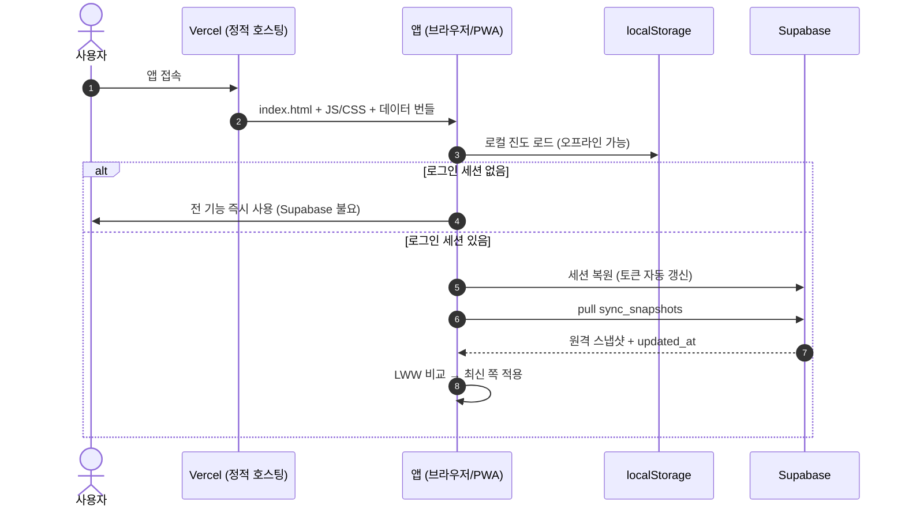
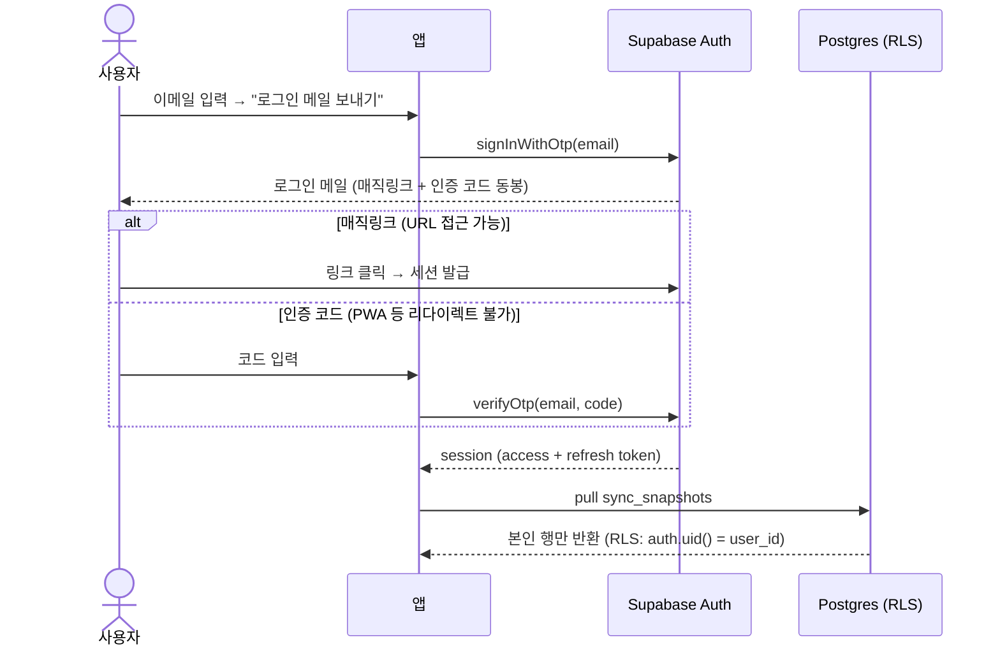
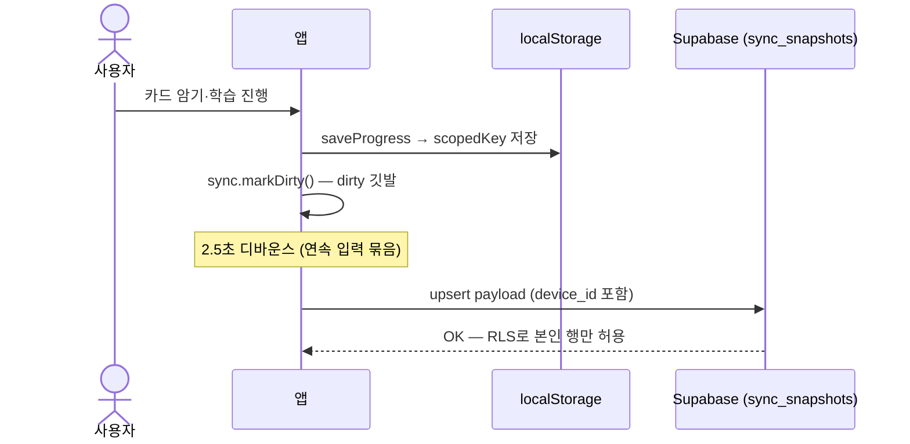
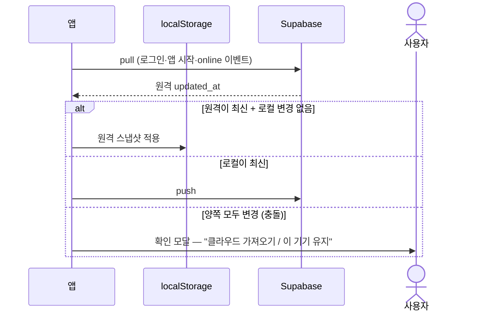
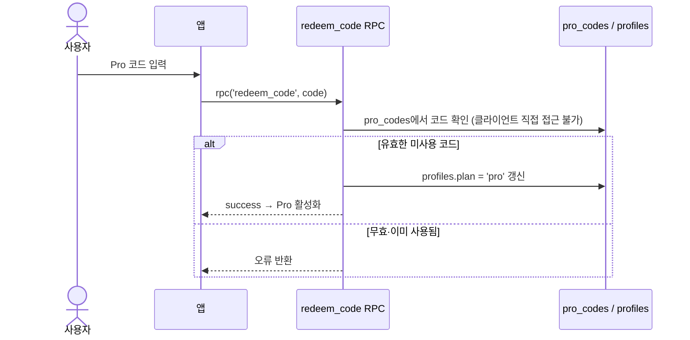

# Supabase 연동 설계 — 계정·클라우드 동기화·Pro 권한

> 상위 문서: `ARCHITECTURE.md` (전체 구조), `docs/exams/cosmetic/report_archive/FORMULA_OS_DESIGN.md` (실무 데이터 모델 — 아카이브, 현행 요구사양은 `SPEC.md` §3.18)
> **관련 SPEC ID**: `AU-01~08` (SPEC §3.19) · `DA-08` (고객 PII 동기화 제외) · `S-01` (CSP) · `ROAD-P0` (Pro entitlement)
> 목적: localStorage 전용 구조에 **선택적 계정(로그인) + 클라우드 동기화 + 서버 측 Pro entitlement**를 추가한다.
> **구현 상태**: ✅ Phase 1~2 구현 완료 (2026-09-23) — Phase 1: `supabase-client.js` lazy init + `auth-view.js` 로그인 모달(이메일+PW·가입·이메일 로그인 통합) + CSP `connect-src` 확장 + vendor/supabase 2.116.0 self-host. Phase 2: `src/sync.js` 스냅샷 동기화(쓰기 훅 dirty·2.5s 디바운스 push·pull·LWW+확인 모달·`지금 동기화` 버튼·`device_id`). 고객 카드·상담 이력은 개인정보 보호로 동기화 제외(§7). Pro(Phase 3)만 남음 — `tools/supabase/schema.sql`을 SQL Editor에서 실행 필요.
> **UX 개정 (2026-09-23 2차)**: 매직링크·인증 코드 버튼을 **단일 "로그인 메일 보내기"로 통합** — 같은 `signInWithOtp` 메일에 링크+코드가 동봉되므로 URL/PWA 어느 환경이든 동일 절차. 매직링크 랜딩 오류·성공 토스트 추가 (§A.8).
> 전제: 기존 오프라인 PWA·Zero-Backend 철학 유지 — Supabase는 "없어도 되는" 선택 계층
> **문서 ID**: DOC-DSN-08
> **범위**: platform · 판본: none

---

## 1. 설계 원칙

1. **로컬 우선 (offline-first)** — localStorage가 계속 1차 저장소. 네트워크·계정 없이도 앱 전 기능 동작.
2. **로그인은 선택** — 로그인의 가치는 "기기 간 동기화 + Pro 권한 귀속". 강제 로그인은 학습 앱 이탈을 유발하므로 하지 않는다.
3. **Supabase는 얇은 계층** — Auth + Postgres 2개 테이블만 사용. 콘텐츠(교재·문제은행·원료 DB)는 계속 정적 번들로 배포.
4. **기존 자산 재사용** — 동기화 페이로드는 `views/backup.js`의 백업 JSON 포맷(논리 키 → 값)을 그대로 사용.
5. **보안은 RLS가 담당** — publishable(구 anon) key는 클라이언트 노출이 정상이며, 행 접근은 `auth.uid()` 정책으로 제한. secret(구 service_role) key는 절대 번들하지 않는다.
6. **개인정보 분리** — 고객 카드·상담 이력(타인 PII)은 동기화 대상에서 기본 제외 (§7).

---

## 2. 아키텍처

```
[기존] localStorage (scopedKey <examId>:*)      ← 1차 저장소, 변경 없음
   ↕ src/sync.js (신규)                         ← push/pull · 디바운스 · 충돌 처리
   ↕ src/supabase-client.js (신규)              ← vendored supabase-js lazy init · 세션 복원
[Supabase] auth.users + profiles + sync_snapshots
```

### 2.1 플랫폼 역할 분담 (Vercel vs Supabase)

| 영역 | Vercel | Supabase |
|---|---|---|
| 앱 호스팅 | 정적 파일 서빙 (HTML/JS/CSS/번들) | — |
| CDN·HTTPS·배포 | 글로벌 엣지 캐시, TLS 자동, `git push` → 자동 배포 | — |
| 서버 코드 | 없음 (정적 전용) | Postgres + PostgREST + RPC |
| 인증 | — | 이메일/PW·매직링크 OTP (`auth.users`, Custom SMTP 가능) |
| DB | — | `profiles`(요금제) · `sync_snapshots`(학습 진도 백업) · `pro_codes`(Pro 코드) |
| 접근 제어 | — | RLS 정책 (`auth.uid() = user_id` 행 소유자 검증) |
| 권한 로직 | — | `redeem_code` RPC (security definer — plan 변경의 유일한 경로) |
| 실시간 동기화 | — | `sync_snapshots` push/pull (2.5s 디바운스 · LWW) |
| 오프라인 | PWA Service Worker가 담당 (Vercel 무관) | 미연결 시 앱 정상 동작 (localStorage가 1차) |
| 비용 | Hobby 무료 → 상업화 시 Pro $20/월 | 무료 티어 운영 중 |

> **경계선 요약**: Vercel은 "파일 배달부", Supabase는 "선택적 계정·동기화 계층". Supabase가 다운되거나 미설정이어도 앱 전 기능이 동작하는 Local-First 구조다.

```text
[사용자] → Vercel (앱 파일 다운로드) → 브라우저에서 실행
              ↘ 로그인 시에만 → Supabase (인증 + 스냅샷 동기화)
              ↘ 비로그인 → localStorage만 사용, Supabase 불요
```

#### 동작 흐름 (시퀀스)

**① 앱 로드 + 세션 복원** — Vercel은 파일 배달만 담당하고, Supabase는 로그인 세션이 있을 때만 접촉한다:



**② 로그인 (매직링크/OTP)** — 한 통의 메일에 링크와 코드가 동봉되어 URL/PWA 어느 환경이든 동일 절차:



**③ 데이터 동기화 push** — 쓰기 훅이 깃발을 세우고 2.5초 디바운스 후 한 번에 업로드:



**④ 충돌 처리 pull** — 양쪽이 다 바뀐 경우만 사용자에게 묻는다:



**⑤ Pro 코드 교환** — plan 갱신은 `security definer` RPC만 가능해 클라이언트 우회를 차단:



### 2.2 배포·CSP 제약 (실측 확인)

| 제약 | 현황 | 조치 |
|---|---|---|
| `connect-src 'self'` | `vercel.json` CSP 헤더 | `connect-src 'self' https://*.supabase.co` 추가 |
| `script-src 'self'` | CDN 스크립트 불가 | supabase-js ESM을 `vendor/supabase/`에 self-host (~100KB) |
| Service Worker | 모든 fetch가 동일 오리진이었음 | `url.origin !== location.origin` → network-only 조기 리턴 (Supabase 응답 캐시 금지) |
| `Permissions-Policy payment=()` | — | 코드 방식은 불필요. 향후 Payment Request API 도입 시에만 재검토 |

### 2.3 신규/변경 파일

| 파일 | 역할 |
|---|---|
| `vendor/supabase/` | supabase-js ESM 번들 (self-host) |
| `src/supabase-client.js` | 프로젝트 URL·publishable key config, `getSupabase()` lazy init, `onAuthChange` |
| `src/sync.js` | push/pull, dirty flag + 2~3s 디바운스, `updated_at` 충돌 비교, 확인 모달 |
| `src/auth-view.js` | 로그인 모달 (이메일+PW / 매직링크 / OAuth), 계정 상태 패널 |
| `index.html` | 로그인 모달 마크업, 설정 메뉴 `계정` 항목 |
| `src/state.js` | `saveProgress` 등 쓰기 경로에 `sync.markDirty()` 훅 |
| `vercel.json` | `connect-src` 확장 |
| `sw.js` | 외부 오리진 network-only 분기 + vendor 자산 등록 |
| `tests/dom/common-auth.dom.test.js` 등 | 로그인·동기화·충돌 시나리오 (supabase client는 vi.mock) |

---

## 3. DB 스키마 + RLS

```sql
-- 계정별 Pro 플랜 — entitlement를 서버로 이동해 클라이언트 우회 차단
create table profiles (
  id uuid primary key references auth.users(id) on delete cascade,
  plan text not null default 'free' check (plan in ('free','pro')),
  pro_since timestamptz,
  created_at timestamptz not null default now()
);

-- 시험별 진도 스냅샷 — backup.js의 논리 키→값 JSON을 payload로 저장
create table sync_snapshots (
  user_id uuid not null references auth.users(id) on delete cascade,
  exam_id text not null,
  payload jsonb not null,
  updated_at timestamptz not null default now(),
  device_id text not null,
  primary key (user_id, exam_id)
);

alter table profiles enable row level security;
alter table sync_snapshots enable row level security;

create policy "own profile read" on profiles
  for select using (auth.uid() = id);
-- plan 갱신은 RPC(redeem_code)만 가능 — 클라이언트 직접 update 정책 없음
create policy "own snapshots" on sync_snapshots
  for all using (auth.uid() = user_id)
  with check (auth.uid() = user_id);

-- 런타임 오류 텔레메트리 — src/error-telemetry.js, feedback과 같은 익명 insert 패턴
create table if not exists client_errors (
  id uuid primary key default gen_random_uuid(),
  created_at timestamptz not null default now(),
  kind text not null check (kind in ('error','unhandledrejection')),
  message text not null check (char_length(message) between 1 and 500),
  stack text, view text, exam_id text, app_version text, url text,
  user_agent text, meta jsonb
);
alter table client_errors enable row level security;
create policy "public insert" on client_errors
  for insert to anon, authenticated with check (true);
-- 조회 정책 없음 = 클라이언트 읽기 차단, 대시보드(service role)에서만 확인
```

### 3.1 스냅샷 vs 엔티티 테이블 — 선택: 스냅샷 우선

| 방식 | 장점 | 단점 |
|---|---|---|
| **스냅샷 (채택)** — 시험별 jsonb 문서 | 백업 포맷 재사용·구현 최소·모든 데이터 한 번에 커버 | 문서 단위 충돌(필드 병합 불가) |
| 엔티티 테이블 (Phase 4 검토) | 행 단위 동기화·충돌 병합 가능 | 스키마 이중 관리·localStorage↔행 매핑 비용 |

---

## 4. 동기화 전략

| 시점 | 동작 |
|---|---|
| 로그인 성공 | pull — 원격 `updated_at` > 로컬이면 적용, 로컬이 최신이면 push |
| 데이터 쓰기 | `saveProgress`/스토어 저장 훅 → dirty flag + 2~3s 디바운스 push |
| 앱 시작·`online` 이벤트 | 로그인 상태면 백그라운드 pull/push |
| 충돌 | 원격 최신 + 로컬 미반영 변경 동시 존재 → 확인 모달: "클라우드 데이터 가져오기 / 이 기기 데이터 유지" |
| 로그아웃 | 로컬 데이터 유지. 다른 계정 로그인 시 시험별 덮어쓰기 확인 |

- **충돌 정책**: last-write-wins + 사용자 확인 (필드 병합은 Phase 4 과제)
- **device_id**: 기기별 랜덤 UUID (localStorage `device_id`, GLOBAL_KEYS) — "마지막으로 쓴 기기" 표시용
- **동기화 범위 키**: `backup.js`의 `getBackupKeys()` 결과에서 `customer_*`·상담 이력 키 제외 (§7)

---

## 5. 로그인 UX

- **진입점**: 설정 메뉴 `계정` 항목 + 비로그인 시 대시보드 1회성 배너
- **수단**: 이메일+비밀번호 / **매직링크**(권장 — 학습 앱 특성상 비밀번호 부담 최소) / Google·Kakao OAuth (Supabase 내장 프로바이더)
- **세션**: supabase-js가 토큰을 localStorage 보관·자동 갱신 — PWA 재시작에도 유지
- **계정 패널**: 이메일, plan 뱃지(Free/Pro), "지금 동기화" 버튼, 마지막 동기화 시각, 로그아웃
- **⚠️ 매직링크 가입 계정은 비밀번호 없음** — 이메일+비밀번호 로그인은 `Invalid login credentials`로 실패 (소셜 계정 비밀번호와 무관). 계정 모달의 **비밀번호 설정**(`authSetPassword` → `updateUser({password})`)으로 등록하면 PWA 등 리다이렉트 불가 환경에서도 비밀번호 로그인 가능 (§A.7)

---

## 6. Pro 연동 (무료/유료 설계와 결합)

```
코드 구매(외부 채널) → 앱에서 코드 입력 → redeem_code RPC가 검증
→ profiles.plan='pro' 갱신 → isPro() = 로컬 캐시 + 주기적 서버 확인
```

- `redeem_code`는 `security definer` RPC — 코드 테이블(`pro_codes: code, redeemed_by, redeemed_at`)에 직접 접근 불가
- entitlement를 서버가 보유하므로 클라이언트 조작으로 Pro 우회 불가 (이전 "언락 코드 오프라인 검증" 안의 한계 해소)
- **미결**: 미로그인 사용자의 코드 전용 Pro 허용 여부 — 계정 귀속이 공유 방지에 유리하나 로그인 마찰 증가

---

## 7. ⚠️ 개인정보 — 고객 카드 동기화 제외

Formula OS의 고객 카드·상담 이력은 **타인의 개인정보**(이름·피부 상태·알레르기·사용 중 제품)이다.

- 클라우드 전송 시 개인정보처리방침·고객 동의·보관 책임 발생
- **Phase 1~3: `customer_*` 키 동기화 제외 (로컬 전용 유지)** — 학습 진도·포뮬러·배치·원료만 동기화해도 핵심 가치 충족
- Phase 4에서 고객 데이터 동기화 시 별도 동의 체크박스 + 전송 암호화 검토 필수

### 7.1 법정 기록 분리 동기화 (Phase 4 선행 과제 — 전략 근거: `../FORMULA_OS_경쟁전략.md` §2-A)

판매업소의 법정 기록(판매내역·조제 이력)은 localStorage만으로는 유실 위험이 있다. 고객 PII와 분리해 동기화하되, **기존 스냅샷 구조로는 불가**하다.

> ⚠️ **LWW 유실 위험 — 부분 완화됨 (2026-09-25)**: Phase 2는 포뮬러·배치·원료를 이미 `sync_snapshots` LWW로 동기화 중이라, 건별로 쌓이는 기록은 다기기 동시 기록 시 충돌 모달에서 한쪽이 유실될 수 있었다. **즉시 조치 적용**: `sync.js` 충돌 분기에서 미선택 쪽 스냅샷을 `sync_conflict_backup` 키에 보존(배열, 최근 3건) — 사용자가 꺼내는 복원 UI는 후속 과제. append-only 행 단위 테이블(아래 결정 ①)이 구조적 해결.

**결정 ① 저장 구조 — append-only 행 단위 테이블**

- `sync_snapshots`는 문서 단위 LWW — 매장 PC와 태블릿이 동시에 판매·조제·원료 입고를 기록하면 충돌 모달에서 한쪽 기록이 소실된다. **건별 기록에는 LWW 불가.**
- 신규 테이블 예시: `sales_records(user_id, sale_id uuid, sold_at, product_lot, expiry, qty, …법정 항목)` — INSERT 전용, UPDATE/DELETE 없음 (RLS: insert + select only)
- 이는 Phase 4의 엔티티 테이블화 작업 일부를 앞당기는 것 — 스냅샷과 다른 쓰기 경로(행 단위 upsert·offline 큐)가 필요해 작업량은 Phase 2보다 크다

**결정 ② 보존 장치 — 탈퇴·플랜 정지 시 기록 소실 방지**

- 현재 스키마는 `auth.users` 삭제 시 `on delete cascade`로 전 행 소거 — **법정 보관 기간이 남은 기록의 탈퇴 전내보내기 강제 또는 삭제 유예 필요** (보관 기간 ⚠️ 법령 확인 과제)
- 무료 플랜 휴면·일시 정지 정책도 위험 — 법정 기록 저장은 **유료 플랜 또는 별도 백업 전제**

**결정 ③ 데이터 위생 — 서버 비전송 필드 분리**

- 서버에는 **고객 키를 보내지 않는다** — 판매별 무작위 ID + 법정 항목만, `고객 → 판매 ID` 연결표는 로컬 전용 (가명정보 논란 여지 최소화)
- 포뮬러·배치 레코드에 상담 메모가 섞이면 서버에 피부 상태 정보가 올라감 — `notes`와 상담 메모를 스키마 필드로 분리

> ⚠️ 조건: §2-A "위탁 부담 제거" 마케팅 문구는 이 설계 + 법률 검토 통과를 전제로 한다. 부작용 발생 시 구매자 추적 필요 여부는 미확인 — 필요하면 연결표 설계 변경.

---

## 8. 단계별 로드맵

| Phase | 내용 | 검증 |
|---|---|---|
| 1 | Supabase 프로젝트(Seoul `ap-northeast-2`)·스키마·RLS → `supabase-client` + 로그인 모달 (동기화 없이 인증만) | 로그인·로그아웃·세션 복원 DOM 테스트 |
| 2 | 스냅샷 push/pull + 디바운스 + 충돌 모달 + 자동 동기화 | 동기화·충돌·오프라인 큐 시나리오 |
| 3 | `profiles.plan` + `redeem_code` RPC + Pro 게이팅 (기존 한도 상수 → `limitFor(plan)`) | 코드 활성화·한도 분기·잠금 UI |
| 4 (선택) | Formula OS 엔티티 테이블화·고객 동기화(동의+암호화)·필드 병합 | 별도 설계 |

---

## 9. 테스트 전략

- supabase-js는 `vi.mock`으로 교체 — 네트워크 없이 세션·응답 시뮬레이션 (기존 `common-uimode` 패턴)
- 커버 시나리오: 로그인 모달 열기/오류 표시, pull 적용, 충돌 모달 2분기, dirty 디바운스 push, 오프라인 큐 → online 복귀 flush, RLS 정책은 Supabase 로컬(`supabase start`)에서 검증
- `check:imports`·`verify:assets`에 vendor 자산·신규 모듈 반영

---

## 10. 미결 사항 (착수 전 결정 필요)

1. **로그인 강제 여부** — 선택(권장) / 필수
2. **동기화 범위** — 학습 진도+포뮬러만(권장) / 고객 데이터 포함(개인정보 절차 필요)
3. **인증 수단 범위** — 매직링크만 / +이메일PW / +OAuth(카카오·구글)
4. **Pro와 로그인 결합** — Pro=계정 필수(권장) / 미로그인 코드-only 병행
5. **Supabase 프로젝트** — 신규 생성 / 기존 프로젝트 재사용

---

## 11. 리스크

| 리스크 | 완화 |
|---|---|
| 익명 사용자가 로그인 없이 쓰던 데이터가 첫 동기화에서 덮여씀 | 첫 pull 시 로컬 존재 여부 확인 → 충돌 모달 |
| supabase-js vendored 번들 갱신 누락 | `verify:assets`에 vendor 체크리스트, 버전 주석 |
| 무료 티어 한도 (500MB DB·50k MAU) | 스냅샷 크기 수 KB 수준 — 실사용에서 한도 도달 어려움 |
| RLS 정책 누락으로 타 사용자 데이터 노출 | 정책 SQL을 마이그레이션 파일로 관리 + `supabase start` 로컬 검증 |

---

## 부록 A. Supabase 무료 계정·프로젝트 생성 절차

### A.1 계정 생성 (약 1분)

1. <https://supabase.com> 접속 → 우측 상단 **Start your project**
2. **GitHub 계정 가입** 권장 (이메일 가입도 가능) → OAuth 승인 → 대시보드 진입
3. 카드 등록 불필요 — Free 플랜은 결제 정보 없이 시작

### A.2 프로젝트 생성

대시보드 → **New project**:

| 항목 | 입력값 |
|---|---|
| Name | `passmula` (임의) |
| Database Password | 자동 생성 → **별도 안전 보관** (DB 직접 접속 시 필요) |
| Region | **`Northeast Asia (Seoul)` / `ap-northeast-2`** — 한국 사용자 지연 최소 |
| Pricing Plan | Free (기본) |

**Create new project** → 프로비저닝 약 2분.

### A.3 대시보드에 표시되는 값 4개 — 필요한 것은 2개

**Project Settings → Data API**(또는 Connect)에서 확인:

| 항목 | 필요? | 용도 |
|---|---|---|
| **Project URL** | ✅ 앱 연동 | `https://<프로젝트ID>.supabase.co` — `supabase-client.js` config |
| **Publishable key** (구 anon public key) | ✅ 앱 연동 | `sb_publishable_...` 또는 레거시 `anon` JWT — 클라이언트 노출 가능한 공개 키, RLS가 보안 담당 |
| Direct connection string | 선택 | Postgres 직접 접속용(`psql`·DB 관리 도구) — **앱이 아니라 관리자용**, 비밀번호 포함으로 저장소 포함 금지 |
| CLI setup commands | 선택 | Supabase CLI 로컬 개발·마이그레이션용 — SQL Editor로 충분하나, RLS 로컬 검증(`supabase start`)에 유용 |

> Supabase는 2025년부터 키 명칭을 변경 — **Publishable key = 구 anon public key**, **Secret key = 구 service_role**. 대시보드에 어느 표기가 보여도 같은 역할이다.
>
> ⚠️ **Secret(구 service_role) 키는 절대 코드·저장소에 포함 금지** — RLS를 우회하는 관리자 키로, 노출 시 전체 데이터가 열린다.

### A.4 Free 플랜 한도·주의

- DB 500MB · MAU 50,000 · 스토리지 1GB — 본 앱 규모에서 충분
- **7일 무활동 시 프로젝트 일시 정지** — 대시보드에서 한 클릭 재개, 데이터 유지. 정지 방지는 대시보드 접속 또는 cron 호출로 해결 가능

### A.5 프로젝트 생성 후 작업 순서

#### 1. 스키마 실행 (SQL Editor)

1. 대시보드 → 좌측 메뉴 **SQL Editor** (`>_` 아이콘) → **+ New query**
2. `tools/supabase/schema.sql` 전체 복사 → 붙여넣기 → **Run** (`Ctrl+Enter`)
3. "Success" 메시지 확인 — `create table if not exists`/`create or replace` 구조라 **재실행 안전** (스키마 수정·프로젝트 이전 시 다시 붙여넣으면 됨)

포함 내용: `profiles`·`sync_snapshots`·`pro_codes` 테이블 + RLS 정책 + 가입 트리거(`handle_new_user`) + `redeem_code` RPC + 기존 사용자 profiles 백필.

#### 2. 생성 확인

```sql
select table_name from information_schema.tables where table_schema='public';
select polname, polrelid::regclass from pg_policy;
```

기대: 테이블 3개(`profiles`·`sync_snapshots`·`pro_codes`), 정책 2개(`own profile read`·`own snapshots`). Table Editor에서도 테이블이 보이면 정상.

#### 3. 인증 설정

- Authentication → Providers에서 **Email 활성화 확인** (기본 ON)
- 개발 중 이메일 확인 메일이 번거로우면 Authentication → Sign In / Up에서 **Confirm email OFF** 가능 (프로덕션은 ON 권장)

#### 4. 클라이언트 연결

- Project URL + Publishable key를 `src/supabase-config.js`에 반영 (§A.3 — 2개만, 나머지 불필요)
- `connect-src 'self' https://*.supabase.co` (vercel.json) + vendor 자산이 `sw.js`에 등록되어 있어야 함 — Phase 1 커밋에서 완료

#### 5. 동작 검증

앱에서 계정 생성·로그인 후 데이터 변경 → **Table Editor → sync_snapshots**에 `(user_id, exam_id)` 행이 upsert되면 Phase 2 동기화 정상.

### A.6 연결 테스트 결과 (2026-09-23 실측)

| 검사 | 결과 |
|---|---|
| 프로젝트·Publishable key | ✅ 유효 — `/rest/v1/` 인증 통과, 테이블 미생성은 PGRST205 (정상) |
| Auth `/auth/v1/settings` | ✅ 200 — email 프로바이더 ON, `disable_signup:false` |
| 이메일 인증 | `mailer_autoconfirm:false` — 가입 시 확인 메일 발송 (개발 편의 시 대시보드에서 해제 가능) |
| OAuth 프로바이더 | 전부 OFF — 이메일/매직링크만으로 Phase 1 진행 가능 |

※ Node fetch가 환경의 undici 파싱 문제로 실패한 적 있음 — 연결 테스트는 `curl` 사용 권장 (본 문서 §A 명령 참조)

### A.7 회원가입·로그인 검증 절차 (2026-09-23 E2E 실측)

#### 필수 선행 설정 — Site URL

**Authentication → URL Configuration**:

| 항목 | 값 |
|---|---|
| Site URL | `https://passory.vercel.app` |
| Redirect URLs | `https://passory.vercel.app/**` + `http://localhost:3000/**` (로컬 테스트용) |

> 기본 Site URL은 `http://localhost:3000` — 설정 전에 발송된 확인 메일·매직링크는 localhost로 리다이렉트된다. **토큰 검증 자체는 Supabase 서버에서 완료되므로 리다이렉트가 실패해도 이메일 확인은 성공** — 이후 프로덕션에서 정상 로그인 가능. 단, 매직링크 로그인은 리다이렉트가 앱으로 돌아와야 세션이 성립하므로 Site URL 변경은 사실상 필수.

#### 검증 절차

1. 앱 → 설정 메뉴 → `계정 / 로그인` → 이메일+비밀번호 입력 → `회원가입` → "확인 메일" 안내
2. 받은 메일에서 "Confirm email address" 클릭 → 이메일 확인 완료
3. 앱에서 같은 이메일+비밀번호로 `로그인` → 모달 닫힘 + 설정 라벨이 이메일로 변경
4. 진도 변경(플래시카드 암기 등) → 2~3초 후 자동 push
5. **Table Editor → `sync_snapshots`**에 `(user_id, cosmetic)` 행 생성 확인
6. 계정 모달 재오픈 → `지금 동기화` 버튼 + `동기화:` 상태 라인 확인

#### 통합 이메일 로그인 E2E 체크리스트 (링크+코드 동봉 메일)

`로그인 메일 보내기`가 두 환경에서 동일하게 동작하는지 검증하는 절차 — 상세는 운영 런북(`Supabase_Custom_SMTP_MagicLink_OTP_설정가이드.md` §15) 참조.

- [ ] 앱 → 설정 → `계정 / 로그인` → 이메일 입력 → `로그인 메일 보내기` → 코드 입력 칸 표시 + 버튼 60초 쿨다운
- [ ] 수신 메일에 **인증 코드(`{{ .Token }}` 치환)와 로그인 링크가 둘 다** 표시됨 — 코드가 없으면 Custom SMTP/템플릿 설정 누락
- [ ] **⚠️ Users에 없는 새 이메일로도 발송** — 신규 계정은 `Confirm signup` 템플릿이 나가므로 이 템플릿에도 코드가 있는지 확인
- [ ] **브라우저 경로**: 메일의 링크 클릭 → 앱 랜딩 → "이 브라우저에서 로그인" 확인 → 로그인 토스트 → 설정 라벨이 이메일로 변경
- [ ] **PWA 경로**: PWA에서 메일 발송 → 메일의 숫자 코드를 앱의 인증 코드 칸에 입력 → `확인` → 로그인 토스트
- [ ] 링크 클릭 후 **취소** 시 토큰 미소비 — 같은 메일의 코드로 계속 로그인 가능 (스캐너 방어 확인)
- [ ] 만료된 링크·코드 → "만료" 계열 한글 안내 확인 (§A.8 랜딩 핸들러)
- [ ] 로그인 후 진도 변경 → `sync_snapshots` 행 갱신 확인

#### 실측 이슈 기록

| 증상 | 원인 | 해결 |
|---|---|---|
| 확인 메일이 localhost로 리다이렉트 | Site URL 기본값 `localhost:3000` | URL Configuration에서 프로덕션으로 변경 (위 표) |
| 로그인 시 "이메일 또는 비밀번호가 올바르지 않습니다" | 매직링크로 가입 → 비밀번호 미설정 상태 | 매직링크로 로그인 후 계정 모달에서 비밀번호 설정. 소셜 계정 비밀번호는 Supabase와 무관 — 어떤 비밀번호도 통과 불가 |
| PWA에서 매직링크 로그인 불가 | 메일 링크가 브라우저를 열고 세션은 브라우저에 저장 — PWA는 별도 저장 공간 | ① **인증 코드(OTP) 로그인** — PWA 안에서 완결 (아래 참조) ② 비밀번호 설정 후 이메일+비밀번호 로그인 |
| 계정 상태 확인 필요 시 | — | Authentication → Users에서 행 존재 + `email_confirmed_at` 확인 |

#### 이메일 로그인 — 링크·코드 통합 단일 경로 (2026-09-23 2차 개정)

- 앱: `로그인 메일 보내기` → `signInWithOtp({email, options:{emailRedirectTo}})` → 코드 입력 칸 표시. 메일에는 **`?token_hash=` 앱 링크와 코드(`{{ .Token }}`)가 동봉**되므로 사용자가 환경에 맞게 선택 — 브라우저는 링크→앱 랜딩 확인, PWA는 코드 입력
- 두 수단이 같은 메일을 공유하므로 버튼을 분리할 이유가 없고, 분리 시 PWA 사용자가 "매직링크"를 눌러 세션이 브라우저에 생기는 **조용한 실패**가 발생 — 단일 버튼으로 통합해 URL·PWA 간 동일 UX 확보
- 코드 입력: `verifyOtp({email, token, type:'email'})` — 리다이렉트 없이 세션 성립
- `authMagicLink`/`authSendOtp`는 `authEmailLogin`의 별칭으로 유지 (기존 호출 호환)

##### `{{ .Token }}` 템플릿 설정 절차 (1회, 프로젝트 전역)

> 📋 **상세 운영 런북**: 단계별 화면 이동·체크리스트·트러블슈팅은 `dev/runbooks/Supabase_Custom_SMTP_MagicLink_OTP_설정가이드.md` 참조. 이 문서는 설계 근거·필수 조건만 다룬다.

기본 Magic Link 템플릿은 링크만 표시하므로 코드가 메일에 안 보인다 — **OTP 로그인 사용 전 필수 설정**.

> ⚠️ **선행 조건 — Custom SMTP**: Supabase는 기본 이메일 발송 서비스에서 템플릿 편집을 막는다 ("Set up custom SMTP to edit templates" — Subject/Body 비활성). 템플릿을 바꾸려면 먼저 SMTP를 연결해야 한다.
>
> SMTP는 어차피 운영 필수 — 기본 발송은 시간당 한도가 매우 낮고 스팸함 분류가 잦다.

##### Custom SMTP 설정 — 권장: Gmail 앱 비밀번호

**권장 이유**: 주 사용자층이 설치형 PWA라 브라우저 없는 로그인(OTP)이 필요하고, OTP는 `{{ .Token }}` 템플릿 → **Custom SMTP**가 선행 조건이다. SMTP 제공자 중 Gmail 앱 비밀번호는 ① 기존 Gmail 계정으로 즉시 가능(별도 가입·도메인 인증 불필요) ② Resend는 도메인 없으면 소유자 메일로만 발송 가능하고 vercel.app 도메인은 DNS 레코드를 못 넣어 실사용 발송엔 자체 도메인 필요 ③ 이 앱 규모에서는 일 ~500통 한도로 충분. 규모 확장 시 Resend/SES로 설정만 교체하면 되고 앱 코드 변경은 없다.

1. **myaccount.google.com** → 보안 → 2단계 인증 활성화 → "앱 비밀번호" 생성 (이름 예: `Supabase`) → 16자리 발급
2. Supabase 대시보드 → **Authentication → SMTP Settings**에 입력:

   | 항목 | 값 |
   |---|---|
   | Host | `smtp.gmail.com` |
   | Port | `465` |
   | Username | 발신용 Gmail 주소 |
   | Password | 16자리 앱 비밀번호 (공백 제외) |
   | Sender email | 같은 Gmail 주소 |
   | Sender name | 서비스명 (예: `Passmula`) |

3. 저장 + **Enable Custom SMTP** ON → 이후 Templates 편집 가능

1. 대시보드 → **Authentication → Emails** (또는 Email Templates — 대시보드 버전에 따라 SMTP 설정이 이 안의 탭에 있기도 함) → **`Magic link or OTP`** 템플릿 선택
2. **Content → Body** 영역 클릭 후 권장안 적용. **Body는 HTML**이므로 줄바꿈만 쓰면 한 문단으로 뭉치고 URL도 링크가 안 될 수 있음 — `<a>` 태그 포함 HTML로 작성. 권장 HTML SSOT: `docs/dev/runbooks/Supabase_Custom_SMTP_MagicLink_OTP_설정가이드.md` §16 "최종 템플릿"

   - `{{ .Token }}`·`{{ .TokenHash }}`·`{{ .SiteURL }}`는 발송 시점에 자동 치환 — 실제 값을 가져올 필요 없음
   - 링크 끝 `type=`은 토큰 종류 — `Magic link or OTP`는 `email`, `Confirm signup`은 `signup`. 앱이 이 값을 `verifyOtp`에 전달한다
   - ⚠️ **링크와 코드는 독립적이지 않고 같은 일회용 토큰의 두 표현** — 한쪽을 쓰면 다른 쪽도 함께 소진된다. iOS 사용자가 습관적으로 링크를 누르면 코드가 죽어 "코드가 안 먹는다"로 보이고, 메일 보안 스캐너·미리보기가 `ConfirmationURL`에 GET을 보내면 사용자가 열기 전에 토큰이 소진된다 → **기본 `{{ .ConfirmationURL }}` 대신 앱 도메인 `?token_hash=` 링크를 쓰는 것이 권장** (앱이 확인 클릭을 요구해 스캐너 소진을 막고, iOS에 코드 경로 안내 기회를 준다 — §A.8)
   - `{{ .SiteURL }}`는 대시보드 Site URL로 치환 — Redirect URLs 허용 목록과 무관하게 Site URL 값이 들어간다
   - Subject는 변경 불필요

3. **`Confirm signup` 템플릿에도 동일하게 적용 — 단, 링크 끝을 `type=signup`으로** — `signInWithOtp`는 미등록 이메일로 새 계정을 만들며, `Confirm email` ON 상태에서 신규 사용자에게는 `Magic link or OTP`가 아니라 **`Confirm signup` 템플릿이 나간다**. 이 템플릿에 `{{ .Token }}`이 없으면 처음 가입하는 iOS PWA 사용자만 코드 없는 메일을 받는다. **E2E 테스트는 반드시 Users에 없는 새 이메일로도 수행할 것.**

   > 앱의 `token_hash` 랜딩은 쿼리의 `type` 값을 `verifyOtp`에 그대로 전달한다 — `Magic link or OTP`는 `type=email`, `Confirm signup`은 `type=signup`. 잘못된 type은 검증 실패로 이어진다.

4. **Save** — 내용이 바뀌어야 버튼이 활성화됨. 프로젝트 전역 설정이므로 사용자별 작업 불필요

**Body 편집이 안 될 때**: Subject/Body가 회색 비활성이면 **Custom SMTP 미설정**이 원인 (위 선행 조건). 그 외에는 ① 기존 텍스트 위 직접 클릭(에디터 포커스) ② 페이지 새로고침 ③ 시크릿 모드/다른 브라우저 ④ Management API(`PATCH /v1/projects/{ref}/config/auth`의 `mailer_templates_magic_link_content`). SMTP 없이는 OTP 불가 — 비밀번호 경로로 대체 가능 (OTP는 편의 개선)

#### 설치형 PWA에서 로그인하는 방법 (사용자 절차)

**기본 경로는 환경 무관하게 동일** — `로그인 메일 보내기` 한 버튼이 링크+코드를 동봉한 메일을 보낸다. 완료 수단만 환경에 따라 갈린다:

| 환경 | 완료 수단 | 비고 |
|---|---|---|
| 브라우저 (PC/모바일) | 메일의 **링크 클릭** → 앱 랜딩 → 확인 클릭 → 세션 성립 | 코드 입력도 가능 |
| Android PWA | 링크 클릭 시 OS 링크 캡처로 **PWA에서 랜딩**(앱 도메인 직행 링크라 캡처 확률↑). 캡처가 안 되면 코드 입력 | 기기·브라우저 설정 의존 → 코드가 보험. Chrome 설치 PWA는 Chrome과 저장소를 공유해 브라우저 로그인 세션이 PWA에도 보일 수 있음 — 실기기 확인 필요 |
| iOS PWA (홈 화면) | **코드 입력 필수** — 링크는 항상 Safari를 열고 세션은 Safari에만 생김 | 플랫폼 한계: 홈 화면 앱으로의 링크 라우팅 API 없음. 랜딩 확인 창에 코드 경로 안내 포함 |

보조 경로:

| 방법 | 절차 | 브라우저 필요? |
|---|---|---|
| 비밀번호 | 브라우저에서 1회: 로그인 메일 링크로 로그인 → 계정 모달 → `비밀번호 설정`. 이후 어디서든 이메일+비밀번호 | 최초 1회만 (SMTP 없이 가능) |
| PWA에서 가입 | 이메일+비밀번호 → `회원가입` → 확인 메일 링크를 브라우저에서 1번 클릭 → PWA로 돌아와 비밀번호 로그인. `Confirm email` OFF면 생략 | 확인 클릭 1회 |

> 핵심 원리: 세션은 **로그인 API가 완료된 저장 공간**에 생긴다. 비밀번호·OTP 코드는 앱 안에서 완결되므로 PWA에 세션이 저장되고, 매직링크는 링크를 연 쪽(브라우저 또는 링크 캡처된 PWA)에 저장된다.

#### A.8 매직링크 플로우 정밀 검토 + 랜딩 피드백 (2026-09-23 2차)

**flowType 확인 결과 — PKCE 함정 없음**: vendored supabase-js 2.116.0의 기본값은 `flowType: 'implicit'`. 매직링크는 `?code=` PKCE 교환이 아니라 `#access_token=` 해시 토큰 방식이라 `code_verifier`를 요구하지 않는다 — **링크를 요청한 컨텍스트와 다른 컨텍스트에서 열어도** 그곳의 `detectSessionInUrl`이 토큰을 소비해 세션이 성립한다. (PKCE였다면 verifier 부재로 무조건 실패했을 경로.) 보안상 implicit은 공개 클라이언트·정적 사이트에 적합하며, 크로스 디바이스 매직링크에는 오히려 PKCE보다 호환성이 높다.

**환경별 매직링크 동작 매트릭스** (권장 `?token_hash=` 템플릿 기준):

| 요청 → 링크 오픈 | 결과 |
|---|---|
| 브라우저 → 브라우저 | ✅ 랜딩 → 확인 클릭 → `verifyOtp` → 세션 성립 |
| PWA → Android 링크 캡처로 PWA | ✅ 동일 랜딩 경로 (앱 도메인 첫 URL이라 캡처 확률 상승 — 기본 ConfirmationURL은 `*.supabase.co`를 경유해 인텐트가 브라우저로 잡힘) |
| PWA → 브라우저 (iOS·캡처 실패) | 랜딩 확인 창이 "PWA 로그인 중이면 코드 입력" 안내 — 취소하면 토큰 미소비, 확인하면 브라우저에 세션 |
| 메일 스캐너/미리보기 | 링크 GET만으로는 토큰 미소비 (확인 클릭이 필요) — 기본 `ConfirmationURL`은 GET 한 번에 검증 완료돼 취약했음 |

**랜딩 피드백 (구현)**: `initAuthView` 시작 시 두 형태를 처리한다.
① `?token_hash=` — `replaceState`로 파라미터 정리 후 `showConfirm`으로 "이 브라우저에서 로그인할까요?(PWA 로그인 중이면 취소)" 확인 → 승인 시 `verifyOtp({token_hash, type:'email'})`. 확인 클릭 전까지 토큰을 소비하지 않아 스캐너·미리보기 소진을 막고 flowType과 무관하게 동작한다.
② `#access_token`/`#error_*` 해시(기본 ConfirmationURL 링크, 하위 호환) — 오류 파라미터는 한글 토스트 + URL 정리, `access_token`은 supabase-js가 소비하므로 `SIGNED_IN` 이벤트에서 성공 토스트(수동 로그인과 중복되지 않게 랜딩 플래그로 게이트).

**보조 세부 (구현)**: `signInWithOtp`에 `emailRedirectTo: location.origin` 명시(Redirect URLs 허용 목록과 일치 필요 — 로컬/프로덕션 각자 자기 도메인 복귀). 발송 버튼에 60초 재발송 쿨다운(동일 주소 재요청 제한 대응, 429는 한글 매핑). OTP 입력칸은 `inputmode="numeric"` + `autocomplete="one-time-code"` + 공백 제거, 자릿수는 Email OTP Length 설정에 따르므로 6~10자리 허용. `createClient`에 `auth:{flowType:'implicit',…}` 명시 — vendor 갱신으로 기본값이 바뀌어도 조용히 깨지지 않게 고정.

**운영 주의**: Gmail 앱 비밀번호는 Google 계정 비밀번호 변경 시 폐기된다 — 로그인 메일이 조용히 끊기므로 트러블슈팅 1순위로 앱 비밀번호 재발급을 확인. Custom SMTP 적용 후 Auth → Rate Limits의 시간당 발송 한도도 별도로 생긴다.

**통합 버튼 결정 근거**: `authMagicLink`와 `authSendOtp`는 동일한 `signInWithOtp` 호출이며 차이는 코드 입력칸 표시뿐이었다. 분리 상태에서는 PWA 사용자가 '매직링크'를 선택하면 링크가 브라우저에서 열려 세션이 엉뚱한 저장 공간에 생기는 조용한 실패가 발생 — 단일 버튼 + 코드 입력칸 상시 표시로 URL·PWA 간 절차를 완전히 동일하게 만들었다.

#### 알려진 UX 갭 (후속 과제)

- ~~비밀번호 설정 UI 없음~~ — ✅ 해결: 계정 모달 `비밀번호 설정` (`authSetPassword` → `updateUser`). 매직링크 가입자는 로그인 후 비밀번호를 등록하면 PWA(리다이렉트 불가 환경)에서도 이메일+비밀번호 로그인 가능
- ~~매직링크/인증 코드 버튼 분리로 인한 PWA 조용한 실패~~ — ✅ 해결: `authEmailLogin` 단일 버튼 통합 (§A.8)
- ~~매직링크 랜딩 오류 무표시~~ — ✅ 해결: 해시 `error_*` 파라미터 파싱 → 한글 토스트 (§A.8)
- 비밀번호 분실 시 대시보드 Users → Delete 후 재가입이 유일한 경로 (비밀번호 재설정 메일 플로우 미구현)
- iOS PWA의 매직링크 완결 불가는 플랫폼 한계 — 코드 입력 경로로 커버 (통합 버튼으로 기본 UX는 동일)
- Supabase 기본 SMTP는 스팸함에 들어갈 수 있음 + 이메일 발송 레이트리밋이 낮음 + **템플릿 편집 자체가 Custom SMTP 설정을 요구** — Resend/SendGrid 등 연결 권장 (OTP 코드 메일도 이게 있어야 동작)
