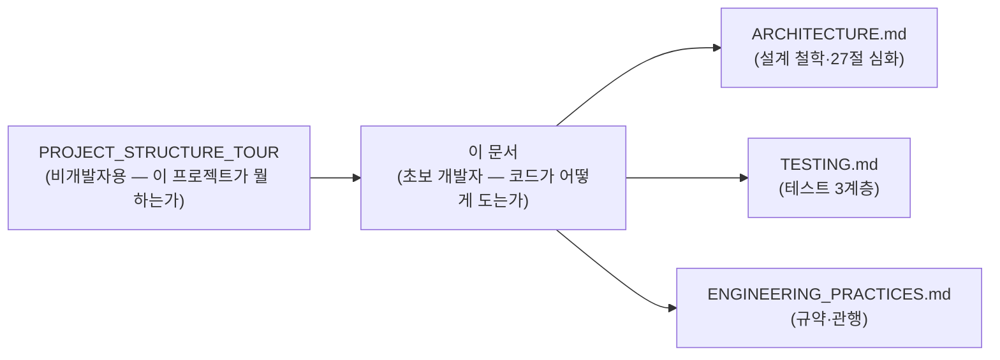
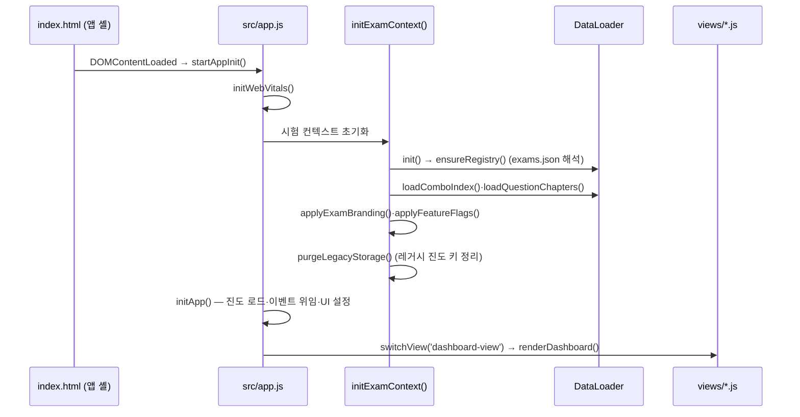
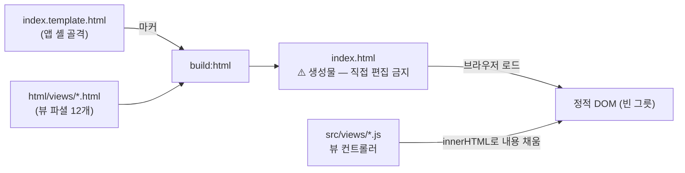
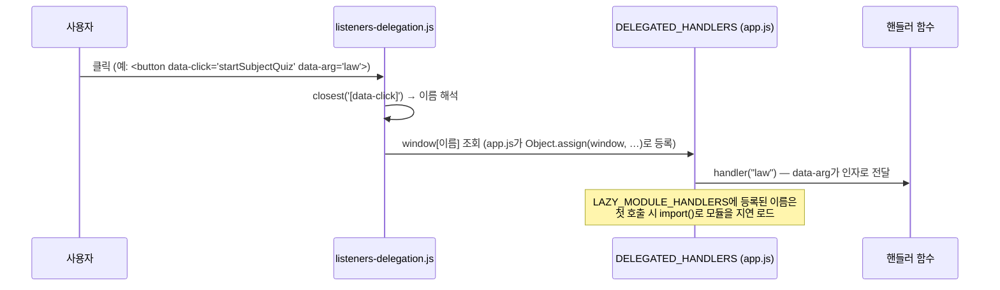
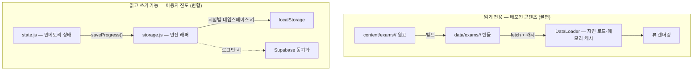
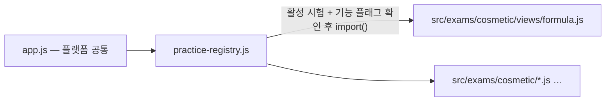

# 🗺️ 코드 읽기 가이드 — 초보 개발자 온보딩

> **최종 업데이트**: 2026-10-15
> **대상**: 이 저장소를 처음 여는 개발자 — 환경 설정은 끝났다고 가정(`DEV_ENVIRONMENT.md`)하고 "코드가 어떻게 도는지"를 설명
> **관련 SPEC ID**: 해당 없음 (온보딩 문서)
> **문서 ID**: DOC-REF-12

---

## 0. 읽기 경로 — 이 문서의 위치



투어 문서가 "지도"라면, 이 문서는 **"길 위를 실제로 걷는 법"**입니다. 앱이 켜지는 순서 → 클릭이 동작하는 원리 → 데이터가 흐르는 경로 → 첫 변경 순서로 진행합니다.

---

## 1. 실행해 보기 — 30초

```powershell
npm.cmd run serve        # http://localhost:3000 — vercel.json 헤더(CSP·캐시) 그대로 미러링
```

빌드 없이 바로 뜹니다 — 이 프로젝트는 **번들러가 없습니다**. 브라우저가 ES Module을 그대로 import하므로, `src/`의 파일을 고치고 새로고침하면 즉시 반영됩니다. DevTools Network 탭에서 각 `.js`가 개별 파일로 로드되는 것을 확인해 보세요.

## 2. 앱이 켜지는 순서 (부팅 시퀀스)



**읽기 포인트**: `src/app.js` 맨 아래 `startAppInit()`부터 거꾸로 올라가면 전체 초기화 경로가 보입니다. 시험이 2개 이상이고 미선택이면 대시보드 대신 시험 선택 화면(`showExamSelect`)이 홈이 됩니다.

## 3. 화면이 만들어지는 방식 — 파셜 조립



- **HTML을 고치려면** `html/views/*.html`을 편집하고 `npm.cmd run build:html` → `npm.cmd run check:html`로 검증. `index.html`을 직접 고치면 다음 빌드에 덮어씌워집니다.
- 뷰 컨트롤러는 `document.getElementById(...)`로 빈 영역을 찾아 `innerHTML`을 채우는 단순한 패턴입니다. 예: `src/views/dashboard.js`의 `renderDashboard()`.

## 4. 클릭이 동작하는 방식 — data-click 위임 (가장 중요한 패턴)

CSP 보안 정책이 인라인 스크립트를 금지하기 때문에, 이 프로젝트는 `onclick="..."`을 **한 군데도 쓰지 않습니다**. 대신 HTML 속성으로 "무엇을 호출할지"를 선언하고, 하나의 위임 리스너가 해석합니다.



**새 버튼을 추가할 때 절차**:
1. `html/views/xxx.html`에 `data-click="myHandler"` 속성 부여
2. 핸들러 함수 작성 (보통 해당 뷰 컨트롤러에 `export function`)
3. `src/app.js`의 `DELEGATED_HANDLERS`에 등록 — 등록 안 하면 콘솔에 `Handler not found` 오류

## 5. 데이터가 흐르는 경로 — 두 개의 "저장소"를 구분



**초보자가 가장 많이 실수하는 지점**:
- `localStorage`를 **직접 호출하면 안 됩니다** — `check:storage` 게이트가 커밋을 차단합니다. 반드시 `storage.js`의 `safeGetItem`/`safeSetItem`을 거치세요 (시험별 키 네임스페이스·용량 예외 처리가 들어있습니다).
- `data/`와 `index.html`은 **생성물**입니다. 원본은 `content/`와 `html/views/` — 생성물을 직접 고치면 `check:datafresh`/`check:html`이 불일치로 실패합니다.

## 6. 시험 도메인 코드 — src/exams/<id>/ 의 지연 로딩



- 시험 전용 코드(Formula OS 등)는 `src/exams/<id>/`에 격리되고, `practice-registry.js`가 지연 import합니다. 핸들러도 `LAZY_MODULE_HANDLERS`를 통해 첫 클릭 시점에 로드됩니다.
- 기능 노출은 `exams.json`의 `features` 플래그로 선언 — `hasFeature('x')`가 falsy면 관련 UI가 렌더되지 않습니다 (`check:featflags`가 미선언 키 사용을 오류로 잡습니다).

## 7. 첫 변경 — 작업 유형별 레시피

| 하고 싶은 일 | 편집 위치 | 필수 후속 명령 |
|--------------|-----------|----------------|
| 뷰 마크업·문구 | `html/views/*.html` | `build:html` → `check:html` |
| JS 로직 | `src/` (테스트 동반 규칙) | `test:dom` 또는 `npm test` → `check:testfirst` |
| 콘텐츠(교재·문제) | `content/exams/<id>/` | `build:data` → `check:content` |
| 참조자료 | `참조자료/` + `references.json` | `check:reflayout`·`check:reffresh` |
| 문서 추가 | `docs/` + `docs/README.md` 등록 | `check:docs` |

**끝나기 전**: `npm.cmd run check:all` — 변경 유형에 관계없이 로컬 최종 게이트입니다. 실패하면 출력 맨 아래 실패 단계의 메시지가 원인을 알려줍니다 (어느 게이트가 왜 존재하는지는 §9 표 참조).

## 8. 추천 읽기 순서 (코드를 직접 펴 보기)

| 순서 | 파일 | 볼 것 |
|------|------|-------|
| 1 | `src/app.js` (맨 아래) | 부팅 시퀀스·`DELEGATED_HANDLERS` 등록 |
| 2 | `src/views/listeners-delegation.js` | data-click 해석 규칙 (100줄 미만) |
| 3 | `src/state.js` | 인메모리 상태 + `saveProgress()` 구조 |
| 4 | `src/storage.js` → `src/storage-keys.js` | localStorage 추상화·시험별 키 규칙 |
| 5 | `src/data-loader.js` | 번들 fetch·캐시·레지스트리 해석 |
| 6 | `src/views/dashboard.js` | 뷰 컨트롤러 표준 패턴 |
| 7 | `src/views/analysis-view.js` | dashboard에서 분리된 모듈 경계 실례 |
| 8 | `src/exams/cosmetic/` 한 파일 | 시험 도메인 격리 예시 |

## 9. 게이트 치트시트 — 실패 메시지 읽는 법

| 게이트 | 잡는 것 | 고치는 법 |
|--------|---------|-----------|
| `check:html` | index.html 미재생성 | `npm.cmd run build:html` |
| `check:escape` | 미이스케이프 `${}` 보간 | `esc()` 감싸거나 `html`` ` 템플릿 사용 |
| `check:storage` | localStorage 직접 접근 | `storage.js` 래퍼 사용 |
| `check:imports` | import/export 이름 불일치 | 오류 메시지의 파일·심볼 확인 |
| `check:testfirst` | src 변경인데 테스트 미동반 | 동작 변경이라면 테스트 추가 (문서·주석만이면 커밋에 `[no-test]`) |
| `check:docs` | src 변경인데 문서 미갱신 | 관련 문서 동반 수정 (`[no-docs]`는 신중히) |
| `check:specrefs` | SPEC↔@spec 어긋남 | `@spec ID` 태그 추가·정정 |
| `check:datafresh` | data/ 생성물이 원본보다 오래됨 | `build:data` 후 결과 커밋 |
| `check:domainmap` | 새 파일이 분류표에 미등록 | `tools/check/domain-map.json`에 경로 추가 |

## 10. 자주 하는 질문

**Q. 프레임워크 없이 상태 관리는?**
`state.js`의 평범한 객체 + `saveProgress()`가 전부입니다. 리액티브 바인딩은 없고, 각 뷰의 `render*()`가 상태를 읽어 DOM을 다시 그립니다.

**Q. 타입 체크는?**
TypeScript가 아니라 `jsconfig.json`의 `checkJs` + JSDoc 주석으로 `tsc --noEmit`을 돌립니다 (`check:types`). 새 함수엔 JSDoc `@param`/`@type`을 달아주세요.

**Q. 왜 이렇게 게이트가 많나?**
1인 유지보수에서 "나중의 나"가 규칙을 잊어도 기계가 잡아주도록 설계됐습니다. 각 게이트의 존재 이유는 `ARCHITECTURE.md`와 각 `tools/check/*.js` 헤더 주석에 적혀 있습니다.

**Q. 어디부터 고쳐보면 좋을까?**
문구 수정(§7 표 첫 행)이 가장 안전한 첫 커밋입니다. 그다음은 `check:escape` 리포트의 잔존 후보를 `html`` `로 바꾸는 청소 작업이 코드베이스 감각 익히기에 좋습니다.

---

## 11. 용어 정리

이 문서와 코드베이스에서 반복적으로 등장하는 용어입니다. 비개발자용 풀이는 `PROJECT_STRUCTURE_TOUR.md` §10을 참조하세요.

| 용어 | 뜻 | 코드에서의 위치 |
|------|-----|----------------|
| ES Module (ESM) | `import`/`export`를 파일 단위로 쓰는 표준 모듈 방식. 이 프로젝트는 번들러 없이 브라우저가 `.js`를 그대로 로드 | `src/` 전체 |
| CSP | Content Security Policy — 인라인 스크립트를 금지하는 보안 헤더. `data-click` 위임 패턴이 필요한 이유 | `index.template.html` |
| 위임 (delegation) | 요소마다 리스너를 달지 않고 상위 리스너 하나가 `closest('[data-click]')`로 일괄 해석하는 방식 | `src/views/listeners-delegation.js` |
| DELEGATED_HANDLERS | `data-click` 이름 → 실제 함수 매핑표. `app.js`가 `Object.assign(window, …)`로 등록 | `src/app.js` |
| 지연 로딩 (lazy import) | `import()`로 모듈을 첫 사용 시점에 로드 — 초기 로딩을 가볍게 유지 | `practice-registry.js`, `LAZY_MODULE_HANDLERS` |
| 생성물 | 기계가 빌드로 만든 파일 — 손으로 고치면 덮어씌워짐 | `index.html`, `data/`, `sw.js` 스탬프 |
| SSOT | Single Source of Truth — 원본은 `content/` 하나, `data/`는 파생물 | `content/` ↔ `data/` |
| 번들 | 빌드(`build:data`)로 생성된 시험별 JSON/JS 데이터 묶음 | `data/exams/<id>/` |
| DataLoader | 번들 fetch·메모리 캐시·레지스트리 해석을 담당하는 중앙 로더 | `src/data-loader.js` |
| 레지스트리 | 시험 목록·과목 메타의 런타임 진입점 (`exams.json` 빌드 산출) | `data/exams.js`, `DataLoader.registry` |
| 시험 팩 | `content/exams/<id>/` 구조의 콘텐츠 단위 — manifest·교재·문제은행·docs | `content/exams/` |
| features 플래그 | 시험 팩별 기능 on/off 선언 — `hasFeature('x')`로 게이트 | `content/exams.json` |
| state | 인메모리 전역 상태 객체 (진도·뷰·시험 컨텍스트) | `src/state.js` |
| storage.js | localStorage 안전 래퍼 — 시험별 키 네임스페이스·용량 예외 처리. 직접 접근은 `check:storage`가 차단 | `src/storage.js` |
| localStorage | 브라우저 내장 키-값 저장소 — 이 앱의 1차 진도 보관소 | `storage.js` 경유만 허용 |
| Service Worker | 네트워크를 가로채는 백그라운드 스크립트 — 오프라인 캐시의 핵심 | `sw.js` |
| 프리캐시 | 설치 시점에 미리 저장하는 파일 목록 (`SHELL_ASSETS`) | `sw.js` |
| innerHTML | 문자열로 DOM 내용을 교체하는 API — 미이스케이프 값이 섞이면 XSS 위험 | 뷰 컨트롤러 전반 |
| `esc()` / `html`` ` | XSS 방지 이스케이프 헬퍼·태그드 템플릿 — 보간 문자열을 자동 이스케이프 | `src/sanitize.js` |
| SPEC ID / `@spec` | 요구사항 식별자와 코드 추적 태그 — `check:specrefs`가 양방향 검증 | `SPEC.md` ↔ 소스 주석 |
| 게이트 | 커밋·푸시·배포를 차단하는 자동 검사 단계 (`check:*` 스크립트) | `tools/check/` |
| jsdom | Node.js에서 브라우저 DOM을 흉내 내는 테스트 환경 | `tests/dom/` (Vitest) |
| ref_md | 참조자료 PDF의 Markdown 변환본 — 앱이 실제로 서빙하는 형태 | `참조자료/ref_md/` |
| Pro 기능 | `feature-plan.json`으로 관리되는 유료 표기 기능 — `pro-badge` 표시 | `feature-plan.json` |
