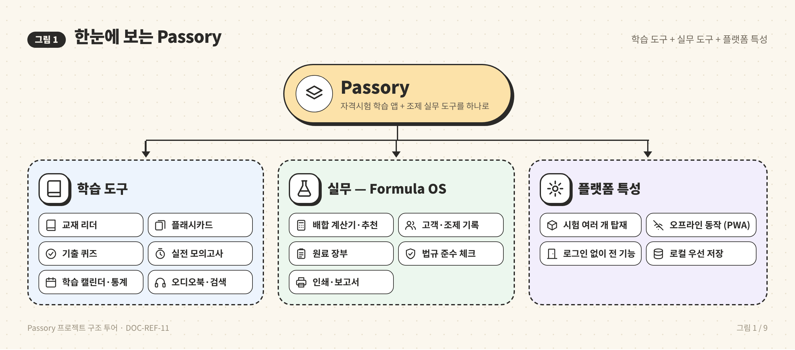
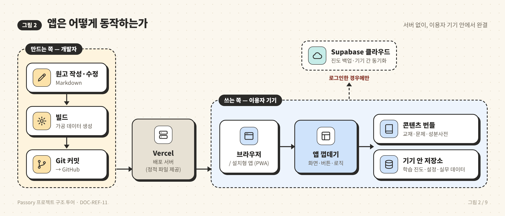
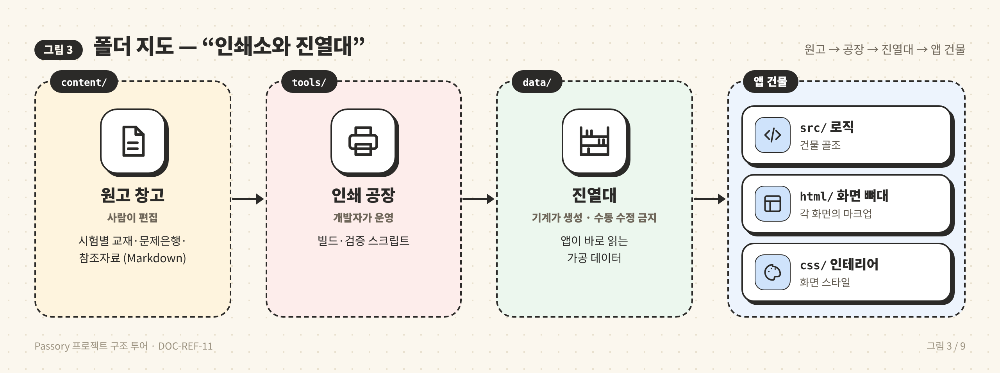
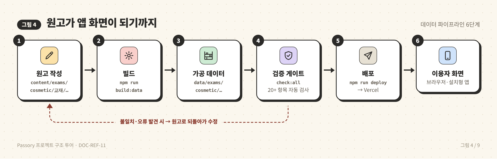
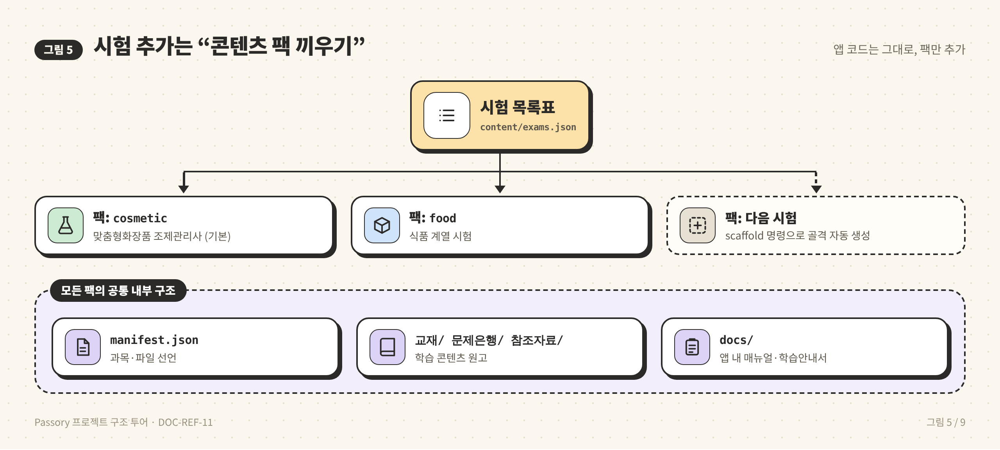
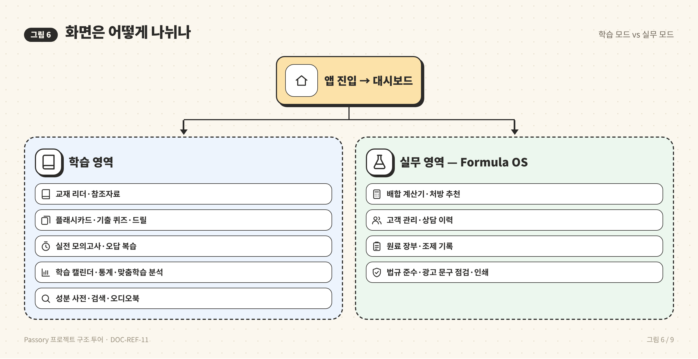
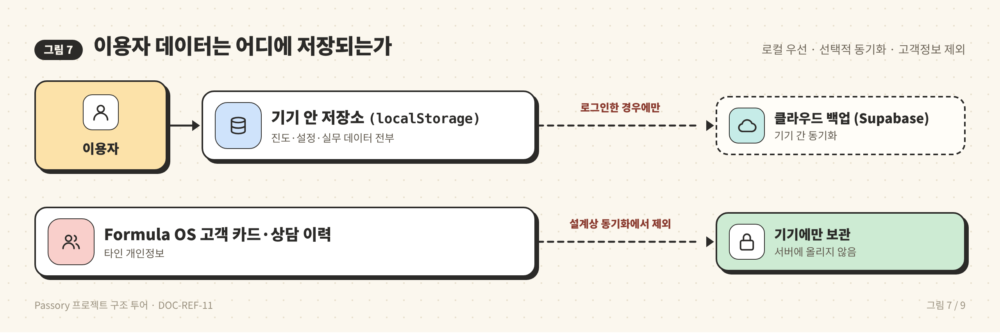
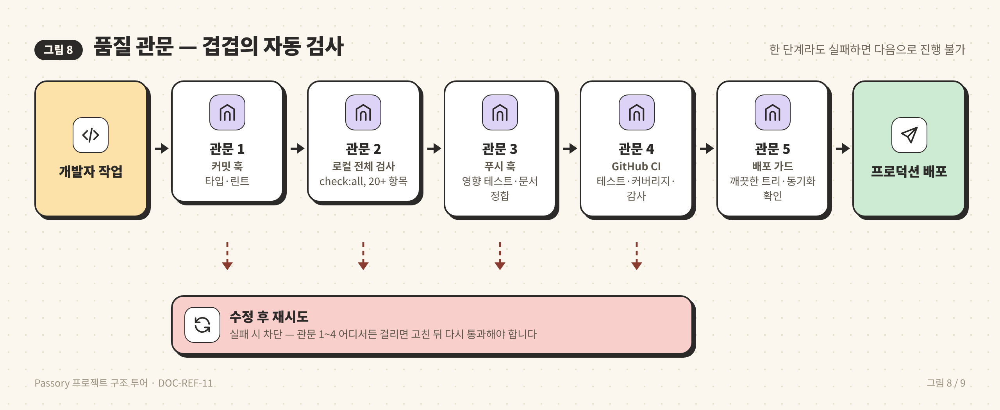
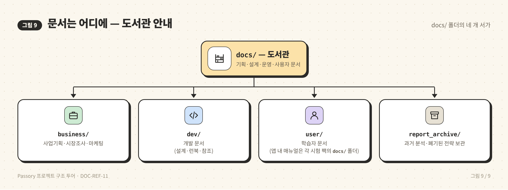

# 🗺️ 프로젝트 구조 투어 — 비개발자를 위한 Passory 안내

> **대상 프로젝트**: Passory — 멀티시험 자격시험 학습 플랫폼 (기본 팩: 맞춤형화장품 조제관리사, 앱명 Passmula + Formula OS)
> **목적**: 코드를 읽지 않는 기획자·사업 담당·신규 합류자가 저장소 구조와 데이터 흐름을 그림만으로 파악하는 입문 자료
> **대상 독자**: 비개발자·기획자·PM (개발자용 설계 상세는 [ARCHITECTURE.md](../ARCHITECTURE.md) 참조)
> **최종 업데이트**: 2026-10-06
> **문서 ID**: DOC-REF-11
> **관련 SPEC ID**: 해당 없음 (온보딩·구조 개요 자료)

---

## 📋 목차

1. [한눈에 보는 Passory](#1-한눈에-보는-passory)
2. [앱은 어떻게 동작하는가 — 서버 없이 완결](#2-앱은-어떻게-동작하는가--서버-없이-완결)
3. [폴더 지도 — "인쇄소와 진열대" 비유](#3-폴더-지도--인쇄소와-진열대-비유)
4. [원고가 앱 화면이 되기까지 — 데이터 파이프라인](#4-원고가-앱-화면이-되기까지--데이터-파이프라인)
5. [시험 추가는 "콘텐츠 팩 끼우기"](#5-시험-추가는-콘텐츠-팩-끼우기)
6. [화면은 어떻게 나뉘나 — 학습 모드 vs 실무 모드](#6-화면은-어떻게-나뉘나--학습-모드-vs-실무-모드)
7. [이용자 데이터는 어디에 저장되는가](#7-이용자-데이터는-어디에-저장되는가)
8. [품질 관문 — 4중 검사 체계](#8-품질-관문--4중-검사-체계)
9. [문서는 어디에 — 도서관 안내](#9-문서는-어디에--도서관-안내)
10. [용어 풀이](#10-용어-풀이)

---

## 1. 한눈에 보는 Passory

Passory는 **자격시험 학습 앱 + 조제 실무 도구**를 하나로 합친 웹앱입니다. 별도 설치 없이 브라우저에서 바로 동작하며, 원하면 홈 화면에 설치(PWA)할 수도 있습니다. 시험 한 종류가 "콘텐츠 팩" 단위로 탑재되어, 현재는 맞춤형화장품 조제관리사(`cosmetic`)가 기본이고 식품 계열 시험(`food`) 팩도 준비되어 있습니다.

---

## 2. 앱은 어떻게 동작하는가 — 서버 없이 완결

이 프로젝트의 가장 큰 특징은 **서버가 없어도 모든 기능이 동작**한다는 점입니다. 앱 전체가 정적 파일(화면·코드·데이터)로 이루어져 있고, 이용자 기기 안에서 완결됩니다. 클라우드(Supabase)는 로그인한 이용자의 진도 백업·동기화를 위한 **선택적 부가 레이어**일 뿐입니다.

- **오프라인 동작**: 한 번 불러오면 Service Worker가 파일을 기기에 캐시해 지하철 등 무인터넷 환경에서도 학습 가능
- **계정 불필요**: 진도·설정·실무 데이터 모두 기기 안 저장소(localStorage)가 1차 보관소
- **서버 비용 0**: Vercel 정적 호스팅만 사용 — 앱이 직접 데이터베이스를 두지 않는 구조

---

## 3. 폴더 지도 — "인쇄소와 진열대" 비유

저장소를 **인쇄소**에 비유하면 가장 이해하기 쉽습니다. 사람이 쓴 원고(`content/`)가 공장(`tools/`)을 거쳐 진열대(`data/`)에 올라가고, 그 진열대를 앱 건물(`src/`·`html/`·`css/`)이 이용자에게 보여주는 구조입니다.

| 폴더/파일 | 비유 | 역할 | 주로 건드리는 사람 |
|-----------|------|------|-------------------|
| `content/` | 원고 창고 | 교재·문제은행·참조자료·매뉴얼 원본 (Markdown) | 콘텐츠 편집자 |
| `data/` | 진열대 | 빌드로 생성되는 앱용 데이터 — **직접 수정 금지** | (자동 생성) |
| `tools/` | 인쇄 공장 | 원고→데이터 변환, 각종 검증 스크립트 | 개발자 |
| `src/` | 건물 골조 | 앱 동작 로직 (JavaScript 모듈) | 개발자 |
| `html/` | 화면 뼈대 | 각 화면의 마크업 조각 | 개발자 |
| `css/` | 인테리어 | 화면 스타일 | 개발자·디자이너 |
| `tests/` | 품질검사팀 | 자동 테스트 (유닛·화면·실브라우저) | 개발자 |
| `docs/` | 도서관 | 기획·설계·운영·사용자 문서 | 모두 |
| `ref-pipeline/` | 별도 작업실 | PDF→텍스트 변환, 오디오북 제작, 법령·고시 감시 | 개발자 |
| `vendor/` | 부속 창고 | 폰트·아이콘 등 자체 보관 자산 | — |
| `index.html` | 출입문 | 이용자가 처음 만나는 앱 진입 화면 | (자동 조립) |
| `sw.js` | 오프라인 관리인 | 파일 캐시·오프라인 동작 담당 | 개발자 |
| `feature-plan.json` | 가격표 | 기능별 무료/Pro 구분 설정 | 기획자·개발자 |

---

## 4. 원고가 앱 화면이 되기까지 — 데이터 파이프라인

원고(Markdown)와 앱용 데이터가 **두 벌로 나뉘어 있는 이유**: 원고는 사람이 자유롭게 고치는 "단 하나의 원본(SSOT)"이고, 앱 데이터는 기계가 원고로부터 다시 만드는 "가공품"입니다. 두 벌이 어긋나면 검증 게이트가 배포를 차단합니다.

- **인용 추적**: 문제은행의 각 문항은 교재 원고의 라인 번호(`#L####`)로 근거를 인용 — 원고가 바뀌면 인용 정합도 자동 검사
- **신선도 검사**: `data/`가 최신 원고로 만들어졌는지 해시로 비교 — 빌드 누락을 기계가 감지
- 기획 관점 요약: **"원고만 고치면, 나머지는 명령어와 게이트가 처리"**하는 구조입니다.

---

## 5. 시험 추가는 "콘텐츠 팩 끼우기"

시험을 새로 추가할 때 **앱 코드를 고치지 않습니다**. `content/exams.json`(시험 목록표)에 항목을 등록하고, 모든 시험이 동일한 내부 구조를 갖는 콘텐츠 팩을 끼우면 됩니다. 시험별 진도도 자동으로 격리됩니다.

- **시험별 브랜딩**: 팩마다 앱명·로고·아이콘을 별도 지정 가능 (기본 팩 = Passmula + Formula OS)
- **기능 스위치**: 팩마다 `features` 플래그로 오디오북·사전·실무 도구 등 보여줄 기능을 선언 — 미선언 기능은 자동 숨김
- **시험 전용 코드**: 특정 시험에만 필요한 화면·스타일은 `src/exams/<id>/` 등 시험 폴더에 격리 — 다른 시험에는 영향 없음

---

## 6. 화면은 어떻게 나뉘나 — 학습 모드 vs 실무 모드

앱 화면은 크게 **학습**(수험 대비)과 **실무**(Formula OS 조제 업무) 두 영역으로 나뉘며, 설정의 "UI 모드"로 학습 도구를 접어 실무 중심 화면으로 전환할 수 있습니다.

- 실무 영역은 사업 유형(맞춤형·제조업·책임판매업)에 따라 보이는 패널이 달라집니다.
- 무료/Pro 구분은 `feature-plan.json` 한 파일에서 관리 — 화면마다 흩어져 있지 않습니다.

---

## 7. 이용자 데이터는 어디에 저장되는가

- **로컬 우선**: 계정 없이 모든 기능 사용 가능 — 개인정보 수집 최소화
- **선택적 동기화**: 로그인하면 진도 스냅샷을 클라우드에 보관해 다른 기기에서 이어서 사용
- **프라이버시 설계**: 조제관리사가 기록하는 **고객 개인정보는 구조적으로 동기화 대상에서 제외** — 앱이 서버에 올리지 않습니다.

---

## 8. 품질 관문 — 4중 검사 체계

변경이 프로덕션(실서비스)에 도달하기까지 자동 검사 관문이 여러 겹 있습니다. 어느 한 단계라도 실패하면 다음으로 진행되지 않습니다.

- 검사 항목 예: 코드 스타일, 타입 오류, 테스트 전체, 문서↔코드 정합, 콘텐츠 인용 정합, 생성물 신선도, 시크릿 유출 스캔, 성능 예산
- 기획 관점 요약: **"사람이 빠뜨린 실수를 기계가 단계별로 걸러내는"** 구조로, 문서와 코드가 어긋나는 것도 자동 탐지합니다.

---

## 9. 문서는 어디에 — 도서관 안내

| 나는 누구인가 | 먼저 볼 문서 |
|---------------|--------------|
| 기획자·사업 담당 | `docs/business/` 사업기획서 → 본 문서 → `docs/dev/design/` |
| 신규 개발자 | `README.md` → `AGENTS.md` → `docs/dev/ARCHITECTURE.md` |
| 콘텐츠 편집자 | `docs/dev/runbooks/CONTENT_WORKFLOW.md` |
| 앱 이용자 | 앱 내 "매뉴얼·학습안내서" 메뉴 (`docs/user/` 참조) |
| AI 코딩 에이전트 | `AGENTS.md` |

전체 문서 목록과 목적별 읽기 순서는 인덱스 [`docs/README.md`](../../README.md)가 안내합니다.

---

## 10. 용어 풀이

| 용어 | 쉬운 설명 |
|------|-----------|
| PWA | 웹사이트를 스마트폰 앱처럼 홈 화면에 설치·오프라인 사용하게 하는 기술 |
| Service Worker (`sw.js`) | 앱 파일을 기기에 저장해 두고 오프라인에서도 열리게 하는 "관리인" 프로그램 |
| localStorage | 브라우저 안의 작은 저장 공간 — 여기선 학습 진도·설정의 1차 보관소 |
| Markdown (`.md`) | 문서 원고의 작성 형식 — 워드 대신 글자 기호로 꾸미는 가벼운 문서 포맷 |
| 빌드 (`build:data`) | 원고(Markdown)를 앱이 빠르게 읽는 데이터로 변환하는 가공 과정 |
| 번들 | 가공된 데이터 파일 묶음 — `data/` 폴더에 생성 |
| ES 모듈 | 코드를 파일 단위로 나눠 조립하는 방식 (프레임워크 없이 브라우저 표준 사용) |
| CI (지속적 검증) | GitHub에서 코드가 올라올 때마다 테스트·검사를 자동 실행하는 시스템 |
| 스캐폴딩 | 새 시험·새 기능의 기본 골격을 명령어 한 번으로 자동 생성하는 것 |
| SSOT | "단 하나의 원본" — 원고는 `content/`에만 두고 나머지는 거기서 생성하는 원칙 |
| Supabase | 선택적 클라우드 백업·로그인 서비스 — 미설정이어도 앱은 정상 동작 |
| SPEC ID / 문서 ID | 요구사항·문서에 붙이는 고유 번호 — "이 코드가 어느 요구사항인가"를 기계가 추적 |

---

> 더 깊은 설계 의도·모듈 상세·요구사항 추적은 개발자용 문서 [ARCHITECTURE.md](../ARCHITECTURE.md), 문서 인덱스 [docs/README.md](../../README.md)를 참조하세요.
