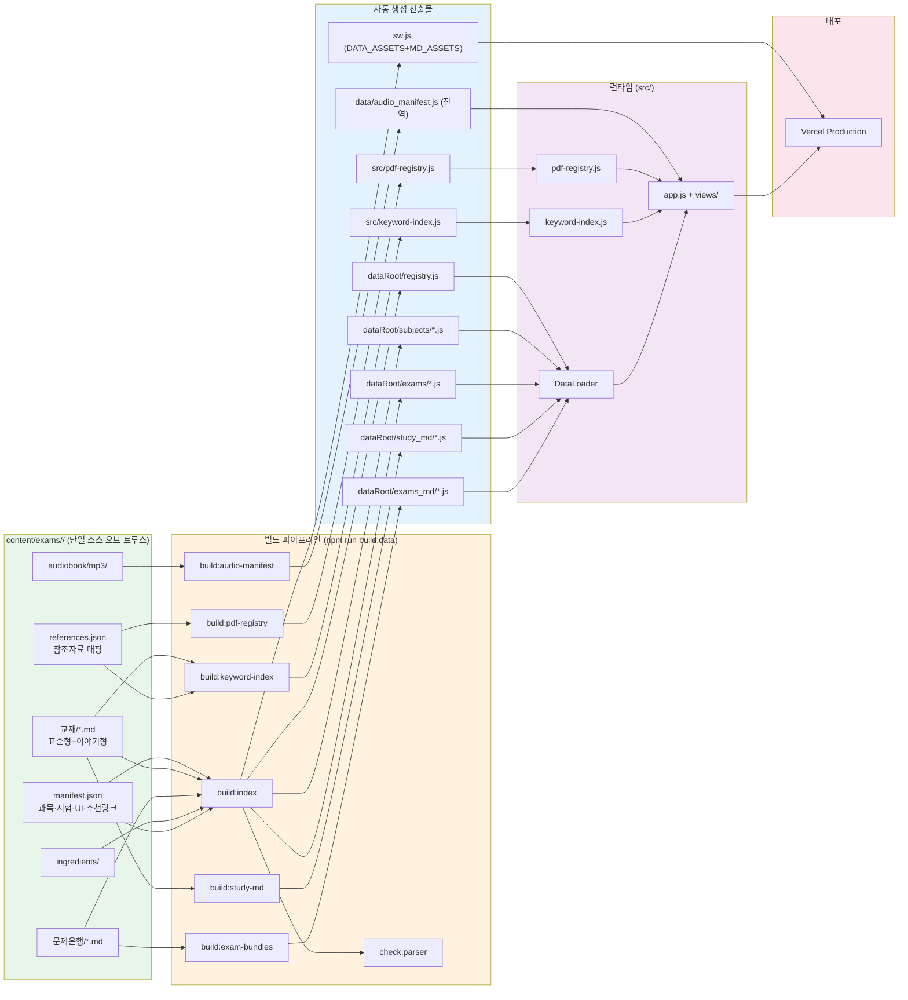
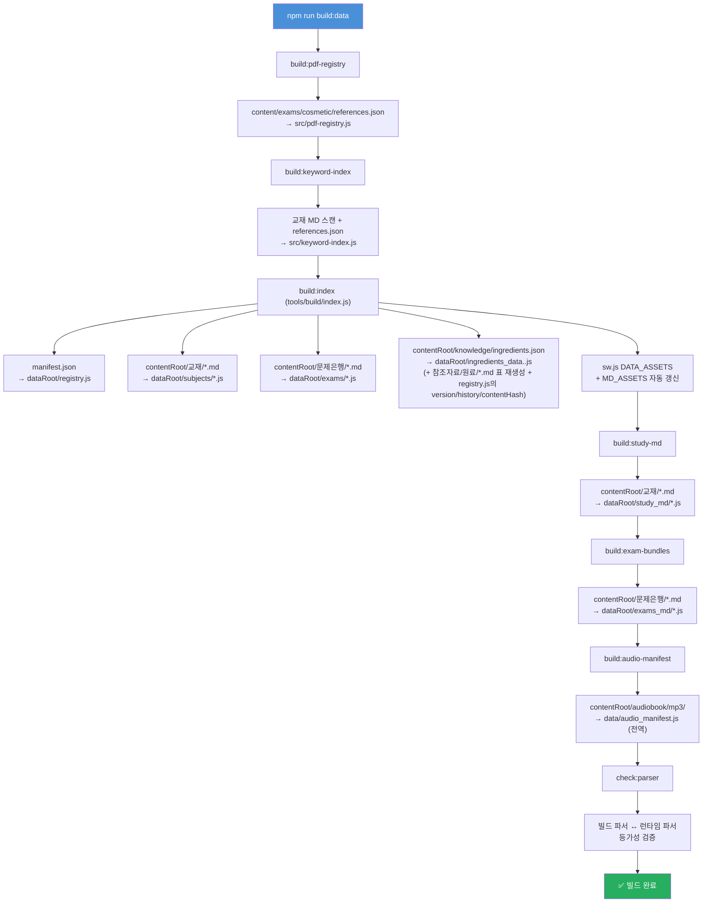
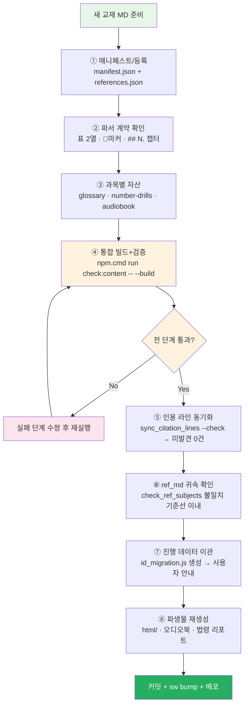
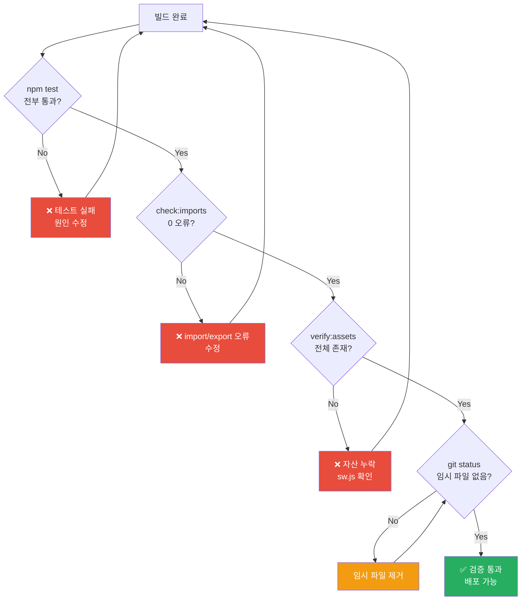

# Content 변경 작업 절차 가이드

> content/exams/<id>/ 폴더의 교재, 문제은행, 참조자료, 오디오북, 원료 데이터가 변경될 때 따라야 할 표준 작업 절차.
> **관련 SPEC ID**: `CS-01~10` (콘텐츠 구조) · `BP-01~08` (빌드 파이프라인) · `DA-01~09` (데이터 아키텍처)
> **문서 ID**: DOC-RBK-03
> **범위**: platform · 판본: none

## 개요

이 프로젝트는 `content/exams/<id>/` 폴더의 Markdown/JSON 파일이 **단일 소스 오브 트루스(SSOT)** 역할을 합니다. 소스 코드(`src/`)를 직접 수정하지 않고, content 파일과 매니페스트만 편집하면 빌드 파이프라인이 나머지를 자동 처리합니다.

> **멀티시험 대칭 구조 (2026-09-21~)**: 모든 시험이 `content/exams/<id>/`·`data/exams/<id>/` 루트를 갖습니다 — 기본 시험(cosmetic)도 `content/exams/cosmetic/`·`data/exams/cosmetic/`에 있으며 예외가 없습니다. 이 문서의 `content/`·`data/` 경로 표기는 **각 시험의 `contentRoot`/`dataRoot`를 의미**합니다 (예: `content/exams/cosmetic/manifest.json` = `content/exams/cosmetic/manifest.json`). `content/`·`data/` 루트 자체에는 전역 파일만 있습니다: `exams.json`/`exams.js`(시험 목록), `audio_manifest.js`(시험 id 키 분리), `docs_md/`(앱 공용 문서). `build:data`는 `content/exams.json`의 모든 시험을 순회 빌드하므로 절차는 동일합니다. 새 시험 추가는 `AGENTS.md`의 "멀티시험 구조" 섹션을 참조하세요.



---

## 1. 변경 유형별 수정 파일

| 변경 유형 | 수정할 파일 | 비고 |
|----------|------------|------|
| **교재 내용 수정** | `content/exams/cosmetic/교재/{과목}/*_표준형.md` | 표준형만 수정 — `_이야기형.md`는 `npm run build:story` 생성물 (서사는 `교재/{과목}/story/*_서사.md` 패치) |
| **문제은행 수정** | `content/exams/cosmetic/문제은행/과목N_문제은행.md` | 문제 추가/삭제/수정 |
| **과목 추가/삭제** | `content/exams/cosmetic/manifest.json` | `subjects` 배열 수정 |
| **시험 추가/삭제** | `content/exams/cosmetic/manifest.json` | `exams` 배열 수정 |
| **참조자료 추가/삭제** | `content/exams/cosmetic/references.json` | 참조자료 매핑 수정 |
| **오디오북 추가** | `content/exams/cosmetic/audiobook/mp3/{과목}/` | MP3 파일 배치 |
| **통합 모의고사 문제 수 변경** | `content/exams/cosmetic/manifest.json` | `integratedExam.questionsPerSubject` 수정 |
| **UI 텍스트 변경** | `content/exams/cosmetic/manifest.json` | `uiText` 객체 수정 |
| **추천 링크 변경** | `content/exams/cosmetic/manifest.json` | `resources` 객체 수정 |
| **원료 데이터 변경** | `content/exams/cosmetic/knowledge/ingredients.json` | 지식DB SSOT의 `items` 수정 + `meta` 버전 범프 (아래 §원료 DB 버전 절차) — 참조자료 `원료/*.md` 표는 빌드가 재생성 |

---

## 2. 표준 빌드 절차

### 2.1 전체 빌드 (권장)

content 변경 후 아래 한 줄로 전체 파이프라인 실행:

```powershell
npm.cmd run build:data
```

이 명령은 다음 파이프라인을 순차 실행합니다:



### 2.2 부분 빌드 (특정 과목만)

```powershell
npm.cmd run build:data:law           # 1과목만
npm.cmd run build:data:manufacturing # 2과목만
npm.cmd run build:data:safety        # 3과목만
npm.cmd run build:data:understanding # 4과목만
```

### 2.3 개별 스크립트 실행

```powershell
npm.cmd run build:pdf-registry       # 참조자료 레지스트리만
npm.cmd run build:keyword-index      # 키워드 인덱스만
npm.cmd run build:study-md           # 폴백 번들만
npm.cmd run build:exam-bundles       # 시험 폴백 번들만
npm.cmd run build:audio-manifest     # 오디오 매니페스트만
```

---

## 3. 변경 유형별 상세 절차

### 3.1 교재 내용 수정

1. `content/exams/cosmetic/교재/{과목}/{파일명}_표준형.md` 편집 — `_이야기형.md`는 **생성물**(직접 편집 금지, 첫 줄 배너 참조). 서사·전면 섹션은 `교재/{과목}/story/{base}_서사.md` 패치를 편집하고 `npm.cmd run build:story`로 재생성 (`build:data`에 포함). 패치 지시어 상세: `docs/dev/runbooks/STORY_PATCH_GUIDE.md` — 삽입은 표준형의 `<!-- story:slot:id -->` 마커(`@insert slot="id"`, 권장) 또는 `before/after="앵커 줄"`·`at="start/end"` · `story` 플래그로 서사 마커 자동 · `@suffix`/`@replace line="…"` · 중복 앵커 `n="k"`. 신규 과목: `build:story -- --scaffold <subjectKey>`로 패치 골격 생성 후 manifest `storyFile` 선언 (`check:manifest`가 선언↔패치 불일치 경고). 표준형 편집으로 패치 앵커가 깨지면 build가 에러로 보고 — 앵커·슬롯을 갱신
2. `npm.cmd run build:data` 실행 (build:story 자동 포함 — 이야기형 재생성 후 인용 동기화 필요 시 `sync:citations`)
3. **인용 라인 동기화** (교재 라인 변경 시):
   ```powershell
   node tools/sync/sync_citation_lines.js --check   # 변경사항 확인만
   node tools/sync/sync_citation_lines.js            # 실제 동기화 실행
   ```
   - 문제은행의 인용 링크(`[label: L####](<path#L####>)`) 라인 번호를 교재 변경에 맞춰 자동 갱신
   - 인용문(`>` 블록) 지문으로 인용 라인 ±3 검증 → 불일치 시 타겟 파일에서 재탐색(정확 포함 → 쉥글 → 키프레이즈)
   - 범위초과 링크도 인용문 지문으로 재탐색 (skip하지 않음)
   - 키프레이즈만 일치하는 낮은 신뢰도 매칭은 자동 갱신하지 않음
   - 미발견 항목은 수동 확인 필요 (exit code 1)
4. `npm.cmd test` 통과 확인
5. 커밋 + 배포

### 3.1-1 과목 교재 전체 교체 체크리스트

> **시간 순서 런북**: `docs/dev/runbooks/TEXTBOOK_REPLACEMENT_RUNBOOK.md` — 이 체크리스트와 ref-pipeline 파생물 단계를 실행 순서로 통합한 단일 페이지 절차.

과목의 교재를 통째로 다른 문서로 교체할 때는 단순 수정보다 의존성이 넓습니다.
아래 8개 계층을 순서대로 확인하세요.



**1. 매니페스트/등록**
- [ ] `content/exams/cosmetic/manifest.json` — `subjects[].dir`·`file`/`storyFile` 경로가 새 교재를 가리키는지, `exams[].subject`·`integratedExam.questionsPerSubject` 키 정합
- [ ] `content/exams/cosmetic/references.json` — `subjectDirMap`·`refDirs`·`referenceFiles` 과목 귀속

**2. 콘텐츠 파서 계약 (새 교재가 지켜야 할 형식)**
- [ ] 카드 추출용 표 `| 용어 | 설명 |` 2열 구조, `- **용어**: 설명` 리스트
- [ ] 퀴즈 마커 `🔖기출`/`📌중요`/`★필수` + `**볼드**` 또는 숫자+단위(`0.5%`, `6개월` 등) 빈칸 대상 — 헤더·라벨 라인의 마커는 퀴즈 미생성(상세: TEXTBOOK_AUTHORING_GUIDE §3.5)
- [ ] 챕터 헤딩 `## 📚 Chapter NN.` 또는 `## N.` (question_chapters 경계)
- [ ] 참조 링크 `../참조자료/ref_md/과목N/...` 형식 (상세: `docs/dev/runbooks/TEXTBOOK_AUTHORING_GUIDE.md`)

**3. 과목별 자산 (번호·키 기준 하드코딩 지점)**
- [ ] `content/exams/cosmetic/교재/glossary/subject{N}.json` — 큐레이션 용어집 (과목 order 번호 기준)
- [ ] `content/exams/cosmetic/number-drills/{과목키}.json`
- [ ] `content/exams/cosmetic/audiobook/mp3/{과목키}/` — 교재 교체 시 TTS 재생성(`ref-pipeline/audiobook/generate_all_mp3.py`)
- [ ] `tools/check/check_ref_subjects.js`는 manifest의 `dir`↔`order`에서 과목 매핑을 자동 파생 — 별도 상수 없음

**4. 빌드 재생성**

```powershell
npm.cmd run check:content -- --build   # build:data + 전 계층 검증을 한 번에 실행
```

`--build` 없이 실행하면 검증만 수행합니다. 단계별 실패는 리포트에 모아 출력됩니다.

**5. 인용 라인번호 (가장 깨지기 쉬운 지점)**
- [ ] 문제은행의 `(<교재파일.md#L1234>)` 인용은 라인 번호에 하드 의존 — 교재 교체로 라인이 밀리면 인용 전수 재검증
- [ ] `node tools/sync/sync_citation_lines.js --check` 결과 미발견 0건 확인
- [ ] `tools/config/citation_fingerprints.json` 지문 재생성 필요 시 `--fingerprint`

**6. 참조자료(ref_md) 귀속**
- [ ] `node tools/check/check_ref_subjects.js` — 불일치 건수가 교체 전 기준선보다 늘었는지 확인
- [ ] `node tools/check/check_reflayout.js` — 폴더/레지스트리 정합성
- [ ] 문서→과목 귀속 규칙은 `content/exams/cosmetic/references.json`의 `docSubjectRules`가 진실 (폴더 이동보다 규칙이 우선인 평탄 잔존 문서용)

**7. 사용자 진행 데이터 (localStorage)**
- [ ] 카드/퀴즈 ID는 `stableId(subjectKey, chapterKey, type, term)` — 교재가 바뀌면 term 해시가 달라집니다
- [ ] `npm.cmd run build:id-migration`이 이전 스냅샷(`{dataRoot}/card_terms_snapshot.json`)과 비교해 term이 유일하게 일치하는 구ID→신ID 이관 맵(`{dataRoot}/id_migration.js`)을 생성합니다 — 같은 용어가 남아 있으면 진도가 자동 이관됩니다
- [ ] 스냅샷 파일은 커밋 대상입니다 — 배포된 직전 빌드의 ID 집합을 보존해야 이관이 동작합니다
- [ ] term이 바뀌거나 삭제된 카드의 진도는 이관 불가 → `cleanOrphansForSubject`가 정리(삭제). 과목 통째 교체 시 잔량을 사용자에게 안내하세요

**8. 파생물 재생성 (`ref-pipeline/` — 상세 절차: `ref-pipeline/README.md`)**
- [ ] `python ref-pipeline/batch_convert.py` — 교재·안내서·문제은행 → `{EXAM}/html/` 공유용 HTML 재생성 (manifest `subjects[].dir` 기준 glob이라 과목 추가 시에도 자동 대상화)
- [ ] 오디오북 재생성(사용 시): `python ref-pipeline/audiobook/run_pipeline.py --subject {과목키} --tts` → `audiobook/mp3/` 갱신 후 §3.4 절차 (재생성 없이 MP3만 교체한 경우도 §3.4)
- [ ] `python ref-pipeline/check_laws.py` — 인용 법령 현행성 재확인 → `{EXAM}/report/` (`LAW_OC` 키 필요, `업데이트 필요` 판정 시 §3.3-1로 연계)

### 3.2 과목 추가

1. `content/exams/cosmetic/교재/{새과목키}/` 디렉토리 생성, MD 파일 배치
2. `content/exams/cosmetic/manifest.json`의 `subjects` 배열에 항목 추가:
   ```json
   {
     "key": "newsubject",
     "order": 5,
     "name": "새 과목명",
     "shortName": "약칭",
     "dir": "교재/newsubject",
     "chapters": [
       { "key": "full", "title": "...", "file": "5과목_..._표준형.md", "storyFile": "5과목_..._이야기형.md" }
     ]
   }
   ```
3. `content/exams/cosmetic/references.json`의 `subjectDirMap`에 매핑 추가:
   ```json
   "newsubject": "과목5"
   ```
4. `content/exams/cosmetic/references.json`의 `referenceFiles`에 과목별 참조자료 추가
5. `content/exams/cosmetic/references.json`의 `refDirs`에 `과목5` 배열 추가
6. `content/exams/cosmetic/문제은행/과목5_문제은행.md` 생성 후 `manifest.json`의 `exams`에 추가
7. `npm.cmd run build:data` 실행
8. 검증 + 커밋 + 배포

### 3.3 참조자료 추가

1. `content/exams/cosmetic/참조자료/ref_md/과목N/{파일명}/{파일명}.md` 배치 (PDF→MD 변환본 — 과목 폴더가 문항 생성 귀속의 진실)
2. `content/exams/cosmetic/references.json` 수정:
   - `refDirs.{해당폴더}` 배열에 파일명 추가
   - `referenceFiles.{과목}` 또는 `referenceCommon`에 항목 추가
   - 출처 매칭이 필요하면 `sourceRefMap`에 정규식 매핑 추가
   - 본문 자동 링크가 필요하면 `keywordRefMap`에 패턴 추가
3. `npm.cmd run build:data` 실행
4. 검증 + 커밋 + 배포

### 3.3-1 PDF → MD 재변환 절차 (ref_md 갱신)

> 변환 도구 전체 사용법·시나리오: **`ref-pipeline/README.md`** (PDF→MD, MD→HTML, 오디오북 TTS, 법령 검증 — `EXAM_CONTENT_ROOT` 공통 계약)

참조자료 PDF를 추가·교체하거나 변환 규칙을 수정했을 때의 표준 절차:

```powershell
# 1) 스테이징 변환 (ref_md_v2에 출력, ref_md는 건드리지 않음)
npm.cmd run convert:refs                       # 전체 (= python ref-pipeline/convert.py)
python ref-pipeline/convert.py 화장품법          # 파일명 부분 일치만

# 2) 골든 비교 — 현행 ref_md 대비 내용 누락 감사 (누락 있으면 종료코드 1)
npm.cmd run verify:refs                        # (= python ref-pipeline/convert.py --verify)
```

- `--verify`는 현행 문서의 비잡행 라인(워터마크·쪽번호 제외)이 신규 문서에
  존재하는지 **멀티셋(등장 횟수) 기준**으로 검사한다. 줄 병합·분할은
  정규화 부분문자열 매칭으로 흡수한다.
- 변환 단계에서 개별 PDF 실패는 `_report.json`에 기록되며 **종료코드 1**로
  종료한다 — 성공한 문서는 정상 산출되므로 실패분만 재변환하면 된다.
- **ref_md는 의도적으로 시각적 줄 그대로 변환한다**(`segment=False`,
  `ref-pipeline/convert.py` 주석). `#L####` 인용이 라인 번호에
  의존하므로 고정폭 wrap의 문장 중간 절단("…말\n한다.")이 그대로 남는다.
  표시 단에서는 `parseMarkdown`의 `joinWraps` 옵션이 연속줄을 병합한다
  (`exam-viewer`/`html-viewer`가 ref_md 경로에서 자동 적용). 연속줄은
  `<span data-md-line>`으로 감싸 인용이 원줄 위치에 도착하고, H1 제목과
  동일한 반복 단독줄(러닝헤더)은 투명하게 스킵해 페이지 경계 문장도
  병합한다. 병합 품질은 `npm.cmd run check:refmerge`로 감사한다.
- **한계**: 첨자/수식 조각(`t`+`0`, `6 6 2`)은 추출 단계 아티팩트로
  렌더 복원 불가. pdfplumber의 x0 들여쓰기(연속줄 +10~13pt, 러닝헤더
  x0≈480)로 연속줄을 확정 판별하는 방식도 가능하나 소스 재생성+인용
  재동기화 비용 대비 실익이 적어 보류 — 필요 시 `ref-pipeline/pdf2md.py`에
  마커 삽입으로 구현.
- 누락 0이면 `ref_md_v2/{doc}/{doc}.md`와 `images/`를 `ref_md/과목N/`의
  동명 디렉터리에 복사해 승격한다(`index.html` 보존). 문서 과목은
  `tools/build/ref_statements.js`의 `DOC_SUBJECT_RULES`로 확인.
- 승격 후 라인 번호가 밀리므로 반드시 `npm.cmd run sync:citations` →
  `node tools/sync/sync_citation_lines.js --check`(미발견 0 확인) →
  `npm.cmd run build:data` → `node tools/build/build_combo_drills.js` 순서로
  후속 재생성을 실행한다.

### 3.4 오디오북 추가

1. `content/exams/cosmetic/audiobook/mp3/{과목키}/` 디렉토리에 MP3 파일 배치
2. `npm.cmd run build:audio-manifest` 실행 (또는 `npm.cmd run build:data`)
3. 검증 + 커밋 + 배포

**MP3 재생성이 필요한 경우** — 생성 스크립트는 `ref-pipeline/audiobook/`에 있다 (교재 MD → 청취 원고 → TTS → MP3):

```powershell
python ref-pipeline/audiobook/run_pipeline.py --list                            # 대상 챕터 확인
python ref-pipeline/audiobook/run_pipeline.py --subject {과목키} --polish-only  # 원고 정제까지만 (API 키 불필요)
python ref-pipeline/audiobook/run_pipeline.py --subject {과목키} --tts          # TTS + MP3 병합 (ELEVENLABS_API_KEY 필요)
# 무료/로컬 대안: generate_all_mp3.py (gTTS/pyttsx3 — audiobook/requirements.txt)
```

- 산출물은 콘텐츠 측 `{EXAM}/audiobook/{scripts,chunks,mp3}/`에 기록 — 재생성 후 위 2번(build:audio-manifest)부터 진행
- 0바이트 잔여 MP3 정리: `python ref-pipeline/audiobook/cleanup_empty_mp3.py`
- 청킹·원고 정제 규칙·엔진 선택 상세: `ref-pipeline/audiobook/README.md`

> **주의**: MP3 파일은 Vercel 배포 시 용량 초과(302MB)로 인해 함께 배포할 수 없음.
> `data/audio_manifest.js`의 `AUDIO_BASE_URL`을 외부 CDN으로 설정 필요.

### 3.5 통합 모의고사 문제 수 변경

1. `content/exams/cosmetic/manifest.json`의 `integratedExam.questionsPerSubject` 수정:
   ```json
   "integratedExam": {
     "questionsPerSubject": {
       "law": 10,
       "manufacturing": 25,
       "safety": 25,
       "understanding": 40
     }
   }
   ```
2. `npm.cmd run build:data` 실행
3. 검증 + 커밋 + 배포

### 3.6 원료 데이터 변경 + DB 버전 절차

원료 데이터 SSOT: `content/exams/cosmetic/knowledge/ingredients.json` — `{ "meta": {version·updatedAt·notice·history}, "bundleFields": [...7필드], "emitMd": {...}, "items": [...] }`

| 파일 | 용도 |
|------|------|
| `knowledge/ingredients.json` | 원료 데이터 SSOT — `items` 행(11컬럼 필드) + `meta`(버전·이력). 사전·Formula OS·CSV·참조 표 모두 여기서 생성 |
| `참조자료/원료/approved_ingredients.md` | 배합가능원료(별표2) + 마스터 스키마·공통 안내 헤더. `<!-- GENERATED-TABLE -->` 마커 안의 표는 빌드가 JSON에서 재생성 — **마커 밖 서술만 직접 편집** |
| `참조자료/원료/restricted_ingredients.md` | 사용제한 원료 (한도·조건) — 동일하게 표는 생성물 |
| `참조자료/원료/banned_ingredients.md` | 사용금지 원료 (별표1) — 동일하게 표는 생성물 |
| `참조자료/원료/colorants_ingredients.md` | 색소 DB — 별도 고시(「화장품의 색소 종류와 기준 및 시험방법」) 소관, **사전·규정검증 파싱 대상 아님** (참조 문서, 마커 없음 — 전체 수기 편집) |

**아이템 필드 ↔ 표 컬럼:** `name | engName | category | base | description | typicalRange | limit | effect | frequency | tip | note` (11컬럼). `emitMd.columns` 매핑으로 생성. 아이템의 `table`은 정본 표(어느 파일의 어느 섹션인지), `tables`는 중복 게재 표 목록 `"파일#표"` — 같은 원료가 여러 표에 나올 때 표시값은 정본값으로 통일된다.

**절차:**

1. `knowledge/ingredients.json`의 `items` 행 정정 (신규 원료는 `table`에 표 이름 지정 — 파일은 `emitMd.typeFile`의 type 키로 결정)
2. 같은 파일의 `meta` 갱신 — 현재 버전 객체를 `history` 배열 **앞쪽**에 넣고, `version`/`updatedAt`/`notice`를 새 값으로:
   ```json
   {
     "version": "2026.10.1",
     "updatedAt": "2026-10-15",
     "notice": "새 개정 내역",
     "history": [
       { "version": "2026.09.1", "updatedAt": "2026-09-21", "notice": "이전 개정 내역" }
     ]
   }
   ```
   버전 규칙: `연도.월.차수` (예: `2026.09.1` = 2026년 9월 첫 개정분)
3. `npm.cmd run build:data` → `registry.js`의 `ingredients`에 `version`·`history`·`contentHash`·`stats.count`가 병합되고 `참조자료/원료/*.md` 표가 재생성됨 (인용 라인이 밀리면 `sync:citations`가 자동 반영)
4. 검증 + 커밋 + 배포

**동작**: `contentHash`가 `bundleFields` 투영 데이터의 해시라, 배포 후 접속한 기존 사용자에게 `원료 DB 갱신` 모달이 1회 표시되고(이전 개정 최근 3건 포함), 성분 사전 버전 배지 탭으로 전체 이력을 조회할 수 있다. 표시 전용 컬럼(`base`·`typicalRange`·`effect`·`frequency`·`note`)·MD 서술 변경은 번들에 미포함이라 contentHash가 그대로다.

---

## 4. 검증 체크리스트

> **통합 명령**: `npm.cmd run check:content`은 아래 전 항목(+귀속·레이아웃·PDF 신선도·참조라인·드릴신선도·드릴·카드 감사)을 한 번에 실행합니다.

빌드 후 반드시 확인:

```powershell
# 1. 유닛 테스트
npm.cmd test

# 2. import/export 검증
npm.cmd run check:imports

# 3. 셸 자산 존재 확인
npm.cmd run verify:assets

# 4. 파서 등가성 (build:data에 포함되지만 단독 실행 시)
npm.cmd run check:parser

# 5. 임시 파일 제거 확인
git status
```



---

## 5. 배포 절차

### 5.1 Service Worker 버전 bump

애플리케이션 코드/콘텐츠 변경 시 `sw.js`의 `CACHE_VERSION`을 bump:

```powershell
npm.cmd run stamp:sw   # 커밋 해시로 자동 스탬프
```

또는 수동 편집:
```js
const CACHE_VERSION = 'v{번호}-{날짜}-{설명}';
```

### 5.2 Vercel 배포

```powershell
git add -A
git commit -m "content: 변경 내용 요약"
git push origin main
npx.cmd vercel --prod --yes --scope skygold
```

### 5.3 배포 확인

- https://passory.vercel.app 접속
- HTTP 200 확인
- 변경된 콘텐츠 정상 표시 확인


---

## 6. 주의사항

### 6.1 직접 수정 금지 파일 (빌드 자동 생성)

아래 파일들은 빌드 시 자동 생성되므로 **직접 수정 금지**:

| 파일 | 생성 스크립트 | 소스 |
|------|-------------|------|
| `src/pdf-registry.js` | `tools/build/build_pdf_registry.js` | `{contentRoot}/references.json` |
| `src/keyword-index.js` | `tools/build/build_keyword_index.js` | `{contentRoot}/교재/*.md` + `{contentRoot}/references.json` |
| `data/exams.js` | `tools/build/build_exams_list.js` | `content/exams.json` (전역 시험 목록) |
| `data/audio_manifest.js` | `tools/build/build_audio_manifest.js` | `{contentRoot}/audiobook/mp3/` (전 시험 순회, 시험 id 키 분리) |
| `{dataRoot}/registry.js` | `tools/build/index.js` | `{contentRoot}/manifest.json` |
| `{dataRoot}/subjects/*.js` | `tools/build/index.js` | `{contentRoot}/교재/*.md` |
| `{dataRoot}/exams/*.js` | `tools/build/index.js` | `{contentRoot}/문제은행/*.md` |
| `{dataRoot}/study_md/*.js` | `tools/build/build_study_md_bundle.js` | `{contentRoot}/교재/*.md` |
| `{dataRoot}/exams_md/*.js` | `tools/build/build_exam_bundles.js` | `{contentRoot}/문제은행/*.md` (manifest `exams` 등록분만) |
| `{dataRoot}/docs_md/*.js` | `tools/build/build_doc_bundles.js` | `{contentRoot}/docs/*.md` (디렉터리 스캔 — 앱 공용 슬롯은 현재 비어 있음) |
| `{dataRoot}/drills/ox_subject*.js` | `tools/build/build_ox_drills.js` | `{dataRoot}/exams/*.js` (객관식) |
| `{dataRoot}/drills/combo_subject*.js` | `tools/build/build_combo_drills.js` | `{dataRoot}/exams/*.js` (객관식+단답형) — 복수정답형 문제집 문서는 `src/combo-doc.js`가 런타임 직렬화 |
| `{dataRoot}/id_migration.js` + `{dataRoot}/card_terms_snapshot.json` | `tools/build/build_id_migration.js` | 이전 스냅샷 ↔ 현재 파싱 비교 |
| `sw.js` (DATA_ASSETS, MD_ASSETS) | `tools/build/index.js` | `{contentRoot}/manifest.json` |

**앱 외 파생물** (`ref-pipeline/` 도구가 생성 — 앱 런타임과 무관, `{EXAM_CONTENT_ROOT}` 측에 기록):

| 파일 | 생성 스크립트 | 소스 |
|------|-------------|------|
| `{contentRoot}/참조자료/ref_md_v2/` → `ref_md/과목N/` | `ref-pipeline/convert.py` (엔진 `pdf2md.py`) | `{contentRoot}/참조자료/{공통,과목N}/*.pdf` |
| `{contentRoot}/html/*.html` | `ref-pipeline/batch_convert.py` | `교재/*.md`·`학습안내서.md`·`문제은행/*.md`·`report/*.md` |
| `{contentRoot}/report/법령최신확인결과.md` | `ref-pipeline/check_laws.py` | 내장 법령 목록 + law.go.kr API (`LAW_OC`) |
| `{contentRoot}/audiobook/{scripts,chunks,mp3}/` | `ref-pipeline/audiobook/run_pipeline.py` | `{contentRoot}/교재/*.md` |

> ※ `{dataRoot}/drills/`는 `{dataRoot}/exams/`의 2차 파생물입니다 — 문제은행 변경 시 `build:data` 후 `npm run build:drills`로 재생성해야 최신 문항이 반영됩니다. 재생성 누락은 `npm run check:drillfresh`(check:content에 포함)가 감지합니다.

### 6.2 PowerShell 환경

- `npm` → `npm.cmd`, `npx` → `npx.cmd` 사용
- `&&` 연산자 사용 불가 → `;` 사용

### 6.3 Vercel 용량 제한

- MP3 파일(302MB)은 Vercel 배포 불가
- `data/audio_manifest.js`의 `AUDIO_BASE_URL`을 외부 CDN으로 설정
- GitHub Releases, Cloudflare R2, AWS S3 등 활용

---

## 7. 빠른 참조: 변경 시 수정 파일 매트릭스

```
교재 내용 수정        → content/exams/cosmetic/교재/*.md
교재 전체 교체        → §3.1-1 체크리스트 (8계층) + npm.cmd run check:content -- --build + ref-pipeline 파생물(§3.1-1 ⑧)
문제은행 수정         → content/exams/cosmetic/문제은행/*.md (+ npm run build:drills 로 드릴 번들 재생성)
복수정답형 파일럿 추가     → {dataRoot}/drills/combo_pilot.js 직접 편집 + npm run check:combo 검증
과목 추가/삭제        → content/exams/cosmetic/manifest.json + content/exams/cosmetic/references.json + content/exams/cosmetic/교재/ + content/exams/cosmetic/문제은행/
시험 추가/삭제         → content/exams/cosmetic/manifest.json + content/exams/cosmetic/문제은행/
참조자료 추가/삭제     → content/exams/cosmetic/references.json + content/exams/cosmetic/참조자료/ref_md/과목N/ (+ 해당 과목 폴더의 PDF)
오디오북 추가         → content/exams/cosmetic/audiobook/mp3/
통합 모의고사 설정     → content/exams/cosmetic/manifest.json (integratedExam)
UI 텍스트             → content/exams/cosmetic/manifest.json (uiText)
추천 링크             → content/exams/cosmetic/manifest.json (resources)
원료 데이터           → content/exams/cosmetic/knowledge/ingredients.json (items + meta — 참조자료/원료/*.md 표는 빌드 재생성)

공통: npm.cmd run build:data → 검증 → 커밋 → 배포
```
