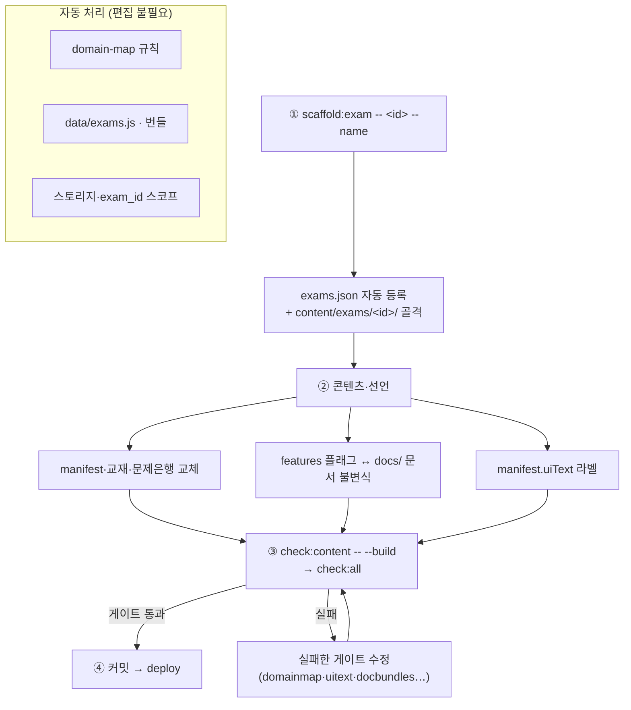

# 새 시험 추가 런북

> **문서 ID**: DOC-RBK-10
> **관련 SPEC ID**: ES-01, DA-11, DA-12, BP-09
> **대상**: Passmula 플랫폼에 새 자격시험을 추가하는 사람
> **전제**: 멀티시험 아키텍처 — `docs/dev/ARCHITECTURE.md` "새 시험 추가 절차"·"시험별 문서 규약"·"파일 계층 분류" 절

## 개요

새 시험 추가는 **앱 코드 변경 없이 콘텐츠 선언만으로** 완료된다. 절차는 4단계:



1. `scaffold:exam`으로 골격 생성 (exams.json 등록 자동)
2. 샘플 콘텐츠를 실제 콘텐츠로 교체 + 기능 플래그·문서 선언
3. 빌드·검증 게이트 실행
4. 커밋·배포

## 1단계 — 스캐폴딩

```powershell
npm.cmd run scaffold:exam -- <id> --name "시험명" [--short-name X] [--year YYYY]
```

- `<id>`: 영문 소문자 식별자 (예: `food`) — URL·디렉터리·스토리지 네임스페이스에 사용
- `--dry-run`: 생성 없이 미리보기 · `--force`: 기존 골격 덮어쓰기 · `<id> --remove`: 골격 전체 제거

생성물:

```
content/exams/<id>/
├── manifest.json          # 과목·챕터·기능 콘텐츠 선언 (샘플)
├── references.json        # 참조자료 레지스트리 골격
├── 교재/·문제은행/         # 샘플 교재·문항
├── docs/                  # 앱 내 문서 (이 단계에선 비어있음)
├── 참조자료/               # ref_md 변환본 + PDF
└── knowledge/             # 지식DB (필요 시)
```

동시에 `content/exams.json`에 엔트리가 자동 등록된다 (`contentRoot`/`dataRoot`/`registryBundle`/`registryGlobal`).

`exams.json` 엔트리의 선택 필드 `pwaShortcuts`: 설치형 PWA의 앱 아이콘 롱프레스 shortcut 배열 — `build_exams_list.js`가 `manifest.<id>.webmanifest`의 `shortcuts`로 패스스루한다 (SPEC UX-PWA-06 — 시험 도메인 기능이라 시험별 매니페스트에만 선언, cosmetic의 '배합 계산기' `#/formula`가 유일 사례).

## 2단계 — 콘텐츠와 선언

### 필수 콘텐츠 교체

- `manifest.json` — `subjects`·`exams`·`integratedExam`을 실제 과목 구성으로. 선택 선언: `uiText`(뷰 라벨)·`synonyms`(주관식 유사어)·`analysis.wrongCauses`(오답 원인 분류 확장 — `key`·`label`·`advice` 배열, 미선언 시 기본 3종)
- `교재/`·`문제은행/` — 샘플 파일을 실제 MD로 교체
- `references.json` — 참조자료 메타데이터. 법령 추적이 필요하면 `content/lawdb.json` + `lawRefs`·`noticeCore` 설정

### 시험 팩 파일 3분류

cosmetic의 모든 파일을 복사할 필요는 없다 — food가 최소 구성 실증이다:

| 분류 | 파일 | 처리 |
|---|---|---|
| **필수** | `manifest.json`, `references.json`, `교재/`, `문제은행/` | 스캐폴더 생성 → 실제 콘텐츠로 교체 |
| **기능 콘텐츠** | `docs/*.md`, `knowledge/`, `number-drills/`, `limits-trainer.json`, `audiobook/`, `교재/glossary/` | 해당 `features` 플래그를 켤 때만 배치 — 아래 불변식 표 참조 |
| **도구 산출물** | `combo_blocklist.json`, `law_verified.json`, `notice_status.json`, `report/`, `html/` | **미리 만들지 않음** — 감사·변환 도구가 첫 실행 시 자동 기록 (`html/`은 ref-pipeline 산출로 gitignore) |

처리 도구도 선택이다 — `ref-pipeline`(PDF→ref_md)은 참조 PDF 보유 시, `check_mfds_notice.py`는 `referenceLaw` 설정 시, 오디오 생성은 `audiobook` 플래그 시에만 필요하다.

### 기능 플래그 (`exams.json` 엔트리의 `features`)

켜둔 플래그만 UI에 노출된다 (`data-feature` 게이팅). **플래그 ↔ 필수 문서 불변식**이 강제된다 — 플래그를 켰는데 `docs/`에 문서가 없으면 `check:docbundles --check`가 실패한다 (불변식 SSOT: `docs/dev/ARCHITECTURE.md` "시험별 문서 규약" 절):

| 플래그 | 필수 문서 | 기능 |
|---|---|---|
| `studyGuide` | `{contentRoot}/docs/학습안내서.md` | 대시보드 학습 안내서 카드 |
| `userManual` | `{contentRoot}/docs/user_manual.md` | 사이드바 사용자 매뉴얼 링크 |
| `formula` | `{contentRoot}/docs/formula_manual.md` | 실무 매뉴얼 링크 + Formula OS |
| `appendixDocs` | `{contentRoot}/docs/두음법_암기_총정리.md` | 부록 문서 |

문서가 없는 기능은 플래그를 선언하지 않는다. `docs/*.md`는 **존재 자체가 선언** — 번들 대상은 디렉터리 스캔으로 자동 결정된다.

**실무작업실 피처**(실습 도구 — cosmetic의 `formula`가 유일 사례): `features` 키 선언 외에 `src/practice-registry.js` 엔트리·뷰 파셜·storage 키 등 선언 접점이 필요하다 — 절차는 `docs/dev/ARCHITECTURE.md` "신규 실무 피처 추가 체크리스트" 참조 (ui-mode·router·app 코어 수정 불필요). **기존 피처를 새 시험에서 재사용하는 경우는 아래 "도메인 자산 규약"만 따르면 된다** — 플랫폼 코드 수정 없이 규약 경로에 파일을 배치하면 활성 시험 id로 자동 해석된다.

### 도메인 자산 규약 (`exams/<id>/`)

시험 전용 코드·마크업·스타일·테스트는 **활성 시험 id 아래 시험 무관 동일 상대 경로**에 둔다. 플랫폼 레지스트리는 `./exams/${getActiveExamId()}/…` 템플릿으로 해석하므로 시험 id가 플랫폼 코드에 남지 않는다:

| 자산 | 규약 경로 | 예시 (cosmetic) |
|---|---|---|
| 도메인 모듈·스토어 | `src/exams/<id>/` | `src/exams/cosmetic/formula-store.js` |
| 실무 뷰 모듈 | `src/exams/<id>/views/` | `src/exams/cosmetic/views/formula.js` |
| 뷰 마크업 파셜 (지연 주입) | `html/exams/<id>/` | `html/exams/cosmetic/formula.html` |
| 도메인 스타일 | `css/exams/<id>/` — 레지스트리 `styles` 필드로 `<link>` 지연 주입 | `css/exams/cosmetic/formula.css` |
| 도메인 테스트 | `tests/{unit,dom}/exams/<id>/` | `tests/unit/exams/cosmetic/formula-os.test.js` |

- **기존 피처 재사용** (예: 새 시험에서 `formula` 활성화): 위 경로에 같은 파일명으로 자산을 배치하고 `features.formula`를 선언하면 끝 — `_domainImport`/`_domainMarkup`이 활성 시험으로 해석하고, 유닛 테스트(`practice-registry.test.js` 규약 검증)가 feature 선언 시험마다 파일 실존을 강제한다
- **신규 피처 추가**: `practice-registry.js`에 엔트리 1건(시험 무관 상대 경로만 선언) + 규약 경로에 자산 배치 — 상세는 ARCHITECTURE "신규 실무 피처 추가 체크리스트"
- **회귀 게이트**: `check:domainmap`이 platform 파일의 `exams/<id>/` 경로 리터럴을 오류로 차단 — 하드코딩 대신 `_domainImport`/`_domainMarkup`·`getActiveExamId()` 사용

### UI 텍스트 (`manifest.uiText`)

- 플랫폼 마크업의 `data-uitext` 키를 시험별 문구로 치환
- `npm run check:uitext`가 data-uitext↔uiText 양방향 + platform 마크업의 시험 용어 잔존을 감사

### 편집 불필요 항목 (자동)

- `domain-map.json` — `check_domain_map.js`가 등록 시험의 `contentRoot`/`dataRoot`를 `domain:<id>` 규칙으로 자동 주입
- `data/exams.js` — `build:exams-list`가 exams.json에서 생성
- `data/exams/<id>/` 번들 — `build:data`가 전 시험 순회 생성
- 로컬 저장소 네임스페이스·클라우드 `exam_id` 분리 — `scopedKey`/`exam-context` 자동

## 3단계 — 빌드·검증

```powershell
npm.cmd run check:content -- --build   # 빌드 + 콘텐츠 통합 검증
npm.cmd run check:all                  # lint·types·imports·html·docs·domainmap·uitext·specrefs·trace·테스트 일괄
```

주요 게이트와 잡는 결함:

| 게이트 | 잡는 결함 |
|---|---|
| `check:domainmap` | 미등록 시험 디렉터리, 미분류 신규 파일 |
| `check:uitext` | manifest에 없는 data-uitext, platform HTML의 시험명 잔존 |
| `check:docbundles` | 플래그↔문서 불변식 위반, 번들 신선도 |
| `check:manifest` | manifest 선언 ↔ 실제 파일 불일치 |
| `tests/unit/multi-exam-gates.test.js` | 게이트 자체 + 등록 시험 디렉터리 정합 |
| `tests/dom/exam-switching.dom.test.js` | 신규 시험 활성 시 게이팅·브랜딩·스코프 격리 |

**제거 롤백**: `npm.cmd run scaffold:exam -- <id> --remove` — 골격 전체 삭제 후 `check:all` 재실행.

## 4단계 — 커밋·배포

표준 절차와 동일: 커밋 → `npm run deploy` (배포 가드 → sw 스탬프 → vercel --prod). 상세는 `DEPLOYMENT_GUIDE.md`.

## 체크리스트

- [ ] `scaffold:exam` 실행 — exams.json 엔트리·디렉터리 트리 생성됨
- [ ] `manifest.json` 실제 과목·문항으로 교체
- [ ] `features` 플래그 = 보유 기능만 선언 (문서 불변식 충족)
- [ ] `manifest.uiText` 시험명·과목 라벨 채움
- [ ] 실무 피처 재사용 시 — `src/exams/<id>/`·`html/exams/<id>/`·`css/exams/<id>/` 규약 경로에 자산 배치 + `features` 선언 (플랫폼 코드 수정 없음)
- [ ] `check:all` 통과 — domainmap·uitext·docbundles 오류 0
- [ ] DOM 시험 전환 테스트에서 새 시험 케이스 추가 검토 (`tests/dom/exam-switching.dom.test.js`)
