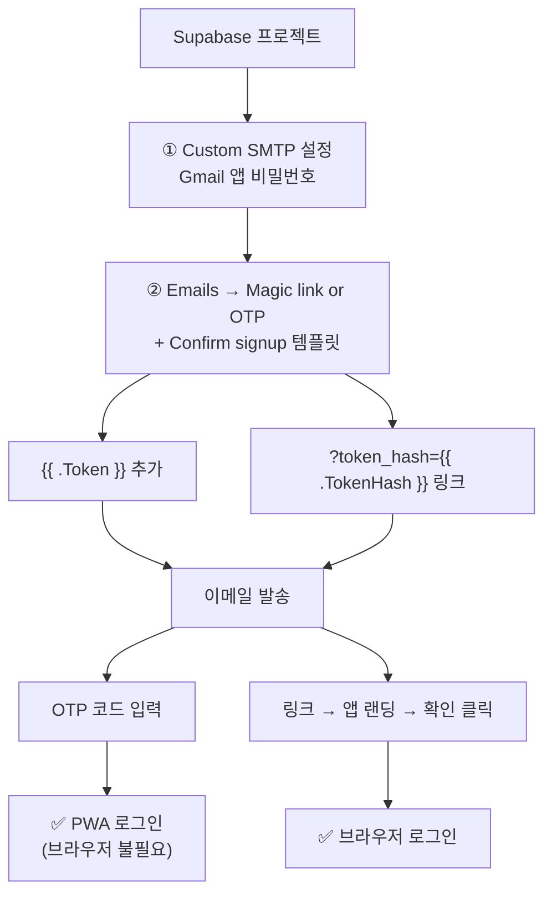
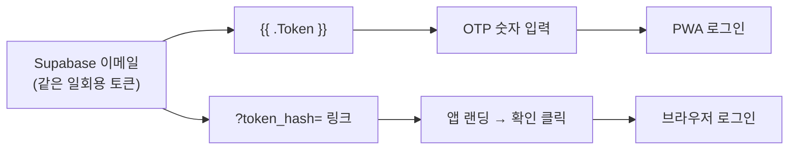

# Supabase Custom SMTP + Magic Link/OTP 설정 가이드

> **문서 ID**: DOC-RBK-06
> **범위**: platform · 판본: none

## 1. 개요

> **관련 SPEC ID**: `AU-02~04` (로그인 메일·쿨다운) — 설계 배경은 `../design/SUPABASE_DESIGN.md`

Supabase에서 **Magic Link + OTP 로그인**을 함께 사용하려면 다음 두 가지 설정이 필요합니다.

1. **Custom SMTP 설정**
2. **Magic link or OTP 이메일 템플릿에 `{{ .Token }}` 추가**

현재 앱 설계에서는 **「로그인 메일 보내기」** 버튼 하나로 이메일을 발송하고, 메일에 포함된 **로그인 링크 또는 OTP 코드**를 사용자가 환경에 맞게 선택하도록 구성합니다.

---

## 2. 전체 설정 흐름

```text
Supabase 프로젝트
      │
      ├─ ① Custom SMTP 설정
      │
      ↓
Authentication → Emails
      │
      └─ ② Magic link or OTP 템플릿 (+ Confirm signup)
              │
              ├─ {{ .Token }}
              └─ ?token_hash={{ .TokenHash }} 링크
                       │
                       ↓
                  이메일 발송
                       │
              ┌────────┴────────┐
              ↓                 ↓
         OTP 코드 입력       링크 → 앱 랜딩 확인
              ↓                 ↓
         PWA 로그인          브라우저 로그인
```



---

## 2.5 대시보드 바로가기

프로젝트 대시보드: `https://supabase.com/dashboard/project/hunpzznyiaddekuggupu`

| 용도 | 경로 | 링크 |
|---|---|---|
| SMTP 설정 | Authentication → SMTP Settings | https://supabase.com/dashboard/project/hunpzznyiaddekuggupu/settings/auth |
| 이메일 템플릿 | Authentication → Emails | https://supabase.com/dashboard/project/hunpzznyiaddekuggupu/auth/templates |
| URL 설정 | Site URL·Redirect URLs | https://supabase.com/dashboard/project/hunpzznyiaddekuggupu/auth/url-configuration |
| 사용자 목록 | Authentication → Users | https://supabase.com/dashboard/project/hunpzznyiaddekuggupu/auth/users |
| 테이블 편집기 | `sync_snapshots` 행 확인 | https://supabase.com/dashboard/project/hunpzznyiaddekuggupu/editor |
| SQL Editor | 스키마·검증 쿼리 | https://supabase.com/dashboard/project/hunpzznyiaddekuggupu/sql/new |

> 대시보드 버전에 따라 메뉴 경로가 약간 다를 수 있습니다 — 링크가 바로 해당 페이지로 이동합니다.

---

# 3. Custom SMTP 설정

## 3.1 Supabase 메뉴

Supabase 대시보드에서 다음으로 이동합니다.

**Authentication → SMTP Settings**

> 대시보드 버전에 따라 **Authentication → Emails** 안의 **SMTP** 탭에 있는 경우도 있습니다. 둘 중 보이는 쪽을 사용하세요.

Magic Link/OTP 템플릿을 직접 수정하려면 먼저 Custom SMTP를 설정해야 합니다.

---

## 3.2 Gmail SMTP 권장 설정

Gmail을 발신 SMTP로 사용할 경우 다음과 같이 설정합니다.

| 항목 | 입력값 |
|---|---|
| Host | `smtp.gmail.com` |
| Port | `465` |
| Username | 발신용 Gmail 주소 |
| Password | Gmail 앱 비밀번호 16자리 |
| Sender email | 같은 Gmail 주소 |
| Sender name | `Passmula` 등 서비스명 |

설정 후:

**Enable Custom SMTP → ON**

으로 활성화합니다.

---

# 4. Gmail 앱 비밀번호 생성

일반 Gmail 비밀번호를 SMTP Password에 입력하면 안 됩니다.

Google 계정에서:

**Google 계정 → 보안 → 2단계 인증 → 앱 비밀번호**

순서로 이동합니다.

앱 이름은 예를 들어:

```text
Supabase
```

로 지정합니다.

생성된 **16자리 앱 비밀번호**를 복사하여 Supabase의 SMTP Password에 입력합니다.

> 앱 비밀번호는 공백을 제거하여 입력합니다.

---

# 5. Magic link or OTP 템플릿 설정

Custom SMTP를 활성화한 다음 Supabase에서:

**Authentication → Emails**

또는

**Authentication → Email Templates**

로 이동합니다.

그 다음:

**Magic link or OTP**

템플릿을 선택합니다.

---

# 6. Body에 `{{ .Token }}` 추가 (HTML 권장안)

**Content → Body** 영역을 수정합니다.

> ⚠️ **Body는 HTML입니다** — 줄바꿈만 쓴 텍스트는 한 문단으로 뭉쳐 보이고, `<a>` 태그 없는 URL은 클릭이 안 될 수 있습니다. 권장 HTML은 **§16 최종 템플릿**(SSOT)을 사용하세요.

핵심 변수는 세 가지입니다.

### OTP 코드

```text
{{ .Token }}
```

### 로그인 링크용 토큰 해시

```text
{{ .TokenHash }}
```

기본 `{{ .ConfirmationURL }}` 대신 **`{{ .SiteURL }}/?token_hash={{ .TokenHash }}&type=email`** 형태의 앱 도메인 링크를 권장합니다 — 기본 ConfirmationURL은 메일 보안 스캐너·미리보기의 GET 요청 한 번에 토큰이 소진되지만, `token_hash` 링크는 앱 안에서 확인 클릭 시에만 소비됩니다.

> ⚠️ **`Confirm signup` 템플릿에서는 링크 끝을 `type=signup`으로 바꾸세요** — 앱은 쿼리의 `type` 값을 `verifyOtp`에 그대로 전달하므로, 가입 확인 토큰을 `email`로 검증하면 실패합니다.

### 앱 도메인

```text
{{ .SiteURL }}
```

대시보드 Site URL로 자동 치환됩니다.

---

# 7. 두 수단의 역할 — 같은 일회용 토큰

## 7.1 `{{ .Token }}`

Supabase가 이메일 발송 시 실제 OTP 숫자로 자동 치환합니다.

예:

```text
앱에 아래 인증 코드를 입력하세요.

123456
```

사용자는 PWA 화면에서 이 코드를 입력합니다.

---

## 7.2 `{{ .TokenHash }}` 링크

`{{ .SiteURL }}/?token_hash={{ .TokenHash }}&type=email` 형태로 쓰면 앱 도메인으로 바로 가는 로그인 링크가 됩니다.

사용자가 링크를 클릭하면 앱이 열리고, 앱 안의 확인 창에서 로그인을 완료합니다.

---

## 7.3 ⚠️ 코드와 링크는 독립적이지 않습니다

**둘은 같은 일회용 토큰의 두 표현입니다 — 한쪽을 쓰면 다른 쪽도 함께 소진됩니다.**

- iOS PWA 사용자가 습관적으로 링크를 누르면 Safari에서 토큰이 소비돼, 돌아와서 코드를 입력하면 "만료" 오류가 뜹니다.
- 메일 보안 스캐너·미리보기가 링크를 먼저 열어도 소진될 수 있습니다 — `token_hash` 방식은 앱에서 확인 클릭을 요구하므로 이 함정을 피합니다.

## 7.4 전체 동작 구조

```text
                    Supabase 이메일
                          │
              ┌───────────┴───────────┐
              ↓                       ↓
       {{ .Token }}        ?token_hash= 링크
              ↓                       ↓
         OTP 숫자 입력        앱 랜딩 → 확인 클릭
              ↓                       ↓
          PWA 로그인             브라우저 로그인
```



두 변수는 별도로 입력할 필요가 없습니다.

Supabase가 이메일 발송 시 자동으로 실제 값으로 치환합니다.

---

## 7.5 `Confirm signup` 템플릿에도 동일하게 적용 (필수)

`signInWithOtp`는 **미등록 이메일로 새 계정을 만듭니다**. `Confirm email`이 켜져 있으면 신규 사용자에게는 `Magic link or OTP`가 아니라 **`Confirm signup` 템플릿**이 발송됩니다.

이 템플릿에 `{{ .Token }}`이 없으면 **처음 가입하는 iOS PWA 사용자만 코드 없는 메일**을 받습니다. `Confirm signup` 템플릿에도 §6의 HTML 권장안을 적용하세요.

---

# 8. Subject는 변경하지 않아도 됨

Subject는 기본값을 그대로 사용해도 됩니다.

이번 설정에서는 **Body에 `{{ .Token }}`와 `?token_hash={{ .TokenHash }}` 링크를 넣는 것**이 핵심입니다.

---

# 9. Save

Body를 수정한 후:

**Save**

를 클릭합니다.

이 설정은 프로젝트 전체에 적용되므로 사용자별로 설정할 필요가 없습니다.

---

# 10. Body가 회색으로 잠겨 있는 경우

다음과 같은 상태라면:

- Subject 수정 불가
- Body 수정 불가
- 입력창이 회색
- 템플릿 편집이 비활성화됨

먼저 **Custom SMTP 설정 여부**를 확인합니다.

설정 순서는 반드시 다음과 같습니다.

```text
① Authentication → SMTP Settings
        ↓
② Gmail SMTP 정보 입력
        ↓
③ Enable Custom SMTP ON
        ↓
④ Authentication → Emails
        ↓
⑤ Magic link or OTP
        ↓
⑥ Body 수정
        ↓
⑦ Save
```

그래도 편집되지 않는다면 다음을 순서대로 확인합니다.

1. 기존 텍스트 위를 직접 클릭
2. Supabase 대시보드 새로고침
3. 시크릿 모드에서 재접속
4. 다른 브라우저에서 확인

---

# 10.5 메일이 아예 오지 않는 경우

1. **Gmail 앱 비밀번호 폐기 확인** — Google 계정 비밀번호를 변경하면 앱 비밀번호가 폐기돼 로그인 메일이 조용히 끊깁니다. 재발급 후 SMTP Password 갱신.
2. 발송 한도 확인 — Custom SMTP 적용 후 **Auth → Rate Limits**의 시간당 발송 한도에 걸릴 수 있습니다.
3. 스팸함 확인.
4. Authentication → Users에 대상 계정 존재 여부 확인.

---

# 11. 실제 이메일 테스트

설정을 완료한 후 앱에서:

```text
이메일 입력
      ↓
[로그인 메일 보내기]
      ↓
Supabase
      ↓
이메일 발송
```

이메일에 다음과 같이 표시되면 정상입니다.

```text
Passmula 로그인

앱에 아래 인증 코드를 입력하세요.

123456          ← 크게 표시된 숫자 코드

브라우저에서 이용 중이라면 아래 버튼으로도 로그인할 수 있습니다.
(홈 화면 앱에서 로그인 중이면 버튼 대신 코드를 입력하세요)

[브라우저에서 로그인]   ← 앱 도메인 링크

코드와 링크 중 하나만 사용할 수 있으며, 잠시 후 만료됩니다.
```

> ⚠️ **Users에 없는 새 이메일로도 한 번 테스트하세요** — 신규 계정은 `Confirm signup` 템플릿이 발송되므로, 이 템플릿에도 코드가 들어있는지 반드시 확인해야 합니다 (§7.5).

---

# 12. PWA에서 OTP 로그인

설치형 PWA에서는 이메일에 표시된 OTP 코드를 앱에 입력합니다.

예:

```text
이메일: user@example.com

인증 코드:
[ 123456 ]

[확인]
```

Supabase에서는 다음과 같은 방식으로 인증합니다.

```javascript
supabase.auth.verifyOtp({
  email,
  token,
  type: 'email'
})
```

OTP 방식은 링크를 다른 브라우저에서 열 필요가 없기 때문에 PWA 로그인에 적합합니다.

---

# 13. 브라우저에서 Magic Link 로그인

일반 브라우저에서는 이메일의 로그인 링크를 클릭할 수 있습니다.

```text
이메일
  ↓
[로그인 링크 클릭]
  ↓
앱 랜딩 → "이 브라우저에서 로그인" 확인
  ↓
Supabase 세션 생성
  ↓
로그인 완료
```

확인 클릭을 거치므로 메일 스캐너·미리보기가 링크를 열어도 토큰이 소진되지 않습니다. 취소하면 토큰이 남아 있어 같은 메일의 코드로 계속 로그인할 수 있습니다.

따라서 동일한 이메일을 다음 두 환경에서 사용할 수 있습니다.

| 환경 | 로그인 방법 |
|---|---|
| PC/모바일 브라우저 | 로그인 링크 클릭 |
| 설치형 PWA | OTP 코드 입력 |
| Android PWA | 링크 클릭 또는 OTP |
| iOS PWA | OTP 권장 |

---

# 14. 현재 앱의 권장 UX

현재 설계에서는 Magic Link와 OTP 버튼을 별도로 만들지 않고 하나로 통합합니다.

버튼:

```text
[로그인 메일 보내기]
```

메일 (§11 예시와 동일 — `Magic link or OTP` + `Confirm signup` 공통):

```text
Passmula 로그인

앱에 아래 인증 코드를 입력하세요.

123456          ← 크게 표시된 숫자 코드

브라우저에서 이용 중이라면 아래 버튼으로도 로그인할 수 있습니다.
(홈 화면 앱에서 로그인 중이면 버튼 대신 코드를 입력하세요)

[브라우저에서 로그인]   ← 앱 도메인 링크 (?token_hash=)

코드와 링크 중 하나만 사용할 수 있으며, 잠시 후 만료됩니다.
```

사용자는 자신의 환경에 맞는 방법을 선택합니다.

```text
브라우저
→ 로그인 링크 클릭

PWA
→ OTP 코드 입력
```

이렇게 하면 URL 환경과 PWA 환경에서 로그인 절차를 하나로 통일할 수 있습니다.

---

# 15. 최종 체크리스트

## Supabase

- [ ] Authentication → SMTP Settings 진입
- [ ] Gmail 2단계 인증 활성화
- [ ] Gmail 앱 비밀번호 생성
- [ ] `smtp.gmail.com` 입력
- [ ] Port `465` 입력
- [ ] Gmail 주소 입력
- [ ] 앱 비밀번호 입력
- [ ] Sender email 입력
- [ ] Sender name 입력
- [ ] **Enable Custom SMTP ON**

## Email Template

- [ ] Authentication → Emails
- [ ] `Magic link or OTP` 선택
- [ ] Body 편집 (HTML)
- [ ] `{{ .Token }}` 추가
- [ ] `{{ .SiteURL }}/?token_hash={{ .TokenHash }}&type=email` 링크 추가
- [ ] Save
- [ ] **`Confirm signup` 템플릿에도 동일하게 적용 — 링크는 `type=signup`** — 신규 계정은 이 템플릿이 발송됨

## 앱 테스트

- [ ] 앱에서 이메일 입력
- [ ] 「로그인 메일 보내기」 클릭
- [ ] 이메일 수신 확인
- [ ] OTP 코드 표시 확인
- [ ] **Users에 없는 새 이메일로도 발송 — `Confirm signup` 메일에 코드 확인**
- [ ] PWA에서 코드 입력
- [ ] 로그인 상태 확인
- [ ] 브라우저에서 로그인 링크 → 앱 랜딩 → 확인 클릭으로 로그인
- [ ] 링크 클릭 후 취소 시 토큰 미소비 — 코드로 계속 로그인 가능한지 확인

---

# 16. 최종 템플릿

실제 Supabase Body에는 아래 HTML을 사용하면 됩니다 (`Magic link or OTP`와 `Confirm signup` 양쪽에 적용 — `Confirm signup`에서는 링크 끝의 `type=email`을 **`type=signup`**으로 변경).

```html
<h2>Passmula 로그인</h2>
<p>앱에 아래 인증 코드를 입력하세요.</p>
<p style="font-size:28px;font-weight:700;letter-spacing:6px">{{ .Token }}</p>
<p>브라우저에서 이용 중이라면 아래 버튼으로도 로그인할 수 있습니다.<br>
(홈 화면 앱에서 로그인 중이면 버튼 대신 코드를 입력하세요)</p>
<p><a href="{{ .SiteURL }}/?token_hash={{ .TokenHash }}&type=email">브라우저에서 로그인</a></p>
<p>코드와 링크 중 하나만 사용할 수 있으며, 잠시 후 만료됩니다.</p>
```

> `{{ .Token }}`·`{{ .TokenHash }}`·`{{ .SiteURL }}`는 Supabase가 이메일 발송 시 자동으로 실제 값으로 치환합니다. 코드와 링크는 **같은 일회용 토큰** — 한쪽을 쓰면 다른 쪽도 소진됩니다.
