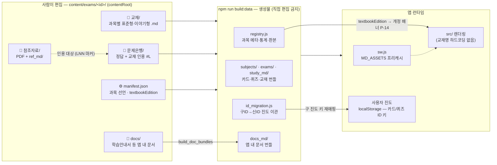
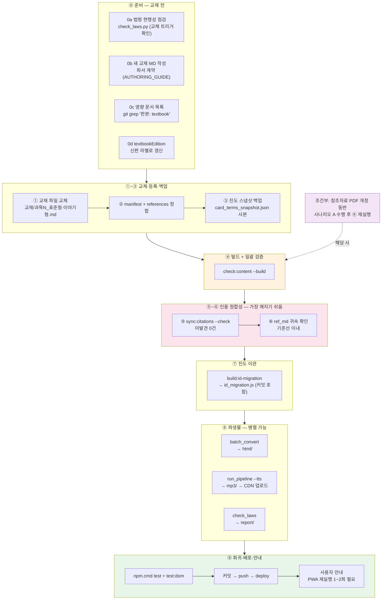

# 교재 교체 작업 순서도 (Runbook)

> **대상**: 과목 교재를 통째로 교체하거나 교재 전면 개정을 반영할 때의 **시간 순서 작업 절차**.
> **이 문서만으로 완결 가능** — 신참자가 처음부터 끝까지 수행할 수 있도록 배경·용어·정상 출력·실패 대응까지 담았다.
> 상세 근거는 `docs/dev/runbooks/CONTENT_WORKFLOW.md` §3.1-1(8계층)과 `ref-pipeline/README.md` 시나리오 A/B를 따른다.
> **관련 SPEC ID**: `DA-01` (manifest SSOT) · `CS-01~10` · `BP-01~08` · `ID-01~04` · `P-14`
> **문서 ID**: DOC-RBK-08
> **범위**: platform · 판본: none

## 이 런북이 다루는 것 / 다루지 않는 것

| 하려는 작업 | 읽을 문서 |
|---|---|
| **기존 시험의 교재 파일을 교체·전면 개정** | ← 이 문서 |
| 교재 Markdown 작성 규칙 (표·마커·챕터·인용 형식) | `TEXTBOOK_AUTHORING_GUIDE.md` |
| **새 시험**을 플랫폼에 추가 (교재 교체가 아님) | `NEW_EXAM_RUNBOOK.md` (`scaffold:exam`) |
| 참조자료(법령·고시) PDF 추가·개정만 | `ref-pipeline/README.md` 시나리오 A |
| 이야기형 서사(스토리) 패치 작성·수정 | `STORY_PATCH_GUIDE.md` |
| 교재 문장·오타 소규모 수정 | 아래 "부분 변경 시 생략 가능 단계" |

## 작업 전 준비

### 환경 체크

```powershell
node -v           # Node.js — 버전 요구사항은 docs/dev/reference/DEV_ENVIRONMENT.md
python --version  # Python 3 — ⑧ 파생물·ref-pipeline에 필요
git status        # clean 상태에서 시작 (미커밋 변경이 있으면 먼저 정리)
npm.cmd run check:all:quick   # 시작 전 저장소가 건강한지 1회 확인
```

> **주의**: Windows PowerShell에서 `npm`/`npx`가 실행 정책으로 차단되므로 **항상 `npm.cmd`/`npx.cmd`**를 쓴다.

### 대상 시험 지정

```powershell
# cosmetic이 기본값. 다른 시험은 contentRoot를 명시
$env:EXAM_CONTENT_ROOT = "content/exams/cosmetic"
# food 파일럿이면: $env:EXAM_CONTENT_ROOT = "content/exams/food"
```

### 용어 사전 — 이 문서에서만 쓰는 말

| 용어 | 뜻 |
|---|---|
| `contentRoot` | 시험 콘텐츠 루트 `content/exams/<id>/` — **사람이 편집하는 진실(SSOT)** |
| `dataRoot` | 빌드 산출물 루트 `data/exams/<id>/` — **직접 편집 금지**, `build:data`가 재생성 |
| 표준형 / 이야기형 | 같은 교재의 두 본문 — 표준형(번호·표 중심) / 이야기형(서사 내러티브, `교재/*/story/*_서사.md` 패치 → `build:story` 생성물) |
| `manifest.json` | 과목·교재 파일·문제은행·`textbookEdition`을 선언하는 시험의 SSOT |
| `ref_md` | 참조자료 PDF를 라인번호 인용 가능하도록 변환한 MD (`참조자료/ref_md/과목N/{문서}/{문서}.md`) — 판본은 폴더명의 `제N호·시행일`에 내재화 |
| `#L###` | 교재/참조자료 라인번호 인용 (문제은행 → 교재의 근거 링크) |
| `textbookEdition` | manifest에 선언하는 **현재 교재 판본 라벨** — 개정 안내 배너(P-14)·문서 신선도 게이트의 앵커 |
| 범위·판본 헤더 | 문서 상단 `> **범위**: exam:<id> · 판본: textbook` — "이 문서는 교재에 종속"의 기계 선언 |
| ID 이관 | 교재 교체로 바뀐 카드/퀴즈 ID를 구ID→신ID로 매핑해 **사용자 학습 진도를 보존** (`id_migration.js`) |
| 스냅샷 | `card_terms_snapshot.json` — 직전 배포의 ID 집합. 이관 맵 생성의 비교 기준 (커밋 대상) |
| 게이트 | `check:*` 검증 스크립트 — 실패 시 커밋·푸시·배포가 차단된다 |

## 한눈에 보는 구조 — 교재가 앱에 도달하기까지



**핵심 원리 3줄:**

1. `src/` 앱 코드에는 과목명·교재명이 하드코딩되어 있지 않다 — **교재 변경은 `content/`와 `sw.js`만 건드리면 된다**.
2. `data/`는 전부 생성물 — **직접 수정하면 다음 `build:data`에 덮어씌워진다**.
3. 사용자 진도는 카드/퀴즈 ID에 매달린다 — 교재가 바뀌면 ID도 바뀌므로 **⑦ ID 이관이 진도 손실의 안전망**이다.

## 전체 흐름



## 순서별 상세

| # | 단계 | 명령/작업 | 통과 기준 (게이트) | 상세 |
|---|---|---|---|---|
| 0 | 사전 점검 | 0a `python ref-pipeline/check_laws.py` — 인용 법령 개정이 교체 원인인지 확인<br/>0b 새 교재 MD 작성 — `| 용어 \| 설명 |` 표, `🔖/📌/★` 마커, `## N.` 챕터, 참조 링크 `../참조자료/ref_md/과목N/…`<br/>0c 영향 문서 목록 확보 — `git grep -l "판본: textbook" -- docs/exams/{id} content/exams/{id}/docs` 결과 각 문서의 갱신 범위 수립 (교재 종속 선언 문서 — 체계는 docs/README.md "범위 체계")<br/>0d `manifest.json`의 `textbookEdition`을 신판 라벨로 갱신 (check:manifest 필수 선언 — registry 전파 + 개정 안내 배너 P-14 트리거 + 판본 문서의 기준 앵커) | 법령 판정 확인 + 파서 계약 충족 | TEXTBOOK_AUTHORING_GUIDE |
| 1 | 파일 교체 | `{EXAM}/교재/{과목}/` 에 `_표준형.md`·`_이야기형.md` 배치 (파일명 변경이면 `node tools/sync/sync_textbook_files.js --rename <구> <신>`으로 교체 — manifest+sw.js+인용 경로 원자 전파) | 파일명 규칙 일치 | CONTENT_WORKFLOW §3.1 |
| 2 | 등록 정합 | `node tools/sync/sync_textbook_files.js` — manifest file/storyFile·exams·`sw.js MD_ASSETS` 자동 동기화 (`--check`로 사전 확인). 수동 잔여: `integratedExam`·`references.json`(subjectDirMap·refDirs·sourceRefMap) | `드리프트 없음` + 선언↔파일 일치 | §3.1-1 ① |
| 3 | **백업** | `{dataRoot}/card_terms_snapshot.json` + `id_migration.js` 사본을 작업 브랜치 외 별도 위치에 보관 | 복원 가능한 사본 확보 | 롤백 절차 참조 |
| 4 | 빌드+검증 | `npm.cmd run check:content -- --build` (수 분 소요) | 전 계층 통과 | §3.1-1 ④ |
| 5 | 인용 동기화 | `node tools/sync/sync_citation_lines.js --check` → 필요 시 실행 후 재--check | **미발견 0건** | §3.1-1 ⑤ |
| 6 | ref_md 귀속 | `node tools/check/check_ref_subjects.js` + `check_reflayout.js` | 불일치가 교체 전 기준선 이내 | §3.1-1 ⑥ |
| 7 | 진도 이관 | `npm.cmd run build:id-migration` → `id_migration.js`·스냅샷 **커밋 포함** | 이관 맵 생성; 삭제 용어 진도는 사용자 안내 | §3.1-1 ⑦ |
| 8 | 파생물 (병렬 가능) | 8a `python ref-pipeline/batch_convert.py` → `html/`<br/>8b `python ref-pipeline/audiobook/run_pipeline.py --subject {키} --tts` → `mp3/` → **CDN 업로드 + `AUDIO_BASE_URL` 확인** (MP3는 Vercel 배포 불가)<br/>8c `python ref-pipeline/check_laws.py` → `report/` | 변환 성공 + `build:audio-manifest` + CDN URL 유효 | ref-pipeline README 시나리오 B |
| 8' | 참조자료 (조건부 병행 트랙) | 법령 개정 동반 시: `convert:refs` → `verify:refs` → 수동 승격 → `check:reffresh --update` → **④부터 재수행** | verify 누락 0 | ref-pipeline README 시나리오 A |
| 9 | 회귀·배포·안내 | `npm.cmd test` + `npm.cmd run test:dom` (+`test:e2e` 선택) → 0c 목록의 `판본: textbook` 문서 갱신 포함해 커밋 (check:textbookdocs가 미갱신 문서를 게이트) → `npm.cmd run deploy` → 설치형 PWA 사용자에게 **완전 종료 후 1~2회 재실행** 안내 (sw 캐시 전파 지연; 재실행 시 대시보드에 교재 개정 배너 P-14 표시) | 687+/388+ 통과, clean tree, 교재 종속 문서 갱신 | AGENTS.md 배포 절차 |

## 각 단계의 정상 출력 — 처음이라면 이렇게 나와야 한다

| 단계 | 명령 | 정상 출력 | 비정상 신호 |
|---|---|---|---|
| ② | `node tools/sync/sync_textbook_files.js --check` | `✅ 드리프트 없음` | 불일치 목록 + exit 1 → `--check` 없이 실행해 동기화 |
| ④ | `npm.cmd run check:content -- --build` | 각 계층 `✅ 통과` → `🎉 전 단계 통과` | 실패 단계명이 헤더에 표시됨 — 아래 "자주 실패하는 지점" 참조 |
| ⑤ | `node tools/sync/sync_citation_lines.js --check` | **미발견 0건** | 미발견 문항 목록 → 인용 라인 수동 지정 |
| ⑦ | `npm.cmd run build:id-migration` | 이관 N건 · 신규 M건 · **lost 0건** | lost > 0이면 삭제 용어의 진도 손실 — 의도 확인 후 사용자 안내 |
| ⑨ (커밋 전) | `npm.cmd run check:textbookdocs` | `✅ 모든 교재 종속 문서가 최신 교재 이후 갱신됨` | stale 문서 목록 → 0c 목록 문서 갱신 후 재커밋 |
| ⑨ | `npm.cmd run deploy` | `✅ 프로덕션 스모크 통과` | 배포 가드(clean tree·동기화) 실패면 커밋/푸시부터 정리 |

## 자주 실패하는 지점 — 증상 → 원인 → 조치

| 증상 | 원인 | 조치 |
|---|---|---|
| `[선언]` 챕터 헤딩 없음 | 교재에 `## N.` 형식 아닌 헤딩 사용 | AUTHORING_GUIDE 헤딩 규칙으로 `## 1. 제목` 형태로 수정 |
| 카드/퀴즈가 0개 생성 | `\| 용어 \| 설명 \|` 표 또는 `🔖/📌/★` 마커 부재 | 파서 계약 표(아래 ①-1) 대조 — 헤더·라벨 라인의 마커는 생성 대상 아님 |
| `[구조]` 드리프트 | 교재 파일 추가·이름 변경 후 sync 미실행 | `node tools/sync/sync_textbook_files.js` |
| `[선언]` "manifest 미등록 .md" 경고 | 디스크에만 있고 chapters[].file에 미등록 | manifest에 등록하거나 불필요 파일 삭제 |
| `[인용]` 미발견 | 교재 본문 재작성으로 인용문 지문 매칭 실패 | 해당 문항의 `[교재: LNNN]` 링크를 새 라인으로 수동 수정 |
| `[ID이관]` lost 대량 | 용어 대량 삭제·개명 — 진도 손실 | 의도한 변경인지 재확인 → 손실 안내 여부 결정 (되돌리려면 ③ 백업으로 롤백) |
| `check:textbookdocs` 실패 | `판본: textbook` 문서가 교재보다 오래됨 | 문서 갱신 후 커밋 (검토만 완료한 문서는 갱신일·내용 확인 후 터치) |
| `check:manifest` "textbookEdition 없음" | 0d 누락 | manifest 상단에 `"textbookEdition": "<신판 라벨>"` 추가 |
| `[문서번들]` 실패 | `content/exams/<id>/docs/*.md` 수정 후 번들 미갱신 | `node tools/build/build_doc_bundles.js` |
| `[데이터신선도]` 실패 | content 변경 후 `build:data` 누락 | `npm.cmd run build:data` 재실행 |
| `[신선도]` (참조자료) 실패 | ref_md보다 PDF가 최신 — PDF 교체·개정 | `convert:refs` → `verify:refs` → 승격 → `check:reffresh -- --update` (⑧' 트랙) |
| 배포 후 앱에 반영 안 됨 | 설치형 PWA의 sw 캐시 | 완전 종료 후 1~2회 재실행 (정상 지연 — 버그 아님) |
| 배포 후 개정 배너가 안 뜸 | `textbookEdition` 미갱신 또는 이전과 동일 값 | manifest 확인 — 동일 라벨이면 변경 없음으로 억제되는 정상 동작 |

## 완료 체크리스트

- [ ] ⓪ `check_laws.py`로 교체 트리거(법령 개정 여부) 확인
- [ ] ⓪ 새 교재 MD가 AUTHORING_GUIDE 파서 계약 충족 (헤딩·표·마커)
- [ ] ⓪ `git grep -l "판본: textbook"` 목록 확보 + 문서별 갱신 범위 수립
- [ ] ⓪ manifest `textbookEdition`을 신판 라벨로 갱신
- [ ] ① 파일 배치 완료 (이름 변경이면 `--rename` 사용 — 수동 이동 금지)
- [ ] ② `sync_textbook_files.js --check` → 드리프트 0
- [ ] ③ 스냅샷+이관 맵 백업 사본 확보
- [ ] ④ `check:content --build` 전 계층 통과
- [ ] ⑤ 인용 미발견 0건
- [ ] ⑥ ref_md 귀속이 교체 전 기준선 이내
- [ ] ⑦ `id_migration.js` 생성 + lost 항목 검토·안내 결정
- [ ] ⑧ 필요 파생물(html/mp3/report) 생성 — mp3는 **CDN 업로드**까지
- [ ] ⑨ test + test:dom 통과, `판본: textbook` 문서 갱신 포함 커밋
- [ ] ⑨ `deploy` 스모크 통과 + PWA 재실행 안내 + 대시보드 개정 배너 육안 확인

## 교재 변경 시 소스코드 수정 지점

교재 변경으로 손봐야 하는 파일을 **직접 수정 / 자동 동기화 / 자동 재생성 / 조건부 수정**으로 구분한다.
`src/` 앱 코드는 과목·교재명 하드코딩이 없어 **대부분의 교재 변경은 `src/`를 건드리지 않는다** — 수정 대상은 `content/` 설정·원문과 `sw.js`의 프리캐시 목록뿐이다.

### ⓪ 자동 동기화 도구 — `tools/sync/sync_textbook_files.js`

파일시스템을 진실(source of truth)로 선언 지점을 자동 동기화한다. **교재 변경 후 가장 먼저 실행**할 것.

```powershell
node tools/sync/sync_textbook_files.js --check   # 불일치 보고만 (drift 시 exit 1)
node tools/sync/sync_textbook_files.js           # 동기화 실행
node tools/sync/sync_textbook_files.js --rename 교재/law/OLD.md 교재/law/NEW.md  # 파일명 변경 전파
```

| 대상 | 자동 처리 |
|---|---|
| `manifest.json` `chapters[].file`/`storyFile` | `*_표준형.md`/`_이야기형.md` 스캔으로 매칭 (후보 2개+면 수동 보고) |
| `manifest.json` `exams[]` | `문제은행/과목N_*.md` 미등록 파일을 `subjects[].order`로 매칭해 자동 등록 |
| `sw.js` `MD_ASSETS` | `MD_ASSETS:BEGIN/END` 마커 사이를 선언 기준으로 재생성 (`docs/*.md` 포함) |
| 문제은행·교재 간 인용 경로 | `--rename` 시 상대경로+URL 인코딩 일괄 치환, `#L` 프래그먼트·라벨 보존 |
| manifest 포맷 | 부분 텍스트 치환으로 uiText 인라인 스타일 보존 — 재직렬화는 모호할 때만 폴백+경고 |

> 라인번호 재동기화는 이 도구가 아닌 `sync:citations` 담당. `[구조]` 단계가 `--check`를 `check:content`에 통합.

### ① 직접 수정 (수동)

#### 1. `content/exams/{id}/교재/{dir}/*.md` — 교재 본문

파서 계약을 지켜야 카드/퀴즈/챕터 매핑이 정상 생성된다:

| 요소 | 규칙 | 용도 |
|---|---|---|
| 챕터 헤딩 | `## 📚 Chapter NN. 제목` 또는 `## N. 제목` (번호 있는 `##`만 인식) | 문항→챕터 매핑(`build_question_chapters`) |
| 카드 표 | `\| 용어 \| 설명 \|` 2열 | 플래시카드 추출 |
| 리스트 | `- **용어**: 설명` | 플래시카드 추출(보조) |
| 퀴즈 마커 | `🔖기출`·`📌중요`·`🎯기출`·`🎯중요`·`★필수` + `**볼드**`/숫자+단위 빈칸 대상 | 퀴즈 생성 (헤더·라벨 라인의 마커는 미생성) |
| 참조 링크 | `../참조자료/ref_md/과목N/{문서}/{문서}.md` 상대경로 | 참조자료 연결 (카드 감사가 존재 검증) |
| `(LNN)` 마커 | `(L123)` 또는 `(L123\|파일.pdf)` — ref_md 라인 번호 | `check_ref_lines`가 범위+키워드 검증 |

> 상세 작성 규칙: `docs/dev/runbooks/TEXTBOOK_AUTHORING_GUIDE.md`

#### 2. `content/exams/{id}/manifest.json` — 과목·문제은행 선언 (SSOT)

> `file`/`storyFile`/`exams[].file` 필드는 `sync_textbook_files.js`가 디스크 스캔으로 동기화 — **key·order·title·questionsPerSubject 등 의미 필드만 수동**.

```jsonc
{
  "subjects": [{
    "key": "law",                 // 과목 고유키 — ID·스냅샷·데이터 경로의 기준. 변경 시 전체 연쇄 영향
    "order": 1,                   // 과목 번호 — glossary/subjectN.json·ref_md/과목N 폴더와 연동
    "dir": "교재/law",            // 교재 디렉터리 (contentRoot 상대)
    "chapters": [{
      "file": "1과목_..._표준형.md",      // 표준형 파일명 (dir 안)
      "storyFile": "1과목_..._이야기형.md" // 이야기형 (선택)
    }]
  }],
  "exams": [{
    "key": "subject1",
    "subject": "law",                    // subjects[].key 참조
    "file": "과목1_문제은행.md"         // 문제은행/ 안의 파일명
  }],
  "integratedExam": {
    "questionsPerSubject": { "law": 10, ... }  // 키는 subjects[].key — 없는 키는 선언 단계에서 실패
  }
}
```

- **파일명 변경**: `node tools/sync/sync_textbook_files.js --rename <구경로> <신경로>`가 `chapters[].file`/`storyFile` + `sw.js MD_ASSETS` + `문제은행` 인용 경로 3곳을 원자 전파. 수동 시에는 3곳을 함께 갱신할 것
- **과목 추가**: `subjects[]` + `exams[]` + `integratedExam.questionsPerSubject` + `교재/glossary/subject{N}.json` + `number-drills/{key}.json` 수동 선언 후 `sync_textbook_files.js`가 `MD_ASSETS` 갱신
- **과목 삭제**: 위 역순 + `card_terms_snapshot.json`의 해당 과목이 다음 build에서 제거됨 (이관 대상 없음)

#### 3. `sw.js` → `MD_ASSETS` — 오프라인 프리캐시

```js
const MD_ASSETS = [
  // MD_ASSETS:BEGIN   ← sync_textbook_files.js가 이 마커 사이만 재생성
  './content/exams/cosmetic/교재/law/1과목_화장품법의이해_표준형.md',
  // ...
  // MD_ASSETS:END
];
```

- 교재/문제은행/`docs/` md가 **파일별 하드코딩** — 마커 안은 `sync_textbook_files.js` 소유. 파일명 변경·추가·삭제 시 도구 실행 또는 `--rename`으로 자동 동기화
- 누락 시 `[구조]` 단계(sync --check)와 `verify:assets`가 실패 — 설치 시 프리캐시에 존재하지 않는 파일이 섞여도 `precacheResilient`가 개별 실패로 처리하므로 앱은 뜨지만 오프라인 대응이 깨짐
- `DATA_ASSETS`(registry.js·id_migration.js)와 `SHELL_ASSETS`(src/css)는 구조 불변이라 보통 무수정

#### 4. `content/exams/{id}/문제은행/*.md` — 인용 링크

```markdown
> **정답: ③** [교재: L328](<../교재/law/1과목_화장품법의이해_표준형.md#L328>)
```

| 변경 유형 | 처리 |
|---|---|
| 교재 라인 밀림(삽입·삭제·이동) | `sync:citations`가 인용문 지문으로 자동 재탐색·갱신 (±3 검증 → 쉥글 → 키프레이즈) |
| 교재 파일명 변경 | `sync_textbook_files.js --rename`이 문제은행 인용 경로+manifest+sw.js를 일괄 치환 → 이후 `sync:citations`로 라인 재동기화 |
| 교재 본문 재작성(문장 다름) | 인용문 지문 매칭 실패 → 미발견 → 수동으로 해당 라인·인용문 수정 |
| `(LNN)` 마커 (ref_md 참조) | `check_ref_lines`가 범위+키워드 검증, 불일치 시 실제 라인 제안 — 수동 갱신 |

#### 5. `content/exams/{id}/references.json` — 참조자료 귀속

| 키 | 역할 | 변경 시점 |
|---|---|---|
| `subjectDirMap` | 과목키 → `과목N` 문자열 | 과목 구성 변경 |
| `docSubjectRules` | `[regex, 과목번호, 근거]` — 문서명→과목 귀속 규칙 | 새 참조 문서·귀속 변경 |
| `refDirs` | `과목N`/공통 폴더 → ref_md 파일 목록 | 참조자료 추가·삭제·재분류 |
| `sourceRefMap` | `test` regex → 출처 PDF 파일명 — `(LNN)`/`📌출처`의 문서 해석 | 법령·고시 문서 변경 |
| `keywordRefMap` | 키워드 인덱스용 참조 매핑 | 키워드-문서 연결 변경 |

#### 6. 과목별 파생 자산

| 파일 | 내용 | 수정 시점 |
|---|---|---|
| `교재/glossary/subject{N}.json` | `[{keyword, definition}]` — 큐레이션 용어집. `keyword-index.js` 자동 항목을 덮어씀 | 용어 설명 추가·정정 |
| `number-drills/{key}.json` | 숫자·기한 암기 드릴 | 법령 수치(과태료 상한·기한 등) 변경 |
| `combo_blocklist.json` | `ids`·`derivedFromPrefixes`(빌드 제외)·`approved`(검수 완료) | 콤보 문항 수동 검수 결과 반영 |
| `audiobook/mp3/{key}/` | TTS 음원 — 교재 변경 시 `run_pipeline.py --subject {key} --tts` 재생성 → CDN 업로드 | 본문 변경 시 |

### ② 자동 재생성 — 직접 수정 금지

| 파일 | 생성 | 커밋 |
|---|---|---|
| `data/exams/{id}/` 전체 (`registry.js`·`subjects/`·`exams/`·`study_md/`·`drills/`·`question_chapters.js` 등) | `npm.cmd run build:data` | ✅ |
| `src/pdf-registry.js` | `build:pdf-registry` — 원본 `references.json` | ✅ |
| `src/keyword-index.js` | `build:keyword-index` | ✅ |
| `data/exams/{id}/id_migration.js` + `card_terms_snapshot.json` | `build:id-migration` — 스냅샷이 이전 배포 진도의 진실 | ✅ 필수 |
| `data/exams/{id}/drills/combo_subject*.js` | `npm.cmd run build:drills` (복수정답형 문제집은 런타임 직렬화 — MD 산출물 없음) | ✅ |
| `content/exams/{id}/html/` | `python ref-pipeline/batch_convert.py` | ❌ (생성물) |
| `audiobook/mp3/` | `run_pipeline.py --tts` → CDN | ❌ (CDN 호스팅) |
| `docs/**/*.pdf` | `md2doc.py --pdf` 등 | ❌ (.gitignore) |

### ③ 조건부 수정

| 파일 | 조건 |
|---|---|
| `content/exams/{id}/docs/학습안내서.md` | 챕터·과목 구성 변경 시 — `node tools/build/build_doc_bundles.js`로 앱 내 번들 재생성 |
| `content/exams.json` 엔트리의 `desc` | 과목명·문항 수가 하드코딩된 표시 문구 ("4과목 · 문제은행 1,000문") — 시험 선택 카드에 노출되므로 **구성 변경 시 수동 갱신**. `N과목`·`N문` 수치는 `check:manifest`가 manifest 과목 수·`### Q` 실측 문항 수와 대조해 오류로 차단 (과목명 등 문구 자체는 수동). `manifest.exams[].title`의 `(N제)`도 동일 검증 |
| `content/exams/{id}/combo_blocklist.json` | `approved`/`derivedFromPrefixes`가 구 교재의 과목 프리픽스 ID를 참조 — 남겨둬도 무해(미매칭 시 no-op)이나 **복수정답 검수 큐는 신 교재 기준으로 다시 쌓임** |
| `참조자료/*.pdf` + `ref_md/` | 법령 개정 동반 — `convert:refs` → `verify:refs` → `ref_md_v2`→`ref_md` 승격 → `check:reffresh -- --update` |
| `content/exams.json` | 시험 자체 추가·제거 시만 — 위 `desc` 표시 문구 외에는 교재 변경에 무관 |
| `sw.js` `CACHE_VERSION` | `stamp:sw`가 커밋 해시로 자동 스탬프 — 수동 편집 금지 |
| `tests/` (구조 단정) | 픽스처 테스트는 무방하나 **실데이터를 읽는 구조 테스트**(`build-pipeline`의 subjects 수, `content-structure`의 과목별 자산 존재, e2e의 과목 의존 흐름)는 신 교재 구조에 맞춰 갱신 — `check:content`·`test` 실패로 표면화됨 |

### `src/`를 수정해야 하는 유일한 경우

일반 교재 변경은 `src/` 불필요. 다음은 예외:

| 경우 | 수정 파일 |
|---|---|
| 새 뷰·기능 추가 (교재 포맷이 아닌 기능) | 해당 view + `manifest.uiText` + `router.js` 폴백 |
| 마크다운에 새 문법 도입 | `src/markdown-parser.js`·`textbook-parser.js` + `check:parser` 통과 확인 |
| 시험 추가 | `content/exams.json` 엔트리 + `features` 플래그 (AGENTS.md "새 시험 추가 절차") |

### 검증 게이트 (변경 후 자동 차단)

| 게이트 | 잡아내는 것 | 실패 시 |
|---|---|---|
| `check:content -- --build` | 전 계층 일괄 | 실패 단계별 리포트 |
| `[선언]` | manifest 선언 파일 부재 + **미등록 .md 역방향 경고** (빌드에서 조용히 제외) | 선언·파일 불일치 |
| `[구조]` | 교재/문제은행 디스크 ↔ manifest·`sw.js MD_ASSETS` 구조 드리프트 | `node tools/sync/sync_textbook_files.js` 실행 |
| `[인용]` | 문제은행→교재 `#L` 링크 — 라인 밀림·**대상 파일 부재(이름 변경/삭제)**·재작성 | 미발견 항목 수동 수정 |
| `[참조라인]` | `(LNN)`/`📌출처` 조문 ↔ ref_md 실제 내용 | 라인/조문 불일치 |
| `[신선도]` | 참조자료 PDF 해시 ↔ ref_md — PDF 교체 감지 | `check:reffresh -- --update` |
| `[드릴신선도]` | 드릴 번들 ↔ 문제은행 번들 | `npm.cmd run build:drills` |
| `[ID이관]` | 스냅샷↔콘텐츠 불일치 + 미이관(lost) 항목 상세 — 진도 손실 가시화 | `build:data` 재실행 |
| `[카드]` | 참조자료 링크 부재·카드 품질 | 깨진 `참조자료/` 링크 수정 |
| `[자산]` | `sw.js` SHELL/DATA/MD_ASSETS 파일 존재 | MD_ASSETS 경로 동기화 |
| CI `check_content --content-only --quick` | 위 콘텐츠 단계를 push/PR마다 원격 강제 | 로컬 생략 불가 |

## 순서의 이유 (의존성)

```
교재 교체가 라인 번호를 밀리게 함
    → ④ 빌드/검증으로 깨진 인용을 먼저 "탐지" (sync:citations가 build:data에 통합 — 빌드가 곧 1차 동기화)
    → ⑤ --check로 잔여 미발견을 "확인"
    → ⑥ 귀속은 갱신된 인용 기준으로만 평가 가능
    → ⑦ id_migration은 최종 교재 기준으로 한 번만 생성 (③ 백업이 없으면 이 단계 결과를 되돌릴 수 없음)
    → ⑧ 파생물(html/mp3/report)은 최종 교재가 확정된 후 생성해야 재작업 없음 — 3종은 서로 독립이라 병렬 실행 가능
    → ⑨ 배포 후에도 sw 캐시 때문에 설치형 사용자에게 즉시 반영되지 않음 — 안내까지가 완료
```

## 롤백 절차 (검증 실패·배포 후 문제 발견 시)

```powershell
# A. 배포 전 검증 단계에서 실패 → 작업 취소
git checkout -- content/exams/<id>/ data/exams/<id>/   # 콘텐츠·번들 복원
#    + ③에서 백업한 card_terms_snapshot.json / id_migration.js 사본 복원

# B. 배포 후 발견 → 커밋 되돌리기
git revert <교체 커밋>
npm.cmd run build:data                                 # 번들 재생성
npm.cmd run deploy                                     # 재배포
#    ※ 사용자 진도는 id_migration이 이관한 상태라 일부 손실 가능 — 사전 안내 권장
#    ※ mp3/는 CDN에 올라간 상태라 git revert 대상 아님 — CDN 측 교체 필요
```

## 부분 변경 시 생략 가능 단계

| 변경 범위 | 필요 단계 |
|---|---|
| 교재 일부 문장 수정 | ④ → ⑤ → ⑨ (⑧는 영향 있는 경우만) |
| 과목 1개 교재 교체 | 전 단계 (⑧b는 해당 과목만 `--subject`) |
| 교재 전면 교체 | 전 단계 + ⑧' 참조자료 재검증 권장 |
| 문제은행만 수정 | ④ (+ `build:drills`) → ⑨ |

## 소요시간 참고

- ④ `check:content --build` — 수 분 (전 계층 일괄 검증)
- ⑧a/b/c — 상호 독립, 병렬 터미널 실행 가능 (⑧b TTS는 챕터당 수 분 + API 레이트리밋)
- 이 시간들은 `LEARNING_PREMIUM_PLAN.md`의 **콘텐츠 제작시간 KPI** 측정 단위이기도 하다 — 두 번째 시험 추가 시 단계별 실측 기록 권장

## 참고 문서 맵 — 상황별 다음 읽을 문서

| 상황 | 문서 |
|---|---|
| 교재 MD 작성 규칙 전체 (표·마커·챕터·인용) | `TEXTBOOK_AUTHORING_GUIDE.md` (DOC-RBK-07) |
| 이야기형 서사 패치 (슬롯 마커·지시어) | `STORY_PATCH_GUIDE.md` (DOC-RBK-13) |
| 콘텐츠 파이프라인 8계층 전체 설계 | `CONTENT_WORKFLOW.md` |
| 참조자료 PDF → ref_md 변환·승격 | `ref-pipeline/README.md` (시나리오 A/B) |
| 새 시험 온보딩 (이 런북이 아닌 경우) | `NEW_EXAM_RUNBOOK.md` |
| 문서 범위·판본 체계 (0c 목록의 의미) | `docs/README.md` "범위 체계" |
| 오디오 CDN 업로드 절차 | `AUDIO_HOSTING_GUIDE.md` |
| 배포 절차·릴리스 노트 | `DEPLOYMENT_GUIDE.md` · AGENTS.md 배포 절 |
