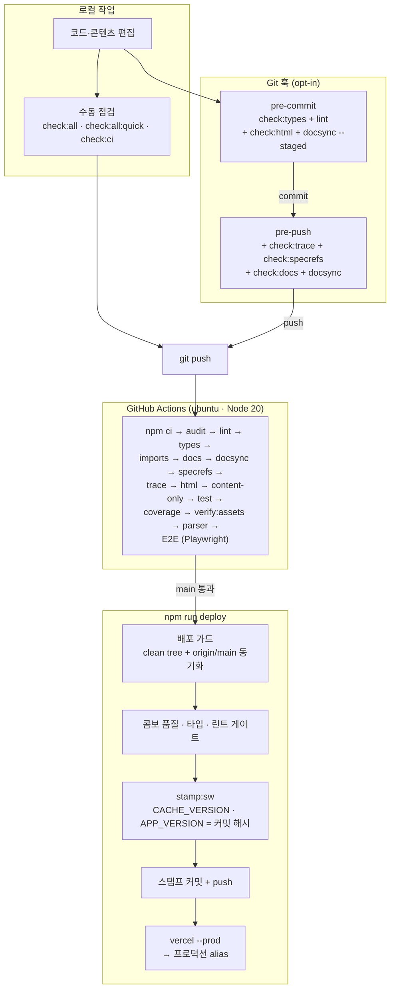

# 🔍 전체구조 점검 → 배포 파이프라인 가이드

> **대상 프로젝트**: Passmula (Cosmetic Pass Master) — 맞춤형화장품 조제관리사 스마트 학습 + Formula OS 실무 플랫폼
> **목적**: "전체구조 점검"부터 "배포"까지 이 저장소가 강제하는 검증 게이트의 전체 그림 — 각 게이트가 무엇을 검사하고, 실패 시 어떻게 복구하는지를 한 문서에 정리
> **관련 문서**: [DEPLOYMENT_GUIDE.md](DEPLOYMENT_GUIDE.md) (Vercel·PWA 배포 상세) · [CONTENT_WORKFLOW.md](CONTENT_WORKFLOW.md) (콘텐츠 변경 절차) · `AGENTS.md` (명령어 목록)
> **문서 ID**: DOC-RBK-09
> **범위**: platform · 판본: none
> **관련 SPEC ID**: `BP-01~08` (빌드 파이프라인) · `P-13` (릴리스 노트·버전 스탬프)

---

## 1. 전체 그림



같은 게이트가 3중으로 존재한다 — **로컬 훅(옵션) → 수동 점검 → CI(필수) → 배포 가드**. 훅은 설치 안 된 환경에서 우회될 수 있지만 CI가 동일 게이트를 재실행하므로 최종 방어선은 항상 있다.

## 2. 점검 명령어 선택 기준

| 명령 | 용도 | 포함 범위 |
|---|---|---|
| `npm run check:all` | 저장소 전체 검증 (단일 진입점) | lint · types · html · docs · check:content 전 단계 |
| `npm run check:all:quick` | 빠른 점검 | 위와 동일하되 DOM 테스트 생략 |
| `npm run check:ci` | **CI 로컬 재현** | CI와 동일 순서 — hooks 확인 · lint · types · imports · docs · docsync · specrefs · trace · html · content-only · unit test · verify:assets · parser |
| `npm run check:content` | 콘텐츠 변경 후 통합 검증 | 인용 · 귀속 · 레이아웃 · 드릴 · ID이관 · 데이터신선도 · 문서번들 · 파서 · 임포트 · 자산 · 테스트 |

> `check:all -- --quick`은 npm 인자 전달 방식 때문에 플래그가 도달하지 않는다 — 반드시 `check:all:quick` 사용.
> `check:ci`에는 **coverage · E2E · `npm audit`** 가 없다 (CI 전용). 이 3개를 로컬에서 확인하려면 `npm run coverage`·`npm run test:e2e`를 별도 실행.

## 3. 생성물 신선도 게이트 (핵심 구조)

이 저장소는 "소스 → 생성물" 방향의 체인이 여러 개다. 소스만 바꾸고 생성물 재빌드를 빠뜨리면 stale 상태가 되므로, 각 체인마다 신선도 게이트가 있다.

| 소스 | 생성물 | 검사 | 재생성 |
|---|---|---|---|
| `index.template.html` + `html/views/*.html` | `index.html` | `check:html` (개행 정규화 후 비교) | `build:html` |
| `docs/dev/SPEC.md` + `@spec` 주석 + 문서 헤더 | `docs/dev/TRACE_MATRIX.md` | `check:trace` (입력 해시 — 개행 정규화 후 계산) | `build:trace` |
| `{contentRoot}/docs/*.md` | `{dataRoot}/docs_md/` 번들 | `check:docbundles` | `node tools/build/build_doc_bundles.js` |
| `content/**` (교재·문제은행·manifest·exams.json) | `data/` 번들 · `src/keyword-index.js` · `sw.js` 자산 목록 등 | `check:datafresh` (빌드 체인 실행 → git diff 비교 → 자동 원복) | `build:data` |
| 문제은행 번들 | `data/` 드릴 번들 | `check:drillfresh` | `build:drills` |
| `content/**/참조자료/*.pdf` | `ref_md/` | `check:reffresh` (PDF 해시) | `convert:refs` → 승격 절차 |
| 인용 라인번호 | content md 내 `(LNN)` 인용 | `sync:citations --check` | `sync:citations` |

`check:datafresh`는 유일하게 "실제 빌드를 돌려 비교"하는 방식이다 — 생성기마다 별도 `--check`를 구현하지 않아도 `data/` 전체를 커버한다. 실행 전 생성물 경로가 clean이어야 하고(dirty면 사용자 변경 유실 방지로 중단), 검사 후 생성물은 항상 HEAD로 원복된다. `generatedAt` 타임스탬프·`CACHE_VERSION` 스탬프 라인만의 차이는 노이즈로 무시한다.

## 4. 개행(EOL) 규칙 — 오탐 방지 기반

- `.gitattributes`: `* text=auto eol=lf` — 저장소 blob과 **작업트리 체크아웃 모두 LF로 고정** (Windows `core.autocrlf` 설정과 무관하게 동일 바이트)
- 바이너리 명시: `png · jpg · webp · ico · pdf · ttf · woff · woff2`는 `binary` 처리
- 비교·해시는 항상 정규화 후 수행: `check:html`(양쪽 `\r\n→\n`), `check:trace`(입력 해시 전 정규화), md 임베드 생성기 3종(`build_doc_bundles`·`build_study_md_bundle`·`build_exam_bundles` — 원본 정규화 후 `JSON.stringify`)

**교훈**: 이 규칙 도입 전에는 Windows autocrlf 환경에서 콘텐츠가 동일해도 개행 차이로 `check:html`·`check:trace`가 오탐했고, CRLF 소스로 구운 번들에는 `\r\n` 이스케이프가 번들 문자열에 그대로 박혀 있었다. 새 비교 로직을 작성할 때는 raw 바이트 대신 **정규화된 텍스트**를 비교해야 한다.

## 5. Git 훅 (opt-in)

```powershell
npm.cmd run hooks:install   # .githooks 활성화 (core.hooksPath 설정)
npm.cmd run check:hooks     # 설치 여부 확인 — 미설치 시 권고 출력 (비차단)
```

| 훅 | 실행 게이트 |
|---|---|
| pre-commit | `check:types` + `lint` + `check:html` + `docsync --staged` |
| pre-push | 위 + `check:trace` + `check:specrefs` + `check:docs` + `docsync --ref origin/main` |

훅은 opt-in이라 미설치 환경의 커밋·푸시를 막지 않는다 — `check:hooks`는 이를 가시화하는 권고이며, 최종 방어는 CI다.

## 6. CI 게이트 (`.github/workflows/ci.yml`)

ubuntu + Node 20에서 순서대로 실행 — 로컬 `check:ci`와 대응 관계:

1. `npm ci` · `npm audit --audit-level=high` · `npm run sbom` → SPDX SBOM 아티팩트 업로드 *(CI 전용)*  
   + Dependabot(`.github/dependabot.yml`)이 npm·github-actions 생태계 주간 업데이트 PR을 자동 생성 *(저장소 설정)*
2. `lint` → `check:types` → `check:imports` → `check:docs` → `doc_sync --ref origin/main` → `check:specrefs` → `check:trace` → `check:html`
3. `check_content.js --content-only --quick` — 콘텐츠 추적 단계 전체 (**check:datafresh·check:docbundles 포함**)
4. `npm test` → `coverage` → `coverage:unit` → `coverage_merge --check` *(커버리지는 CI 전용)*
5. `verify:assets` → `check:parser`
6. `playwright install` → `test:e2e` *(CI 전용)*

> **저장소 설정 권장 (코드 밖)**: GitHub Settings → Branches → `main` 보호 규칙에 "Require status checks"(`test` 잡)를 지정하면 CI 미통과 머지가 원천 차단된다. 코드 게이트만으로는 우회 불가이지만, 저장소 설정 없이는 `git push --force`·직접 머지가 가능하므로 마지막 방어선으로 권장.

## 7. 배포 (`npm run deploy`)

`vercel --prod` 직접 실행은 금지 — 아래 절차가 `deploy` 명령 하나로 수행된다.

1. **배포 가드**: 작업트리 clean + `origin/main`과 동기화 확인 — 미푸시 커밋·미커밋 변경 차단
2. **영향 분석**: `impact_tests.js --ref`로 변경이 닿는 요구사항 수 보고
3. **품질 게이트**: 콤보 품질 + `check:types` + `lint` 재검사
4. **버전 스탬프**: `sw.js` `CACHE_VERSION`과 `data/release-notes.json` `APP_VERSION`을 `v<날짜>-<커밋해시>`로 갱신 → 커밋 · 푸시
   - 릴리스 노트 pending이 없으면 커밋 subject로 자동 초안 생성 — 미리 `npm run notes:draft`로 편집 가능
5. **`vercel --prod`**: 빌드 → 프로덕션 alias 갱신

## 8. 흔한 실패 → 복구

| 증상 | 원인 | 복구 |
|---|---|---|
| `index.html이 파셜/템플릿과 불일치` | 뷰 편집 후 재조립 누락 | `npm run build:html` 후 diff 확인·커밋 |
| `TRACE_MATRIX.md가 입력과 다릅니다` | SPEC·`@spec`·문서 헤더/파일 인벤토리 변경 | `npm run build:trace` 후 커밋 |
| `생성물 드리프트 N건` | content 변경 후 `build:data` 누락 | `npm run build:data` 후 diff 확인·커밋 |
| `생성물 경로에 미커밋 변경` (check:datafresh 중단) | data/ 등 생성물이 dirty | 커밋 또는 스태시 후 재실행 |
| `docs_md 번들 불일치` | `docs/exams/cosmetic/user/*.md`·학습안내서 변경 후 번들 재생성 누락 | `node tools/build/build_doc_bundles.js` 후 커밋 |
| `문서 동기화 게이트` 실패 | src/tools/tests 변경에 docs 갱신 미동반 | 관련 문서 갱신 후 재시도 (정말 불필요 시 `[no-docs]`) |
| check:html/trace만 로컬 실패·CI 통과 | 과거 EOL 이슈 — `.gitattributes` 적용 후엔 발생하지 않아야 함 | 재현 시 `git add --renormalize .` + 개행 상태 확인 |
